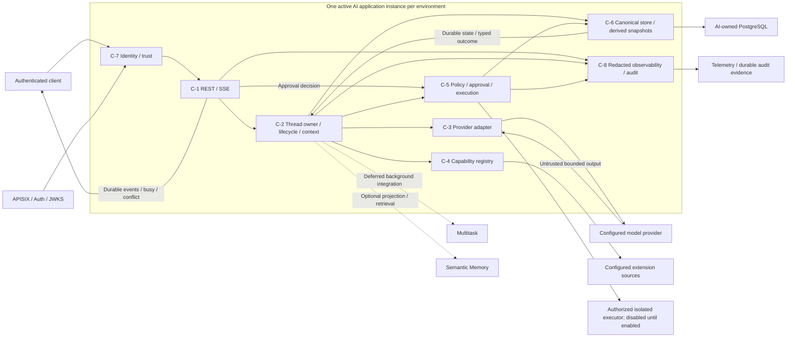
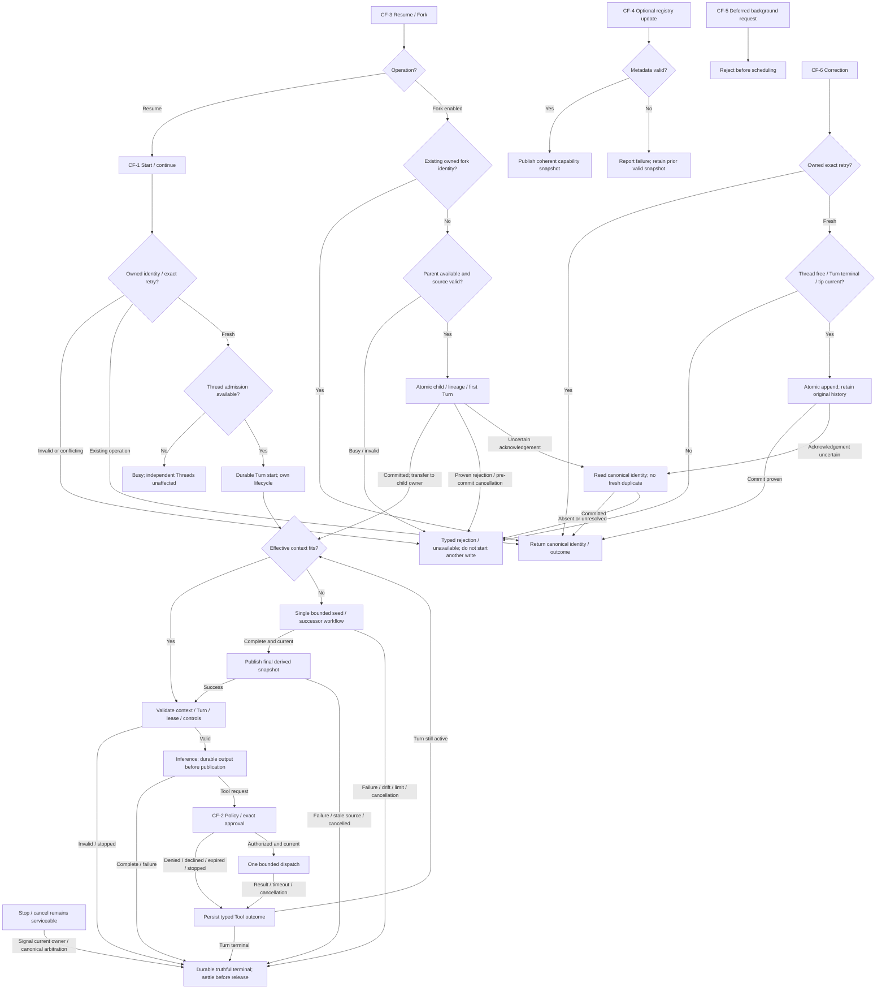
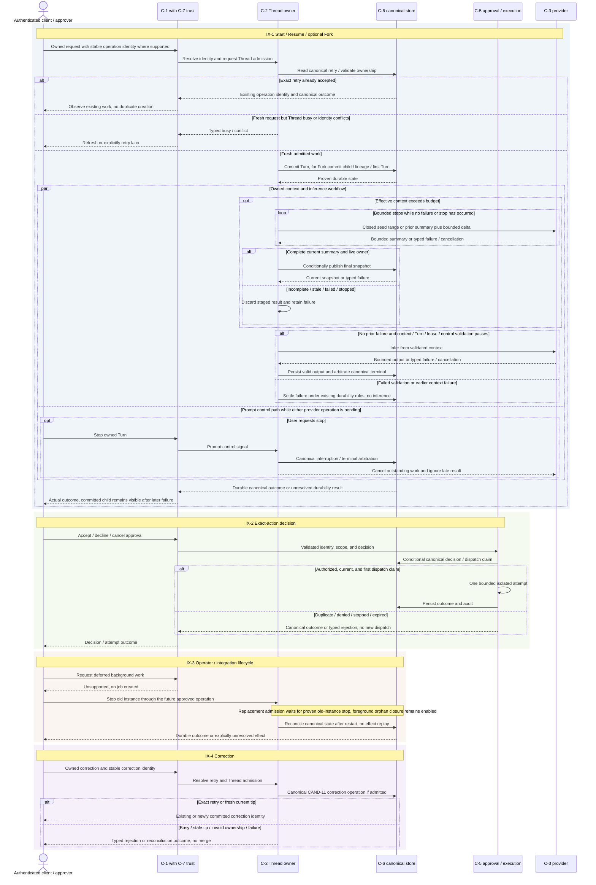

# ADD-0001: AI Service Boundary and Codex Alignment

## Metadata [Required]

- **Design Status**: Current
- **Date**: 2026-08-10
- **Author**: @codex
- **Architecture Owner**: @linhai
- **Required Approver**: @linhai
- **Approver [Conditionally Required — Design Status is or has been `Current`]**: @linhai
- **Approval Time [Conditionally Required — Design Status is or has been `Current`]**: 2026-09-23T14:01:07Z
- **Approval Evidence [Conditionally Required — Design Status is or has been `Current`]**: Approve
- **Retired By [Conditionally Required — Design Status is `Deprecated` or `Superseded`]**: N/A — Design Status is `Current`; the document has not been retired
- **Retirement Time [Conditionally Required — Design Status is `Deprecated` or `Superseded`]**: N/A — Design Status is `Current`; the document has not been retired
- **Retirement Evidence [Conditionally Required — Design Status is `Deprecated` or `Superseded`]**: N/A — Design Status is `Current`; the document has not been retired
- **Retirement Reason [Conditionally Required — Design Status is `Deprecated` or `Superseded`]**: N/A — Design Status is `Current`; the document has not been retired
- **Scope Level**: Repository / Cross-project
- **Scope**: The Koduck AI runtime and its single-instance, per-Thread mutation ownership profile; contracts with API clients, providers, identity, storage, and tool execution; optional extensions and Memory, with automatic background takeover and multi-agent work deferred
- **Trello Sources**: [Koduck card 4WI4sszw](https://trello.com/c/4WI4sszw/2-%E8%B0%83%E7%A0%94-adr-%E6%98%8E%E7%A1%AE-ai-%E6%9C%8D%E5%8A%A1%E9%87%8D%E6%9E%84%E8%BE%B9%E7%95%8C%E4%B8%8E-codex-%E5%AF%B9%E9%BD%90%E7%9B%AE%E6%A0%87)
- **Figma Sources [Conditionally Required — UI is in scope]**: N/A — this design covers service and protocol boundaries and does not change a Web or native UI
- **Related**: [Koduck predecessor baseline](https://github.com/hailingu/koduck-quant/tree/c414ddccdbc45a99fcd3d606ca0fe1f75730b7fe/koduck-ai); [OpenAI Codex reference baseline](https://github.com/openai/codex/tree/3c60d4da648bfa98e3c51c5161ac2720519c733e)
- **Supersedes [Conditionally Required — this ADD replaces another]**: None
- **Superseded By [Conditionally Required — this ADD is replaced]**: None

## Requirement Level Legend [Required]

- **`[Required]`**: The section or field always applies and MUST remain present
  with complete, verifiable content. Use `None — <reason>` only when the
  template explicitly permits an empty result; never leave it blank.
- **`[Conditionally Required — <trigger>]`**: The section or field MUST be
  completed when its stated trigger applies. When the trigger does not apply,
  retain `N/A — <reason>` unless the template explicitly instructs removal or
  retention as inactive future-lifecycle guidance. A missing trigger assessment
  is incomplete content.
- **`[Optional]`**: The section may be removed without affecting acceptance,
  execution, completion, or verification. If retained, it MUST be accurate and
  complete; optional content MUST NOT substitute for required evidence.

Unlabeled fields inside a `[Required]` section are required.

## Context And Solution Summary [Required]

Koduck is a from-scratch successor to `koduck-quant`. The predecessor at
`c414ddccdbc45a99fcd3d606ca0fe1f75730b7fe` and public Codex at
`3c60d4da648bfa98e3c51c5161ac2720519c733e` remain fixed research baselines,
not compatibility obligations. The repository now contains `koduck-ai`:
CAND-1, CAND-2, CAND-3, and CAND-11 are complete. Their Accepted ADRs,
contracts, source, tests, and historical evidence remain authoritative.

**Solution summary**: Keep the provider-neutral core, owned REST/SSE boundary,
PostgreSQL canonical history, identity isolation, and default-deny execution.
For the next delivery stage, support independent conversations in parallel
through one active AI application instance per environment and one mutation
owner per Thread. A conflicting fresh write receives an explicit busy or
conflict result. Stop and cancellation remain serviceable while inference or
compaction is pending. Exact retries use the operation's stable identity;
uncertain effects never trigger a fresh execution automatically.

Automatic context compaction remains in scope, with one producer workflow per
Thread. It creates a bounded summary and preserves the exact recent tail and
complete canonical history. A stale result is discarded and the attempt fails
visibly; competing-builder winner adoption, replacement-chain recovery, and
automatic cross-instance work takeover are outside this delivery stage.

**Greenfield operating model**: The predecessor has no operating deployment,
shared history, or fallback route. A failed candidate is not promoted. Any
deployment or rollback needs its own governing OCR. The single-instance
profile requires stop-before-start replacement and proof that an old process
cannot continue serving or executing when its replacement starts. Process-local
coordination is never evidence that two overlapping instances are safe.

**Design boundary**: This ADD proposes outcomes, ownership, flows, and future
ADR candidates. It does not authorize implementation, change deployed behavior,
waive checks, or prescribe source files, schemas, commands, or test code.
Existing lease fencing, durable terminal arbitration, correction validation,
and security controls are retained. Removing an implemented guarantee needs a
separate Accepted ADR; this revision does not rewrite completed candidates.

## Requirement Baseline [Required]

| ID | Trello source | Requirement baseline | Acceptance outcome | Priority and constraints | Last checked |
| --- | --- | --- | --- | --- | --- |
| R-1 | [Card 4WI4sszw](https://trello.com/c/4WI4sszw/2-%E8%B0%83%E7%A0%94-adr-%E6%98%8E%E7%A1%AE-ai-%E6%9C%8D%E5%8A%A1%E9%87%8D%E6%9E%84%E8%BE%B9%E7%95%8C%E4%B8%8E-codex-%E5%AF%B9%E9%BD%90%E7%9B%AE%E6%A0%87) | Research the current AI-service baseline against public OpenAI Codex and establish an auditable target boundary and migration direction. | A traceable gap matrix, adoption decisions with reasons, external-contract and security boundaries, dependency-ordered migration slices with validation and rollback boundaries, and a project Full ADR proposal after ADD approval. | Highest board position. No source, configuration, dependency, build, release, or deployment work before an eligible approver accepts the governing ADR. Trello is coordination context, not decision authority. | 2026-09-01 |

The Trello requirement above retains its last checked baseline; the card was
not reread or changed in this task. The following scope refinement records the
user's direction separately rather than attributing new text to that card.

| ID | Source | Requirement baseline | Acceptance outcome | Constraint | Last checked |
| --- | --- | --- | --- | --- | --- |
| R-2 | Current Codex task, user messages on 2026-09-23: request to assess real concurrency and reduce development/testing weight, followed by “同意你的建议” | Use the proposed personal/small-user independent-conversation profile: one active instance, parallel Threads, one Thread mutation owner, explicit conflicts, and deferred automatic takeover/shared editing. | A coherent narrower solution and candidate set; essential retry, stop, isolation, durability, and execution-safety coverage retained; unused distributed recovery is not a first-release prerequisite. | Agreement authorizes drafting this revision; it is not the canonical approval of the resulting ADD. This is a chosen scope, not measured user counts or a capacity claim. | 2026-09-23 — conversation scope only |

## Goals And Non-Goals [Required]

Goals:

- Keep independent user conversations responsive and isolated.
- Give each Thread one owner of conversation mutations while serving control
  requests without waiting for a provider response.
- Preserve durable history, exact-action approval, truthful terminal results,
  and retry identity across failures.
- Support long conversations with bounded context compaction and explicit
  failure when a safe context cannot be assembled.
- Separate the first usable release from optional integrations and distributed
  execution, with each future candidate owning one implementation boundary.

Non-goals for this delivery stage:

- Multiple active AI instances, automatic failover or background checkpoint
  takeover, and availability during instance replacement.
- Collaborative editing of one Thread by different subjects, automatic merge
  of conflicting edits, or concurrent compaction builders for one Thread.
- Adoption of another builder's summary followed by automatic suffix recovery.
- Codex product parity, a code fork, automatic provider fallback, or a new UI.
- Removing existing checks or Accepted implementation contracts through an ADD.

## Functional Capability Design [Required]

| ID | Actor | Trigger | Capability and outcome | Business rules and edge cases | Requirements |
| --- | --- | --- | --- | --- | --- |
| F-1 | Authenticated API client | Start, continue, stop, read, or optionally fork work | Ordered Thread/Turn/Item lifecycle and truthful visible result. | Resume creates a new Turn; terminal Turns do not reactivate. Client stop is interrupted; platform/dependency stop is cancelled. Fresh competing writes are busy/conflict; same-operation retries resolve through their canonical identity. | R-1, R-2 |
| F-2 | Agent core | Before each inference, including continuation after a Tool result | Assemble direct effective history or one validated summary plus exact tail within budget. | One compaction workflow per Thread; bounded sequential producer steps; stale, cancelled, corrupt, or unfit output cannot reach inference. No history is silently dropped and no competing summary is adopted. | R-1, R-2 |
| F-3 | Provider adapter | Inference or a summary step | Translate owned input and normalize bounded output, usage, cancellation, and errors. | One explicitly selected provider initially; no automatic fallback. Provider results are untrusted data, not execution authority. | R-1 |
| F-4 | Tool/approval boundary | Model requests a capability or a human decides an approval | Apply policy and bind authorization to one exact bounded execution attempt. | Default deny, same-owner approval, no duplicate dispatch, bounded cancellation and failure. Real capabilities remain disabled until separately authorized. | R-1, R-2 |
| F-5 | Thread store | History, correction, or lineage changes | Own canonical durable data, ordered appends, and operation-specific idempotency. | Publish only after durability; corrections retain original Items. Stale corrections return conflict, never automatic merge. Derived snapshots cannot replace canonical history. | R-1, R-2 |
| F-6 | Extension owner | Optional capability metadata changes | Load a coherent validated capability snapshot with provenance. | Invalid metadata fails visibly; tenant/Thread isolation and non-escalation remain mandatory. This integration is not a prerequisite for static empty inventories. | R-1 |
| F-7 | Operator or reviewer | Failure, approval, execution, or recovery occurs | Observe correlated, redacted lifecycle and audit evidence. | No secrets or sensitive prompt content in routine diagnostics. An uncertain external effect remains uncertain until reconciled. | R-1, R-2 |
| F-8 | Admission owner | Competing requests or instance restart | Admit one mutation workflow per Thread and bound total active work across Threads. | Busy Threads do not block independent Threads. Stop/cancel and canonical approval decisions remain serviceable; they do not grant a second conversation writer. Existing crash closure stays supported; automatic resumption of a lost computation is deferred. | R-2 |

## Data Model Design [Conditionally Required — data is created, updated, deleted, transferred, retained, or changes ownership, classification, lifecycle, relationships, or invariants]

### Entities And Lifecycle

| ID | Entity | Purpose | Ownership | Classification | Lifecycle |
| --- | --- | --- | --- | --- | --- |
| D-1 | Thread | One subject-owned conversation and optional immutable fork lineage. | C-6 canonical data; C-2 mutation admission. | Potentially sensitive user content. | Created, active, optionally forked, archived/deleted under owner policy. One mutation workflow at a time after CAND-17; multiple readers are allowed. |
| D-2 | Turn | One input-to-terminal attempt. | C-2 live lifecycle; C-6 durable state and existing fenced lease. | Sensitive input and policy references. | Started, possibly recovery-pending, then completed/interrupted/failed/cancelled under existing contracts. A terminal Turn never becomes active again. |
| D-3 | Item | Ordered input, model output, Tool projection/result, or append-only correction. | C-6 canonical history; C-2 presentation projection. | Payload-dependent sensitive and untrusted content. | Appended with stable identity/order. Correction references prior content and never deletes or rewrites it. Approval projections have no independent authority. |
| D-4 | Capability Descriptor | Validated tool/extension metadata and bounded effect semantics. | C-4. | Untrusted configuration metadata until validated. | Discovered, validated, enabled, refreshed, disabled, or rejected. |
| D-5 | Permission Profile | Bound filesystem/network/process/data permissions. | C-5. | Security policy. | Selected and optionally narrowed; model output, extension metadata, and approval cannot widen it. |
| D-6 | Approval Request | Canonical decision for one exact action. | C-5 through its durable port. | Minimized security audit data. | Requested, accepted/declined/cancelled/expired, then associated with its one attempt. No reusable session grant. |
| D-7 | Execution Attempt | One bounded effect and its outcome. | C-5. | Sensitive untrusted inputs/outputs and audit data. | Prepared, authorized, running, succeeded/failed/timed out/cancelled. Existing foreground lease and terminal guards remain binding. |
| D-8 | Extension Manifest | Provenance and declared capabilities. | C-4. | Internal metadata; secrets referenced rather than embedded. | Loaded, validated, activated, updated, disabled, or rejected. |
| D-9 | Context Compaction Snapshot | Reconstructable summary of a bounded, causally closed effective-history prefix. | C-2 production policy; C-6 derived storage. | As sensitive as source history. | Produced sequentially by the Thread owner, published only when complete and current, reused while prefix provenance matches, otherwise discarded/rebuilt on a later attempt. Intermediate producer results are not a durable chain. |

### Relationships And Invariants

| Relationship | Cardinality and meaning | Invariant |
| --- | --- | --- |
| Thread contains Turn | Many historical Turns; at most one admitted mutation workflow under the new profile. | Subject/tenant scope is immutable; an independent Thread is not serialized behind this Thread. |
| Turn contains Item | Ordered Items and later corrections. | Raw replay remains complete and ordered; rejected writes do not advance history. |
| Submission identity identifies Turn | One authenticated operation identity maps to one accepted Turn after CAND-18. | Identical retries return the same identity/outcome; changed input under that identity conflicts. Observing an existing acceptance never grants authority to execute that Turn again. No success is inferred from an ambiguous acknowledgement. |
| Thread forks Thread | Optional single immutable parent and exact fork point. | No cross-owner lineage. Child creation is idempotent and atomic for child/lineage/first-Turn state. Later inference failure retains that committed child and its truthful Turn outcome. |
| Foreground Turn holds lease | Existing CAND-1 generation and heartbeat. | Expired owners cannot append or dispatch; orphan closure has one durable cancelled terminal. Single-instance scope does not waive existing arbitration tests. |
| Approval authorizes Attempt | One accepted exact-action D-6 binds one D-7. | Duplicate decisions cannot duplicate an effect; parameter or authority drift requires new authorization. |
| Manifest exposes Descriptor | One manifest can expose many validated descriptors. | Disabled, incompatible, or stale descriptors cannot authorize execution; history is unchanged. |
| Snapshot summarizes prefix | One published summary plus its exact recent tail forms provider context. | Scope, source range/version, summary identity/content, and policy/producer provenance are validated. Tool request/result groups stay together. Tail-only growth can reuse a matching prefix; prefix changes invalidate it. Canonical history is never replaced. |
| Thread owner controls inference | The same owner admits context work and final inference establishment. | Before dispatch, the selected context and current Turn/lease/control state still match. Stale or late work fails without inference, winner adoption, or automatic rebuild within the same failed attempt. |

D-9 reuse includes tenant, subject, Thread, and applicable fork lineage. A child
does not borrow a parent's snapshot identity; it derives its own context from
authorized canonical history. Producer steps remain bounded: a seed consumes
one closed source range, and a successor consumes the prior bounded summary
plus one contiguous closed range. The final summary alone is published through
C-6. Exhausted budgets or source drift end the attempt visibly. Any previously
published snapshot remains merely a cache that must be revalidated before use.

## Architecture Design [Required]

| ID | Component or dependency | Responsibility | Conceptual inputs and outputs | Dependencies | Accepted constraints |
| --- | --- | --- | --- | --- | --- |
| C-1 | Presentation boundary | Translate authenticated requests and durable events; expose busy/conflict and retry outcomes when their contracts are accepted. | Chat/control/approval requests; REST/SSE results. | C-2, C-5, C-7. | Existing wire contracts remain binding until changed by an Accepted ADR; no UI scope. |
| C-2 | Agent core | Own per-Thread admission, lifecycle, effective projection, context budget, sequential compaction, and prompt control handling. | Owned requests, context, provider and tool results; durable Items and terminals. | C-3, C-4, C-5, C-6. | One mutation owner after CAND-17; bounded parallelism across Threads; existing lease/terminal rules retained. |
| C-3 | Provider adapter | Translate inference and bounded summary steps. | Owned context and budgets; normalized output, usage, errors. | Configured provider. | No store access, orchestration ownership, or implicit fallback. |
| C-4 | Capability/extension registry | Supply coherent validated metadata with provenance. | Configured roots/catalogs; descriptors and diagnostics. | Configuration and extension providers. | Metadata cannot grant authority; the existing static empty inventory remains valid. |
| C-5 | Policy, approval, execution | Own exact-action authorization, bounded dispatch, cancellation, and audit. | Proposed effect and trusted decision; attempt results and projections. | C-6 and authorized isolated executors. | Existing Accepted CAND-2 contract, default deny, single-dispatch arbitration, and generation fencing. |
| C-6 | AI-owned store port and PostgreSQL adapter | Own canonical history, existing leases, retry records, optional lineage, and derived snapshots. | Scoped requests; canonical state, atomic outcomes, typed conflicts. | PostgreSQL. | Existing Accepted CAND-1/CAND-3/CAND-11 contracts. D-9 adds no second history owner or competing-builder recovery protocol. |
| C-7 | Identity and trust-context adapter | Carry validated identity and scopes from the gateway/Auth boundary. | Credentials/gateway context; immutable principal. | APISIX and Auth/JWKS. | Runtime handoff and strip/reissue rules remain binding; untrusted headers cannot supply authority. |
| C-8 | Observability/audit boundary | Correlate lifecycle, conflicts, failures, and effects with redaction. | Bounded signals; logs/metrics/traces/audit evidence. | Existing telemetry sinks and durable audit owner. | No raw secrets or routine sensitive content; observations do not authorize work. |

The single-instance constraint covers ingress and all workers that could write
the same canonical history. PostgreSQL remains the canonical store even though
the delivery profile has one active application instance. Optional Memory and
Multitask integrations never gain direct history-writing authority. Deployment
enforcement belongs to a later OCR; this design is not proof of a running
topology. Existing Accepted ADRs listed in the central index take precedence
over this non-authorizing design for implemented behavior.

The Thread mutation owner is the owner of a conversation workflow, not a
requirement to route every SQL statement through one queue. Existing C-5
approval transitions, C-6 lease renewal, stop arbitration, and orphan closure
retain their canonical conditional guards. They can serve the current workflow
or close it without admitting a second conversation producer. Future correction
or fork delivery must use the same admission boundary when enabled; this ADD
does not claim that those routes already exist.

### Mermaid Architecture Diagram [Required]

## Control Flow Design [Conditionally Required — the solution has multiple steps, branches, retries, asynchronous work, or failure recovery]

| ID | Trigger and precondition | Happy path | Branches and retries | Failure handling | Observable result |
| --- | --- | --- | --- | --- | --- |
| CF-1 | Owned start/continue request | Resolve submission identity; admit Thread owner; durably start Turn; assemble direct context or one bounded sequential summary; validate context/control state; infer and publish durable Items; repeat after Tool result; commit terminal and release ownership. | Exact retry observes the canonical operation; a fresh competing write is busy. Independent Threads proceed. | Stop/cancel remains serviceable. Source drift, producer failure, timeout, or budget exhaustion fails visibly; late output is ignored. Existing durability recovery may retain ownership until state is settled. | One accepted Turn and one truthful durable terminal; no stale inference or duplicate acceptance. |
| CF-2 | Model proposes a capability | C-4 resolves metadata; C-5 checks policy/lease; if needed obtains one exact approval; conditionally dispatches once; persists outcome; C-2 appends projection before continuing. | Denial/decline/cancel/expiry never dispatches; exact retries observe canonical state. | A terminal Turn or fenced lease prevents later dispatch/commit; unknown effects are not automatically repeated. | One bounded authorized attempt or typed denial/failure. |
| CF-3 | Owned Resume or optional Fork | Resume enters CF-1 as a new Turn; Fork admits the parent mutation boundary, validates exact source point, atomically creates child/lineage/first Turn, then performs child context/inference under its owner. | Same fork identity returns committed child before repeating creation; changed identity-bound content conflicts; a busy source rejects new work. | Before child commit, failure exposes no new child. After commit, summary/inference failure preserves child state and closes its Turn truthfully; ambiguous commits reconcile by identity. | No duplicate child; parent history unchanged; no atomic summary-plus-child transaction required. |
| CF-4 | Optional registry update | Load, validate, and publish one coherent capability snapshot. | Keep the prior valid snapshot when a replacement is rejected. | Report source/validation failure; metadata never widens permissions. | Valid versioned metadata or an explicit failure. |
| CF-5 | Request for automatically recoverable background work | No scheduling or takeover in this delivery profile. | CAND-8/CAND-9 remain Deferred until measured need and a later approved scope. | Any exposed unsupported request rejects before creating work. Existing foreground orphan closure remains available. | No background job or implied automatic resume. |
| CF-6 | Owned correction against a terminal Turn, when correction delivery is enabled | Resolve owned exact retry before fresh-write admission; otherwise acquire Thread admission, validate ownership/current predecessor, atomically append one correction, and release owner. | Identical retries return original result; new writes against a stale predecessor conflict; active Thread writes are busy under CAND-17. | Rejection leaves history unchanged; uncertain acknowledgement uses existing CAND-11 reconciliation. | One durable correction, no automatic merge, unchanged original Items and Turn terminal. |

### Mermaid Control Flow [Conditionally Required — Control Flow Design is triggered]

## Interaction Flow Design [Conditionally Required — a human or external system interacts with the solution]

| ID | Actor and entry state | Actions | System feedback and transitions | Exit state | Figma reference |
| --- | --- | --- | --- | --- | --- |
| IX-1 | Authenticated client; new or owned Thread | Start, retry, continue, stop, Resume, or optional Fork. | Stable retry returns the existing operation; busy/conflict is explicit; accepted work streams only durable events. Fork creation precedes child inference and its identity survives later inference failure. Stop remains available during provider/summary waits. | Canonical completed/interrupted/cancelled/failed state or typed pre-admission rejection; no hidden automatic takeover. | N/A — service protocol only |
| IX-2 | Authenticated approver; requested action | Accept, decline, or cancel the exact request; possibly repeat a decision. | Canonical D-6 transition; duplicate/conflicting decisions cannot dispatch twice. A Turn stop or authority expiry can prevent execution despite a late acceptance. | One canonical decision and at most one authorized attempt. | N/A — service protocol only |
| IX-3 | Operator or integration caller | Observe failures, replace the instance, or request deferred background work. | Foreground orphan closure remains truthful; deferred submissions create no job. Replacement requires old-instance stop and later OCR verification before new admission. | No simultaneous application owners; uncertain external effects require reconciliation or explicit new action. | N/A — no operator UI design |
| IX-4 | Authenticated owner; terminal content | Correct content, retry, or submit a stale edit. | Exact retry returns its durable result; busy/stale edits receive typed rejection and can be refreshed and explicitly resubmitted. No automatic merge. | One append or no mutation; original history retained. | N/A — service boundary only |

### Mermaid Interaction Flow [Conditionally Required — Interaction Flow Design is triggered]

## Cross-Cutting Design [Required]

| Quality attribute | Solution-level design | Architecture-level validation |
| --- | --- | --- |
| Security and privacy | Keep tenant/subject ownership, exact-action approval, default deny, isolated execution, untrusted output treatment, and redaction. User-content deletion and separately retained D-6/D-7 audit evidence follow their respective owner policies. | Cross-owner requests fail without disclosure; duplicate decisions cannot repeat an effect; snapshots never cross scope or grant authority. |
| Reliability | Durable publication, atomic owner transitions, bounded waits, operation-specific exact retries, prompt stop, and existing lease/terminal recovery. | Controlled completion/stop ordering and acknowledgement loss preserve one canonical outcome; uncertain effects are never blindly repeated. |
| Concurrency | Independent Threads proceed in parallel; one admitted mutation workflow and one summary producer per Thread. A conflicting fresh write fails explicitly rather than accumulating an unbounded queue. | Two competing callers demonstrate admission, deduplication, or conflict. Add another participant only for a distinct recovery/control role. This is correctness evidence, not a user-capacity claim. |
| Context integrity | Summary production is sequential and bounded; publish only the final current snapshot; preserve exact tail and Tool causality. | Under/at/over budgets, prefix correction, tail growth, cancellation, stale results, and unable-to-fit outcomes are explicit; raw history remains unchanged. |
| Availability and deployment | One active application instance, stop-before-start replacement, PostgreSQL durability; no automatic takeover of work. | Future OCR establishes non-overlap and recovery. Release readiness discloses downtime and unmeasured capacity; existing multi-writer database safeguards are not removed. |
| Test cost | Select deterministic semantic cases at the owning boundary; reuse shared fixtures and evidence; isolate capacity testing from race correctness. | Pure policy checks avoid external services. Transaction/lock claims retain real PostgreSQL checks; provider framing/cancellation claims retain an appropriate transport harness. No per-feature Cartesian product or repeated random race sampling is implied by this ADD. |
| Governance compatibility | Existing required CI, SonarQube, contract traceability, and the five baseline risk dimensions remain binding. | Inapplicable future distributed scenarios have specific scope reasons; applicable existing checks are not relabeled N/A or deleted. Changing a required check requires its governing process. |
| Maintainability and observability | One owner per policy/data boundary; correlated minimal diagnostics; adapters contain external types. | No duplicate canonical state or cross-boundary authority; failures identify the operation without exposing sensitive content. |

## Assumptions And Open Questions [Conditionally Required — assumptions or material questions exist]

| ID | Assumption or question | Owner | Status | Resolution and evidence |
| --- | --- | --- | --- | --- |
| Q-1 | What is the predecessor baseline? | @linhai | Resolved | Fixed predecessor commit remains research only; the old infrastructure was removed. The current repository now has a service and completed candidates. |
| Q-2 | Which Codex reference applies? | @linhai | Resolved | Preserve the fixed 2026-08-10 research baseline at `3c60d4da648bfa98e3c51c5161ac2720519c733e`; no claim about current Codex behavior. |
| Q-3 | Does alignment imply product parity? | @linhai | Resolved | No; R-1 calls for reasoned boundary adoption and owned Koduck contracts. |
| Q-5 | Is there a predecessor rollback path? | @linhai | Resolved | No; first promotion is greenfield and later rollback needs a verified Koduck artifact and governing OCR. |
| Q-6 | Is automatic compaction retained? | @linhai | Resolved | Yes; R-2 narrows CAND-15/CAND-16/CAND-14 to one Thread owner, sequential bounded production, final-snapshot publication, and visible failure on drift. Historical competing-chain recovery is not an active candidate requirement. |
| Q-7 | What concurrency profile should the next design target? | @linhai | Resolved | The user agreed to the preceding scope recommendation on 2026-09-23 and approved this concrete revision as `@linhai` in this task. The selected small-use single-instance profile does not infer actual traffic counts, production topology, or latency SLO. |
| Q-8 | Does an ADD revision remove implemented guarantees or unblock a new ADR? | @linhai | Resolved | No. Completed ADRs remain authoritative. ADR-0016 is Proposed / Not Started in the inspected index and the repository-wide ADR serialization rule still applies. |

Numeric admission limits and endpoint details belong to the selected candidate's
ADR. They must be fixed before its implementation, but are not assumed capacity
facts in this solution view. This design proposes rejecting fresh competing
writes rather than an optional unspecified queue policy.

## Risks And Trade-Offs [Required]

| ID | Risk or trade-off | Impact | Mitigation |
| --- | --- | --- | --- |
| RK-1 | Two instances overlap despite the selected operating profile. | Process-local Thread ownership cannot protect shared history. | Keep existing database guards; require deployment non-overlap evidence before using CAND-17 as the runtime admission guarantee. Multi-instance support needs a later approved design. |
| RK-2 | One Thread owner blocks control delivery during provider work. | Stop or approval cancellation becomes unresponsive. | Controls remain serviceable and canonical terminal/approval arbitration stays below every dispatch path; test blocked-provider cancellation. |
| RK-3 | Retried submission creates a new identity. | Duplicate Turns or effects. | CAND-18 binds the client-stable authenticated submission identity and exact input. Until that contract is delivered, existing chat is not claimed to deduplicate arbitrary client resubmissions. |
| RK-4 | Same-thread corrections or fork creation bypass admission. | Context becomes stale while inference is being established. | CAND-17 covers all runtime mutation entry points, including later ones; retain source validation and typed failure. Direct store tests retain existing concurrency safeguards. |
| RK-5 | Single-instance failure stops active work. | Downtime and failed attempts rather than seamless continuation. | Preserve durable history and foreground orphan closure; disclose this trade-off. Never replay an uncertain external effect to simulate recovery. |
| RK-6 | Simplifying compaction drops content or uses stale summaries. | Incorrect model context. | Bounded closed ranges, exact tail, provenance checks, final publication only, and fail-visible outcomes; no silent truncation or authority from summary content. |
| RK-7 | Fork summary failure is mistaken for failed child creation. | Duplicate child on retry or false zero-state response. | Child identity/lineage/first Turn commit atomically before context work; return the committed identity and truthful failure; reconcile uncertain creation by the same identity. |
| RK-8 | Test reduction removes a distinct invariant. | Undetected duplicate execution, leakage, or data loss. | Map retained semantic cases to owners; reuse evidence rather than deleting required coverage. Additional contenders need a distinct role; load claims need separate measurements. |
| RK-9 | Deferred integrations silently return as release prerequisites. | First delivery inherits unneeded recovery and coordination cost. | CAND-5 uses an explicit delivered-capability inventory; CAND-8/CAND-9/CAND-6 are Deferred. Optional integrations are included only when selected and complete. |

## ADR Task Candidates [Required]

Allowed task-candidate statuses: `Ready`, `Selected`, `Complete`, or `Deferred`.
No Ready candidate is selectable while this ADD is Draft or while the ADR
serialization gate is closed. Completed rows below are preserved as historical
scope and reciprocal evidence. In particular, CAND-11's original 32-writer
wording is historical: its Accepted ADR's owner-authorized 2026-09-10 amendment
defines the current four-contender check. This revision neither reinstates 32
writers nor changes that existing check to two.

| ID | Complete outcome | Scope boundary | Dependencies | Acceptance context | Recommended ADR type | Status | Status reason or evidence | ADR path |
| --- | --- | --- | --- | --- | --- | --- | --- | --- |
| CAND-1 | A provider-neutral thread/turn/item orchestration kernel can execute one authenticated, tool-free turn through a new versioned REST/SSE boundary with durable ordered history and explicit completion, failure, interruption, durability-outage, and foreground-owner-loss outcomes. | Includes the owned lifecycle model, core ports, new REST/SSE v1 contract, one provider path, and an AI-owned durable C-6 adapter sufficient for append-before-publish, replay, and fenced foreground liveness leases; excludes semantic Memory integration, background Multitask integration, forks/checkpoints, privileged tools, extensions, deployment, and any legacy compatibility or fallback path. | This ADD must be `Current`; the new REST/SSE v1 and TurnHistory contracts, trust-context handoff, and AI-owned durable-store boundary must be complete and deterministic before ADR acceptance. | Binary contract checks for one non-tool turn; deterministic state, Resume-as-new-Turn, append-before-publish, bounded append/backpressure and liveness windows, replay, provider/store failure, process crash, lease expiry, stale-owner fencing, concurrent-reconciler idempotency, and exactly-one orphan `cancelled` terminal. | Full | Complete | Completed by the Accepted, Complete project Full ADR at `docs/adr/ADR-0001-provider-neutral-turn-kernel.md`; implementation source is commit `08cc1b3`, review corrections are commits `56073a0`, `df49b69`, `11b5ea2`, `fe3beb9`, `a7258bc`, `a7b6faa`, `31ef43f`, and `d444cf3`, and all 14 ADR checks pass; the 2026-08-17 wire-contract reconciliation enumerating the SSE `error` diagnostic event was reapproved by `@linhai` at `2026-08-17T08:57:39Z` with revised checks re-executed and passing | `docs/adr/ADR-0001-provider-neutral-turn-kernel.md` |
| CAND-2 | Every tool and MCP invocation passes through one default-deny policy and isolated D-7 execution boundary; any required approval uses one canonical exact-action D-6 record, with cancellation, timeout, output-cap, lease fencing, and an auditable terminal result. | Includes C-1/C-7 approval transport, C-5 authority, C-6 foreground-lease validation, D-3 status projections, and new Tool/MCP adapters; excludes reusable session/turn grants, UI design, and expansion of allowed privileged capabilities. | CAND-1 complete; authenticated approval protocol and intended tool-effect inventory available. | Checks cover allow without approval, deny, invalid approver identity, decline, cancel, expiry, scope/attempt/lease drift, stale-owner dispatch and result rejection, pre-effect retry reapproval, timeout, cancellation, and untrusted output; recovery disables or reverts the unpromoted dispatcher and leaves tools unavailable rather than invoking a legacy path. | Full | Complete | Complete through the Accepted, Complete project Full ADR at `docs/adr/ADR-0003-default-deny-tool-approval-execution-boundary.md`; AC-1/AC-11 verification methods were revised under the adopted test standard and reapproved on 2026-08-20 | `docs/adr/ADR-0003-default-deny-tool-approval-execution-boundary.md` |
| CAND-3 | Canonical history can represent a typed append-only correction relationship and raw replay returns every original and correction Item exactly once without rewriting prior history. | Primary implementation boundary: persistence and data behavior in C-6. Includes the correction Item type, durable relationship shape, payload codec, additive migration, structural fail-closed decoding, and ordered raw replay; excludes authenticated correction admission, write arbitration, stable-identity reconciliation, effective-context projection, provider integration, Thread forks, checkpoints, Memory, Multitask, routes, UI, and deployment. This representation-and-replay foundation forms one independently reviewable implementation pull request. | CAND-1 complete; the existing C-6 Item identity, append-before-publish, ordered replay, migration, and terminal contracts remain authoritative. | Checks cover typed codec round trips, same-scope relationship structure, self-reference and multiple-direct-successor rejection, immutable existing rows, deterministic original-plus-correction raw replay, corrupt-row fail-closed behavior, idempotent migration, and preservation of every CAND-1/CAND-2 row and terminal constraint. | Full | Complete | Complete through the Accepted, Complete service Full ADR at `koduck-ai/docs/adr/ADR-0003-correction-item-schema-and-raw-replay.md`; implementation is commit `c5211311e34bf` with AC-1 through AC-4 `Pass` | `koduck-ai/docs/adr/ADR-0003-correction-item-schema-and-raw-replay.md` |
| CAND-11 | One authenticated correction request is admitted against a terminal subject-owned Turn with a valid current predecessor, and concurrent or retried writes converge to one durable successor or one typed zero-mutation rejection. | Primary implementation boundary: persistence and data behavior in the C-6 correction transaction. Includes the owned correction operation, tenant/subject/Thread/Turn/terminal/kind/predecessor validation, linear-chain admission, sequence allocation, stable correction identity, single-winner concurrency, deadline, and ambiguous-acknowledgement reconciliation; excludes raw representation already owned by CAND-3, effective-context projection, provider integration, routes, UI, and deployment. The safety invariants are one atomic transaction boundary and must remain one independently reviewable implementation pull request. | CAND-3 complete; authenticated trust context and the CAND-1 database deadline/reconciliation contracts remain authoritative. | Checks cover every terminal/nonterminal and ownership case, supported/unsupported predecessor kinds, earlier/current-tip validation, exact retry and identity drift, 32-writer single-winner behavior, committed-but-unacknowledged reconciliation, bounded attempts, and zero mutation for every rejection. | Full | Complete | Complete through the Accepted, Verified service Full ADR at `koduck-ai/docs/adr/ADR-0004-authenticated-correction-admission.md`; implementation is commit `849b0c2ffa722c70484e1516ab1e122ac3f8ca9c` with AC-1 through AC-6 `Pass` | `koduck-ai/docs/adr/ADR-0004-authenticated-correction-admission.md` |
| CAND-18 | Repeating one authenticated chat submission identity resolves to the same accepted Turn or a typed identity conflict, including after uncertain acknowledgement. | Primary implementation boundary: C-6 submission identity and atomic acceptance. Includes durable identity/outcome binding and only the C-1/C-2 input plumbing necessary to exercise it; excludes Thread admission policy, provider changes, UI, and deployment. One durable acceptance outcome fits one implementation PR. | CAND-1 complete; existing subject ownership and bounded durability contracts retained. | Identical overlapping retries converge; different input under one identity conflicts; cross-owner lookup reveals nothing; ambiguous commit reconciles without a second Turn; no success is invented when unresolved. | Full | Ready | N/A — Ready; added for client retry semantics absent from the current chat contract | None |
| CAND-17 | One active instance admits at most one conversation mutation workflow per Thread while independent Threads and prompt controls remain serviceable. | Primary implementation boundary: C-2 admission and lifecycle ownership. Includes existing runtime mutation entry points, owned admission for correction/fork consumers when enabled, busy/conflict outcomes, owner release after settlement, and minimal existing-route wiring; excludes new optional routes, distributed ownership, checkpoint takeover, persistence redesign, and deployment. One admission policy fits one implementation PR. | CAND-1/CAND-2/CAND-11 and CAND-18 complete; deployment must later prove single-instance non-overlap before relying on this profile. | Two competing fresh writes admit one owner; exact retry observes existing work without execution authority; other Threads proceed; stop and approval cancellation work during provider waits; every enabled runtime mutation entry point participates; failure/cancellation settles before release. | Full | Ready | N/A — Ready; prerequisite for the simplified same-Thread context workflow | None |
| CAND-12 | Raw history produces one deterministic effective correction projection without duplicate conversational messages. | Primary implementation boundary: C-2 projection policy. Includes chain-tip substitution, original-position preservation, and typed corruption rejection; excludes writes, provider serialization, routes, Memory, and deployment. One pure projection contract fits one implementation PR. | CAND-11 and CAND-3 complete. | Unchanged, repeated, and independent chains preserve order; missing/cyclic/branched/forward/cross-scope data fails closed. Pure projection has no independent writer or timeout owner. | Full | Ready | N/A — Ready; independent of admission implementation | None |
| CAND-13 | Provider input consumes the effective correction projection within existing aggregate bounds. | Primary implementation boundary: provider-context integration. Includes owned input construction and failure propagation; excludes projection policy, correction writes, provider expansion, UI, and deployment. One adapter integration fits one implementation PR. | CAND-12 complete; existing provider-neutral messages and aggregate limits retained. | No-correction behavior unchanged; corrected messages have exact order without duplication; aggregate boundaries and Tool causality remain enforced. | Full | Ready | N/A — Ready; after CAND-12 | None |
| CAND-7 | An owned fork creates one child, immutable lineage, and first Turn at an exact canonical point. | Primary implementation boundary: C-6 lineage persistence. Includes atomic child/lineage/first-Turn creation and idempotent identity lookup, with minimal C-1/C-2 exposure; excludes summary production, checkpoint recovery, and deployment. One lineage outcome fits one implementation PR. | CAND-11/CAND-17 complete; canonical subject-owned source available. | Duplicate identity returns existing child; conflicts or invalid sources mutate nothing; parent replay unchanged. Child remains visible after subsequent inference/summary failure. | Full | Ready | N/A — Ready; optional feature, not a compaction prerequisite | None |
| CAND-15 | One complete derived snapshot can be published, read, validated, and discarded without altering canonical history. | Primary implementation boundary: C-6 derived snapshot persistence. Includes bounded source reads, scoped provenance/content identity, conditional final-snapshot publication, current-context validation, and typed stale/conflict results; excludes intermediate-chain persistence, winner adoption, Turn/fork creation, provider calls, and deployment. One derived-storage contract fits one implementation PR. | CAND-13 complete; existing correction and lease/terminal contracts retained; runtime use requires CAND-17. | Complete current publication or no new snapshot; exact publication retry; changed source rejection; prefix correction invalidation; tail-only growth preserves valid prefix; isolation/deletion; unchanged raw replay. Fork scoping applies only when CAND-7 is enabled. | Full | Ready | N/A — Ready; simplified from competing staged-chain storage | None |
| CAND-16 | The configured provider performs one bounded summary step over a seed range or prior summary plus contiguous delta. | Primary implementation boundary: C-3 provider transport. Includes owned input/output, accounting, deadlines, cancellation, normalized errors, and bounded retry; excludes history reads, storage, pass orchestration, fallback, and deployment. One provider operation fits one implementation PR. | CAND-13 complete; existing provider and trust contracts retained. | Bounded seed/successor input/output, malformed result, cancellation/timeout, normalized failure, no complete expanded prefix in a request, and no persistence access. | Full | Ready | N/A — Ready; producer boundary retained | None |
| CAND-14 | The Thread owner assembles bounded context before each inference using direct history or one valid final summary and exact tail. | Primary implementation boundary: C-2 context policy. Includes sequential bounded seed/successor work, reuse/advancement, final publication, pre-inference state validation, and failure/cancellation; excludes adapter implementation, distributed builders, winner/suffix recovery, atomic summary-plus-Turn/fork creation, UI, and deployment. One context policy fits one implementation PR. | CAND-17/CAND-15/CAND-16 complete. Fork behavior applies only if CAND-7 is delivered. | Direct/over-budget paths; repeated bounded steps; exact tail and Tool causality; prefix/tail changes; stale/late result rejection; inability to fit; blocked-producer stop; no inference after failure; raw history unchanged. Failed context work closes an already-created Turn truthfully. | Full | Ready | N/A — Ready; one builder, explicit failure instead of competing-winner recovery | None |
| CAND-8 | A future background Turn can resume from an owned durable checkpoint without duplicating effects. | Primary implementation boundary: C-6 checkpoint and recovery state. Excludes transport, summary policy, and deployment. One checkpoint state machine would fit one implementation PR after scope is revalidated. | Existing CAND-1/CAND-2 contracts; measured need and a later approved operating profile. | Future checkpoint monotonicity, identity, ownership loss, stale-owner rejection, and ambiguous-effect behavior; no current implementation or load claim. | Full | Deferred | R-2 postpones automatic background recovery and multi-instance takeover; reopen only for a concrete recoverable-job requirement | None |
| CAND-4 | Extensions supply a coherent provenance-bearing capability snapshot without widening permissions. | Primary implementation boundary: C-4 registry. Includes validation/precedence and only its necessary snapshot storage interface; excludes marketplace UI, remote installation, and new privileged tools. One registry lifecycle fits one implementation PR. | CAND-1/CAND-2 complete; no background checkpoint dependency. | Deterministic precedence, invalid/source-loss outcomes, isolation, snapshot consistency, and permission non-escalation. | Full | Ready | N/A — Ready; optional integration, static inventory remains supported | None |
| CAND-9 | A future Multitask adapter submits and observes an authenticated recoverable background job. | Primary implementation boundary: external background-work integration. Includes one owned adapter and minimal submission/status delivery; excludes canonical history ownership, Memory, new policy, and deployment. One adapter flow would fit one implementation PR after scope revalidation. | CAND-8 complete and concrete external job requirement with a contract owner. | Future duplicate submission, checkpoint handoff, cancellation, dependency failure, and isolation outcomes. | Full | Deferred | R-2 postpones recoverable external background scheduling; not required for foreground delivery | None |
| CAND-10 | Optional Memory consumes owned effective projections and returns bounded scoped retrieval. | Primary implementation boundary: external semantic-memory integration. Includes projection/retrieval contract, provenance, idempotent delivery, and reconstructable cache behavior; excludes canonical mutation, compaction ownership, and deployment. One adapter fits one implementation PR. | CAND-12 complete; Memory contract owner and selected operation inventory; CAND-7 only if fork projections are included. | Isolation, version/provenance, stale rejection, bounded retrieval, dependency failure, retention, and no history-writing authority. | Full | Ready | N/A — Ready; optional and independent of deferred background recovery | None |
| CAND-5 | The explicitly selected delivered capabilities compose into one verifiable single-instance release candidate. | Primary implementation boundary: runtime assembly/readiness. Includes composition and evidence for already-delivered contracts; excludes new behavior, deployment, optional integrations absent from the inventory, and automatic takeover. One assembly slice fits one implementation PR. | CAND-1/CAND-2/CAND-17/CAND-18 complete; every additional capability selected in this candidate's ADR must already be complete. Correction projection and long-context compaction require CAND-12/CAND-13 and CAND-14/CAND-15/CAND-16 respectively when advertised. | Exact capability/provider inventory; preserved contracts; single-instance operating constraint; admission, stop, retries, bounded failure, redaction, and explicit unmeasured capacity. Future OCR proves deployment non-overlap. | Full | Ready | N/A — Ready; optional forks, extensions, Memory, and deferred background work no longer block a smaller declared release | None |
| CAND-6 | A later evidence-based decision accepts one bounded multi-agent orchestration outcome or keeps it deferred. | Primary implementation boundary: C-2 multi-agent policy. Excludes new storage/execution authority, production rollout, and UI. Revalidate one-PR scope before selection. | Delivered single-agent profile and measured need; later approved lifecycle/authority scope. | No dormant production path; evidence must justify any added ownership, cancellation, and effect semantics. | Full | Deferred | No present collaborative-agent requirement; independent user Threads do not establish one | None |

## Traceability [Required]

| Requirement | Capabilities | Data entities | Components | Control / interaction flows | ADR task candidates |
| --- | --- | --- | --- | --- | --- |
| R-1 | F-1 through F-7 | D-1 through D-9 | C-1 through C-8 | CF-1 through CF-6; IX-1 through IX-4 | CAND-1 through CAND-16, with deferred candidates explicitly outside current delivery |
| R-2 | F-1, F-2, F-4, F-5, F-7, F-8 | D-1, D-2, D-3, D-6, D-7, D-9 | C-1, C-2, C-3, C-5, C-6, C-8 | CF-1, CF-2, CF-3, CF-5, CF-6; IX-1 through IX-4 | CAND-17/CAND-18 admission and retries; simplified CAND-14/CAND-15; narrowed CAND-5 prerequisites; CAND-8/CAND-9/CAND-6 deferral; completed safeguards retained |

## Supporting Material [Optional]

### Evidence Baselines

The following is retained research evidence from the fixed predecessor/Codex
baseline, not a fresh external review or a claim about current product versions.

| Evidence ID | Immutable or repository source | Material conclusion |
| --- | --- | --- |
| E-1 | Current repository [README](../../README.md) | Koduck is a from-scratch rebuild of `koduck-quant`; the current repository now contains `koduck-ai`. The no-service observation in the original design was historical. |
| E-2 | [`koduck-ai` design at `c414ddcc`](https://github.com/hailingu/koduck-quant/blob/c414ddccdbc45a99fcd3d606ca0fe1f75730b7fe/koduck-ai/docs/design/ai-decoupled-architecture.md) | The predecessor intends `koduck-ai` to be an AI gateway/orchestrator and assigns memory, tools, auth, and gateway governance to surrounding services. |
| E-3 | [`koduck-ai/src/lib.rs` at `c414ddcc`](https://github.com/hailingu/koduck-quant/blob/c414ddccdbc45a99fcd3d606ca0fe1f75730b7fe/koduck-ai/src/lib.rs) and [`app/mod.rs`](https://github.com/hailingu/koduck-quant/blob/c414ddccdbc45a99fcd3d606ca0fe1f75730b7fe/koduck-ai/src/app/mod.rs) | One crate contains API, app lifecycle, auth, background work, clients, configuration, context, LLM, MCP, orchestration, registry, reliability, session, skill, storage, streaming, and tasks, and exposes broad REST/SSE behavior. |
| E-4 | [`native_tool_loop.rs` at `c414ddcc`](https://github.com/hailingu/koduck-quant/blob/c414ddccdbc45a99fcd3d606ca0fe1f75730b7fe/koduck-ai/src/api/llm_flow/native_tool_loop.rs) | Tool orchestration is concentrated in one 2,073-line source unit, indicating a high-coupling review area for later ADR design. |
| E-11 | Codex [`compact.rs`](https://github.com/openai/codex/blob/3c60d4da648bfa98e3c51c5161ac2720519c733e/codex-rs/core/src/compact.rs#L106-L125), [`compact.rs` integration tests](https://github.com/openai/codex/blob/3c60d4da648bfa98e3c51c5161ac2720519c733e/codex-rs/core/tests/suite/compact.rs#L1070-L1175), and [`compact_resume_fork.rs`](https://github.com/openai/codex/blob/3c60d4da648bfa98e3c51c5161ac2720519c733e/codex-rs/core/tests/suite/compact_resume_fork.rs#L128-L196) at the fixed `3c60d4d` baseline | Codex implements a token-triggered automatic compaction task, verifies repeated automatic compaction after token-limit crossings, and preserves the compacted model-history prefix across Resume and Fork; dependency-ordered CAND-15, CAND-16, and CAND-14 are the persistence, provider, and policy slices of this adjusted R-1 adoption rather than separately sourced product requirements. |
| E-5 | [`mcp/mod.rs` at `c414ddcc`](https://github.com/hailingu/koduck-quant/blob/c414ddccdbc45a99fcd3d606ca0fe1f75730b7fe/koduck-ai/src/mcp/mod.rs) | The predecessor supported a deliberately small MCP client surface and adapts discovered tools into its native tool pipeline. |
| E-6 | [`app-server` README at `3c60d4da`](https://github.com/openai/codex/blob/3c60d4da648bfa98e3c51c5161ac2720519c733e/codex-rs/app-server/README.md) | Codex separates a bidirectional application protocol and models threads, turns, typed events, approvals, skills, apps, auth, and command execution at that boundary. |
| E-7 | [`thread-store` README at `3c60d4da`](https://github.com/openai/codex/blob/3c60d4da648bfa98e3c51c5161ac2720519c733e/codex-rs/thread-store/README.md) | Codex defines a replaceable `ThreadStore`, one metadata-write API, a `LiveThread` abstraction, and local/in-memory implementations. |
| E-8 | [`core` README at `3c60d4da`](https://github.com/openai/codex/blob/3c60d4da648bfa98e3c51c5161ac2720519c733e/codex-rs/core/README.md), [`sandboxing`](https://github.com/openai/codex/blob/3c60d4da648bfa98e3c51c5161ac2720519c733e/codex-rs/core/src/sandboxing/mod.rs), and [`approvals`](https://github.com/openai/codex/blob/3c60d4da648bfa98e3c51c5161ac2720519c733e/codex-rs/core/src/tools/approvals.rs) | Codex treats filesystem/network sandbox selection and approval as explicit execution concerns rather than model-granted authority. |
| E-9 | [`codex_mcp_interface.md` at `3c60d4da`](https://github.com/openai/codex/blob/3c60d4da648bfa98e3c51c5161ac2720519c733e/codex-rs/docs/codex_mcp_interface.md) | The public control surface uses thread/turn operations, typed notifications, and server-to-client approval requests; the MCP control interface is explicitly experimental. |
| E-10 | [`agents_md.rs`](https://github.com/openai/codex/blob/3c60d4da648bfa98e3c51c5161ac2720519c733e/codex-rs/core/src/agents_md.rs), [`skills/loading.rs`](https://github.com/openai/codex/blob/3c60d4da648bfa98e3c51c5161ac2720519c733e/codex-rs/skills/src/loading.rs), and [`plugins/mod.rs`](https://github.com/openai/codex/blob/3c60d4da648bfa98e3c51c5161ac2720519c733e/codex-rs/core/src/plugins/mod.rs) | Repository instructions, skills, and plugins are separately loaded capabilities with explicit roots and services. |

### Adoption Decisions And Delivery Order

| Research / existing boundary | Current delivered baseline | Gap selected for the next stage | Deferred or optional scope |
| --- | --- | --- | --- |
| Lifecycle and API | Owned authenticated REST/SSE, durable Turn state, interruption and orphan closure. | CAND-18 client retry identity and CAND-17 per-Thread admission. | Multi-subject editing and automatic execution takeover are excluded. |
| History and storage | PostgreSQL canonical replay and owned post-terminal correction admission. | CAND-12/CAND-13 effective correction consumption; CAND-15 final derived snapshot storage. | CAND-7 fork lineage is optional; checkpoint recovery is deferred. |
| Provider and long context | One configured provider with bounded streaming and no fallback. | CAND-16 bounded summary operation and CAND-14 single-owner context policy. | Competing summary chains and automatic winner adoption are excluded. |
| Tools and extensions | Default-deny approval/execution boundary with an empty production capability inventory. | Retain current safety and enable only explicitly selected capabilities. | CAND-4 extension registry is optional; no implicit real executor activation. |
| Surrounding integrations | Identity handoff is defined; Memory/Multitask do not own canonical history. | Retain trust and ownership boundaries. | CAND-10 Memory is optional; CAND-8/CAND-9 recoverable jobs are deferred. |
| Runtime delivery | Implemented contracts and checks exist; this task supplies no deployment or load evidence. | CAND-5 composes the selected completed inventory for a single active instance. | Horizontal availability and multi-agent orchestration are not first-release conditions. |

| Decision | Disposition for this revision | Reason and delivery boundary |
| --- | --- | --- |
| AD-1 | Keep Thread/Turn/Item and append-only evidence. | Completed lifecycle/correction contracts remain authoritative; CAND-12/CAND-13 add effective consumption. |
| AD-2 | Keep provider-neutral core and owned adapter boundaries. | Each boundary has one owner; no crate-for-crate copy of Codex. |
| AD-3 | Keep AI-owned PostgreSQL and reconstructable derived data. | CAND-18 adds stable submission identity; CAND-17 adds runtime admission; optional lineage and compaction remain separate candidates. |
| AD-4 | Keep exact-action approval, least privilege, and isolated execution. | Existing CAND-2 protects effects even in single-user use. |
| AD-5 | Retain versioned REST/SSE; add protocol behavior only through its Accepted ADR. | This design does not silently change current response or request fields. |
| AD-6 | Keep extension provenance and isolation as an optional integration. | Empty/static inventories remain valid until concrete capabilities are enabled. |
| AD-7 | Select one active application instance while retaining canonical PostgreSQL. | Replaces the prior future multi-instance delivery requirement; does not remove implemented durable fencing or authorize a storage migration. |
| AD-8 | Retain Koduck identity and explicit provider configuration. | No adoption of Codex product-specific account or auth behavior. |
| AD-9 | Keep UI and broad host execution outside this ADD. | New UI needs Figma; real executors need their own accepted capability scope. |
| AD-10 | Defer automatic background takeover and multi-agent work. | Independent conversations do not require these features; reopen for measured need. |
| AD-11 | Keep conceptual alignment rather than a direct code fork. | R-1 is satisfied by reasoned adoption, with R-2 bounding delivery cost. |

The near-term ordering is CAND-18 then CAND-17 for submission/admission;
CAND-12 then CAND-13 for effective history; CAND-15 and CAND-16 can be designed
as separate boundaries after their dependencies, followed by CAND-14 after
CAND-17. Repository ADR serialization still governs when each may be drafted.
CAND-5 inventories only capabilities actually selected and completed. CAND-7,
CAND-4, and CAND-10 remain optional; CAND-8, CAND-9, and CAND-6 are deferred.

| Delivery boundary | Validation outcome before promotion | Failure / recovery boundary |
| --- | --- | --- |
| Submission and admission | One canonical acceptance, one Thread owner, prompt controls and independent-Thread progress. | A failed candidate is not promoted. Later rollback must preserve accepted identity/history data and use its governing record; removing admission does not preserve the new single-owner guarantee. |
| Effective history and context | Ordered effective messages, bounded validated context, unchanged raw replay. | Derived summaries can be discarded. When complete direct context cannot fit, fail explicitly; never fall back to truncated or stale input. |
| Optional capabilities and integrations | Each advertised capability has a completed contract, owner, and failure outcome. | Disable the selected integration through its governing change while retaining canonical evidence; no substitute receives history-writing or execution authority. |
| Runtime profile | Only declared completed capabilities are composed; required checks pass. | No first promotion on failure. A later OCR must prove stop-before-start non-overlap and identify a verified rollback artifact; no predecessor route-back exists. |

Verification intent is the smallest deterministic set proving distinct
invariants: duplicate identity, same-Thread contention, cross-Thread progress,
both completion/stop orders, repeat approval, scope isolation, and truthful
durability failure. Real transaction and transport claims retain their real
boundaries. New cases use two contenders unless a third represents a distinct
role; current four-contender Accepted checks remain unchanged. Capacity tests
and fault campaigns need explicit workload/failure goals and are not inferred
from that correctness set. No fresh performance threshold is claimed here.

## Approval And Review Checklist [Required]

- [x] This revision changes an existing ADD; its path, identity, and completed reciprocal ADR links are preserved.
- [x] Trello baseline and later conversational scope are separately attributed; no card freshness or traffic measurement is invented.
- [x] Capabilities, data, component ownership, control flows, and interaction flows describe the selected single-instance profile.
- [x] Architecture and triggered flow sections contain Mermaid diagrams matching their declared IDs; UI/Figma is not triggered.
- [x] Completed candidates and Accepted safeguards remain historical and authoritative; new and changed candidates each have one primary implementation boundary.
- [x] Automatic background recovery and multi-agent candidates are Deferred with explicit reasons; optional features are not implicit first-release dependencies.
- [x] Required verification gates remain unchanged; reduced future scenario scope does not waive existing contracts or tests.
- [x] Governance validation and 184 governance-validator tests pass; the two local structured review rounds are recorded in the 2026-09-23 Change Log. Final metadata-only evidence updates are revalidated before handoff.
- [x] Required non-author approver `@linhai` approved this concrete revision; active approval fields and Design Status now record the Current state.

## Archival [Conditionally Required — Design Status is `Deprecated` or `Superseded`]

This section is inactive because Design Status is `Current`. When triggered:

- [ ] Confirm every candidate is `Deferred` or `Complete`, no linked ADR has a non-terminal Implementation Status, and all reciprocal paths are current.
- [ ] Move it to `archive/ADD-0001-ai-service-codex-alignment.md` under this architecture root.
- [ ] Update all ADR, ADD, code, documentation, and task-candidate references to its final path.
- [ ] For supersession, set reciprocal `Supersedes` and `Superseded By` paths.
- [ ] Update its single row in `docs/architecture/INDEX.md`; never delete the row.
- [ ] Confirm no non-archived ADD/ADR or governed marker still cites the pre-archive path.

## Change Log [Required]

| Date | Change | Author |
| --- | --- | --- |
| 2026-08-10 | Created the Draft ADD from Trello card 4WI4sszw, pinned predecessor and OpenAI Codex evidence, and defined the target boundary and migration candidates. | Codex |
| 2026-08-11 | Added the required architecture, control-flow, and interaction-flow Mermaid diagrams; restored the diagram review checks; clarified the non-Trello R-2 source; and recorded @linhai as the reviewer confirming Q-2. | Codex |
| 2026-08-11 | Resolved lifecycle, approval authority, exact-attempt scope, append-only correction, CAND-1 storage, and migration-coexistence conflicts; aligned source-loss, durability, retry metadata, cancellation semantics, contract direction, audit retention, and C-1/C-7 interaction in both language versions. | Codex |
| 2026-08-11 | Assigned foreground orphan-turn liveness to C-2/C-6 fenced leases and reconciliation, fenced stale-owner tool dispatch and result commitment, added CAND-1/CAND-2 crash/expiry/fencing checks, and aligned migration preconditions to ADR acceptance. | Codex |
| 2026-08-10 | Approved by @linhai in the active review conversation; recorded approval metadata and the informational, non-binding Approval Context Revision `541598139e4903942b309ccb075b46473b117f7f`, and set Design Status to `Current`. | @kimi |
| 2026-08-11 | Selected CAND-1 through the Proposed, Not Started project Full ADR at `docs/adr/ADR-0001-provider-neutral-turn-kernel.md` and synchronized the reciprocal path and review checklist. | @codex |
| 2026-08-11 | Approval-invalidating revision at 2026-08-11T09:48:15+08:00 replaced the side-by-side predecessor migration, legacy compatibility, shared-history, and route-back model with a greenfield implementation model. Preserved prior approval history: Approver `@linhai`, Approval Time `2026-08-10T17:24:17Z`, Approval Evidence `Approve`, Approval Context Revision `541598139e4903942b309ccb075b46473b117f7f`; reset Design Status to `Draft` pending reapproval. | @codex |
| 2026-08-11 | Reapproved the greenfield revision after the human approver self-declared `@linhai`, identified ADD-0001, and responded with exact `Approve`; recorded Approval Time `2026-08-11T10:37:34+08:00` and returned Design Status to `Current`. No Approval Context Revision is recorded because the approved content is not yet represented by an immutable commit. | @linhai |
| 2026-08-11 | Synchronized CAND-1 evidence after `@linhai` accepted its linked ADR at `docs/adr/ADR-0001-provider-neutral-turn-kernel.md`; candidate remains `Selected` while the ADR is `Accepted`, `Not Started`. | @codex |
| 2026-08-11 | Synchronized CAND-1 after the linked ADR returned to `Proposed`, `Not Started` for the approval-invalidating addition of its mandatory first-service Scope Routing deliverable. | @codex |
| 2026-08-11 | Synchronized CAND-1 after `@linhai` reapproved the Scope Routing revision of `docs/adr/ADR-0001-provider-neutral-turn-kernel.md`; the linked ADR is `Accepted`, `Not Started`. | @codex |
| 2026-08-11 | Synchronized CAND-1 when the linked Accepted ADR entered `In Progress` for its test-first T-1 implementation. | @codex |
| 2026-08-11 | Synchronized CAND-1 after the linked ADR returned to `Proposed`, `Not Started` to add omitted maintained Rust and generated lock paths before any governed build. | @codex |
| 2026-08-11 | Synchronized CAND-1 after `@linhai` reapproved the complete maintained-path scope and the linked ADR entered `Accepted`, `In Progress`. | @codex |
| 2026-08-11 | Synchronized CAND-1 to `Complete` after linked ADR-0001 reached `Accepted`, `Complete`; source commit `08cc1b3` satisfies AC-12's runtime precondition and all 14 ADR acceptance checks pass. | @codex |
| 2026-08-11 | Added review-correction evidence commit `56073a0` for CAND-1 concurrency, incremental streaming, provider-failure terminalization, append-deadline, and lease-worker wiring; the candidate remains `Complete` and its accepted outcome and scope are unchanged. | @codex |
| 2026-08-11 | Added second review-correction evidence commit `df49b69` for CAND-1 in-band stream failure, idle interrupt polling, nullable usage decoding, synchronous failure mapping, payload/UTF-8 validation, and heartbeat retry; the candidate remains `Complete` and its accepted outcome and scope are unchanged. | @codex |
| 2026-08-11 | Added third review-correction evidence commit `11b5ea2` for CAND-1 durability recovery ownership, subject isolation, provider-history delta coalescing, and complete JSON input/output escaping; the candidate remains `Complete` and its accepted outcome and scope are unchanged. | @codex |
| 2026-08-11 | Added fourth review-correction evidence commit `fe3beb9` for CAND-1 HTTPS-only provider configuration, runtime problem correlation, interrupt/completion arbitration, and the live 64-item fail-closed limit; the candidate remains `Complete` and its accepted outcome and scope are unchanged. | @codex |
| 2026-08-11 | Added fifth review-correction evidence commit `a7258bc` for every-provider-terminal interrupt arbitration, one bounded PostgreSQL append operation, and SSE terminal consistency; the candidate remains `Complete` and its accepted outcome and scope are unchanged. | @codex |
| 2026-08-11 | Added sixth review-correction evidence commit `a7b6faa` for serialized-payload accounting, provider-pump cancellation, and non-blocking renewal-guard shutdown; the candidate remains `Complete` and its accepted outcome and scope are unchanged. | @codex |
| 2026-08-11 | Added seventh review-correction evidence commit `31ef43f` for interruptible provider request establishment and a 1-MiB unterminated-frame cap; the candidate remains `Complete` and its accepted outcome and scope are unchanged. | @codex |
| 2026-08-11 | Added eighth review-correction evidence commit `d444cf3` for Turn-contiguous concurrent Thread history and owned oversized-body/method-rejection problems; the candidate remains `Complete` and its accepted outcome and scope are unchanged. | @codex |
| 2026-08-12 | Selected CAND-2 through the Proposed, Not Started project Full ADR at `docs/adr/ADR-0003-default-deny-tool-approval-execution-boundary.md` and synchronized the reciprocal path. | @codex |
| 2026-08-12 | Synchronized CAND-2 evidence after `@linhai` accepted its linked ADR at `docs/adr/ADR-0003-default-deny-tool-approval-execution-boundary.md`; the candidate remains `Selected` while the ADR is `Accepted`, `Not Started`. | @codex |
| 2026-08-12 | Synchronized CAND-2 when its linked Accepted ADR entered `In Progress` for test-first T-1 implementation. | @codex |
| 2026-08-17 | Synchronized CAND-1 after the linked ADR returned to `Proposed`, `Not Started` for the approval-invalidating wire-contract reconciliation that enumerates the in-band SSE `error` transport-diagnostic event; the candidate is `Selected` again and its historical completion evidence is retained pending ADR reapproval and re-verification. | @kimi |
| 2026-08-17 | Synchronized CAND-1 to `Complete` after `@linhai` reapproved the linked ADR at `2026-08-17T08:57:39Z` and the revised acceptance checks were re-executed and passed; the linked ADR is `Accepted`, `Complete`. | @kimi |
| 2026-08-18 | Approval-invalidating revision at `2026-08-18T21:52:09+08:00` removed the non-authoritative Chinese translation at `docs/architecture/translations/zh-CN/ADD-0001-ai-service-codex-alignment.md` and its translation-scoped baseline content — requirement R-2, capability F-8, resolved question Q-4, the synchronized-translation goal, the R-2 traceability row, and the Related translation link — by repository-owner direction in the active task, ending per-change translation synchronization; the indexed English document remains the sole design identity. Preserved prior approval history: Approver `@linhai`, Approval Time `2026-08-11T10:37:34+08:00`, Approval Evidence `Approve`, no Approval Context Revision. Reset Design Status to `Draft` and the approval fields to `Pending — reapproval required`. CAND-1 `Complete` and CAND-2 `Selected` candidate statuses, their reciprocal ADR links, and ADR-0003's `Accepted`, `In Progress` state are unchanged; no new candidate may be selected until this ADD is `Current` again. | @zcode |
| 2026-08-18 | Reapproved the translation-removal revision after repository owner `@linhai` identified ADD-0001 in the active task and supplied exact `Approve`; recorded Approval Time `2026-08-18T21:54:39+08:00` and returned Design Status to `Current`. No Approval Context Revision is recorded because the approved content is not yet represented by an immutable commit. | @linhai |
| 2026-08-20 | Recorded ADR-0003's deliberate AC-1 acceptance-definition revision and its return to `Proposed, Not Started` pending reapproval. | @zcode |
| 2026-08-20 | Marked CAND-2 `Complete` after `@linhai` reapproved the revision and the linked ADR reached `Accepted, Complete` on `a288abc`; every declared acceptance-check command was re-executed post-reapproval before completion. | @zcode |
| 2026-08-20 | Recorded CAND-2 `Complete` after the AC-1/AC-11 semantic-method revision was `@linhai`-reapproved at 2026-08-20T10:26:01+08:00 and the revised commands re-executed post-reapproval. | @zcode |
| 2026-08-21 | Synchronized the Approval And Review Checklist with CAND-2's existing `Complete` status and its Accepted, Complete linked ADR. | @codex |
| 2026-08-25 | Approval-invalidating revision at `2026-08-25T16:09:44+08:00` split the former cross-boundary CAND-3 into dependency-ordered, independently reviewable candidates: retained CAND-3 for append-only Item correction; added CAND-7 for immutable Thread fork lineage, CAND-8 for AI-owned checkpoint/idempotency and background resume, CAND-9 for Multitask integration, and CAND-10 for semantic Memory integration; clarified the downstream CAND-4, CAND-5, and CAND-6 boundaries and dependencies. Preserved prior approval history: Approver `@linhai`, Approval Time `2026-08-18T21:54:39+08:00`, Approval Evidence `Approve`, no Approval Context Revision. Reset Design Status to `Draft` and the active approval fields to `Pending — reapproval required`; CAND-1 and CAND-2 remain `Complete`, and no Ready candidate may be selected until this ADD returns to `Current`. | @codex |
| 2026-08-25 | Incorporated accepted review findings before reapproval: assigned the minimal authenticated fork operation and C-2 orchestration to CAND-7 supporting scope; assigned the minimal background submission/status handoff to CAND-9 supporting scope; clarified that CAND-8 has no fork dependency and that CAND-4 owns any registry snapshot it requires; removed CAND-10's unrelated background-resume dependency; and made the CAND-5 provider scope explicit — first promotion uses only providers delivered by Accepted ADRs, with the CAND-1 provider as the sole baseline and every additional provider requiring a future Current ADD candidate and Accepted ADR. Historical completed ADR wording remains unchanged. | @codex |
| 2026-08-25 | Reapproved the CAND-3 split and accepted review clarifications after the human approver self-declared `@linhai` in the active task and responded with exact `Approve`; recorded Approval Time `2026-08-25T16:52:23+08:00` and returned Design Status to `Current`. No Approval Context Revision is recorded because the approved content is not yet represented by an immutable commit. | @linhai |
| 2026-08-25 | Selected CAND-3 through the Proposed, Not Started service Full ADR now located at `koduck-ai/docs/adr/ADR-0003-correction-item-schema-and-raw-replay.md` and synchronized the reciprocal path and central ADR index; implementation remains gated on ADR acceptance. | @codex |
| 2026-08-25 | Approval-invalidating revision at `2026-08-25T17:28:24+08:00` further split the selected correction work into four dependency-ordered, independently reviewable candidates: narrowed CAND-3 to typed correction schema/codec and raw replay; added CAND-11 for authenticated transactional admission, CAND-12 for pure effective projection, and CAND-13 for provider-context integration. Renamed the reciprocal Proposed ADR-0003 to match narrowed CAND-3; updated CAND-7, CAND-8, CAND-10, CAND-5, and CAND-6 dependencies and delivery ordering. Preserved prior approval history: Approver `@linhai`, Approval Time `2026-08-25T16:52:23+08:00`, Approval Evidence `Approve`, no Approval Context Revision. Reset Design Status to `Draft` and active approval fields to `Pending — reapproval required`; CAND-11 through CAND-13 remain `Ready` with no ADR under the serialization gate. | @codex |
| 2026-08-25 | Reapproved the CAND-3/CAND-11/CAND-12/CAND-13 split after repository owner `@linhai` identified ADD-0001 in the active task and responded with exact `Approve`; recorded Approval Time `2026-08-25T17:52:56+08:00` and returned Design Status to `Current`. No Approval Context Revision is recorded because the approved content is not yet represented by an immutable commit. Ready-candidate status reasons were synchronized to remove the pending-reapproval gate; CAND-3 remains `Selected` with implementation gated on ADR acceptance. | @linhai |
| 2026-08-25 | `@linhai` approved the selected service Full ADR `koduck-ai/docs/adr/ADR-0003-correction-item-schema-and-raw-replay.md` at `2026-08-25T22:36:27+08:00`; before acceptance was recorded, acceptance-stage governance validation required completing one Risk Coverage Matrix cell in that ADR, invalidating the approval. The ADR returned to `Proposed` with reapproval requested; CAND-3 remains `Selected` with implementation gated on ADR acceptance. | @zcode |
| 2026-08-25 | `@linhai` reapproved the revised service Full ADR at `2026-08-25T22:43:30+08:00` with exact `Approve`; the ADR is now `Accepted, Not Started` and CAND-3 implementation is authorized to begin. | @linhai |
| 2026-08-25 | Marked CAND-3 `Complete` after the linked service ADR reached `Accepted, Complete` on commit `c5211311e34bf` with every acceptance check `Pass`; every declared focused command was executed post-approval before completion. | @zcode |
| 2026-08-26 | Synchronized the retained candidate-linkage checklist with the final states: CAND-3 is `Complete` through the `Accepted, Complete` service ADR and CAND-11 through CAND-13 are eligible for selection now that every linked ADR is terminal (PR-7 automatic-review P2). Evidence-only update. | @zcode |
| 2026-09-01 | Approval-invalidating revision at `2026-09-01T21:40:55+08:00` added CAND-14 for automatic provider-context compaction after repository owner `@linhai` authorized an independent candidate in the active Codex task. Added D-9 as a provenance-bearing derived snapshot, extended F-2/C-2/C-6/CF-3 and cross-cutting constraints, placed CAND-14 after CAND-13 and CAND-7, and updated CAND-5/CAND-6 dependencies and delivery ordering. Preserved prior approval history: Approver `@linhai`, Approval Time `2026-08-25T17:52:56+08:00`, Approval Evidence `Approve`, no Approval Context Revision. Reset Design Status to `Draft`, active approval fields to `Pending — reapproval required`, and the central index row to `Draft`; CAND-1 through CAND-3 remain `Complete`, CAND-11 through CAND-14 remain `Ready` with no ADR, and no candidate may be selected until reapproval. | @codex |
| 2026-09-01 | Reapproved the CAND-14 context-compaction revision after repository owner and required approver `@linhai` reviewed the complete diff and governance result, identified the CF-3 duplicate-node semantic issue, reviewed its correction into distinct direct-history and compacted-context paths, and responded with exact `Approve` in the active task; recorded Approval Time `2026-09-01T22:20:43+08:00` and returned Design Status and the central index row to `Current`. No Approval Context Revision is recorded because the approved content is not yet represented by an immutable commit. CAND-11 through CAND-14 are eligible for dependency-ordered selection. | @linhai |
| 2026-09-01 | Approval-invalidating review correction at `2026-09-01T22:39:31+08:00` clarified CAND-14's deterministic failure acceptance: a compaction-producer request may fail, but that failure creates no subsequent Turn-inference provider request or new Turn and silently drops no uncovered history. Preserved prior approval history: Approver `@linhai`, Approval Time `2026-09-01T22:20:43+08:00`, Approval Evidence `Approve`, no Approval Context Revision. Reset Design Status to `Draft`, active approval fields to `Pending — reapproval required`, and the central index row to `Draft`. In the same review response, refreshed R-1's last-checked date and added fixed Codex baseline E-11 as approval-preserving evidence that automatic compaction is an in-scope R-1 adjusted-adoption decision, not a separately sourced product requirement. | @codex |
| 2026-09-02 | Reapproved the review correction after repository owner and required approver `@linhai` confirmed that Card 4WI4sszw covers Codex alignment research and migration adoption decisions, reviewed fixed Codex evidence E-11 and the deterministic Turn-inference failure clarification, and responded with exact `Approve` in the active task; recorded Approval Time `2026-09-02T00:56:45+08:00` and returned Design Status and the central index row to `Current`. No Approval Context Revision is recorded because the approved content is not yet represented by an immutable commit. | @linhai |
| 2026-09-02 | Approval-invalidating automatic-review correction at `2026-09-02T01:06:58+08:00` addressed review `5080859593`: CF-1 now checks the soft token budget before every Turn-inference request, including retry and post-tool continuation inside an active Turn, and durably fails an accepted Turn when compaction blocks its next inference; CF-3 now reserves child identity and immutable lineage before any Fork D-9 selection or construction, never reuses a parent-scoped D-9 as child state, and atomically commits or discards all child state. Preserved prior approval history: Approver `@linhai`, Approval Time `2026-09-02T00:56:45+08:00`, Approval Evidence `Approve`, no Approval Context Revision. Reset Design Status to `Draft`, active approval fields to `Pending — reapproval required`, and the central index row to `Draft`; CAND-14 remains `Ready` but no candidate may be selected until reapproval. | @codex |
| 2026-09-02 | Reapproved automatic-review corrections for review `5080859593` after repository owner and required approver `@linhai` reviewed the complete active-turn compaction and Fork child-scope atomicity diff and responded with exact `Approve` in the active task; recorded Approval Time `2026-09-02T01:15:29+08:00` and returned Design Status and the central index row to `Current`. No Approval Context Revision is recorded because the approved content is not yet represented by an immutable commit. CAND-11 through CAND-14 are eligible for dependency-ordered selection. | @linhai |
| 2026-09-02 | Approval-invalidating automatic-review correction at `2026-09-02T01:22:49+08:00` addressed review `5081021985`: D-9 and CAND-14 now require a causally closed prefix that never splits a Tool call/result or other provider-visible request/result group across the summarized prefix and exact tail, with explicit split/open-round rejection and fail-closed outcomes; the required architecture Mermaid now agrees with C-2/C-3/C-6 by showing Turn-inference and compaction-producer traffic, D-9 operations, Fork child-lineage reservation and atomic commit, and durable datastore directions. Preserved prior approval history: Approver `@linhai`, Approval Time `2026-09-02T01:15:29+08:00`, Approval Evidence `Approve`, no Approval Context Revision. Reset Design Status to `Draft`, active approval fields to `Pending — reapproval required`, and the central index row to `Draft`; CAND-14 remains `Ready` but no candidate may be selected until reapproval. | @codex |
| 2026-09-02 | Reapproved automatic-review corrections for review `5081021985` after repository owner and required approver `@linhai` reviewed the complete causally closed boundary and architecture-diagram flow diff and responded with exact `Approve` in the active task; recorded Approval Time `2026-09-02T01:29:54+08:00` and returned Design Status and the central index row to `Current`. No Approval Context Revision is recorded because the approved content is not yet represented by an immutable commit. CAND-11 through CAND-14 are eligible for dependency-ordered selection. | @linhai |
| 2026-09-02 | Approval-invalidating automatic-review correction at `2026-09-02T01:36:33+08:00` addressed review `5081140397`: CF-1 now stages compaction output and revalidates the nonterminal Turn, authenticated-interrupt/cancellation state, and current lease generation immediately before conditional D-9 commitment and generation-bound inference dispatch; interrupt, cancellation, terminal, and lease-expiry races discard late output, reject post-terminal or stale-generation D-9 writes, preserve the winning terminal, and issue no next inference. CAND-14 adds deterministic producer-blocked and final dispatch-establishment race checks. Preserved prior approval history: Approver `@linhai`, Approval Time `2026-09-02T01:29:54+08:00`, Approval Evidence `Approve`, no Approval Context Revision. Reset Design Status to `Draft`, active approval fields to `Pending — reapproval required`, and the central index row to `Draft`; CAND-14 remains `Ready` but no candidate may be selected until reapproval. | @codex |
| 2026-09-02 | Reapproved automatic-review corrections for review `5081140397` after repository owner and required approver `@linhai` reviewed the complete post-compaction terminal/lease fence and late-result race diff and responded with exact `Approve` in the active task; recorded Approval Time `2026-09-02T01:42:25+08:00` and returned Design Status and the central index row to `Current`. No Approval Context Revision is recorded because the approved content is not yet represented by an immutable commit. CAND-11 through CAND-14 are eligible for dependency-ordered selection. | @linhai |
| 2026-09-02 | Approval-invalidating automatic-review correction at `2026-09-02T01:50:09+08:00` addressed review `5081258041`: D-9, C-2, C-6, CF-1, and CF-3 now carry an effective-history version/digest and atomically reject or rebuild compaction when a correction or other source change wins before conditional D-9 commitment or generation-bound inference establishment. The former cross-boundary CAND-14 was narrowed to the C-2 context-assembly policy; new dependency-ordered CAND-15 owns C-6 versioned source reads, conditional D-9/inference fencing, and atomic Fork persistence, while CAND-16 owns the configured C-3 compaction-producer operation. Preserved prior approval history: Approver `@linhai`, Approval Time `2026-09-02T01:42:25+08:00`, Approval Evidence `Approve`, no Approval Context Revision. Reset Design Status to `Draft`, active approval fields to `Pending — reapproval required`, and the central index row to `Draft`; CAND-11 through CAND-16 remain `Ready` but no candidate may be selected until reapproval. | @codex |
| 2026-09-02 | Reapproved automatic-review corrections for review `5081258041` after repository owner and required approver `@linhai` reviewed the complete effective-history source-provenance fence and CAND-15/CAND-16/CAND-14 implementation-boundary split and responded with exact `Approve` in the active task; recorded Approval Time `2026-09-02T09:14:00+08:00` and returned Design Status and the central index row to `Current`. No Approval Context Revision is recorded because the approved content is not yet represented by an immutable commit. CAND-11 through CAND-16 are eligible for dependency-ordered selection. | @linhai |
| 2026-09-02 | Approval-invalidating automatic-review correction at `2026-09-02T09:23:01+08:00` addressed review `5084688037`: D-9, C-2, C-6, CF-1, CF-3, RK-12, CAND-15, and CAND-14 now distinguish immutable prefix-scoped snapshot provenance from request-wide effective-context provenance. Tail-only appends preserve a matching D-9 and trigger exact-tail reassembly under a new request version; corrections inside the summarized prefix invalidate D-9; prefix or tail drift after assembly rejects inference establishment. Acceptance context now covers each case explicitly. Preserved prior approval history: Approver `@linhai`, Approval Time `2026-09-02T09:14:00+08:00`, Approval Evidence `Approve`, no Approval Context Revision. Reset Design Status to `Draft`, active approval fields to `Pending — reapproval required`, and the central index row to `Draft`; CAND-11 through CAND-16 remain `Ready` but no candidate may be selected until reapproval. | @codex |
| 2026-09-02 | Reapproved automatic-review corrections for review `5084688037` after repository owner and required approver `@linhai` reviewed the complete separate prefix-scoped snapshot provenance and request-wide inference provenance diff and responded with exact `Approve` in the active task; recorded Approval Time `2026-09-02T09:29:27+08:00` and returned Design Status and the central index row to `Current`. No Approval Context Revision is recorded because the approved content is not yet represented by an immutable commit. CAND-11 through CAND-16 are eligible for dependency-ordered selection. | @linhai |
| 2026-09-02 | Approval-invalidating automatic-review correction at `2026-09-02T09:36:17+08:00` addressed review `5084749747`: IX-1 now agrees with CF-3 by loading and validating Resume context before creating a new Turn, invoking bounded compaction only when the pre-Turn context exceeds budget without a reusable D-9, and terminating with no new Turn on source failure, producer failure, absence of a causally closed boundary, request-wide drift, or conditional append failure. The structured interaction row and required sequence diagram now show the same pre-creation ordering, feedback, failure, and recovery outcome. Preserved prior approval history: Approver `@linhai`, Approval Time `2026-09-02T09:29:27+08:00`, Approval Evidence `Approve`, no Approval Context Revision. Reset Design Status to `Draft`, active approval fields to `Pending — reapproval required`, and the central index row to `Draft`; CAND-11 through CAND-16 remain `Ready` but no candidate may be selected until reapproval. | @codex |
| 2026-09-02 | Reapproved automatic-review corrections for review `5084749747` after repository owner and required approver `@linhai` reviewed the complete IX-1 pre-Turn Resume compaction and zero-side-effect failure diff and responded with exact `Approve` in the active task; recorded Approval Time `2026-09-02T09:48:19+08:00` and returned Design Status and the central index row to `Current`. No Approval Context Revision is recorded because the approved content is not yet represented by an immutable commit. CAND-11 through CAND-16 are eligible for dependency-ordered selection. | @linhai |
| 2026-09-02 | Approval-invalidating automatic-review correction at `2026-09-02T09:54:39+08:00` addressed review `5084828990`: CF-1 and C-2 now route a valid D-9 whose grown exact tail no longer fits through the bounded C-3 producer, staging, prefix fence, and explicit failure path; CF-3, IX-1, D-9, C-6, CAND-15, and CAND-14 now commit a Resume-staged D-9 and new Turn atomically or expose neither; IX-1 now models Fork as an explicit child-reservation, child-bound budget/compaction, request-wide fence, and all-or-zero commit branch with success, cancellation, and failure feedback. Preserved prior approval history: Approver `@linhai`, Approval Time `2026-09-02T09:48:19+08:00`, Approval Evidence `Approve`, no Approval Context Revision. Reset Design Status to `Draft`, active approval fields to `Pending — reapproval required`, and the central index row to `Draft`; CAND-11 through CAND-16 remain `Ready` but no candidate may be selected until reapproval. | @codex |
| 2026-09-02 | Reapproved automatic-review corrections for review `5084828990` after repository owner and required approver `@linhai` reviewed the complete producer-backed rolling snapshot advancement, atomic Resume D-9/new-Turn commit, and explicit Fork interaction diff and responded with exact `Approve` in the active task; recorded Approval Time `2026-09-02T10:15:12+08:00` and returned Design Status and the central index row to `Current`. No Approval Context Revision is recorded because the approved content is not yet represented by an immutable commit. CAND-11 through CAND-16 are eligible for dependency-ordered selection. | @linhai |
| 2026-09-02 | Approval-invalidating automatic-review correction at `2026-09-02T10:20:45+08:00` addressed review `5084952972`: CF-3 and IX-1 now distinguish a fitting reusable Resume D-9 from a prefix-valid but insufficient snapshot whose grown exact tail requires bounded C-3 advancement over a later causally closed prefix, staging, prefix and request-wide provenance fencing, and atomic D-9/new-Turn commitment. RK-12, CAND-14 acceptance context, and delivery evidence now cover the same pre-Turn rolling-advancement case and its zero-side-effect failures. Preserved prior approval history: Approver `@linhai`, Approval Time `2026-09-02T10:15:12+08:00`, Approval Evidence `Approve`, no Approval Context Revision. Reset Design Status to `Draft`, active approval fields to `Pending — reapproval required`, and the central index row to `Draft`; CAND-11 through CAND-16 remain `Ready` but no candidate may be selected until reapproval. | @codex |
| 2026-09-02 | Reapproved automatic-review correction for review `5084952972` after repository owner and required approver `@linhai` reviewed the complete pre-Turn Resume valid-but-insufficient snapshot advancement diff and responded with exact `Approve` in the active task; recorded Approval Time `2026-09-02T10:25:47+08:00` and returned Design Status and the central index row to `Current`. No Approval Context Revision is recorded because the approved content is not yet represented by an immutable commit. CAND-11 through CAND-16 are eligible for dependency-ordered selection. | @linhai |
| 2026-09-02 | Approval-invalidating automatic-review correction at `2026-09-02T10:32:17+08:00` addressed review `5085002291`: F-2, D-9, C-2/C-3/C-6, CF-1/CF-3, IX-1, RK-12, CAND-15/CAND-16/CAND-14, and delivery evidence now define bounded recursive seed/successor compaction in which each producer call receives either one bounded causally closed seed range or the immediately preceding bounded snapshot content plus one bounded contiguous closed delta, never the complete expanded prefix. D-9 now carries stable identity/content digest and predecessor/range provenance; concurrent non-identical builders converge to one committed winner, losing staged output is discarded, and request-wide provenance plus atomic Resume/Fork state bind the exact committed winner identity/content digest. Preserved prior approval history: Approver `@linhai`, Approval Time `2026-09-02T10:25:47+08:00`, Approval Evidence `Approve`, no Approval Context Revision. Reset Design Status to `Draft`, active approval fields to `Pending — reapproval required`, and the central index row to `Draft`; CAND-11 through CAND-16 remain `Ready` but no candidate may be selected until reapproval. | @codex |
| 2026-09-02 | Reapproved automatic-review corrections for review `5085002291` after repository owner and required approver `@linhai` reviewed the complete bounded recursive seed/successor production and committed-winner-bound inference diff and responded with exact `Approve` in the active task; recorded Approval Time `2026-09-02T10:41:07+08:00` and returned Design Status and the central index row to `Current`. No Approval Context Revision is recorded because the approved content is not yet represented by an immutable commit. CAND-11 through CAND-16 are eligible for dependency-ordered selection. | @linhai |
| 2026-09-02 | Approval-invalidating follow-up at `2026-09-02T11:15:46+08:00` addressed the two unresolved P1 findings from merged PR #11 automatic review `5085068762`: the CF-1 and CF-3 rolling-advancement loops now begin with the committed D-9, promote every successfully staged successor to the rolling predecessor, and use that current predecessor for each later bounded delta; CF-3 now keeps direct-history Resume/Fork commits bound to the explicit direct-history marker and routes only compacted context through committed D-9 winner selection. Existing CF-1/CF-3 tables and CAND-14 acceptance context already require those outcomes and are unchanged. Preserved prior approval history: Approver `@linhai`, Approval Time `2026-09-02T10:41:07+08:00`, Approval Evidence `Approve`, no Approval Context Revision. Reset Design Status to `Draft`, active approval fields to `Pending — reapproval required`, and the central index row to `Draft`; CAND-11 through CAND-16 remain `Ready` but no candidate may be selected until reapproval. | @codex |
| 2026-09-02 | Reapproved the merged-PR follow-up for automatic review `5085068762` after repository owner and required approver `@linhai` reviewed the complete staged-successor promotion and direct-history commit-path diff and responded with exact `Approve` in the active task; recorded Approval Time `2026-09-02T11:18:20+08:00` and returned Design Status and the central index row to `Current`. No Approval Context Revision is recorded because the approved content is not yet represented by an immutable commit. CAND-11 through CAND-16 are eligible for dependency-ordered selection. | @linhai |
| 2026-09-02 | Approval-invalidating automatic-review correction at `2026-09-02T11:24:35+08:00` addressed review `5085259961`: bounded seed/successor production now yields one ordered staged D-9 chain anchored to an optional committed winner; C-6 must atomically validate every member's predecessor identity/digest, contiguous absorbed range, target-prefix provenance, and current source before committing/selecting the complete chain. A non-identical conflict at any member commits none of the request's chain, returns the earliest conflicting winner, and requires bounded suffix regeneration from that committed winner. Active-Turn inference, Resume, and Fork bind only the final committed chain winner, while failed Resume/Fork exposes no chain member or visible state. Preserved prior approval history: Approver `@linhai`, Approval Time `2026-09-02T11:18:20+08:00`, Approval Evidence `Approve`, no Approval Context Revision. Reset Design Status to `Draft`, active approval fields to `Pending — reapproval required`, and the central index row to `Draft`; CAND-11 through CAND-16 remain `Ready` but no candidate may be selected until reapproval. | @codex |
| 2026-09-02 | Reapproved the atomic staged-chain persistence correction for automatic review `5085259961` after repository owner and required approver `@linhai` reviewed the complete final diff and responded with exact `Approve` in the active task; recorded Approval Time `2026-09-02T11:39:30+08:00` and returned Design Status and the central index row to `Current`. No Approval Context Revision is recorded because the approved content is not yet represented by an immutable commit. CAND-11 through CAND-16 are eligible for dependency-ordered selection. | @linhai |
| 2026-09-02 | Approval-invalidating automatic-review correction at `2026-09-02T11:46:36+08:00` addressed review `5085360263`: after an atomic staged-chain conflict, C-2 now adopts the earliest committed winner and first rechecks whether that winner already covers the target prefix and fits with the exact tail. A conflict at the final staged member therefore uses an empty regenerated suffix and retries the atomic target-state transaction directly; C-3 is called only when an uncovered contiguous range remains. CF-1, CF-3, IX-1, D-9/C-2/C-6, RK-12, CAND-14/CAND-15, and delivery evidence carry the same winner-first recovery rule for active-Turn, Resume, and Fork paths. Preserved prior approval history: Approver `@linhai`, Approval Time `2026-09-02T11:39:30+08:00`, Approval Evidence `Approve`, no Approval Context Revision. Reset Design Status to `Draft`, active approval fields to `Pending — reapproval required`, and the central index row to `Draft`; CAND-11 through CAND-16 remain `Ready` but no candidate may be selected until reapproval. | @codex |
| 2026-09-02 | Reapproved the winner-first conflict-recovery correction for automatic review `5085360263` after repository owner and required approver `@linhai` reviewed the complete final diff and responded with exact `Approve` in the active task; recorded Approval Time `2026-09-02T12:00:24+08:00` and returned Design Status and the central index row to `Current`. No Approval Context Revision is recorded because the approved content is not yet represented by an immutable commit. CAND-11 through CAND-16 are eligible for dependency-ordered selection. | @linhai |
| 2026-09-02 | Approval-invalidating automatic-review correction at `2026-09-02T12:06:33+08:00` addressed review `5085455540`: winner-first recovery now builds the complete remaining staged suffix before retrying the atomic target-state transaction. An empty suffix remains valid when the adopted winner already covers the target and fits; otherwise C-2 loops across every required bounded contiguous delta, promotes each new staged member as the next predecessor, and retries C-6 only after the replacement tip plus exact tail fits. IX-1 Resume and Fork now match the existing CF-1/CF-3 multi-pass control flow, and CAND-14/CAND-15 plus delivery evidence cover zero-, one-, and multi-member regenerated suffixes. Preserved prior approval history: Approver `@linhai`, Approval Time `2026-09-02T12:00:24+08:00`, Approval Evidence `Approve`, no Approval Context Revision. Reset Design Status to `Draft`, active approval fields to `Pending — reapproval required`, and the central index row to `Draft`; CAND-11 through CAND-16 remain `Ready` but no candidate may be selected until reapproval. | @codex |
| 2026-09-02 | Reapproved the complete conflict-suffix regeneration correction for automatic review `5085455540` after repository owner and required approver `@linhai` reviewed the complete final diff and responded with exact `Approve` in the active task; recorded Approval Time `2026-09-02T12:11:59+08:00` and returned Design Status and the central index row to `Current`. No Approval Context Revision is recorded because the approved content is not yet represented by an immutable commit. CAND-11 through CAND-16 are eligible for dependency-ordered selection. | @linhai |
| 2026-09-02 | Approval-invalidating automatic-review correction at `2026-09-02T12:17:43+08:00` addressed review `5085510111`: C-6 now owns one versioned deterministic D-9 member-identity rule over canonical target scope, range and prefix provenance, policy/producer identity, canonical predecessor identity/content digest, and staged content digest. C-2 derives that identity before constructing descendants and C-6 recomputes it inside the atomic chain transaction, so identical concurrent members cannot receive different staged and committed identities or leave dangling successor links; mismatched identity versions, encodings, digests, and predecessor identities reject the whole chain. Preserved prior approval history: Approver `@linhai`, Approval Time `2026-09-02T12:11:59+08:00`, Approval Evidence `Approve`, no Approval Context Revision. Reset Design Status to `Draft`, active approval fields to `Pending — reapproval required`, and the central index row to `Draft`; CAND-11 through CAND-16 remain `Ready` but no candidate may be selected until reapproval. | @codex |
| 2026-09-02 | Reapproved the canonical D-9 identity correction for automatic review `5085510111` after repository owner and required approver `@linhai` reviewed the complete final diff and responded with exact `Approve` in the active task; recorded Approval Time `2026-09-02T13:04:13+08:00` and returned Design Status and the central index row to `Current`. No Approval Context Revision is recorded because the approved content is not yet represented by an immutable commit. CAND-11 through CAND-16 are eligible for dependency-ordered selection. | @linhai |
| 2026-09-02 | Approval-invalidating automatic-review correction at `2026-09-02T13:10:02+08:00` addressed review `5085774823`: IX-1 Resume and Fork winner-first recovery now distinguishes every empty- and non-empty-suffix transaction response. Only another earliest conflict winner enters the next bounded recovery iteration; a typed non-conflict zero-mutation source or durability failure immediately exits recovery with no further transaction attempt; a successful target-state commit exits recovery as complete. Preserved prior approval history: Approver `@linhai`, Approval Time `2026-09-02T13:04:13+08:00`, Approval Evidence `Approve`, no Approval Context Revision. Reset Design Status to `Draft`, active approval fields to `Pending — reapproval required`, and the central index row to `Draft`; CAND-11 through CAND-16 remain `Ready` but no candidate may be selected until reapproval. | @codex |
| 2026-09-02 | Reapproved the transactional-failure exit correction for automatic review `5085774823` after repository owner and required approver `@linhai` reviewed the complete final diff and responded with exact `Approve` in the active task; recorded Approval Time `2026-09-02T13:15:25+08:00` and returned Design Status and the central index row to `Current`. No Approval Context Revision is recorded because the approved content is not yet represented by an immutable commit. CAND-11 through CAND-16 are eligible for dependency-ordered selection. | @linhai |
| 2026-09-02 | Approval-invalidating automatic-review correction at `2026-09-02T13:22:21+08:00` addressed review `5085863664`: every IX-1 Resume/Fork initial- and conflict-suffix producer response now branches before identity derivation or chain mutation. Only bounded successful output derives a canonical D-9 identity and appends/promotes a member; typed failure or cancellation immediately exits the applicable loop with no member and no further producer call. Preserved prior approval history: Approver `@linhai`, Approval Time `2026-09-02T13:15:25+08:00`, Approval Evidence `Approve`, no Approval Context Revision. Reset Design Status to `Draft`, active approval fields to `Pending — reapproval required`, and the central index row to `Draft`; CAND-11 through CAND-16 remain `Ready` but no candidate may be selected until reapproval. | @codex |
| 2026-09-02 | Approval-invalidating automatic-review correction at `2026-09-02T13:38:23+08:00` addressed review `5085923290`: the Ordered Greenfield Delivery section now states that CAND-11 through CAND-16 are eligible for dependency-ordered selection only while this ADD is `Current`, and that no candidate may be selected while the ADD is `Draft` pending reapproval, matching the updated completion checklist and the repository selection gate. Preserved prior approval history: Approver `@linhai`, Approval Time `2026-09-02T13:15:25+08:00`, Approval Evidence `Approve`, no Approval Context Revision. Design Status remains `Draft`, active approval fields remain `Pending — reapproval required`, and the central index row remains `Draft`; CAND-11 through CAND-16 remain `Ready` but no candidate may be selected until reapproval. | @codex |
| 2026-09-02 | Approval-invalidating automatic-review correction at `2026-09-02T14:13:32+08:00` addressed review `5086121809`: request-source drift after compacted Resume or Fork assembly no longer rejects immediately; IX-1 now discards the stale staged chain, rereads the current canonical or authorized parent source, and restarts bounded context reassembly within the shared drift budget, reserving rejection for drift- or pass-budget exhaustion or typed durability failure, matching the CF-3 and C-2 bounded-reassembly requirement. Fork child conflict-suffix regeneration now distinguishes producer cancellation from typed failure: cancellation exits immediately with no member and no further producer request, and the Fork outcome reports the cancellation with zero visible child state instead of a generic failure. The IX-1 structured row, RK-15, and the CAND-14 delivery matrix carry the same rules. Preserved prior approval history: Approver `@linhai`, Approval Time `2026-09-02T13:15:25+08:00`, Approval Evidence `Approve`, no Approval Context Revision. Design Status remains `Draft`, active approval fields remain `Pending — reapproval required`, and the central index row remains `Draft`; CAND-11 through CAND-16 remain `Ready` but no candidate may be selected until reapproval. | @codex |
| 2026-09-02 | Approval-invalidating automatic-review correction at `2026-09-02T14:29:04+08:00` addressed review `5086269808`: every winner-first conflict-recovery retry response in IX-1 Resume and Fork now distinguishes typed request-source drift from typed zero-mutation durability failure; drift exits conflict recovery and routes into the bounded request-drift reassembly flow instead of terminal rejection, while durability failure still exits with no further transaction attempt. Drift reassembly that fits below the soft budget now commits through the atomic direct-marker Resume or child-state transaction rather than the compacted-chain transaction, and cancellation during child drift reassembly exits immediately and reports the zero-visible-state Fork cancellation outcome. The IX-1 structured row, RK-14, RK-15, and the CAND-14 delivery acceptance matrix carry the same rules. Preserved prior approval history: Approver `@linhai`, Approval Time `2026-09-02T13:15:25+08:00`, Approval Evidence `Approve`, no Approval Context Revision. Design Status remains `Draft`, active approval fields remain `Pending — reapproval required`, and the central index row remains `Draft`; CAND-11 through CAND-16 remain `Ready` but no candidate may be selected until reapproval. | @codex |
| 2026-09-02 | Approval-invalidating automatic-review correction at `2026-09-02T14:54:05+08:00` addressed review `5086388217`: the CF-1 flowchart now routes an atomic staged-chain typed durability failure to the documented compact-failure path that prepares a durable `failed` terminal with no further Turn-inference request, so an accepted active Turn never stalls without a durable outcome. The CF-3 flowchart now separates request-source/final-winner/prefix/tail drift from typed durability failure on both the Resume and Fork commit edges and routes drift through a bounded source-drift retry back into budget-checked bounded assembly, matching the CF-3 table and IX-1. IX-1 Resume initial construction, conflict-suffix regeneration, and drift reassembly now distinguish producer cancellation from typed failure, exit immediately with no member and no further producer call, and report the Resume cancellation outcome with no D-9 or Turn, matching the existing Fork cancellation semantics; the IX-1 row, RK-15, and the CAND-14 delivery acceptance matrix carry the same rules. Preserved prior approval history: Approver `@linhai`, Approval Time `2026-09-02T13:15:25+08:00`, Approval Evidence `Approve`, no Approval Context Revision. Design Status remains `Draft`, active approval fields remain `Pending — reapproval required`, and the central index row remains `Draft`; CAND-11 through CAND-16 remain `Ready` but no candidate may be selected until reapproval. | @codex |
| 2026-09-02 | Approval-invalidating automatic-review correction at `2026-09-02T15:10:26+08:00` addressed review `5086580275`: direct-history Resume and Fork commits no longer send request-source drift to terminal failure. The CF-3 flowchart routes drift from both direct-history commit edges through CF3Drift into the bounded source-drift retry, separating it from typed durability failure, and IX-1 now retries each direct-history commit inside a bounded drift loop that rereads the current source, rechecks the soft budget, commits again while the context still fits as direct history, or continues through bounded compaction assembly within the same drift budget when the drifted context exceeds it. The IX-1 row and the CAND-14 delivery acceptance matrix carry the same direct-commit drift rule. Preserved prior approval history: Approver `@linhai`, Approval Time `2026-09-02T13:15:25+08:00`, Approval Evidence `Approve`, no Approval Context Revision. Design Status remains `Draft`, active approval fields remain `Pending — reapproval required`, and the central index row remains `Draft`; CAND-11 through CAND-16 remain `Ready` but no candidate may be selected until reapproval. | @codex |
| 2026-09-02 | Approval-invalidating automatic-review correction at `2026-09-02T15:28:54+08:00` addressed review `5086766960`: when request-source drift pushes a formerly direct Resume or Fork context over the soft budget, IX-1 now exits the direct-path drift loop instead of rereading the source in place until budget exhaustion, and continues through the over-budget bounded seed/successor compaction passes and atomic complete-chain (Resume) or complete-child-chain (Fork) commit flow within the same drift budget, matching the CF-3 diagram's `CF3Drift` to `CF3Budget` recovery. The CAND-14 delivery acceptance matrix records the same over-budget drift exit. Preserved prior approval history: Approver `@linhai`, Approval Time `2026-09-02T13:15:25+08:00`, Approval Evidence `Approve`, no Approval Context Revision. Design Status remains `Draft`, active approval fields remain `Pending — reapproval required`, and the central index row remains `Draft`; CAND-11 through CAND-16 remain `Ready` but no candidate may be selected until reapproval. | @codex |
| 2026-09-02 | Approval-invalidating automatic-review correction at `2026-09-02T15:38:35+08:00` addressed review `5086850935`: the Resume direct-path drift recovery loop now checks a prefix-valid committed D-9 winner with the refreshed exact tail before rebuilding. A tail-only drift retries the atomic committed-winner and new-Turn transaction with refreshed source provenance and no producer passes, matching the CF-3 rule to retain and retry the same fitting winner; only a winner that no longer fits falls through to bounded compaction. The IX-1 structured row and the CAND-14 delivery acceptance matrix carry the same rule. Preserved prior approval history: Approver `@linhai`, Approval Time `2026-09-02T13:15:25+08:00`, Approval Evidence `Approve`, no Approval Context Revision. Design Status remains `Draft`, active approval fields remain `Pending — reapproval required`, and the central index row remains `Draft`; CAND-11 through CAND-16 remain `Ready` but no candidate may be selected until reapproval. | @codex |
| 2026-09-02 | Approval-invalidating automatic-review correction at `2026-09-02T16:08:37+08:00` addressed review `5087118888`: the IX-1 direct-path drift recovery loops for Resume and Fork now check cancellation after rereading the source and before any further transaction attempt. A cancelled Resume drift recovery reports Resume cancelled with no D-9 or new Turn, and a cancelled Fork child drift recovery aborts the child reservation and reports Fork cancelled with zero visible child state, matching the cancellation semantics already defined for construction, suffix regeneration, and compacted drift reassembly. Preserved prior approval history: Approver `@linhai`, Approval Time `2026-09-02T13:15:25+08:00`, Approval Evidence `Approve`, no Approval Context Revision. Design Status remains `Draft`, active approval fields remain `Pending — reapproval required`, and the central index row remains `Draft`; CAND-11 through CAND-16 remain `Ready` but no candidate may be selected until reapproval. | @codex |
| 2026-09-02 | Approval-invalidating automatic-review correction at `2026-09-02T16:35:32+08:00` addressed review `5087270540` plus a systematic async-outcome cross-product audit: drift-recovery retry responses in IX-1 Resume and Fork now separate another request drift from an earliest conflict winner — drift continues the bounded drift iteration while a conflict winner exits drift recovery into the bounded winner-first conflict recovery flow, so an otherwise converging request is neither rejected with remaining conflict budget nor rebuilt wholesale. The audit then closed the remaining outcome-classification gaps in one pass: CF-1 producer decisions now branch an authenticated interrupt to `interrupted` and a platform/policy/dependency/lease stop to `cancelled` during compaction, and CF1Dispatch gained a typed durability failure exit into the compact-failure recovery; CF-3 producer decisions now route cancellation to a CF3Cancelled node that discards the staged chain, aborts the fork reservation, and reports cancellation with no new Turn and zero visible child state, matching the CF-3 table and IX-1. The IX-1 structured row and the CAND-14 delivery acceptance matrix carry the same rules. Preserved prior approval history: Approver `@linhai`, Approval Time `2026-09-02T13:15:25+08:00`, Approval Evidence `Approve`, no Approval Context Revision. Design Status remains `Draft`, active approval fields remain `Pending — reapproval required`, and the central index row remains `Draft`; CAND-11 through CAND-16 remain `Ready` but no candidate may be selected until reapproval. | @codex |
| 2026-09-02 | Approval-invalidating automatic-review correction at `2026-09-02T16:48:22+08:00` addressed review `5087490898`: the CF-1 and CF-3 producer decisions (`CF1BuildResult`, `CF1AdvanceResult`, `CF3BuildResult`, `CF3AdvanceResult`) are no longer binary "Producer succeeds?" questions whose generic `No` edge overlapped the interrupt and cancellation edges. Each is now an explicit `Bounded producer outcome?` decision with mutually exclusive edges — `Valid bounded output`, `Typed producer failure`, `Authenticated interrupt won` or `Cancelled`, and `Platform, policy, dependency, or lease stop` — so an interrupt or cancellation can only reach its required terminal and the diagram unambiguously agrees with the structured flow semantics. Preserved prior approval history: Approver `@linhai`, Approval Time `2026-09-02T13:15:25+08:00`, Approval Evidence `Approve`, no Approval Context Revision. Design Status remains `Draft`, active approval fields remain `Pending — reapproval required`, and the central index row remains `Draft`; CAND-11 through CAND-16 remain `Ready` but no candidate may be selected until reapproval. | @codex |
| 2026-09-02 | Approval-invalidating follow-up audit correction at `2026-09-02T16:52:30+08:00`: a second cross-product audit pass over every CF-1 through CF-5 decision node found one remaining same-class gap — the CF1Snapshot and CF3Snapshot availability edges did not partition the `No` outcome exhaustively, leaving "closed boundary and source available but no fitting bounded seed range" without an edge. Both snapshot decisions now use the exclusive labels `Yes, prefix provenance and causal closure match`, `No, bounded seed range and closed boundary available`, and `No, no fitting seed range, closed boundary, or available source`. All other decision nodes and async response points were rechecked for edge exclusivity and outcome-class coverage with no further gaps found. Preserved prior approval history: Approver `@linhai`, Approval Time `2026-09-02T13:15:25+08:00`, Approval Evidence `Approve`, no Approval Context Revision. Design Status remains `Draft`, active approval fields remain `Pending — reapproval required`, and the central index row remains `Draft`; CAND-11 through CAND-16 remain `Ready` but no candidate may be selected until reapproval. | @codex |
| 2026-09-02 | Approval-invalidating automatic-review correction at `2026-09-02T17:12:56+08:00` addressed review `5087639576`: every atomic target transaction in IX-1 — the direct-history Resume commit, the compacted Resume chain commit, both Resume conflict-recovery retries, all three Resume drift-recovery retries, the compacted Fork child-chain commit, both Fork conflict-recovery retries, all three Fork drift-recovery retries, and the direct Fork child-state commit — now includes typed cancellation or fenced stop in its preconditions and result union, routed to the cancellation abort path (Resume cancelled with no D-9 or Turn; Fork cancelled with the child reservation aborted and zero visible child state). The CF-3 flowchart's four commit decisions gained the same `No, cancelled or fenced` edge into CF3Cancelled; CF-1 already covered cancellation and fencing through its terminal-or-fence-won edges. The C-6 contract row now requires every atomic Resume/Fork target-state transaction to revalidate cancellation and lease fencing before any mutation and to return the typed outcome with zero mutation, and the IX-1 row and CAND-14 delivery acceptance matrix carry the same rule. Preserved prior approval history: Approver `@linhai`, Approval Time `2026-09-02T13:15:25+08:00`, Approval Evidence `Approve`, no Approval Context Revision. Design Status remains `Draft`, active approval fields remain `Pending — reapproval required`, and the central index row remains `Draft`; CAND-11 through CAND-16 remain `Ready` but no candidate may be selected until reapproval. | @codex |
| 2026-09-02 | Approval-invalidating automatic-review correction at `2026-09-02T17:39:49+08:00` addressed review `5087866479`: every IX-1 atomic complete-chain commit response that carries newly defined member identities — the compacted Resume commit, the compacted Fork child-chain commit, and their chain-bearing conflict-recovery and drift-recovery retries — now includes a typed zero-mutation validation-failure outcome for the D-9 canonical identity contract's identity-rule-version, encoding, digest, or predecessor-identity rejection, exiting immediately with no further transaction attempt, rejecting Resume with no D-9 or Turn, and rejecting Fork with zero visible child state, matching RK-13 and RK-14; empty-suffix winner-bound and direct-marker retries define no new identity and keep their existing unions. The CF-1 `CF1CommitD9` and CF-3 `CF3ResumeCommit`/`CF3ForkCommit` decisions gained the same typed validation-failure edges into their compact-failure or fail paths, and the CF-1, CF-3, and IX-1 structured rows record the rejection. The IX-1 Fork initial producer loop no longer merges cancellation with typed failure: cancellation marks child construction cancelled, aborts the child reservation, and reports the typed cancellation outcome with zero visible child state, while typed failure reports the failure outcome, matching IX-1 and RK-15. The CAND-14 delivery acceptance matrix carries both rules. Preserved prior approval history: Approver `@linhai`, Approval Time `2026-09-02T13:15:25+08:00`, Approval Evidence `Approve`, no Approval Context Revision. Design Status remains `Draft`, active approval fields remain `Pending — reapproval required`, and the central index row remains `Draft`; CAND-11 through CAND-16 remain `Ready` but no candidate may be selected until reapproval. | @zcode |
| 2026-09-02 | Approval-metadata synchronization at `2026-09-02T17:54:33+08:00` addressed review `5088080936`: the pending reapproval checklist now includes the chain-validation-failure outcome and Fork initial-construction cancellation-split corrections and their automatic review `5087866479`, so the stated reapproval scope covers the latest approval-invalidating correction before `Approve` is requested. Approval state is unchanged: Design Status remains `Draft`, active approval fields remain `Pending — reapproval required`, and the central index row remains `Draft`. | @zcode |
| 2026-09-02 | Approval-invalidating automatic-review correction at `2026-09-02T18:01:35+08:00` addressed review `5088213427`: the seven IX-1 Fork abort actions in conflict-recovery, drift-recovery, and commit-failure paths now read "abort child reservation and discard staged chain" instead of "complete staged chain", so a cancelled or failed recovery can no longer direct C-6 to retain or commit orphaned child D-9 members; every abort path keeps the zero-visible-child-state acknowledgement, matching CF-3's all-or-zero child-state contract and the initial-construction abort phrasing. The pending reapproval checklist now includes this correction and review `5088213427`. Preserved prior approval history: Approver `@linhai`, Approval Time `2026-09-02T13:15:25+08:00`, Approval Evidence `Approve`, no Approval Context Revision. Design Status remains `Draft`, active approval fields remain `Pending — reapproval required`, and the central index row remains `Draft`; CAND-11 through CAND-16 remain `Ready` but no candidate may be selected until reapproval. | @zcode |
| 2026-09-02 | Approval-invalidating automatic-review correction at `2026-09-02T19:55:02+08:00` addressed review `5088293998`: a committed child-scope D-9 conflict winner can only come from the same idempotent Fork reservation's own atomic child-state commit, so IX-1 no longer runs winner-first conflict recovery for Fork — it reads and validates the already-committed child, lineage, and first Turn against the reservation identity and exact fork point and returns that existing child as the idempotent result, with a missing or mismatched child failing visibly; the CF-3 flowchart routes the Fork commit conflict edge to a new `CF3ForkWinner` adoption node instead of the Resume-only `CF3ChainConflict` loop, and the CF-3 table, IX-1 row, C-6 contract row, CAND-14 and CAND-15 checks, and the CAND-14 delivery acceptance matrix carry the same rule. The compacted Resume drift-recovery loop gained the missing prefix-valid committed-winner branch: when tail-only drift leaves the committed winner prefix-valid and fitting with the refreshed exact tail, it retries the atomic committed-winner and new-Turn transaction with refreshed source provenance and no producer passes, matching the direct-path loop and CF-3. The pending reapproval checklist now also covers the snapshot-edge outcome partition correction from the follow-up audit with no review ID plus this round's corrections and review `5088293998`. Preserved prior approval history: Approver `@linhai`, Approval Time `2026-09-02T13:15:25+08:00`, Approval Evidence `Approve`, no Approval Context Revision. Design Status remains `Draft`, active approval fields remain `Pending — reapproval required`, and the central index row remains `Draft`; CAND-11 through CAND-16 remain `Ready` but no candidate may be selected until reapproval. | @zcode |
| 2026-09-02 | Approval-invalidating automatic-review correction at `2026-09-02T20:10:10+08:00` addressed review `5089327856`: when a complete-child-chain drift-recovery retry returns an earliest child conflict winner, IX-1 now performs the same existing-child read and validation as the initial commit conflict inside the drift loop — a match marks drift recovery complete with the validated existing child and the outer result reports Fork succeeded with that child as the idempotent result, while a missing or mismatched child marks drift recovery failed and reports a typed inconsistent-child-state failure — so the adoption no longer falls through to the generic did-not-commit outcome that could abort the reservation despite an existing visible child. The CF-3 table, IX-1 row, CAND-14 delivery acceptance matrix, and pending reapproval checklist carry the same retry-time completion rule. Preserved prior approval history: Approver `@linhai`, Approval Time `2026-09-02T13:15:25+08:00`, Approval Evidence `Approve`, no Approval Context Revision. Design Status remains `Draft`, active approval fields remain `Pending — reapproval required`, and the central index row remains `Draft`; CAND-11 through CAND-16 remain `Ready` but no candidate may be selected until reapproval. | @zcode |
| 2026-09-02 | Approval-invalidating automatic-review correction at `2026-09-02T20:21:56+08:00` addressed review `5089458967`: an already-committed child for a Fork reservation — including one committed through the direct-history transaction, which leaves no child-chain winner to trigger adoption — is now detected at reservation time and returned to the later retry as the validated idempotent result, and every Fork child-state transaction (initial compacted, direct-history, and their drift-recovery retries) gained an explicit already-committed-child outcome routed through the same existing-child read/validation instead of failing or committing a second child; the direct-path drift outer result gained the validated-existing-child and inconsistent-child-state branches matching the compacted path. The CF-3 flowchart's committed-child mismatch edge no longer enters the zero-visible-state abort: it routes to a distinct typed inconsistent-child-state terminal that preserves and reports the existing visible child, matching IX-1. The CF-3 table, IX-1 row, C-6 contract row, CAND-14 delivery acceptance matrix, and pending reapproval checklist carry the same rules. Preserved prior approval history: Approver `@linhai`, Approval Time `2026-09-02T13:15:25+08:00`, Approval Evidence `Approve`, no Approval Context Revision. Design Status remains `Draft`, active approval fields remain `Pending — reapproval required`, and the central index row remains `Draft`; CAND-11 through CAND-16 remain `Ready` but no candidate may be selected until reapproval. | @zcode |
| 2026-09-02 | Approval-invalidating automatic-review correction at `2026-09-02T20:32:18+08:00` addressed review `5089587190`: every existing-child read/validation block in IX-1 — reservation-time, initial compacted, direct-history, and their drift-recovery retries — now separates a failed read of the already-committed child from a validation mismatch and reports a typed read failure that preserves the visible child, with the two drift-recovery outer results gaining the matching could-not-be-read branch. The three idempotent-adoption success responses (initial conflict adoption and both drift-recovery existing-child completions) now end with an explicit sequence termination so control cannot fall through into the successful-Fork active-work block and append work to the existing first Turn. The CF-3 failure and observable columns exclude an already-committed child's read or validation failure from the zero-visible-state outcome, and the CF-3 flowchart routes CF3ForkWinner read failure to the same preserve-and-report terminal; the IX-1 row and CAND-14 delivery acceptance matrix carry the same exclusions. The pending reapproval checklist now covers these corrections. Preserved prior approval history: Approver `@linhai`, Approval Time `2026-09-02T13:15:25+08:00`, Approval Evidence `Approve`, no Approval Context Revision. Design Status remains `Draft`, active approval fields remain `Pending — reapproval required`, and the central index row remains `Draft`; CAND-11 through CAND-16 remain `Ready` but no candidate may be selected until reapproval. | @zcode |
| 2026-09-02 | Approval-invalidating automatic-review correction at `2026-09-02T20:38:39+08:00` addressed review `5089671852`: the CF-3 flowchart's compacted Fork commit decision gained the missing already-committed-child-without-a-chain-winner edge — the race where another attempt commits this reservation through the direct-history transaction after the reservation check — routed into the CF3ForkWinner existing-child read and validation, and the direct-history Fork commit decision gained the symmetric already-committed edge, matching the structured rule that every child-state transaction validates and returns an existing child. The conflict-winner read/validation block in the complete-child-chain drift retry, which sits one indentation level deeper than the blocks corrected in the previous round, gained the same read-failure branch marking recovery unreadable so the outer typed read-failure terminal is reachable. The pending reapproval checklist now covers these corrections. Preserved prior approval history: Approver `@linhai`, Approval Time `2026-09-02T13:15:25+08:00`, Approval Evidence `Approve`, no Approval Context Revision. Design Status remains `Draft`, active approval fields remain `Pending — reapproval required`, and the central index row remains `Draft`; CAND-11 through CAND-16 remain `Ready` but no candidate may be selected until reapproval. | @zcode |
| 2026-09-02 | Approval-invalidating automatic-review correction at `2026-09-02T20:47:48+08:00` addressed review `5089734040`: the CF-3 flowchart's Fork reservation step no longer mentions the already-committed child in its label while unconditionally flowing into the budget check. A new CF3ForkExisting decision after reservation branches an already-committed child that validates against the reservation and fork point to a terminal idempotent return of the existing child, lineage, and first Turn, routes a missing, mismatched, or unreadable committed child to the preserve-and-report inconsistent terminal, and only a reservation without a committed child continues into the budget check, matching CF-3 and IX-1. The pending reapproval checklist now covers this correction. Preserved prior approval history: Approver `@linhai`, Approval Time `2026-09-02T13:15:25+08:00`, Approval Evidence `Approve`, no Approval Context Revision. Design Status remains `Draft`, active approval fields remain `Pending — reapproval required`, and the central index row remains `Draft`; CAND-11 through CAND-16 remain `Ready` but no candidate may be selected until reapproval. | @zcode |
| 2026-09-02 | Approval-invalidating automatic-review correction at `2026-09-02T20:52:20+08:00` addressed review `5089825280`: the IX-1 Exit state now scopes its zero-exposure claim for initial durability, producer/pass, chain-winner selection/read, or atomic-commit failure to a Fork whose reservation never committed its child, and records that an already-committed child of the reservation remains visible — returned as the idempotent result or reported through its typed read or inconsistent-child-state failure — so the row agrees with the sequence's committed-child branches and no implementation reports nonexistent zero-side-effect state or attempts an impossible rollback. The pending reapproval checklist now covers this correction. Preserved prior approval history: Approver `@linhai`, Approval Time `2026-09-02T13:15:25+08:00`, Approval Evidence `Approve`, no Approval Context Revision. Design Status remains `Draft`, active approval fields remain `Pending — reapproval required`, and the central index row remains `Draft`; CAND-11 through CAND-16 remain `Ready` but no candidate may be selected until reapproval. | @zcode |
| 2026-09-02 | Approval-invalidating automatic-review correction at `2026-09-02T20:59:44+08:00` addressed review `5089885302`: the CF-3 flowchart now decides Resume-or-Fork before source loading, so Fork reserves its child identity and runs the already-committed-child decision before `CF3Load`/`CF3History`/`CF3Version` — an idempotent retry returns its existing child even when the parent source is unavailable, corrupt, or lacks a version adapter — while Resume keeps its original path and a reservation without a committed child rejoins source loading before the budget check; the CF-3 happy path and CAND-14 delivery acceptance matrix record the same ordering. Adoption outcomes now use the provenance-neutral `CF3ForkReturn` terminal instead of `CF3Fork`, whose chain-winner binding contradicted the direct-history-committed child races routed through `CF3ForkWinner`. The pending reapproval checklist now covers these corrections. Preserved prior approval history: Approver `@linhai`, Approval Time `2026-09-02T13:15:25+08:00`, Approval Evidence `Approve`, no Approval Context Revision. Design Status remains `Draft`, active approval fields remain `Pending — reapproval required`, and the central index row remains `Draft`; CAND-11 through CAND-16 remain `Ready` but no candidate may be selected until reapproval. | @zcode |
| 2026-09-02 | Approval-invalidating automatic-review correction at `2026-09-02T21:07:48+08:00` addressed review `5089968070`: every IX-1 Fork abort after construction begins — the two producer-pass aborts, the three compacted commit-time aborts, and all six drift-recovery and direct-path abort branches — now rechecks whether this reservation's child was concurrently committed, acknowledging zero visible child state only when no child exists and returning the already-committed child as the idempotent result otherwise, so no abort reports an impossible zero-visible state for a concurrently committed child; the CF-3 failure column, C-6 contract row, and CAND-14 delivery acceptance matrix carry the same abort-time recheck rule. The compacted drift-recovery existing-child success now reports the child bound to its committed provenance instead of a final chain winner that a direct-history concurrent commit never created. The pending reapproval checklist now covers these corrections. Preserved prior approval history: Approver `@linhai`, Approval Time `2026-09-02T13:15:25+08:00`, Approval Evidence `Approve`, no Approval Context Revision. Design Status remains `Draft`, active approval fields remain `Pending — reapproval required`, and the central index row remains `Draft`; CAND-11 through CAND-16 remain `Ready` but no candidate may be selected until reapproval. | @zcode |
| 2026-09-02 | Approval-invalidating automatic-review correction at `2026-09-02T21:18:08+08:00` addressed review `5090072544`: the CF-1 flowchart gained an explicit winner-content read decision after `CF1WinnerRead` — a failed read routes to the compact-failure path required by the CF-1 table instead of proceeding to the provenance fence without winner content. The CF-3 flowchart's cancellation and failure exits now converge on `CF3Abort`, which discards the staged chain and aborts any fork reservation while rechecking whether this Fork reservation's child was already committed: a recheck hit returns the validated existing child through the provenance-neutral terminal or reports the typed read or inconsistent-child-state failure, and only a recheck miss (or a Resume operation) reports zero visible child state — matching the corrected IX-1 aborts and the CF-3 table. The pending reapproval checklist now covers these corrections. Preserved prior approval history: Approver `@linhai`, Approval Time `2026-09-02T13:15:25+08:00`, Approval Evidence `Approve`, no Approval Context Revision. Design Status remains `Draft`, active approval fields remain `Pending — reapproval required`, and the central index row remains `Draft`; CAND-11 through CAND-16 remain `Ready` but no candidate may be selected until reapproval. | @zcode |
| 2026-09-02 | Approval-invalidating automatic-review correction at `2026-09-02T21:25:35+08:00` addressed review `5090159875`: the CF-3 flowchart's Fork reservation step now branches through a reservation-result decision — reservation failure routes to the fail path and client cancellation to the cancellation path, both converging on the abort recheck, instead of proceeding to the existing-child check without a valid reservation. Every IX-1 abort-recheck block now validates a found existing child against the reservation identity and exact fork point before returning it, enumerating the validated idempotent result or the typed read or inconsistent-child-state failure as outcomes, so a concurrently committed but corrupt or mismatched child can no longer be returned as success; the CF-3 failure column, C-6 contract row, and CAND-14 delivery acceptance matrix carry the same validated-abort-recheck rule. The pending reapproval checklist now covers these corrections. Preserved prior approval history: Approver `@linhai`, Approval Time `2026-09-02T13:15:25+08:00`, Approval Evidence `Approve`, no Approval Context Revision. Design Status remains `Draft`, active approval fields remain `Pending — reapproval required`, and the central index row remains `Draft`; CAND-11 through CAND-16 remain `Ready` but no candidate may be selected until reapproval. | @zcode |
| 2026-09-02 | Approval-invalidating automatic-review correction at `2026-09-02T21:34:40+08:00` addressed review `5090269665`: the IX-1 reservation-failure and client-cancellation abort now performs the same committed-child recheck and validation split used by every later abort, returning a concurrently committed child of the same reservation or its typed failure instead of unconditionally acknowledging zero visible state. The CAND-14 and CAND-15 acceptance checks now require the abort-time lookup and validated-return outcomes so a selected ADR cannot omit the concurrency behavior or test the opposite result. A duplicated-transition defect introduced by the previous indentation-based edit was removed: each of the eleven abort rechecks, plus the reservation abort, now carries exactly one validation transition. The pending reapproval checklist now covers these corrections. Preserved prior approval history: Approver `@linhai`, Approval Time `2026-09-02T13:15:25+08:00`, Approval Evidence `Approve`, no Approval Context Revision. Design Status remains `Draft`, active approval fields remain `Pending — reapproval required`, and the central index row remains `Draft`; CAND-11 through CAND-16 remain `Ready` but no candidate may be selected until reapproval. | @zcode |
| 2026-09-02 | Approval-invalidating automatic-review correction at `2026-09-02T21:44:42+08:00` addressed review `5090371797`: every abort-recheck response union — the eleven construction, commit-time, and drift aborts plus the reservation abort — now includes a typed read-failure outcome when committed child state cannot be read, so the typed read failure already carried by the validation and client-response transitions is reachable instead of forcing a false zero-state acknowledgement. The CAND-14 delivery acceptance matrix's two remaining zero-visible-child-state clauses — Fork initial-construction cancellation and child drift-reassembly cancellation — are now scoped to reservations with no committed child, removing the contradiction with the same row's abort-time adoption requirement. The pending reapproval checklist now covers these corrections. Preserved prior approval history: Approver `@linhai`, Approval Time `2026-09-02T13:15:25+08:00`, Approval Evidence `Approve`, no Approval Context Revision. Design Status remains `Draft`, active approval fields remain `Pending — reapproval required`, and the central index row remains `Draft`; CAND-11 through CAND-16 remain `Ready` but no candidate may be selected until reapproval. | @zcode |
| 2026-09-02 | Approval-invalidating automatic-review correction at `2026-09-02T21:52:38+08:00` addressed review `5090505708`: the CAND-14 delivery acceptance matrix's remaining chain-validation-rejection clause, RK-14's Fork rejection sentence, and RK-15's cancelled-Fork sentence now scope zero visible child state to reservations with no committed child and require the abort recheck to return a concurrently committed child of the same reservation or its typed failure otherwise, aligning all three with the CF-3 and IX-1 abort-time adoption contract. The pending reapproval checklist now covers these corrections. Preserved prior approval history: Approver `@linhai`, Approval Time `2026-09-02T13:15:25+08:00`, Approval Evidence `Approve`, no Approval Context Revision. Design Status remains `Draft`, active approval fields remain `Pending — reapproval required`, and the central index row remains `Draft`; CAND-11 through CAND-16 remain `Ready` but no candidate may be selected until reapproval. | @zcode |
| 2026-09-02 | Approval-invalidating automatic-review correction at `2026-09-02T21:58:00+08:00` addressed review `5090598621`: the IX-1 system-feedback clause for a cancelled Fork now scopes zero visible child state to reservations whose child was never committed and retains the abort-recheck outcome — the validated existing child or its typed child-state failure — otherwise, matching CF-3, the same row's committed-child exception, and the corrected abort paths. The pending reapproval checklist now covers this correction. Preserved prior approval history: Approver `@linhai`, Approval Time `2026-09-02T13:15:25+08:00`, Approval Evidence `Approve`, no Approval Context Revision. Design Status remains `Draft`, active approval fields remain `Pending — reapproval required`, and the central index row remains `Draft`; CAND-11 through CAND-16 remain `Ready` but no candidate may be selected until reapproval. | @zcode |
| 2026-09-02 | Approval-invalidating automatic-review correction at `2026-09-02T22:05:53+08:00` addressed review `5090682094`: the empty-suffix winner-bound retry in Resume winner-first conflict recovery now includes the typed zero-mutation validation-failure outcome in its result union, with a fail-without-retry branch matching the equivalent non-empty chain retry, so a valid store validation rejection at that transaction has a defined termination path and CAND-14's empty/non-empty retry matrix is satisfied. Direct-marker and winner-bound transactions that define no newly staged member identities keep their existing unions. The pending reapproval checklist now covers this correction. Preserved prior approval history: Approver `@linhai`, Approval Time `2026-09-02T13:15:25+08:00`, Approval Evidence `Approve`, no Approval Context Revision. Design Status remains `Draft`, active approval fields remain `Pending — reapproval required`, and the central index row remains `Draft`; CAND-11 through CAND-16 remain `Ready` but no candidate may be selected until reapproval. | @zcode |
| 2026-09-02 | Approval-invalidating automatic-review correction at `2026-09-02T22:18:29+08:00` addressed review `5090811035`: both winner-bound retry transactions that validate a selected committed winner or anchor — the direct-path drift fitting-winner retry and the compacted drift fitting-winner retry — now include the typed zero-mutation validation-failure outcome with a fail-without-retry branch, so an invalid identity-rule version, encoding, or digest on the winner reference terminates recovery instead of falling through; the initial Resume direct-or-winner commit, which validates the same committed D-9 identity/content, gained the same outcome and rejection branch, and the prior 'no newly staged identities' rationale no longer exempts transactions that validate a committed winner reference. Pure direct-marker transactions keep their existing unions. The pending reapproval checklist now covers this correction. Preserved prior approval history: Approver `@linhai`, Approval Time `2026-09-02T13:15:25+08:00`, Approval Evidence `Approve`, no Approval Context Revision. Design Status remains `Draft`, active approval fields remain `Pending — reapproval required`, and the central index row remains `Draft`; CAND-11 through CAND-16 remain `Ready` but no candidate may be selected until reapproval. | @zcode |
| 2026-09-02 | Approval-invalidating automatic-review correction at `2026-09-02T22:35:35+08:00` addressed review `5090938584`: IX-1 now reserves the Fork child identity and checks its committed-child state before the shared ordered-state load, so an idempotent Fork retry returns its already-committed child even when the parent source is unavailable, matching CF-3's reservation-before-load ordering; the storage-unavailable branch gained a reserved-Fork arm that aborts the reservation with the committed-child recheck and reports the durability-unavailable rejection or idempotent result, and the in-flow Fork branch now starts from the pre-loaded reservation. The direct-path drift loops for Resume and Fork mark over-budget drift as routed into over-budget compaction, and both drift-result classifiers gained an explicit routed branch that continues through the bounded seed/successor passes and atomic complete-chain or complete-child-chain commit flow within the same drift budget instead of falling through into rejection. The CAND-14 delivery acceptance matrix and the IX-1 row now list producer or closed-range failure during reassembly and typed validation failure among the drift-reassembly rejection outcomes alongside budget exhaustion and durability failure. The pending reapproval checklist now covers these corrections. Preserved prior approval history: Approver `@linhai`, Approval Time `2026-09-02T13:15:25+08:00`, Approval Evidence `Approve`, no Approval Context Revision. Design Status remains `Draft`, active approval fields remain `Pending — reapproval required`, and the central index row remains `Draft`; CAND-11 through CAND-16 remain `Ready` but no candidate may be selected until reapproval. | @zcode |
| 2026-09-02 | Approval-invalidating automatic-review correction at `2026-09-02T22:46:03+08:00` addressed review `5091156227`: the two routed-into-over-budget-compaction branches no longer contain only a Note — each now models the recovery action explicitly and partitions its continuation: Resume runs the over-budget passes, winner-first conflict recovery, and atomic complete-chain commit and either enters active work with the committed winner or reports the typed cancellation or compaction failure with no D-9 or new Turn; Fork runs the over-budget child passes with idempotent existing-child handling and the atomic complete-child-chain commit and either exposes the child, lineage, and first Turn or reports the typed cancellation or failure with the committed-child abort rules applied or the validated existing child as the idempotent result. Neither path can reach the active-work block without committing the new Turn or child state. The pending reapproval checklist now covers this correction. Preserved prior approval history: Approver `@linhai`, Approval Time `2026-09-02T13:15:25+08:00`, Approval Evidence `Approve`, no Approval Context Revision. Design Status remains `Draft`, active approval fields remain `Pending — reapproval required`, and the central index row remains `Draft`; CAND-11 through CAND-16 remain `Ready` but no candidate may be selected until reapproval. | @zcode |
| 2026-09-02 | Approval-invalidating automatic-review correction at `2026-09-02T22:57:18+08:00` addressed review `5091273740`: the conflict↔drift recovery handoffs in Resume are now modeled explicitly — a conflict-recovery retry returning request-source drift marks the route and the conflict-result classifier gained a routed branch that runs the bounded request-drift recovery flow within the shared drift budget and partitions its continuation, while a drift-recovery retry returning an earliest conflict winner marks the route and the drift-result classifier gained a routed branch that runs the bounded winner-first conflict recovery flow from the returned winner within the shared conflict budget with the same success/cancel/failure partition — so valid concurrent drift or conflict can no longer be classified as uncommitted failure. The Cross-Cutting Reliability row's failed-Fork zero-state invariant is now qualified to reservations with no committed child and retains the typed committed-child exception, matching CF-3 and IX-1. The pending reapproval checklist now covers these corrections. Preserved prior approval history: Approver `@linhai`, Approval Time `2026-09-02T13:15:25+08:00`, Approval Evidence `Approve`, no Approval Context Revision. Design Status remains `Draft`, active approval fields remain `Pending — reapproval required`, and the central index row remains `Draft`; CAND-11 through CAND-16 remain `Ready` but no candidate may be selected until reapproval. | @zcode |
| 2026-09-02 | Approval-invalidating automatic-review correction at `2026-09-02T23:07:31+08:00` addressed review `5091405100`: the drift-recovery durable terminals no longer assume a chain winner that a direct-marker commit never created — the Resume drift-result durable arm is relabeled durable-through-direct-marker-or-complete-chain and reports the committed provenance neutrally, the equivalent Fork child drift-result durable arm reports the child bound to its committed provenance, and the conflict-to-drift routed completion names the direct-history marker or final committed chain winner — so subsequent inference cannot bind to nonexistent winner provenance; the conflict-recovery durable arm keeps its winner wording because both of its retry forms are winner-bound or chain transactions. The pending reapproval checklist now covers this correction. Preserved prior approval history: Approver `@linhai`, Approval Time `2026-09-02T13:15:25+08:00`, Approval Evidence `Approve`, no Approval Context Revision. Design Status remains `Draft`, active approval fields remain `Pending — reapproval required`, and the central index row remains `Draft`; CAND-11 through CAND-16 remain `Ready` but no candidate may be selected until reapproval. | @zcode |
| 2026-09-02 | Approval-invalidating automatic-review correction at `2026-09-02T23:15:26+08:00` addressed review `5091511902`: the CF-3 happy-path row now splits on the operation before source loading — Fork reserves its child identity and immutable lineage first and joins the shared load afterward, while Resume and other operations begin with the shared canonical load — removing the self-contradiction between the row's table-first load and its before-canonical-source-loading clause so the structured row agrees with the corrected flowchart and IX-1 sequence. The pending reapproval checklist now covers this correction. Preserved prior approval history: Approver `@linhai`, Approval Time `2026-09-02T13:15:25+08:00`, Approval Evidence `Approve`, no Approval Context Revision. Design Status remains `Draft`, active approval fields remain `Pending — reapproval required`, and the central index row remains `Draft`; CAND-11 through CAND-16 remain `Ready` but no candidate may be selected until reapproval. | @zcode |

| 2026-09-04 | Recorded ADD-0001 reapproval by required approver `@linhai` at `2026-09-04T13:37:24+08:00` in task `01a06ae7-ba41-7562-b618-f6b85021cfdd`: the user explicitly instructed `Approve ADD-0001`, then self-declared and confirmed `@linhai Approve`. Restored `Current` and active approval metadata without changing the approved solution or candidate scopes. Approval time is the recording time; prior approval and correction history remains above. No Approval Context Revision is recorded. | @codex |
| 2026-09-04 | Selected CAND-11 through `koduck-ai/docs/adr/ADR-0004-authenticated-correction-admission.md` and recorded reciprocal navigation in the same change. Candidate outcome, scope, dependencies, and acceptance context are unchanged; this lifecycle/link update preserves ADD approval. | @codex |
| 2026-09-05 | CAND-11 completed: the service ADR is `Accepted, Verified` and the implementation is commit `849b0c2ffa722c70484e1516ab1e122ac3f8ca9c` with AC-1 through AC-6 `Pass`; the candidate moved `Selected` to `Complete`. Candidate outcome, scope, dependencies, and acceptance context are unchanged; this lifecycle update preserves ADD approval. | @zcode |
| 2026-09-23 | Approval-invalidating scope revision at `2026-09-23T13:50:31+00:00` after the user requested realistic concurrency analysis and agreed to the proposed reduction in the current Codex task. Selected one active application instance, independent parallel Threads, one Thread mutation owner, explicit busy/conflict outcomes, stable submission retries, and single-producer final-snapshot compaction. Added CAND-17/CAND-18 for distinct admission and durable submission-identity boundaries; narrowed future compaction and release prerequisites; deferred CAND-8/CAND-9 while retaining optional forks/extensions/Memory and deferred multi-agent work. Replaced the unimplemented competing-chain/winner/drift recovery design with the current concise flow tables and diagrams; prior details remain in Git history at `1c105015602fd7ff0abd218aa5d2bffa732a66b7`. Completed CAND-1/CAND-2/CAND-3/CAND-11 rows, all Accepted implementation contracts and tests, and the existing historical Change Log remain unchanged. Preserved prior approval: Approver `@linhai`, Approval Time `2026-09-04T13:37:24+08:00`, Approval Evidence: Approve; no Approval Context Revision was recorded. Design Status is Draft and active approval fields are Pending — reapproval required. Agreement to the direction is not recorded as formal approval. No Trello mutation, source/configuration change, new ADR, commit, or push occurs in this revision. | @codex |
| 2026-09-23 | Local structured review round 1 examined working draft blob `402f8c5b5e3d7a70b3a6e5beb369e0a7f5945677` against base `1c105015602fd7ff0abd218aa5d2bffa732a66b7`: corrected exact-retry-before-admission ordering, distinguished conversation ownership from existing conditional control/store writes, restored the R-1 research-to-delivery and recovery mappings, and made summary publication/failure and prompt stop explicit in the diagrams. Round 2 examined the revised design ending at working draft blob `4ccc8fab20279d99792e89507e5f300581765976` with index blob `d7d0270865e5edb275817fdf5aa7fe42882f31c4`: completed candidate rows and the prior Change Log are unchanged; scope/index, required content, component/flow IDs, dependencies, single-boundary candidates, deferred scope, retry observation without execution authority, and retained Accepted constraints agree. Result: no unresolved finding in this local design review. These are pre-evidence working-draft identities, not pushed commit review coverage or formal approval. Governance validation and all 184 validator tests passed, and the whitespace/diff check passed. Source, runtime configuration, and tests were unchanged; Rust/PostgreSQL/Sonar execution is not part of this documentation-only verification. | @codex |
| 2026-09-23 | Reapproved the revised ADD-0001 as Current. In this same task, the user first responded `Approve` to the concrete draft, then confirmed the required approval identity and approval in the reply `@linhai Approve`. The latter reply follows the identity-and-approval convention recorded for the prior ADD-0001 approval, so the active approver is `@linhai` and the recorded approval evidence is `Approve`; approval time `2026-09-23T14:01:07Z` is the recording time. The previous approval and invalidation remain in the Change Log. The approved solution, completed candidate rows, candidate statuses, and paths did not change in this approval update. No informational Approval Context Revision is recorded. | @codex |
