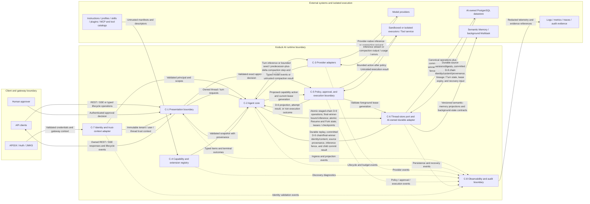

# ADD-0001: AI Service Boundary and Codex Alignment

## Metadata [Required]

- **Design Status**: Current
- **Date**: 2026-08-10
- **Author**: @codex
- **Architecture Owner**: @linhai
- **Required Approver**: @linhai
- **Approver [Conditionally Required — Design Status is or has been `Current`]**: @linhai
- **Approval Time [Conditionally Required — Design Status is or has been `Current`]**: 2026-09-02T12:11:59+08:00
- **Approval Evidence [Conditionally Required — Design Status is or has been `Current`]**: Approve
- **Retired By [Conditionally Required — Design Status is `Deprecated` or `Superseded`]**: N/A — Design Status is `Current`; the document has not been retired
- **Retirement Time [Conditionally Required — Design Status is `Deprecated` or `Superseded`]**: N/A — Design Status is `Current`; the document has not been retired
- **Retirement Evidence [Conditionally Required — Design Status is `Deprecated` or `Superseded`]**: N/A — Design Status is `Current`; the document has not been retired
- **Retirement Reason [Conditionally Required — Design Status is `Deprecated` or `Superseded`]**: N/A — Design Status is `Current`; the document has not been retired
- **Scope Level**: Repository / Cross-project
- **Scope**: The future Koduck AI runtime and its contracts with API clients, model providers, authentication, memory, tool execution, background work, and extension providers
- **Trello Sources**: [Koduck card 4WI4sszw](https://trello.com/c/4WI4sszw/2-%E8%B0%83%E7%A0%94-adr-%E6%98%8E%E7%A1%AE-ai-%E6%9C%8D%E5%8A%A1%E9%87%8D%E6%9E%84%E8%BE%B9%E7%95%8C%E4%B8%8E-codex-%E5%AF%B9%E9%BD%90%E7%9B%AE%E6%A0%87)
- **Figma Sources [Conditionally Required — UI is in scope]**: N/A — this design covers service and protocol boundaries and does not change a Web or native UI
- **Related**: [Koduck predecessor baseline](https://github.com/hailingu/koduck-quant/tree/c414ddccdbc45a99fcd3d606ca0fe1f75730b7fe/koduck-ai); [OpenAI Codex reference baseline](https://github.com/openai/codex/tree/3c60d4da648bfa98e3c51c5161ac2720519c733e)
- **Supersedes [Conditionally Required — this ADD replaces another]**: None
- **Superseded By [Conditionally Required — this ADD is replaced]**: None

## Requirement Level Legend [Required]

- **`[Required]`**: The section or field always applies and MUST remain present
  with complete, verifiable content. Use `None — <reason>` only when the
  template explicitly permits an empty result; never leave it blank.
- **`[Conditionally Required — <trigger>]`**: The section or field MUST be
  completed when its stated trigger applies. When the trigger does not apply,
  retain `N/A — <reason>` unless the template explicitly instructs removal or
  retention as inactive future-lifecycle guidance. A missing trigger assessment
  is incomplete content.
- **`[Optional]`**: The section may be removed without affecting acceptance,
  execution, completion, or verification. If retained, it MUST be accurate and
  complete; optional content MUST NOT substitute for required evidence.

Unlabeled fields inside a `[Required]` section are required.

## Context And Solution Summary [Required]

Koduck is a from-scratch successor to `koduck-quant`. The new repository
currently contains governance scaffolding and no services. The predecessor's
`koduck-ai`, fixed at commit `c414ddccdbc45a99fcd3d606ca0fe1f75730b7fe`, is
functional research evidence only: its infrastructure has been removed, it is
not an operating baseline, and its contracts are not compatibility or rollback
requirements. It is a Rust AI gateway and
orchestrator with REST/SSE APIs, provider adapters, a native tool-use loop,
MCP clients, agent profiles, skills, memory and multitask clients, background
workers, authentication, and reliability policy in one crate. The baseline has
161 tracked Rust source files; multiple orchestration, provider, configuration,
and worker files exceed 800 physical lines, including a 2,073-line native tool
loop. These measurements are review signals, not a conclusion that mechanical
file splitting is the target architecture.

OpenAI Codex is used as a public reference, fixed at commit
`3c60d4da648bfa98e3c51c5161ac2720519c733e`. Its relevant architectural ideas
are a provider-independent core, explicit thread/turn/item lifecycle, a typed
application protocol, replaceable thread storage, distinct execution and
sandbox responsibilities, explicit approval requests, and separately loaded
MCP, skill, plugin, and repository-instruction capabilities. Codex is not a
product specification for Koduck and its code layout is not a migration plan.

**Solution summary**: Build the future Koduck AI capability around an owned,
provider-independent agent core and a versioned thread/turn/item domain model.
Define new northbound REST/SSE and owned persistence contracts from this target
model; use predecessor behavior only to identify functional scenarios. Move capability discovery, policy
evaluation, approval, and execution behind explicit ports; require privileged
execution to run through a least-privilege execution boundary. Treat model
providers, storage, MCP, skills, repository instructions, and presentation
protocols as independently replaceable adapters. Preserve the intended
multi-provider, tenant, semantic-memory, and background-task capabilities
rather than adopting Codex's product-specific local persistence and auth model
or inheriting removed predecessor infrastructure. Before every Turn-inference
request, including an inference that continues an active tool loop, C-2 checks
the effective provider-context token budget and, when needed, automatically
builds or reuses a provenance-bearing derived compaction snapshot plus a
bounded recent tail; canonical Thread/Turn/Item history remains complete and
unchanged.

**Greenfield operating model**: No predecessor deployment, APISIX route, shared
history, or fallback path exists. Each candidate defines and verifies the new
contract it owns before first promotion. A failed candidate is not promoted;
its source or artifact is reverted or quarantined without attempting route-back
to removed infrastructure. After the first verified Koduck AI release exists,
any deployment rollback must target a verified new artifact under a separate
accepted OCR.

**Design boundary**: This ADD defines solution capabilities, logical data,
component responsibilities, flows, constraints, and ordered ADR candidates. It
does not authorize implementation, select source files or crates, define a
physical schema, freeze wire-field definitions, add dependencies, or prescribe
executable build, test, deployment, or rollback commands.

## Requirement Baseline [Required]

| ID | Trello source | Requirement baseline | Acceptance outcome | Priority and constraints | Last checked |
| --- | --- | --- | --- | --- | --- |
| R-1 | [Card 4WI4sszw](https://trello.com/c/4WI4sszw/2-%E8%B0%83%E7%A0%94-adr-%E6%98%8E%E7%A1%AE-ai-%E6%9C%8D%E5%8A%A1%E9%87%8D%E6%9E%84%E8%BE%B9%E7%95%8C%E4%B8%8E-codex-%E5%AF%B9%E9%BD%90%E7%9B%AE%E6%A0%87) | Research the current AI-service baseline against public OpenAI Codex and establish an auditable target boundary and migration direction. | A traceable gap matrix, adoption decisions with reasons, external-contract and security boundaries, dependency-ordered migration slices with validation and rollback boundaries, and a project Full ADR proposal after ADD approval. | Highest board position. No source, configuration, dependency, build, release, or deployment work before an eligible approver accepts the governing ADR. Trello is coordination context, not decision authority. | 2026-09-01 |

## Goals And Non-Goals [Required]

Goals:

- Establish one auditable predecessor functional-research baseline and one immutable Codex reference baseline.
- Define which Codex concepts Koduck adopts, adopts with adjustment, or does not adopt.
- Separate orchestration policy from transport, provider, storage, extension, and privileged-execution concerns.
- Preserve the predecessor's functional intent as research scenarios while defining new owned Koduck contracts without wire-parity or runtime-fallback obligations.
- Define least-privilege, approval, isolation, audit, cancellation, and recovery boundaries before tool execution expands.
- Preserve continuous conversation beyond the provider-context budget through automatic, provenance-bearing compaction without deleting, rewriting, or silently truncating canonical history.
- Provide ordered, independently reviewable ADR candidates with binary architecture-level acceptance context.

Non-goals:

- Forking OpenAI Codex or promising feature parity with its CLI, desktop app, cloud product, or UI.
- Reusing Codex's ChatGPT-specific authentication, account, rate-limit, or model-catalog behavior.
- Making local JSONL or SQLite state the canonical Koduck conversation or memory store.
- Selecting a physical crate layout, wire schema, database schema, dependency set, or implementation framework.
- Changing current APIs, deployments, runtime configuration, or service ownership in this ADD.
- Implementing proactive multi-agent orchestration before the single-agent lifecycle and execution policy are proven.

## Functional Capability Design [Required]

| ID | Actor | Trigger | Capability and outcome | Business rules and edge cases | Requirements |
| --- | --- | --- | --- | --- | --- |
| F-1 | API client or presentation adapter | A user starts, resumes, forks, steers, interrupts, or reads work | Represent work as a stable thread containing ordered turns and typed items, with explicit active and terminal states. | Resume always starts a new turn on the same thread from canonical history; it never reactivates a terminal turn. An authenticated client interrupt produces `interrupted`; a platform, policy, or dependency stop produces `cancelled`. Both are terminal. New versioned REST/SSE behavior is defined by owned contracts. | R-1 |
| F-2 | Agent core | A turn is accepted | Assemble instructions, context, available capabilities, model input, and policy into one observable orchestration lifecycle. | Provider-specific types do not enter the domain model; state transitions have one owner; partial results and terminal errors remain distinguishable. Before each Turn-inference request — initial, resumed, forked, or following durable provider/tool output in an active Turn — context below the configured soft token budget uses effective history directly, while context above that budget uses one valid derived compaction snapshot plus a bounded recent tail. Initial construction, reconstruction, and rolling advancement use bounded recursive producer steps: one bounded causally closed seed range, then the immediately preceding bounded snapshot content plus one bounded contiguous causally closed delta per successor step. D-9 reuse and commitment match the summarized prefix's own version/digest; final inference establishment separately matches the request-wide effective-context version/digest, including the selected committed snapshot identity/content digest or an explicit direct-history marker plus the exact tail. A tail-only append preserves a valid prefix snapshot while any prefix correction rebuilds it. When the preserved snapshot plus its grown exact tail no longer fits, the core advances it through bounded successor steps, staging, prefix fencing, committed-winner selection, and explicit failure handling. Missing, stale, corrupt, source-drifted, or failed compaction never silently discards context or permits a stale or losing staged summary in the next request. | R-1 |
| F-3 | Model adapter | The core requests Turn inference or bounded context-summary production | Translate owned model-neutral input, streamed inference output, and compaction-producer results to and from one configured provider without leaking provider wire types into the core. | CAND-1 has no provider fallback; time, token, retry, and output budgets are bounded; usage and terminal status are preserved. Compaction output is untrusted and the adapter neither owns D-9 persistence nor decides when it is used. Any later automatic provider fallback requires a separate Accepted ADR. | R-1 |
| F-4 | Tool or MCP provider | The core needs capability discovery or invocation | Discover typed tools, validate requests, evaluate policy, request approval when required, and dispatch through an execution boundary. | Untrusted descriptions and results never grant authority; default deny applies to unknown privileged effects; approval is bound to the exact action and scope. | R-1 |
| F-5 | Thread-store adapter | Thread state changes | Persist canonical thread/turn/item history and metadata through an owned store port backed by an AI-owned durable store. | One canonical owner per datum; appends are ordered and idempotent; local caches are reconstructable and never silently become truth. Semantic Memory and background Multitask integrations do not own canonical turn history. | R-1 |
| F-6 | Extension owner | Instructions, skills, plugins, or MCP capabilities change | Load validated, provenance-bearing extension metadata without changing core orchestration code. | Precedence is deterministic; invalid extensions fail visibly; tenant and thread isolation is preserved; extensions cannot widen permissions by declaration. | R-1 |
| F-7 | Operator or reviewer | A privileged action, failure, or recovery occurs | Observe structured lifecycle, policy, approval, execution, and recovery evidence without exposing secrets or sensitive prompt content. | Content logging is minimized and redacted; correlation IDs connect events; audit evidence distinguishes request, decision, attempt, and result. | R-1 |

## Data Model Design [Conditionally Required — data is created, updated, deleted, transferred, retained, or changes ownership, classification, lifecycle, relationships, or invariants]

### Entities And Lifecycle

| ID | Entity | Purpose | Ownership | Classification | Lifecycle |
| --- | --- | --- | --- | --- | --- |
| D-1 | Thread | Stable container for one user-visible body of work and its lineage. | Koduck AI thread-store domain; durable data is provided by its approved AI-owned store adapter. | Tenant/user content and metadata; potentially sensitive. | Created, optionally forked, active, archived, or deleted under owner policy. Thread deletion does not silently cascade to separately retained D-6/D-7 security evidence. |
| D-2 | Turn | One accepted input-to-terminal-outcome execution attempt within a thread. | Agent core for live state and foreground-liveness reconciliation; thread store for durable history and fenced liveness leases. | Potentially sensitive prompts, context references, and policy metadata. | Queued or started, with `recovery-pending` as a nonterminal started substate when durability is unavailable, then completed, interrupted, failed, or cancelled. Every foreground started turn has a C-2-owned heartbeat on a C-6-persisted lease generation. After the deterministic liveness window expires, a healthy C-2 reconciler fences the lost owner and appends `cancelled`; if C-6 was unavailable, reconciliation occurs when it returns. A terminal turn never returns to active. `Interrupted` means an authenticated client stopped it; `cancelled` means the platform, policy, or a dependency stopped it. Resume creates a new turn. |
| D-3 | Item | Ordered typed unit within a turn, such as input, reasoning summary, tool call, approval-status projection, tool result, file change, or agent message. | Agent core creates domain items; thread store persists them; presentation adapters project them. D-6, not D-3, owns approval authority. | Classification follows payload; tool and model output is untrusted. An approval projection carries the D-6 identity and status but no independent authority. | Appended with stable identity and order. A correction is a new versioned item that references the prior item; the prior item is never mutated or removed. |
| D-4 | Capability Descriptor | Validated description and schema for a tool, MCP capability, skill, or plugin, including effect classification, idempotency, retry safety, and applicable deadline/output constraints. | Extension/tool registry. | Public or internal metadata; descriptions and self-declared execution properties remain untrusted until validated by policy. | Discovered, validated, enabled, refreshed, disabled, or withdrawn with provenance and a stable version. |
| D-5 | Permission Profile | Named limits for filesystem, network, process, data, and service access. | Security policy domain. | Security-sensitive policy, not a secret. | Defined and versioned, then selected and optionally narrowed for a turn. Approval never mutates or widens the profile; when policy permits an approval path, D-6 authorizes only its exact D-7 attempt. |
| D-6 | Approval Request | Canonical security record for one exact proposed privileged action, target, parameters, effect, requested scope, rationale, and decision. | Approval/policy domain through C-5; thread items are projections only. | Security audit data; may contain sensitive paths or command metadata. | Requested, accepted for one exact bounded execution attempt, declined, cancelled, or expired, then linked to that attempt's result if accepted. Reusable session/turn grants are outside this ADD and require a future Accepted ADR. |
| D-7 | Execution Attempt | One bounded tool or process invocation and its observable result. | Execution boundary. | Potentially sensitive input/output and diagnostics. | Prepared, policy-checked, optionally approved, running, then succeeded, failed, timed out, or cancelled. A foreground attempt references the current D-2 lease generation; C-5 rejects dispatch or result commitment after that generation is fenced. |
| D-8 | Extension Manifest | Provenance, declared capabilities, configuration needs, and compatibility information for an extension. | Extension registry. | Internal configuration metadata; secrets referenced but never embedded. | Discovered, validated, activated, updated, disabled, or rejected. |
| D-9 | Context Compaction Snapshot | Reconstructable provider-context projection with a stable snapshot identity and content digest, summarizing one causally closed canonical history prefix while retaining its inclusive source range, prefix-scoped effective-history version and digest, policy version, producer identity, token accounting, predecessor snapshot identity/content digest when recursively produced, newly absorbed contiguous source range, and recent-tail boundary. A causally closed prefix ends at a durable Item boundary where no provider-visible request/result group, including a Tool call and its matching Tool result, is split between the summarized prefix and exact recent tail; it may end inside an active Turn only at such a boundary before its next inference. The assembled inference request separately carries a request-wide effective-context version/digest covering either an explicit direct-history marker or the selected committed D-9 identity/content digest, its prefix provenance, and the exact retained tail. | C-2 context-assembly policy; C-6 stores the derived snapshot through a narrow owned port but does not make it canonical history. | Derived tenant/user conversation content; as sensitive as the summarized source. | Built automatically before any Turn-inference request whose effective context exceeds the soft budget. A seed step consumes one bounded causally closed canonical range; each successor step consumes only the immediately preceding bounded snapshot content plus one bounded contiguous causally closed canonical delta, records the predecessor and absorbed range, and is capped by per-step input/output limits plus a bounded pass budget. Producer results form one ordered staged chain: its first member is a seed or is anchored to an exact selected committed D-9, and every later member names the immediately preceding staged member identity/content digest. The complete chain remains staged until one C-6 transaction validates the anchor, every member link, contiguous absorbed ranges, target-prefix keys, foreground Turn, and prefix provenance. That transaction commits or selects every member atomically and returns the final committed winner. Identical existing content is idempotent; a non-identical winner at the earliest conflicting member aborts the request chain with no member committed and returns that winner. C-2 discards the conflicting member and descendants, adopts the winner, and rechecks its covered prefix plus exact tail before producing anything else. If the winner already covers the target and fits, the regenerated suffix is empty and C-2 retries the atomic target-state transaction with that winner; otherwise C-2 rebuilds the complete remaining suffix across one or more bounded contiguous-delta passes, promoting each replacement member as predecessor, and retries C-6 only when the replacement tip plus exact tail fits. A tail-only append does not invalidate D-9; it produces a new request-wide version/digest after reassembly with the same committed snapshot and new exact tail. If that snapshot plus the grown exact tail no longer fits, bounded successor steps extend it over later contiguous closed ranges. A correction or other incompatible change inside the summarized prefix invalidates D-9 and forces bounded seed-and-successor reconstruction. Any snapshot-winner, prefix, or tail change after request assembly is detected by the separate request-wide inference-establishment fence. A Resume-staged chain becomes visible atomically with its new Turn or neither does; a Fork-staged child chain becomes visible atomically with child identity, lineage, and first Turn or none does. D-9 is superseded by a later snapshot, discarded when its producer returns after predecessor/prefix drift, interrupt, fencing, or cancellation, and deleted with its owning Thread under the same content-retention policy. |

### Relationships And Invariants

| Relationship | Cardinality and meaning | Invariant |
| --- | --- | --- |
| Thread contains Turn | One thread contains zero or more ordered turns. | A turn belongs to exactly one thread; its thread identity does not change. |
| Turn contains Item | One turn contains one or more ordered items, including any later correction item. | For the same canonical snapshot/version, replay produces the same externally observable sequence. A correction appends a new ordered item that references its predecessor; it never rewrites prior replay history. |
| Thread forks Thread | A thread may have one parent and zero or more children. | Fork lineage is immutable and cross-tenant lineage is prohibited. |
| Foreground Turn holds Liveness Lease | Each foreground started turn has one current C-6-persisted lease generation renewed by its C-2 owner. | Only the current generation may append or dispatch/commit a foreground D-7 attempt. Missing heartbeats beyond the deterministic liveness window fence the old owner; concurrent reconcilers use one conditional, idempotent terminal transition keyed by turn and lease generation, producing exactly one `cancelled`. An expired owner can never resume or overwrite that result. |
| Turn selects Permission Profile | Each turn resolves exactly one effective profile. | Later extension, model output, or approval cannot mutate or widen the resolved profile; an accepted D-6 remains a one-attempt authorization evaluated against policy. |
| Approval Request projects to Item | One D-6 record may produce status-projection items in its owning turn. | D-6 is canonical; a D-3 projection references the exact D-6 version, cannot authorize execution, and is corrected only by appending a later projection. |
| Approval Request authorizes Execution Attempt | One accepted D-6 approval authorizes exactly one bounded D-7 execution attempt with the same action, target, parameters, effect, and scope. | Any parameter, target, effect, scope, or attempt-identity drift requires a new policy evaluation and a new approval. No session/turn-wide reusable grant exists in this design. |
| Capability Descriptor produces Execution Attempt | An attempt references one validated descriptor version. | Execution is rejected if the descriptor is missing, stale beyond policy, disabled, or incompatible. |
| Extension Manifest exposes Capability Descriptor | One manifest may expose many descriptors. | Removing or disabling a manifest makes its descriptors unavailable without rewriting history. |
| Context Compaction Snapshot summarizes Item range | One D-9 snapshot covers one contiguous, durable, causally closed prefix of effective canonical history and retains a bounded unsummarized tail after that prefix. A Tool call and its matching Tool result, and every other provider-visible request/result group, must remain together in the prefix or together in the tail; the boundary never cuts an open group. The prefix may end inside an active Turn only at such a boundary before its next inference. | The stable snapshot identity/content digest, target Thread, tenant, subject, fork lineage, inclusive source range, prefix-scoped effective-history version and digest, causal-closure proof, policy version, producer identity, and, for a successor, exact predecessor identity/digest plus newly absorbed contiguous range must match before reuse. A seed producer input is one bounded closed source range; a successor input is the immediately preceding bounded snapshot content plus one bounded contiguous closed delta, never the complete expanded canonical prefix. A staged chain is anchored to no predecessor for a seed or to one selected committed D-9 for advancement; each later staged member must name the immediately preceding member. C-6 atomically validates the anchor, every predecessor identity/digest, contiguous absorbed range, target-prefix key, and current prefix source before committing/selecting the complete chain. The chain commits all members or none. An identical winner is idempotent; a non-identical winner at any member aborts the request chain, commits none of its members, and returns the earliest conflicting winner. C-2 must adopt and re-evaluate that winner before rebuilding: when it covers the target prefix and fits with the exact tail, the replacement suffix is empty; otherwise the complete remaining suffix must absorb every required uncovered contiguous range across bounded passes before another atomic attempt. A tail-only append leaves the prefix key valid and reuses the committed D-9 with a freshly read exact tail; if the snapshot plus grown tail no longer fits, one or more bounded successor steps absorb later ranges within a bounded pass budget. A correction or other drift within the summarized prefix rejects or supersedes D-9 and forces bounded seed-and-successor reconstruction. Generation-bound inference establishment separately compares the assembled request-wide effective-context version/digest — covering the final committed chain winner identity/content digest, prefix provenance, and exact tail, or a direct-history marker — with current canonical and snapshot state, so any winner, prefix, or tail drift after assembly triggers bounded reassembly. Resume atomically commits/selects the complete staged chain with its new Turn and binds the Turn to the final winner, or exposes neither. A Fork reserves its child Thread identity and immutable lineage before snapshot selection; a parent-scoped D-9 is never reused as child-scoped data. The complete child-bound staged chain may be built only from authorized causally closed parent ranges ending at or before the exact fork point and is committed atomically with child lineage and first Turn, or no chain member or child state becomes visible. If no causally closed bounded step or pass budget can satisfy the snapshot-plus-tail budget, compaction fails visibly. D-9 is untrusted conversation content and cannot become instructions, policy, identity, approval, or execution authority. It never replaces or authorizes deletion of D-1/D-2/D-3 data. |

## Architecture Design [Required]

| ID | Component or dependency | Responsibility | Conceptual inputs and outputs | Dependencies | Accepted constraints |
| --- | --- | --- | --- | --- | --- |
| C-1 | Presentation boundary | Expose the new versioned REST/SSE contract, authenticated approval protocol, and future typed application protocols; translate them to owned domain requests, approval decisions, and events. | Client and approver requests, gateway context, thread/turn operations, approval decisions; typed lifecycle events and owned REST/SSE responses. | C-2, C-5, C-7. | C-1 delegates signed-claim validation and trust-context construction to C-7; it never validates identity by itself. The new contract is authoritative; predecessor wire parity is not required. UI design is out of scope. |
| C-2 | Agent core | Own thread/turn orchestration, state transitions, effective-context assembly, automatic context-compaction policy, budgets, cancellation, foreground lease heartbeats, orphan reconciliation, and provider-independent policy flow. | Owned turn input, instructions, canonical context references, prefix-scoped D-9 provenance and committed identity/content digest, request-wide effective-context provenance, and causally closed recent-tail boundaries, capabilities, lease-expiry signals; bounded model context, ordered staged D-9 chains, committed derived compaction snapshots, typed items, and terminal outcomes. | C-3, C-4, C-5, C-6, C-7. | Any healthy C-2 instance may reconcile an expired foreground lease, but only through C-6 generation fencing. C-2 checks context before every Turn-inference request. Seed construction consumes one bounded closed canonical range; reconstruction and rolling advancement recursively use the prior bounded snapshot content plus one bounded contiguous closed delta per C-3 call, never the complete expanded prefix, and stop at a configured pass budget. C-2 supplies one ordered staged chain with an optional selected committed anchor, every member's predecessor identity/digest and absorbed range, and all target-prefix provenance to C-6. C-6 atomically validates and commits/selects the complete chain, then returns its final committed winner. A non-identical conflict commits none of the request chain; C-2 discards the conflicting staged member and descendants, rereads and adopts the earliest conflicting winner, then rechecks its covered prefix and exact-tail fit. A winner that already completes the target uses an empty replacement suffix; otherwise C-2 loops across every remaining bounded contiguous delta, promoting each replacement member as predecessor, until the replacement tip plus tail fits or the pass budget ends. Only then may it retry the atomic chain transaction. Final inference establishment separately revalidates request-wide provenance containing the final committed winner identity/content digest, prefix provenance, and exact tail, or a direct-history marker, while also checking that the Turn remains nonterminal, its lease generation remains current, and no authenticated interrupt or cancellation has won. Tail-only drift reassembles the request while retaining D-9 when its prefix still matches; when the valid snapshot plus exact tail no longer fits, C-2 performs bounded successor steps; prefix drift rejects D-9 and performs bounded seed-and-successor reconstruction. All drift and chain-conflict recovery is bounded, and late or losing compaction output is discarded. Compaction may create only derived target-scoped D-9 projections, must keep each provider-visible request/result group wholly in the prefix or tail, and must fail visibly rather than silently omit uncovered history. Resume compaction atomically commits/selects the complete staged chain with the new Turn and binds that Turn to the final winner; Fork compaction follows child identity and lineage reservation and commits the complete child chain only with atomic child state. No provider wire types, Web handlers, database types, or privileged host execution enter the core. |
| C-3 | Provider adapters | Translate owned Turn-inference requests, streams, and the owned bounded compaction-producer request for OpenAI-compatible and other configured providers. | Model-neutral messages, Tool schemas, a bounded seed range or immediately preceding bounded snapshot content plus one bounded contiguous causally closed delta, and budgets; model events, bounded compaction output, usage, and normalized errors. | External provider APIs. | Every producer request independently satisfies input, output, time, and retry limits; C-3 does not load the complete expanded prefix, read canonical history or D-9 persistence, select a committed winner, or control the C-2 pass budget. Provider selection is explicit; the initial baseline has no automatic fallback. Compaction input/output is untrusted conversation content and grants no authority. Secrets remain in adapter configuration boundaries. |
| C-4 | Capability and extension registry | Load repository instructions, agent profiles, skills, plugins, and MCP/tool descriptors with precedence and provenance. | Configured roots and remote catalogs; validated descriptors and diagnostics. | MCP/tool providers, configuration. | Metadata is untrusted; extension declarations never grant execution authority. |
| C-5 | Policy, approval, and execution boundary | Resolve permission profiles, evaluate effects, own canonical D-6 approval records, bind each accepted approval to one D-7 attempt, validate the current foreground lease generation through C-6, and dispatch through sandboxed or isolated executors. | Proposed action, immutable trust context, and applicable turn lease generation; authenticated approval decision delivered through C-1; policy decision, D-6 status, execution events and result returned through C-2. | C-6, Tool service, MCP providers, platform sandbox or isolated worker. | C-5 exposes owned ports and does not depend on C-1. It rejects dispatch and result commitment from a fenced foreground owner. Default deny, cancellation, timeout, output cap, and audit are mandatory; C-2 never performs direct host execution, and no reusable session/turn approval exists. |
| C-6 | Thread-store port and AI-owned durable adapter | Persist and retrieve canonical history, metadata, lineage, foreground liveness leases, checkpoints, idempotency state, and reconstructable D-9 compaction snapshots in a shared durable store owned by the AI service boundary. | Versioned Thread/turn/item appends and bounded range queries, target-scoped derived snapshot reads, atomic ordered staged-chain validation/commit/winner selection, committed-winner identity/content reads, generation- and request-wide-source/snapshot-bound inference-establishment checks, atomic Resume staged-chain/final-winner/new-Turn commit, Fork child-identity/lineage reservation and atomic child-chain/final-winner/child-state commit, lease acquire/renew/expire operations; ordered history, prefix-scoped and request-wide effective-history versions/digests, D-9 identity/content/provenance, metadata, and fenced lease generations. | AI-owned PostgreSQL datastore; later semantic Memory and background Multitask adapters consume owned projections or commands. | Lease expiry and orphan terminal transition are conditional and idempotent by turn plus generation. A stale generation or terminal Turn rejects foreground chain commitment and inference establishment. One chain transaction validates its optional selected committed anchor, every staged member's predecessor identity/content digest, contiguous absorbed range, target-prefix key, and current prefix provenance. All request members commit/select atomically or none do. Identical existing content converges idempotently. A non-identical winner at the earliest conflicting member aborts the whole request chain with no member committed and returns that winner descriptor/content. C-6 accepts the next atomic attempt with that selected winner and an empty staged suffix when it already covers the target, or with only bounded descendants for remaining uncovered ranges; C-2 owns that winner-first choice. Any changed request-wide effective-context provenance or final selected winner identity/content digest rejects inference establishment. Tail-only appends do not invalidate a prefix-matching D-9. A failed Resume compaction or final commit exposes no staged-chain member or new Turn; a successful atomic Resume binds the Turn to the final selected chain winner. A cancelled or failed Fork compaction or final commit exposes no child identity, lineage, staged-chain member, or Turn. The AI-owned store is canonical for Thread/Turn/Item; D-9 and process-local state are reconstructable only and never authorize canonical-history mutation. |
| C-7 | Identity and trust-context adapter | Validate gateway/JWT identity and construct immutable tenant/user/thread trust context. | Credentials and gateway context; validated principal and scopes. | APISIX and Auth/JWKS. | Headers cannot replace missing signed claims; secrets and raw credentials do not enter history or logs. |
| C-8 | Observability and audit boundary | Emit structured lifecycle, provider, policy, approval, execution, retry, and recovery signals. | Correlated events from C-1 through C-7; redacted logs, metrics, traces, and evidence references. | Logging, metrics, tracing backends. | Content minimized by default; sensitive content requires explicit environment-safe diagnostics and redaction. |

The table's Dependencies column defines implementation dependency direction.
Return events and responses in the diagram below do not reverse that direction:
C-5 returns owned policy/approval/execution events through C-2, while C-1 is an
adapter that invokes the C-5 decision port after C-7 validation.

### Mermaid Architecture Diagram [Required]



## Control Flow Design [Conditionally Required — the solution has multiple steps, branches, retries, asynchronous work, or failure recovery]

| ID | Trigger and precondition | Happy path | Branches and retries | Failure handling | Observable result |
| --- | --- | --- | --- | --- | --- |
| CF-1 | Client starts or continues a turn / identity and thread access are valid | C-1 normalizes input; C-2 durably creates the started turn and input, acquires and renews its fenced foreground lease through C-6, and resolves capabilities and policy. Before every C-3 Turn-inference request — including after durable provider/tool output continues an active Turn — C-2 assembles effective context and checks the soft token budget. It uses direct effective history when within budget or one committed prefix-provenance-matching D-9 plus exact recent tail when over budget. Initial construction or reconstruction starts from one bounded causally closed canonical range; each successor step sends only the immediately preceding bounded snapshot content plus one bounded contiguous causally closed delta to C-3. Rolling advancement starts from the selected committed D-9 and stages successors until the snapshot plus tail fits or the bounded pass budget ends. C-2 submits the ordered chain, optional committed anchor, member predecessor identities/digests, absorbed ranges, and target-prefix provenance to one C-6 atomic chain operation. C-6 commits/selects every member or none and returns the final committed winner identity/content digest. C-2 then derives request-wide provenance over that final winner, prefix provenance, and exact tail, or a direct-history marker, and at inference establishment revalidates it plus the nonterminal Turn, current lease generation, and absence of an authenticated interrupt or cancellation. It appends every externally visible item and terminal outcome through C-6 before C-1 publishes it. | Missing, stale, corrupt, incompatible, prefix-provenance-mismatched, or causally open D-9 state is rejected and rebuilt through bounded seed-and-successor steps; no producer call receives the complete expanded canonical prefix. Producer output remains in one ordered staged chain until the atomic anchor/member/range/prefix fence passes. Identical existing content is idempotent. A non-identical winner at any member aborts the request chain with no member committed; C-2 discards that member and descendants, rereads and adopts the earliest conflicting committed winner, and rechecks its coverage and exact-tail fit. If the winner already completes the target, the replacement suffix is empty; only uncovered contiguous ranges produce bounded successors. A correction inside the summarized prefix rejects D-9 and triggers bounded recursive reconstruction. A tail-only append retains a prefix-valid D-9 but changes request-wide provenance, so C-2 rereads the exact tail; if it no longer fits, successor steps absorb later closed ranges. Any final committed-winner, prefix, or tail drift after assembly rejects request establishment and restarts assembly within the same bounded drift/pass budget. Each Tool call/result group remains wholly summarized or wholly exact. Provider retry follows a bounded budget and the same final fence; no provider or legacy runtime fallback occurs. An authenticated interrupt cancels in-flight compaction when possible and yields `interrupted`; a platform, policy, dependency, or lease-generation stop yields `cancelled`. Any late or losing producer result is ignored. | If recursive construction or advancement cannot prove complete and causally closed coverage, any seed/successor producer fails, no valid next bounded range can fit, a chain member conflicts and winner-first bounded recovery cannot converge, a committed winner cannot be reread, or pass/drift budgets exhaust, C-2 issues no subsequent Turn-inference request and durably terminates the accepted active Turn as `failed`; no context is silently discarded and no orphan Tool result is sent. If interrupt, terminal state, cancellation, lease fencing, anchor/member/prefix drift, winner drift, or request-wide drift wins, the applicable fence discards the complete staged chain or conflicting suffix, rejects chain commitment or inference establishment, and either rebuilds from the new source/winner or preserves the winning durable terminal. A later append failure enters `recovery-pending` and closes `failed` when C-6 returns. Liveness expiry fences the old generation and exactly one reconciler appends `cancelled`. | The client sees rejection with no turn, a direct context or context assembled from the exact final committed chain winner and exact tail bound into every fenced inference, the winning durable terminal with no post-terminal, prefix-stale, winner-stale, or request-stale inference, a durable typed `failed` recursive-compaction terminal without a subsequent inference, a replayable prefix plus `durability-unavailable`, or an eventual durable `cancelled` orphan terminal. No expired, terminal, prefix-stale, winner-stale, or request-stale owner can commit compaction, append, or report completion. |
| CF-2 | Model requests a capability / descriptor is active and compatible | C-4 resolves validated effect, idempotency, retry, and budget metadata; C-5 validates the exact action and current foreground lease generation and, when approval is required, creates canonical D-6 state, obtains the decision through C-1/C-7, and binds acceptance to one D-7 attempt. It executes allowed work in isolation and returns any D-6 projection plus the untrusted result to C-2. | Policy may deny, request narrower input, allow without approval, or require approval. Pre-effect work may retry within metadata and budget; once a privileged D-7 starts, any retry is a new attempt requiring current-lease validation, fresh policy evaluation, and, when required, a new approval. | A fenced lease, decline, cancel, or expiry becomes a typed non-execution result; fencing during execution prevents result commitment and records a cancelled/failed attempt according to observed effect state. Descriptor drift restarts evaluation without reusing approval. | Canonical audit evidence links descriptor version, policy, lease generation, D-6 when applicable, D-7 attempt, result, and D-3 projections without treating projections as authority. |
| CF-3 | Thread is resumed or forked / caller has access | C-6 loads canonical ordered history, committed D-9 identity/content/prefix provenance when present, request-wide provenance, and lineage. Resume binds context assembly to the existing Thread. Fork first reserves an unpublished child Thread identity and immutable lineage at the exact fork point, then binds all D-9 selection and construction to that child scope. C-2 uses direct effective history below budget, a fitting committed target-bound D-9 plus exact recent tail, or a bounded recursive seed/successor chain above budget. Each seed consumes one bounded closed range; each successor consumes only its immediately preceding bounded snapshot content plus one bounded contiguous closed delta. Resume atomically validates and commits/selects the complete staged chain, compares request-wide provenance, and commits the new Turn bound to the final winner, or commits neither. Fork atomically validates and commits/selects the complete child chain while committing child identity, lineage, and first Turn bound to the final winner. | Resume may reuse only an existing-Thread prefix-provenance and causal-closure match. A tail-only append retains that committed snapshot and triggers exact-tail reassembly with its identity/content digest; if it no longer fits, bounded successor steps form one staged chain anchored to that committed winner. A prefix correction rejects it and starts a seed-anchored staged chain. Identical existing members converge idempotently; a non-identical winner aborts the whole request chain and returns the earliest conflict. C-2 adopts that winner and rechecks target coverage plus exact-tail fit before retrying the atomic Turn or child-state transaction: a final-member winner may complete recovery with an empty replacement suffix, while only remaining uncovered contiguous ranges produce bounded descendants. Fork never reuses a parent-scoped snapshot; it may stage a child-bound chain only from authorized contiguous closed parent ranges ending at or before the fork point. Request-wide drift after assembly retries with the same final committed winner only while its identity/content/prefix remains selected and fits; otherwise C-2 rereads the winner or regenerates within bounded budgets. Incompatible historical Item versions use a versioned adapter. Foreground orphan closure belongs to CF-1; background recovery belongs to CF-5. | Canonical corruption, unavailable or changed request source, seed/successor producer failure or cancellation, no bounded causally closed next range, pass-budget exhaustion, chain conflict that cannot converge within the bounded winner-first retry budget, committed-winner read failure, or final atomic-commit failure issues no Turn-inference request. Resume exposes no staged-chain member or new Turn; Fork aborts the reservation and exposes no child Thread, lineage, staged-chain member, or Turn. No path silently truncates history, emits an orphan Tool result, mutates canonical Items, crosses scope, reuses parent D-9 as child data, partially commits a request chain, uses a losing staged summary, commits a Turn against stale winner/request provenance, or reactivates a terminal Turn. | The original terminal Turn and complete canonical replay remain unchanged. A successful compacted Resume atomically exposes the complete D-9 chain and one new Turn bound to its final committed winner. A successful compacted Fork atomically exposes the complete child-bound D-9 chain, one child Thread with stable lineage, and its first Turn bound to the final winner; a direct-history path creates no D-9, and every cancelled or failed Fork has zero visible child state. |
| CF-4 | Extension inventory changes or a configured source becomes unavailable | When reachable, C-4 discovers, parses, validates, records provenance, and atomically publishes a new capability snapshot. | Invalid entries are excluded with diagnostics. If the source is unavailable, the prior valid snapshot remains active only when an explicit stale policy permits its age and scope; otherwise new resolutions fail closed. | Source loss or load failure never widens permissions and never partially publishes an inconsistent catalog. In-flight turns retain their already resolved snapshot. | New turns observe one coherent fresh or explicitly stale snapshot, or a typed capability-unavailable failure with provenance diagnostics. |
| CF-5 | Background work is accepted / identity, idempotency, and capability policy are valid | C-1/C-2 create durable work intent; Multitask schedules; workers execute the same core lifecycle and C-6 records checkpoints and terminal state. | Duplicate submission returns the existing identity; lease loss or restart resumes only from a durable checkpoint permitted by task semantics. | Unsafe or ambiguous recovery stops and requires a new attempt; abandoned work has a truthful terminal state. | Foreground and background work expose compatible lifecycle and evidence semantics. |

### Mermaid Control Flow [Conditionally Required — Control Flow Design is triggered]

```mermaid
flowchart TB
  subgraph CF1 ["CF-1 Foreground turn lifecycle"]
    CF1Start["Start or continue turn"] --> CF1Auth{"Identity and thread access valid?"}
    CF1Auth -->|"No"| CF1Reject["Reject before model or tool use"]
    CF1Auth -->|"Yes"| CF1Append["C-1 normalizes; C-2 appends started turn and input"]
    CF1Append --> CF1InputStored{"Started turn and input durable?"}
    CF1InputStored -->|"No"| CF1NoTurn["Reject with durability-unavailable; no turn accepted"]
    CF1InputStored -->|"Yes"| CF1Lease["C-2 acquires and renews fenced foreground lease through C-6"]
    CF1Lease --> CF1Resolve["Resolve capabilities, policy, and effective context"]
    CF1Lease -.->|"Heartbeat absent beyond liveness window"| CF1Orphan["Fence expired owner generation"]
    CF1Orphan --> CF1OrphanCancel["C-2 reconcilers race through one conditional idempotency key"] --> CF1Persist
    CF1Resolve --> CF1Budget{"Effective context within soft token budget before next inference?"}
    CF1Budget -->|"Yes"| CF1RequestFence
    CF1Budget -->|"No"| CF1Snapshot{"Valid prefix-provenance- and causal-closure-matching D-9 available?"}
    CF1Snapshot -->|"Yes, prefix provenance and causal closure match"| CF1Reuse["Reuse D-9 with exact tail; keep each Tool round wholly summarized or wholly exact"]
    CF1Snapshot -->|"No, bounded seed range and closed boundary available"| CF1Build["Request seed D-9 from one bounded causally closed range through C-3"]
    CF1Snapshot -->|"No closed boundary or source unavailable"| CF1CompactFail["Prepare failed terminal; no next Turn-inference request"] --> CF1Persist
    CF1Build --> CF1BuildResult{"Producer succeeds with valid bounded output?"}
    CF1BuildResult -->|"No"| CF1CompactFail
    CF1BuildResult -->|"Yes"| CF1Built["Append seed or successor D-9 to ordered staged chain with predecessor and absorbed-range provenance"] --> CF1BuiltFits{"Current staged-chain tip plus exact recent tail fits budget?"}
    CF1BuiltFits -->|"No"| CF1BuildPass{"Bounded recursive pass budget remains?"}
    CF1BuildPass -->|"No"| CF1CompactFail
    CF1BuildPass -->|"Yes"| CF1BuildRange{"Next bounded contiguous causally closed delta available?"}
    CF1BuildRange -->|"No"| CF1CompactFail
    CF1BuildRange -->|"Yes"| CF1BuildNext["Request successor from staged predecessor content plus bounded delta through C-3"] --> CF1BuildResult
    CF1BuiltFits -->|"Yes"| CF1D9Pending{"Ordered staged D-9 chain pending?"}
    CF1Reuse --> CF1Fits{"Existing D-9 plus grown exact recent tail fits budget?"}
    CF1Fits -->|"Yes"| CF1D9Pending
    CF1Fits -->|"No"| CF1AdvancePredecessor["Set rolling predecessor to committed D-9"] --> CF1AdvanceSource{"Next bounded contiguous causally closed delta available?"}
    CF1AdvanceSource -->|"No"| CF1CompactFail
    CF1AdvanceSource -->|"Yes"| CF1Advance["Request successor from current rolling predecessor content plus bounded delta through C-3"]
    CF1Advance --> CF1AdvanceResult{"Producer succeeds with valid bounded output?"}
    CF1AdvanceResult -->|"No"| CF1CompactFail
    CF1AdvanceResult -->|"Yes"| CF1Advanced["Append successor to ordered staged chain with predecessor and absorbed-range provenance"] --> CF1AdvancedFits{"Current staged-chain tip plus exact recent tail fits budget?"}
    CF1AdvancedFits -->|"No"| CF1AdvancePass{"Bounded successor pass budget remains?"}
    CF1AdvancePass -->|"No"| CF1CompactFail
    CF1AdvancePass -->|"Yes"| CF1AdvancePromote["Promote staged successor to rolling predecessor"] --> CF1AdvanceSource
    CF1AdvancedFits -->|"Yes"| CF1D9Pending
    CF1D9Pending -->|"No"| CF1RequestFence{"Request provenance with direct marker or committed D-9 identity/content digest current, Turn nonterminal, lease current, and no interrupt or cancellation?"}
    CF1D9Pending -->|"Yes"| CF1CommitD9{"Atomic anchor/member/range/prefix/Turn/lease validation commits or selects the complete chain?"}
    CF1CommitD9 -->|"Yes or identical existing members"| CF1Winner["C-6 returns final committed chain winner identity and content digest"] --> CF1WinnerRead["Read final committed winner content"] --> CF1RequestFence
    CF1CommitD9 -->|"No, earliest non-identical member winner"| CF1ChainConflict["No request member committed; discard conflicting member and descendants; adopt winner and recheck coverage plus exact-tail fit"] --> CF1ChainRetry{"Bounded winner-first conflict-recovery budget remains?"}
    CF1ChainRetry -->|"Yes"| CF1Resolve
    CF1ChainRetry -->|"No"| CF1CompactFail
    CF1CommitD9 -->|"No, terminal or fence won"| CF1FenceLost{"Winning durable state"}
    CF1CommitD9 -->|"No, prefix changed"| CF1PrefixDrift["Discard complete staged chain and rebuild summarized prefix"]
    CF1RequestFence -->|"Yes"| CF1Dispatch{"Atomically establish inference for the same source and selected committed-snapshot provenance?"}
    CF1Dispatch -->|"Yes"| CF1Provider["Issue Turn-inference request through C-3"]
    CF1Dispatch -->|"No, terminal or fence won"| CF1FenceLost
    CF1Dispatch -->|"No, final winner, prefix, or tail changed"| CF1RequestDrift["Reread final winner and exact tail; retain D-9 only if identity, digest, and prefix still match"]
    CF1PrefixDrift --> CF1DriftBudget{"Bounded source-drift retry remains?"}
    CF1RequestDrift --> CF1DriftBudget
    CF1DriftBudget -->|"Yes"| CF1Resolve
    CF1DriftBudget -->|"No"| CF1CompactFail
    CF1FenceLost -->|"Authenticated interrupt"| CF1Interrupt
    CF1FenceLost -->|"Existing terminal"| CF1TerminalStop
    CF1FenceLost -->|"Cancelled or fenced"| CF1Cancel
    CF1RequestFence -->|"Authenticated interrupt won"| CF1Interrupt
    CF1RequestFence -->|"Existing terminal"| CF1TerminalStop["Discard staged or late compaction output; preserve terminal; no inference"] --> CF1Done
    CF1RequestFence -->|"Fenced, platform, policy, or dependency stop"| CF1Cancel
    CF1RequestFence -->|"Winner, prefix, or tail changed"| CF1RequestDrift
    CF1Provider --> CF1Outcome{"Next provider or control outcome"}
    CF1Outcome -->|"Stream item"| CF1Item["Append item through C-6"]
    CF1Item --> CF1ItemStored{"Item durable?"}
    CF1ItemStored -->|"Yes"| CF1Publish["C-1 publishes durable item; continue current stream"] --> CF1Outcome
    CF1ItemStored -->|"No"| CF1StoreFail["Stop generation; emit out-of-band durability-unavailable"]
    CF1Outcome -->|"Retryable and budget remains"| CF1Budget
    CF1Outcome -->|"Durable tool or control result requires next inference"| CF1Budget
    CF1Outcome -->|"Authenticated client interrupt"| CF1Interrupt["Discard staged or late compaction output; prepare or preserve interrupted terminal"] --> CF1Persist
    CF1Outcome -->|"Platform, policy, dependency, or lease stop"| CF1Cancel["Discard staged or late compaction output; prepare or preserve cancelled terminal"] --> CF1Persist
    CF1Outcome -->|"Terminal provider failure"| CF1Fail["Prepare failed terminal"] --> CF1Persist
    CF1Outcome -->|"Success"| CF1Persist["C-6 appends terminal outcome"]
    CF1Persist --> CF1Stored{"Append durable?"}
    CF1Stored -->|"No"| CF1StoreFail
    CF1Stored -->|"Yes"| CF1Done["Emit ordered durable terminal lifecycle"]
    CF1StoreFail --> CF1Recovery["Keep turn nonterminal; when C-6 returns, prepare failed terminal"] --> CF1Persist
  end

  subgraph CF2 ["CF-2 Capability policy, approval, and execution"]
    CF2Start["Model proposes capability action"] --> CF2Descriptor{"C-4 descriptor active and compatible?"}
    CF2Descriptor -->|"No or drifted"| CF2Refresh["Refresh and resolve exact descriptor"]
    CF2Refresh --> CF2Fresh{"Fresh compatible descriptor available?"}
    CF2Fresh -->|"No"| CF2NoExec["Typed non-execution result"]
    CF2Fresh -->|"Yes"| CF2Policy["C-5 validates lease generation, input, and effect"]
    CF2Descriptor -->|"Yes"| CF2Policy
    CF2Policy --> CF2Lease{"Foreground lease current or not applicable?"}
    CF2Lease -->|"No"| CF2NoExec
    CF2Lease -->|"Yes"| CF2Decision{"Policy decision"}
    CF2Decision -->|"Deny or require narrower input"| CF2NoExec["Typed non-execution result"]
    CF2Decision -->|"Approval required"| CF2Present["C-1/C-7 presents canonical exact D-6 request"]
    CF2Present --> CF2Approval{"Accept, decline, cancel, or expire?"}
    CF2Approval -->|"Decline / cancel / expire"| CF2NoExec
    CF2Approval -->|"Accept one exact D-7 attempt"| CF2Execute["Dispatch to isolated executor"]
    CF2Decision -->|"Allow"| CF2Execute
    CF2Execute --> CF2ExecOutcome{"Execution outcome"}
    CF2ExecOutcome -->|"Pre-effect retryable failure and metadata permits"| CF2Reevaluate["Create new attempt candidate; reevaluate policy and approval"] --> CF2Policy
    CF2ExecOutcome -->|"Timeout or cancellation"| CF2Stop["Terminate attempt with typed outcome"]
    CF2ExecOutcome -->|"Owner generation fenced"| CF2Fenced["Reject result commit; record cancelled or failed from observed effect state"]
    CF2ExecOutcome -->|"Failure or effect may have occurred"| CF2Failure["Record typed failed attempt; do not auto-retry"]
    CF2ExecOutcome -->|"Success"| CF2Result["Return D-6 projection and untrusted result to C-2"]
    CF2NoExec --> CF2Audit["Link descriptor, policy, applicable D-6/D-7, result, and projections"]
    CF2Stop --> CF2Audit
    CF2Fenced --> CF2Audit
    CF2Failure --> CF2Audit
    CF2Result --> CF2Audit
  end

  subgraph CF3 ["CF-3 Resume or fork"]
    CF3Start["Resume or fork request"] --> CF3Access{"Caller has access?"}
    CF3Access -->|"No"| CF3Reject["Reject without creating work"]
    CF3Access -->|"Yes"| CF3Load["C-6 loads canonical history, prefix-scoped D-9 provenance, request-wide provenance, and lineage"]
    CF3Load --> CF3History{"Canonical history complete and valid?"}
    CF3History -->|"No"| CF3Fail["Fail visibly; do not truncate history"]
    CF3History -->|"Yes"| CF3Version{"Historical item version compatible?"}
    CF3Version -->|"No, adapter exists"| CF3Translate["Apply versioned translation"] --> CF3Operation
    CF3Version -->|"No adapter"| CF3Fail
    CF3Version -->|"Yes"| CF3Operation{"Resume or fork?"}
    CF3Operation -->|"Resume"| CF3ResumeScope["Bind D-9 provenance to existing Thread"] --> CF3Budget
    CF3Operation -->|"Fork"| CF3ForkScope["Reserve unpublished child identity and immutable lineage"] --> CF3Budget
    CF3Budget{"Effective context within soft token budget?"}
    CF3Budget -->|"Yes"| CF3Direct["Use effective history directly"]
    CF3Budget -->|"No"| CF3Snapshot{"Valid target-scope and causally closed D-9 available? Never reuse parent D-9 for Fork"}
    CF3Snapshot -->|"Yes, prefix provenance and causal closure match"| CF3Reuse["Reuse target-bound D-9 with exact tail; keep each Tool round wholly summarized or wholly exact"]
    CF3Snapshot -->|"No, bounded seed range and closed boundary available"| CF3Build["Request seed target-bound D-9 from one bounded causally closed range through C-3"]
    CF3Snapshot -->|"No closed boundary or source unavailable"| CF3Fail
    CF3Build --> CF3BuildResult{"Producer succeeds with valid bounded output?"}
    CF3BuildResult -->|"No"| CF3Fail
    CF3BuildResult -->|"Yes"| CF3Built["Append seed or successor D-9 to ordered staged child or Resume chain"] --> CF3BuiltFits{"Current staged-chain tip plus exact recent tail fits budget?"}
    CF3BuiltFits -->|"No"| CF3BuildPass{"Bounded recursive pass budget remains?"}
    CF3BuildPass -->|"No"| CF3Fail
    CF3BuildPass -->|"Yes"| CF3BuildRange{"Next bounded contiguous causally closed delta available?"}
    CF3BuildRange -->|"No"| CF3Fail
    CF3BuildRange -->|"Yes"| CF3BuildNext["Request successor from staged predecessor content plus bounded delta through C-3"] --> CF3BuildResult
    CF3BuiltFits -->|"Yes"| CF3CompactContext["Use complete staged chain tip plus retained recent tail"]
    CF3Reuse --> CF3Fits{"Existing D-9 plus grown exact recent tail fits budget?"}
    CF3Fits -->|"Yes"| CF3CompactContext
    CF3Fits -->|"No"| CF3AdvancePredecessor["Set rolling predecessor to committed D-9"] --> CF3AdvanceSource{"Next bounded contiguous causally closed delta available?"}
    CF3AdvanceSource -->|"No"| CF3Fail
    CF3AdvanceSource -->|"Yes"| CF3Advance["Request successor from current rolling predecessor content plus bounded delta through C-3"]
    CF3Advance --> CF3AdvanceResult{"Producer succeeds with valid bounded output?"}
    CF3AdvanceResult -->|"No"| CF3Fail
    CF3AdvanceResult -->|"Yes"| CF3Advanced["Append successor to ordered staged chain with predecessor and absorbed-range provenance"] --> CF3AdvancedFits{"Current staged-chain tip plus exact recent tail fits budget?"}
    CF3AdvancedFits -->|"No"| CF3AdvancePass{"Bounded successor pass budget remains?"}
    CF3AdvancePass -->|"No"| CF3Fail
    CF3AdvancePass -->|"Yes"| CF3AdvancePromote["Promote staged successor to rolling predecessor"] --> CF3AdvanceSource
    CF3AdvancedFits -->|"Yes"| CF3CompactContext
    CF3Direct --> CF3DirectCommit{"Commit direct-history Resume or Fork against request-wide source and direct marker?"}
    CF3DirectCommit -->|"Resume"| CF3DirectResumeCommit{"Atomic request check appends new Turn bound to direct-history marker?"}
    CF3DirectResumeCommit -->|"No"| CF3Fail
    CF3DirectResumeCommit -->|"Yes"| CF3DirectResume["Expose new Turn with direct history and no D-9"]
    CF3DirectCommit -->|"Fork"| CF3DirectForkCommit{"Atomic source check commits child, lineage, and first Turn bound to direct-history marker?"}
    CF3DirectForkCommit -->|"No"| CF3Fail
    CF3DirectForkCommit -->|"Yes"| CF3DirectFork["Expose child Thread and stable lineage with no D-9"]
    CF3CompactContext --> CF3CompactCommit{"Atomically commit or select complete chain with compacted Resume or Fork target?"}
    CF3CompactCommit -->|"Resume"| CF3ResumeCommit{"Validate anchor, every member/range, prefix, and request; commit/select complete chain plus new Turn or none?"}
    CF3ResumeCommit -->|"No, earliest non-identical member winner"| CF3ChainConflict["No chain member or target state committed; discard conflicting member and descendants; adopt winner and recheck coverage plus exact-tail fit"]
    CF3ResumeCommit -->|"No, source, final winner, prefix, or tail changed"| CF3Fail
    CF3ResumeCommit -->|"Yes"| CF3Resume["Expose new Turn bound to final committed chain winner"]
    CF3CompactCommit -->|"Fork"| CF3ForkCommit{"Validate child anchor, every member/range, and source; commit/select complete child chain plus child state or none?"}
    CF3ForkCommit -->|"No, earliest non-identical member winner"| CF3ChainConflict
    CF3ForkCommit -->|"No, source drift or atomic failure"| CF3Fail
    CF3ForkCommit -->|"Yes"| CF3Fork["Expose child Thread and stable lineage bound to final chain winner"]
    CF3ChainConflict --> CF3ChainRetry{"Bounded winner-first conflict-recovery budget remains?"}
    CF3ChainRetry -->|"Yes"| CF3Budget
    CF3ChainRetry -->|"No"| CF3Fail
    CF3Fail --> CF3Abort["Discard complete staged chain and fork reservation; no inference or visible child state"]
  end

  subgraph CF4 ["CF-4 Extension inventory refresh"]
    CF4Start["Configured source changes or becomes unavailable"] --> CF4Reachable{"Source reachable?"}
    CF4Reachable -->|"No, stale policy permits age and scope"| CF4Prior["Keep prior valid snapshot and report stale status"]
    CF4Reachable -->|"No stale permission"| CF4Fail["Fail closed with capability-unavailable diagnostics"]
    CF4Reachable -->|"Yes"| CF4Discover["Discover, parse, validate, and record provenance"]
    CF4Discover --> CF4Valid{"Entry valid?"}
    CF4Valid -->|"No"| CF4Exclude["Exclude entry and emit diagnostics"] --> CF4Snapshot
    CF4Valid -->|"Yes"| CF4Snapshot["Build coherent candidate snapshot"]
    CF4Snapshot --> CF4Publish{"Atomic publish succeeds?"}
    CF4Publish -->|"Yes"| CF4Done["New turns use new snapshot; in-flight turns retain resolved snapshot"]
    CF4Publish -->|"No, stale policy permits age and scope"| CF4Prior
    CF4Publish -->|"No stale permission"| CF4Fail
  end

  subgraph CF5 ["CF-5 Background work"]
    CF5Start["Submit background work"] --> CF5Validate{"Identity, idempotency, and policy valid?"}
    CF5Validate -->|"No"| CF5Reject["Reject without scheduling"]
    CF5Validate -->|"Duplicate"| CF5Existing["Return existing work identity"]
    CF5Validate -->|"Yes"| CF5Intent["Persist work intent and schedule with Multitask"]
    CF5Intent --> CF5Worker["Worker runs the same core lifecycle"]
    CF5Worker --> CF5Checkpoint["C-6 records checkpoint and lease progress"]
    CF5Checkpoint --> CF5Outcome{"Terminal, lease loss, or restart?"}
    CF5Outcome -->|"Terminal"| CF5Done["Record truthful compatible terminal state"]
    CF5Outcome -->|"Recoverable from permitted checkpoint"| CF5Worker
    CF5Outcome -->|"Unsafe or ambiguous recovery"| CF5Stop["Stop; record abandonment and require a new attempt"]
  end
```

## Interaction Flow Design [Conditionally Required — a human or external system interacts with the solution]

| ID | Actor and entry state | Actions | System feedback and transitions | Exit state | Figma reference |
| --- | --- | --- | --- | --- | --- |
| IX-1 | API client with authenticated principal and an existing or new thread | Start, steer, interrupt, resume, fork, or read a thread. | C-1 obtains trust context from C-7. Every lifecycle item is published only after C-6 confirms durability. Resume first loads canonical history and any committed D-9 winner, checks the context budget, and uses direct history or that winner only when it plus the exact tail fits. Otherwise C-2 runs bounded recursive production into one ordered staged chain: a seed consumes one bounded closed range; each successor consumes the immediately preceding staged snapshot content plus one bounded contiguous closed delta, never the complete expanded prefix. Before creating the new Turn, C-6 atomically validates every chain link/range/prefix, commits/selects all members or none, and binds the Turn to the final committed winner identity/content digest. A non-identical member conflict returns the earliest committed winner with no partial chain commit. C-2 adopts that winner and rechecks target coverage plus exact-tail fit; an already-complete winner retries the target-state transaction with an empty replacement suffix, while an incomplete winner drives one or more bounded C-3 successor passes until the complete remaining suffix tip plus exact tail fits. C-6 is retried only after that suffix is complete. Fork applies the same bounded child-scoped chain after reserving unpublished child identity and immutable lineage, never reusing parent-scoped D-9. Source, producer, closed-range, pass-budget, winner-first conflict retry, committed-winner read, cancellation, drift, or atomic-commit failure rejects Resume with no staged-chain member or Turn and aborts Fork with zero visible child state. `Interrupted` reports an authenticated client stop; `cancelled` reports a platform, policy, dependency, or reconciled foreground-owner stop. | A durable terminal Turn, one atomic complete D-9 chain and new Turn bound to its final winner when Resume compaction is needed, one atomic visible child plus complete child chain and first Turn bound to its final winner when Fork compaction is needed, or a rejected/cancelled request with no side effect. Initial durability, recursive producer/pass, chain winner selection/read, or atomic-commit failure creates no staged-chain member or Turn for Resume and exposes no child identity, lineage, staged-chain member, or Turn for Fork; a later outage exposes only the durable prefix plus `durability-unavailable`; an orphan becomes durably `cancelled` after the liveness window. | N/A — service/protocol interaction only; no UI is designed here. |
| IX-2 | Human approver using the authenticated approval protocol exposed by C-1 and validated through C-7 | Inspect the canonical D-6 action, target, parameters, effect, scope, rationale, and risk; accept, decline, or cancel that exact request. | C-5 remains the D-6 authority. C-1 carries the request and decision but does not own approval state; C-2/C-6 append user-visible D-3 status projections referencing D-6. Acceptance binds exactly one D-7 attempt, and the execution result is reported separately. | Declined/cancelled/expired with no execution, or accepted with one linked terminal D-7 attempt. Any retry is a newly evaluated attempt and approval when required. | N/A — approval protocol semantics only; presentation design requires future Figma context. |
| IX-3 | MCP, tool, model, memory, auth, or multitask system | Initialize or negotiate, exchange versioned requests/events, report capabilities, and return results. | Compatibility, deadline, correlation, retryability, and terminal status are explicit. | Success, compatible degradation, or typed failure without authority escalation. | N/A — external-system interaction. |

### Mermaid Interaction Flow [Conditionally Required — Interaction Flow Design is triggered]

```mermaid
sequenceDiagram
  participant Client as API client
  participant Approver as Human approver
  participant C1 as C-1 Presentation boundary
  participant Identity as C-7 Identity adapter
  participant Core as C-2 Agent core
  participant Store as C-6 Thread store
  participant Policy as C-5 Policy and execution
  participant External as IX-3 External system

  Note over Client,Store: IX-1 Client lifecycle interaction
  Client->>C1: Start, steer, resume, fork, read, or interrupt
  C1->>Identity: Validate signed claims and requested ownership
  Identity-->>C1: Immutable trust context or typed rejection
  alt Identity or request rejected
    C1-->>Client: Typed rejection with no side effect
  else Request accepted
    C1->>Core: Owned thread or turn operation
    Core->>Store: Append or load ordered state and lineage
    Store-->>Core: Durable state, checkpoint, or typed failure
    alt Storage unavailable
      alt No durable started turn exists
        Core-->>C1: Reject operation, no turn was accepted
        C1-->>Client: Durability-unavailable rejection with no side effect
      else Durable started turn exists
        Core-->>C1: Stop work, no unpersisted item is publishable
        C1-->>Client: Out-of-band durability-unavailable notification
        opt C-6 recovers
          Core->>Store: Append failed terminal for recovery-pending turn
          Store-->>Core: Durable failed terminal acknowledgement
        end
      end
    else Active work
      alt Operation is Resume
        Core->>Store: Load canonical history, committed D-9 identity/content/prefix provenance, and request provenance
        Store-->>Core: Bounded source and matching committed D-9 content or typed failure
        alt Source is unavailable, corrupt, or incomplete
          Core-->>C1: Typed source failure with no D-9 or new Turn
          C1-->>Client: Resume rejected with no side effect and sequence terminates
        else Complete bounded source is available
          Core->>Core: Check soft budget and whether the committed D-9 winner plus exact tail fits before creating the new Turn
          alt Direct context or reusable D-9 plus exact tail fits
            Core->>Store: Atomically validate direct marker or committed D-9 identity/content plus source provenance and append new Turn
            Store-->>Core: New Turn identity or typed zero-mutation failure
            alt Request source drifted or append failed
              Core-->>C1: Typed source or durability failure and no new Turn
              C1-->>Client: Resume rejected with no side effect and sequence terminates
            else New Turn is durable
              Note over Core,Store: Resume may enter active work and source terminal Turn remains unchanged
            end
          else Context is over budget
            alt No reusable prefix-valid D-9 exists
              Core->>Core: Select one bounded causally closed seed range
            else Prefix-valid D-9 exists but its grown exact tail no longer fits
              Core->>Core: Select committed predecessor content plus next bounded contiguous closed delta
            end
            loop Each bounded seed or successor pass until snapshot plus tail fits or pass budget ends
              Core->>External: Send bounded seed range or predecessor snapshot content plus one bounded closed delta through C-3
              External-->>Core: Bounded compaction output or typed producer failure
              Core->>Core: Append seed or successor to ordered staged chain with predecessor and absorbed-range provenance
            end
            alt Producer fails, no bounded closed delta fits, or pass budget ends
              Core-->>C1: Typed context-compaction failure with no D-9 or new Turn
              C1-->>Client: Resume rejected with no side effect and sequence terminates
            else Ordered staged context chain is complete
              Core->>Store: Atomically validate optional anchor, every member link/range, prefix, and request provenance, then commit/select complete chain and append new Turn bound to final winner
              Store-->>Core: Final chain winner plus Turn committed, earliest non-identical conflict, or typed zero-mutation failure
              alt Earliest non-identical member conflict
                loop Bounded winner-first conflict recovery until the transaction succeeds or budget ends
                  Core->>Core: Discard conflicting member and descendants, adopt winner, and recheck target coverage plus exact-tail fit
                  alt Winner covers target and fits with exact tail
                    Core->>Store: Retry atomic new-Turn transaction with winner and empty staged suffix
                    Store-->>Core: Winner plus Turn committed, another conflict, or typed zero-mutation failure
                  else Uncovered contiguous range remains
                    loop Each remaining bounded successor pass until replacement tip plus exact tail fits or pass budget ends
                      Core->>External: Regenerate successor from current replacement predecessor plus next uncovered contiguous closed delta
                      External-->>Core: Replacement bounded suffix member or typed failure
                      Core->>Core: Append replacement member and promote it to current predecessor
                    end
                    alt Producer fails, no next closed delta exists, or pass budget ends before fit
                      Core->>Core: Mark conflict recovery failed without retrying the atomic target transaction
                    else Complete remaining suffix fits with exact tail
                      Core->>Store: Retry atomic complete-chain and new-Turn transaction
                      Store-->>Core: Final chain winner plus Turn, another earliest conflict, or typed zero-mutation failure
                    end
                  else Winner does not fit and no bounded closed range remains
                    Core->>Core: Mark conflict recovery failed without another producer request
                  end
                end
                alt Complete chain and new Turn did not commit
                  Core-->>C1: Typed conflict or durability failure with no D-9 or new Turn
                  C1-->>Client: Resume rejected with no side effect and sequence terminates
                else Complete chain and new Turn are durable
                  Note over Core,Store: Resume may enter active work using the final committed winner while the source terminal Turn remains unchanged
                end
              else Source drifted or atomic commit failed
                Core-->>C1: Typed source or durability failure with no D-9 or new Turn
                C1-->>Client: Resume rejected with no side effect and sequence terminates
              else Complete chain and new Turn are durable
                Note over Core,Store: Resume may enter active work using the final committed winner while the source terminal Turn remains unchanged
              end
            end
          end
        end
      else Operation is Fork
        Core->>Store: Reserve unpublished child identity and immutable lineage at exact fork point
        Store-->>Core: Reservation and authorized parent source or typed failure
        alt Reservation fails or client cancellation wins
          Core->>Store: Abort any reservation idempotently
          Store-->>Core: Zero visible child state acknowledged
          Core-->>C1: Fork rejected or cancelled with no child state
          C1-->>Client: Typed rejection or cancellation and sequence terminates
        else Child scope and authorized parent source are reserved
          Core->>Core: Bind context to child scope and check soft budget
          alt Child context is over budget
            loop Each bounded child seed or successor pass until snapshot plus tail fits or pass budget ends
              Core->>External: Send bounded child seed range or predecessor content plus one bounded closed delta through C-3
              External-->>Core: Bounded child compaction output, cancellation, or typed failure
              Core->>Core: Append child seed or successor to ordered staged chain with predecessor and absorbed-range provenance
            end
            alt Producer fails, no bounded closed delta fits, pass budget ends, or cancellation wins
              Core->>Store: Abort child reservation and discard staged output
              Store-->>Core: Zero visible child state acknowledged
              Core-->>C1: Fork failed or cancelled with no child state
              C1-->>Client: Typed failure or cancellation and sequence terminates
            else Child-bound staged context chain is complete
              Core->>Store: Atomically validate child anchor, every member link/range, and source, then commit/select complete child chain with child, lineage, and first Turn bound to final winner
              Store-->>Core: Final child-chain winner and all child state, earliest non-identical conflict, or typed zero-mutation failure
              alt Earliest non-identical member conflict
                loop Bounded winner-first child conflict recovery until the transaction succeeds or budget ends
                  Core->>Core: Discard conflicting child member and descendants, adopt winner, and recheck target coverage plus exact-tail fit
                  alt Winner covers child target and fits with exact tail
                    Core->>Store: Retry atomic child-state transaction with winner and empty staged suffix
                    Store-->>Core: Winner and child state committed, another conflict, or typed zero-mutation failure
                  else Uncovered child contiguous range remains
                    loop Each remaining bounded child successor pass until replacement tip plus exact tail fits or pass budget ends
                      Core->>External: Regenerate child successor from current replacement predecessor plus next uncovered contiguous closed delta
                      External-->>Core: Replacement bounded child suffix member or typed failure
                      Core->>Core: Append child replacement member and promote it to current predecessor
                    end
                    alt Producer fails, no next child closed delta exists, or pass budget ends before fit
                      Core->>Core: Mark child conflict recovery failed without retrying the atomic target transaction
                    else Complete remaining child suffix fits with exact tail
                      Core->>Store: Retry atomic complete-child-chain and child-state transaction
                      Store-->>Core: Final child-chain winner and child state, another earliest conflict, or typed zero-mutation failure
                    end
                  else Winner does not fit and no bounded closed child range remains
                    Core->>Core: Mark child conflict recovery failed without another producer request
                  end
                end
                alt Complete child chain and child state did not commit
                  Core->>Store: Abort child reservation and complete staged chain
                  Store-->>Core: Zero visible child state acknowledged
                  Core-->>C1: Fork failed with no child state
                  C1-->>Client: Typed failure and sequence terminates
                else Complete child chain and child state are durable
                  Core-->>C1: Child identity, immutable lineage, and first Turn bound to final committed winner
                  C1-->>Client: Fork succeeded with visible child
                end
              else Request source drifted or atomic commit failed
                Core->>Store: Abort child reservation and complete staged chain
                Store-->>Core: Zero visible child state acknowledged
                Core-->>C1: Fork failed with no child state
                C1-->>Client: Typed failure and sequence terminates
              else Child state is durable
                Core-->>C1: Child identity, immutable lineage, and first Turn bound to final committed winner
                C1-->>Client: Fork succeeded with visible child
              end
            end
          else Direct child context fits
            Core->>Store: Atomically commit child, lineage, and first Turn without D-9
            Store-->>Core: All child state committed or typed zero-mutation failure
            alt Request source drifted or atomic commit failed
              Core->>Store: Abort child reservation
              Store-->>Core: Zero visible child state acknowledged
              Core-->>C1: Fork failed with no child state
              C1-->>Client: Typed failure and sequence terminates
            else Child state is durable
              Core-->>C1: Child identity, immutable lineage, and first Turn
              C1-->>Client: Fork succeeded with visible child
            end
          end
        end
      else Other accepted lifecycle operation
        Note over Client,Store: Start, steer, read, or interrupt follows its owned lifecycle path
      end
      opt Start or steer, successful Resume, or successful Fork enters active work
        Core->>Store: Append next lifecycle item
        Store-->>Core: Durable item acknowledgement
        Core-->>C1: Durable progress or approval-status projection
        C1-->>Client: Ordered replayable feedback
        alt Authenticated client interrupts
          Client->>C1: Interrupt exact active turn
          C1->>Core: Interrupt active work
          Core->>Store: Persist interrupted terminal state
          Store-->>Core: Durable terminal acknowledgement
          C1-->>Client: Explicit interrupted feedback
        else Platform, policy, dependency, or orphan reconciler cancels
          Core->>Store: Persist cancelled terminal state
          Store-->>Core: Durable terminal acknowledgement
          C1-->>Client: Explicit cancelled feedback
        else Work reaches normal terminal
          Core->>Store: Persist completed or failed terminal outcome
          Store-->>Core: Durable terminal acknowledgement
          Core-->>C1: Completed or failed terminal event
          C1-->>Client: Durable terminal feedback
        end
      end
    end
  end

  Note over Approver,Policy: IX-2 Human approval interaction
  Core->>Policy: Propose exact privileged action and scope
  alt Approval required
    Policy-->>Core: Canonical pending D-6 identity and projection
    Core->>Store: Append D-3 projection referencing D-6
    Core-->>C1: Present canonical exact D-6 request
    C1-->>Approver: Show action, target, parameters, effect, scope, rationale, and risk
    alt Decision arrives before expiry
      Approver->>C1: Accept, decline, or cancel exact D-6 identity
      C1->>Identity: Validate approver identity and scope
      Identity-->>C1: Immutable approver trust context or rejection
      alt Approver identity rejected
        C1-->>Approver: Typed rejection, request remains pending until expiry
      else Approver identity valid
        C1->>Policy: Validated decision for exact D-6 identity
        alt Approver accepts exact scope
          Policy->>External: Execute one bounded D-7 attempt
          External-->>Policy: Typed terminal result
          Policy-->>Core: Canonical D-6/D-7 terminal status and projection
          Core->>Store: Append D-3 projection referencing D-6/D-7
          Core-->>C1: Separate execution result
          C1-->>Approver: Report linked terminal attempt
        else Approver declines or cancels
          Policy-->>Core: Canonical non-execution status and projection
          Core->>Store: Append D-3 projection referencing D-6
          Core-->>C1: Confirm no execution
          C1-->>Approver: Report declined or cancelled
        end
      end
    else Request expires before a valid decision
      Policy-->>Core: Canonical expired status and projection
      Core->>Store: Append D-3 projection referencing D-6
      Core-->>C1: Expiry notification
      C1-->>Approver: Report expiry
    end
  else Policy allows without approval
    Policy->>External: Execute within resolved profile
    External-->>Policy: Typed terminal result
    Policy-->>Core: Linked terminal attempt
  else Policy denies
    Policy-->>Core: Typed non-execution result
  end

  Note over Core,External: IX-3 External-system interaction
  Core->>External: Initialize or negotiate version and capabilities
  External-->>Core: Compatible capabilities or typed incompatibility
  alt Compatible
    Core->>External: Versioned request with deadline and correlation
    alt Successful terminal response
      External-->>Core: Correlated events and success
    else Retryable pre-effect failure within budget
      External-->>Core: Typed retryable failure
      alt Privileged effect
        Core->>Policy: Create new D-7 candidate and reevaluate policy
        Policy-->>Core: Fresh approval required when applicable
      else Non-effect idempotent dependency call
        Core->>Core: Apply declared retry and budget metadata
      end
      Core->>External: Preserve logical correlation and use a new attempt identity
      External-->>Core: Terminal response
    else Cancellation or deadline
      Core->>External: Cancel exact operation
      External-->>Core: Cancelled or timed-out terminal status
    else Non-retryable failure
      External-->>Core: Typed terminal failure without added authority
    end
  else Incompatible
    Core-->>C1: Compatible degradation when defined, otherwise typed failure
  end
```

## Cross-Cutting Design [Required]

| Quality attribute | Solution-level design | Architecture-level validation |
| --- | --- | --- |
| Security and least privilege | Immutable identity context, named permission profiles, default deny, bounded approvals, isolated execution, network/filesystem/process controls, and untrusted-output treatment. | A review matrix demonstrates that every privileged effect has one policy owner, one enforcement boundary, a deny path, and an audit result; no core path executes host effects directly. |
| Privacy and secret safety | Credentials stay in adapter configuration; prompts, D-9 summaries, tool arguments/results, paths, and logs are minimized and redacted according to classification. Thread deletion removes user-content history, derived compaction snapshots, and approval projections under owner policy, while canonical D-6/D-7 security evidence follows a separately defined retention/deletion schedule with minimized or pseudonymized linkage. | Deterministic inspection shows no secret field in thread history, D-9 provenance, or diagnostics contracts; no compaction snapshot crosses tenant/subject/Thread or lineage scope; Fork never reuses a parent-scoped D-9 and may only stage a child-bound D-9 from the authorized parent prefix after reserving the child identity and lineage; no audit payload survives beyond its approved security/privacy retention; and all optional content diagnostics require explicit safe-environment gating. |
| Reliability | Explicit lifecycle states, cancellation, timeout, per-step/pass/conflict-retry/token budgets, idempotency, append-before-publish ordering, anchor/member/range/prefix/final-winner/request-bound context compaction, pre-inference source/snapshot/terminal/lease fencing, fenced foreground liveness leases, checkpoint ownership, and truthful partial/terminal outcomes. | Each externally visible item is durable before publication. Cancellation, timeout, dependency/storage failure, approval decline, duplicate input, owner loss, anchor/member/snapshot mismatch, correction/source drift, causally open range, seed/successor producer failure, non-identical member conflict, and late completion each have an exact state. Every producer call is bounded to a seed range or predecessor snapshot plus one contiguous closed delta; pass exhaustion fails visibly. C-6 atomically commits/selects the complete ordered staged chain or none and returns the earliest non-identical conflicting winner. C-2 adopts and rechecks that winner before any producer call: a fitting final-member winner uses an empty suffix, while only uncovered contiguous ranges produce bounded descendants. C-6 returns the final committed winner only after every required member and target state are durable. Inference assembly rereads and binds that final winner identity/content digest plus exact tail before the generation-bound source/snapshot/terminal/lease fence. Tail appends reuse a valid winner, grown tails use successor steps, prefix corrections use bounded recursive rebuild, and winner/prefix/tail drift reassembles. Resume and Fork atomically bind visible state to the complete committed chain and final winner; a failed active Turn closes durably, while failed Resume/Fork exposes no request-chain member or new visible state. Lease expiry produces exactly one `cancelled` terminal and rejects stale-owner writes/inference. |
| Observability | Correlation across thread, turn, item, provider call, capability descriptor, approval, and execution attempt. | Traceability review can follow one request from ingress to its durable terminal state without relying on sensitive content. |
| Contract evolution | New northbound REST/SSE and owned store contracts are versioned and provider neutral; predecessor contracts are research evidence only. | Contract tests verify the new C-1 and C-6 contracts directly. Later incompatible changes require separate accepted decisions; no legacy parity or route-back gate applies. |
| Maintainability | One coherent owner for orchestration, presentation, provider translation, extension discovery, policy/execution, identity, and storage. | Dependency review shows inward dependencies toward owned contracts, no cycles, and no external provider/storage/transport types in the core. |
| Scalability | Stateless presentation/core instances where practical; durable shared state behind adapters; foreground turns use fenced liveness leases, and background execution uses leases and checkpoints. | Architecture review demonstrates horizontal instances do not require process-local truth; any healthy C-2 instance can reconcile an orphan without accepting stale-owner writes or duplicating non-idempotent effects. |
| Supply-chain and provenance | External reference concepts are pinned to immutable revisions; extensions and capability descriptors carry source and version provenance. | Evidence links resolve to immutable commits, and a catalog snapshot can identify the source/version of every active extension. |

## Assumptions And Open Questions [Conditionally Required — assumptions or material questions exist]

| ID | Assumption or question | Owner | Status | Resolution and evidence |
| --- | --- | --- | --- | --- |
| Q-1 | What is the AI-service research baseline when this repository has no service code? | @linhai | Resolved | Use the predecessor `koduck-quant` `koduck-ai` tree at commit `c414ddccdbc45a99fcd3d606ca0fe1f75730b7fe` only for functional research. The current repository [README](../../README.md) identifies Koduck as a from-scratch rebuild with no service, and repository-owner direction on 2026-08-11 confirms the predecessor infrastructure is removed and is not an operating baseline. |
| Q-2 | Which Codex revision is the comparison baseline? | @linhai | Resolved | Use public `openai/codex` commit `3c60d4da648bfa98e3c51c5161ac2720519c733e`, observed from `refs/heads/main` on 2026-08-10. The 2026-08-10 ADD review by @linhai confirmed the immutable evidence baseline. |
| Q-3 | Does “align with Codex” mean fork it or reproduce all product behavior? | @linhai | Resolved | No. The Trello outcome asks for boundaries and a migration proposal, and this ADD selects conceptual alignment with owned Koduck contracts. Forking and parity are explicit non-goals subject to approval with this ADD. |
| Q-5 | What operating model applies when the predecessor infrastructure has been removed? | @linhai | Resolved | Repository-owner direction in the active Codex task on 2026-08-11 establishes a greenfield model: new implementation contracts are authoritative; the old baseline is functional research evidence only; no predecessor artifact, APISIX route, shared history, fallback, or route-back gate applies. |
| Q-6 | How does a continuing Thread remain usable when its effective provider context exceeds the configured token budget? | @linhai | Resolved | R-1 requires reasoned adoption decisions from the fixed Codex reference baseline, whose E-11 implementation and tests demonstrate token-triggered automatic compaction across continued, resumed, and forked conversations. Repository owner `@linhai` confirmed on 2026-09-01 that the dependency-ordered CAND-15 persistence boundary, CAND-16 provider boundary, and CAND-14 C-2 policy boundary form the adjusted-adoption delivery set for that in-scope Codex capability. C-2 owns bounded recursive seed/successor policy, C-3 owns one bounded producer step, and C-6 atomically validates and commits/selects the complete ordered staged chain before returning its final provenance-bearing D-9 winner. Each successor absorbs only one bounded contiguous closed delta into the immediately preceding bounded snapshot. A conflicting winner commits none of the request chain; C-2 adopts and rechecks it, uses an empty replacement suffix when it already completes the target, and produces bounded descendants only for remaining uncovered ranges. Inference binds the final committed winner identity/content digest plus exact tail. Canonical D-1/D-2/D-3 history remains complete and unchanged, and unavailable, stale, corrupt, source-/winner-drifted, chain-conflicted, pass-exhausted, or failed compaction fails visibly instead of silently truncating context, partially committing a request chain, or using losing staged output. |

No material question remains open for approval of this design. An approver may
return the document to `Draft` by identifying a material unresolved issue
instead of responding `Approve`.

## Risks And Trade-Offs [Required]

| ID | Risk or trade-off | Impact | Mitigation |
| --- | --- | --- | --- |
| RK-1 | Treating Codex structure as a copy target rather than evidence. | Koduck could inherit irrelevant local-product, auth, UI, and persistence constraints. | Use the adoption matrix; every implementation decision must cite a Koduck outcome and be approved in its own ADR. |
| RK-2 | Research evidence is mistaken for a compatibility obligation. | New contracts could inherit removed infrastructure and unverified wire behavior. | Label predecessor material as functional evidence only and test the new owned contract directly. |
| RK-3 | Splitting a monolith creates distributed coupling instead of boundaries. | More crates or services without ownership clarity can worsen change cost and latency. | Define ports by failure, trust, data, and lifecycle boundaries; do not split solely by file size. |
| RK-4 | Approval UI exists but enforcement remains in-process and bypassable. | Privileged effects may execute without the reviewed scope. | Bind decisions at C-5 and enforce the same policy below every execution path, including MCP and background workers. |
| RK-5 | Canonical history and semantic memory ownership overlap. | Duplicate truth, inconsistent replay, or cross-tenant leakage. | Keep Thread/Turn/Item in the AI-owned store; CAND-12 defines the canonical effective correction projection before CAND-10 consumes it through a versioned semantic-memory contract, while CAND-9 independently owns background Multitask integration. |
| RK-6 | The first owned REST/SSE contract omits a required functional scenario. | A greenfield release could be internally consistent but incomplete. | Derive scenario coverage from predecessor research and current product requirements, while making the new versioned contract and deterministic tests authoritative. |
| RK-7 | Extension descriptions or tool results manipulate authority. | Prompt injection could cause unauthorized behavior or data access. | Treat all extension/model/tool content as untrusted; authorization comes only from identity, policy, and explicit approval. |
| RK-8 | Multi-agent expansion multiplies unfinished lifecycle and permission risks. | Concurrency, lineage, budget, and approval semantics become ambiguous. | Defer proactive multi-agent execution until CAND-1 through CAND-5 and CAND-7 through CAND-16 are complete and verified. |
| RK-9 | One-attempt approval increases prompts and latency compared with reusable session/turn grants. | High-frequency privileged workflows may be slower or encourage unsafe pressure to bypass approval. | Keep the CAND-2 baseline exact and auditable; any reusable grant requires measured need, a bounded revocation/scope model, and a separate Accepted ADR. |
| RK-10 | Append-before-publish couples stream latency and availability to C-6. | First-item latency may increase, and a store outage stops otherwise usable model output. | CAND-1 must set and measure bounded append/backpressure thresholds, preserve the durable-prefix invariant, and fail closed; weakening durability requires a separate architecture decision. |
| RK-11 | Foreground liveness windows can falsely classify a paused or partitioned owner as dead, or delay orphan closure when too long. | A live computation may be cancelled, while an overly conservative window leaves users waiting. | C-6 generation fencing makes the decision safe; CAND-1 must bound heartbeat, clock-skew, pause, and partition cases, and cancellation never transfers the same Turn to another owner. |
| RK-12 | Automatic context compaction loses material detail, feeds an unbounded expanded prefix to the producer, reuses a stale prefix summary after a correction, invalidates a valid snapshot merely because the exact tail grows, fails to advance a still-valid active-Turn or Resume snapshot, partially commits a staged chain whose descendant names an uncommitted predecessor, uses a non-identical losing staged summary instead of the committed winner, needlessly regenerates after a final-member winner already covers the target, exposes a Resume snapshot without its new Turn, dispatches after snapshot-winner/prefix/tail drift, splits a Tool round across prefix and tail, skips an active-loop budget check, crosses ownership or fork boundaries, exposes partial Fork state, or lets late producer output launch inference after interrupt/fencing. | Later model behavior may rely on incomplete, stale, foreign, partially committed, or non-durable context; producer inputs may exceed bounds; conflict recovery may reabsorb covered history or fail despite a complete committed winner; work may fail as history grows; a request may diverge from durable D-9 state; an orphan Tool result or partial Resume/Fork state may appear; or work may continue after terminal even though canonical history is intact. | CAND-15 atomically validates the selected committed anchor plus every staged predecessor/range/prefix link, commits/selects the complete request chain or none, returns the earliest non-identical conflicting winner, accepts an empty-suffix retry anchored to that winner, and provides final-winner request fences plus all-or-zero Resume/Fork persistence. CAND-16 provides one bounded producer step accepting either a bounded seed range or immediately preceding bounded snapshot content plus one bounded contiguous closed delta. CAND-14 orchestrates a bounded seed/successor pass budget, discards a conflicting member and descendants, adopts and rechecks the returned winner, retries with an empty replacement suffix when it covers the target and fits, regenerates only descendants for uncovered contiguous ranges, binds only the final committed winner identity/content digest and exact tail into request provenance, reuses D-9 after tail-only append, recursively advances or rebuilds, checks every inference budget, permits only causally closed ranges, rejects post-terminal/stale writes, and fails visibly whenever complete current-source and committed-chain coverage cannot be proven. Resume and Fork atomically bind new visible state to the final chain winner; cancellation or failure exposes no staged-chain member. |

## ADR Task Candidates [Required]

Allowed task-candidate statuses: `Ready`, `Selected`, `Complete`, or `Deferred`.

| ID | Complete outcome | Scope boundary | Dependencies | Acceptance context | Recommended ADR type | Status | Status reason or evidence | ADR path |
| --- | --- | --- | --- | --- | --- | --- | --- | --- |
| CAND-1 | A provider-neutral thread/turn/item orchestration kernel can execute one authenticated, tool-free turn through a new versioned REST/SSE boundary with durable ordered history and explicit completion, failure, interruption, durability-outage, and foreground-owner-loss outcomes. | Includes the owned lifecycle model, core ports, new REST/SSE v1 contract, one provider path, and an AI-owned durable C-6 adapter sufficient for append-before-publish, replay, and fenced foreground liveness leases; excludes semantic Memory integration, background Multitask integration, forks/checkpoints, privileged tools, extensions, deployment, and any legacy compatibility or fallback path. | This ADD must be `Current`; the new REST/SSE v1 and TurnHistory contracts, trust-context handoff, and AI-owned durable-store boundary must be complete and deterministic before ADR acceptance. | Binary contract checks for one non-tool turn; deterministic state, Resume-as-new-Turn, append-before-publish, bounded append/backpressure and liveness windows, replay, provider/store failure, process crash, lease expiry, stale-owner fencing, concurrent-reconciler idempotency, and exactly-one orphan `cancelled` terminal. | Full | Complete | Completed by the Accepted, Complete project Full ADR at `docs/adr/ADR-0001-provider-neutral-turn-kernel.md`; implementation source is commit `08cc1b3`, review corrections are commits `56073a0`, `df49b69`, `11b5ea2`, `fe3beb9`, `a7258bc`, `a7b6faa`, `31ef43f`, and `d444cf3`, and all 14 ADR checks pass; the 2026-08-17 wire-contract reconciliation enumerating the SSE `error` diagnostic event was reapproved by `@linhai` at `2026-08-17T08:57:39Z` with revised checks re-executed and passing | `docs/adr/ADR-0001-provider-neutral-turn-kernel.md` |
| CAND-2 | Every tool and MCP invocation passes through one default-deny policy and isolated D-7 execution boundary; any required approval uses one canonical exact-action D-6 record, with cancellation, timeout, output-cap, lease fencing, and an auditable terminal result. | Includes C-1/C-7 approval transport, C-5 authority, C-6 foreground-lease validation, D-3 status projections, and new Tool/MCP adapters; excludes reusable session/turn grants, UI design, and expansion of allowed privileged capabilities. | CAND-1 complete; authenticated approval protocol and intended tool-effect inventory available. | Checks cover allow without approval, deny, invalid approver identity, decline, cancel, expiry, scope/attempt/lease drift, stale-owner dispatch and result rejection, pre-effect retry reapproval, timeout, cancellation, and untrusted output; recovery disables or reverts the unpromoted dispatcher and leaves tools unavailable rather than invoking a legacy path. | Full | Complete | Complete through the Accepted, Complete project Full ADR at `docs/adr/ADR-0003-default-deny-tool-approval-execution-boundary.md`; AC-1/AC-11 verification methods were revised under the adopted test standard and reapproved on 2026-08-20 | `docs/adr/ADR-0003-default-deny-tool-approval-execution-boundary.md` |
| CAND-3 | Canonical history can represent a typed append-only correction relationship and raw replay returns every original and correction Item exactly once without rewriting prior history. | Primary implementation boundary: persistence and data behavior in C-6. Includes the correction Item type, durable relationship shape, payload codec, additive migration, structural fail-closed decoding, and ordered raw replay; excludes authenticated correction admission, write arbitration, stable-identity reconciliation, effective-context projection, provider integration, Thread forks, checkpoints, Memory, Multitask, routes, UI, and deployment. This representation-and-replay foundation forms one independently reviewable implementation pull request. | CAND-1 complete; the existing C-6 Item identity, append-before-publish, ordered replay, migration, and terminal contracts remain authoritative. | Checks cover typed codec round trips, same-scope relationship structure, self-reference and multiple-direct-successor rejection, immutable existing rows, deterministic original-plus-correction raw replay, corrupt-row fail-closed behavior, idempotent migration, and preservation of every CAND-1/CAND-2 row and terminal constraint. | Full | Complete | Complete through the Accepted, Complete service Full ADR at `koduck-ai/docs/adr/ADR-0003-correction-item-schema-and-raw-replay.md`; implementation is commit `c5211311e34bf` with AC-1 through AC-4 `Pass` | `koduck-ai/docs/adr/ADR-0003-correction-item-schema-and-raw-replay.md` |
| CAND-11 | One authenticated correction request is admitted against a terminal subject-owned Turn with a valid current predecessor, and concurrent or retried writes converge to one durable successor or one typed zero-mutation rejection. | Primary implementation boundary: persistence and data behavior in the C-6 correction transaction. Includes the owned correction operation, tenant/subject/Thread/Turn/terminal/kind/predecessor validation, linear-chain admission, sequence allocation, stable correction identity, single-winner concurrency, deadline, and ambiguous-acknowledgement reconciliation; excludes raw representation already owned by CAND-3, effective-context projection, provider integration, routes, UI, and deployment. The safety invariants are one atomic transaction boundary and must remain one independently reviewable implementation pull request. | CAND-3 complete; authenticated trust context and the CAND-1 database deadline/reconciliation contracts remain authoritative. | Checks cover every terminal/nonterminal and ownership case, supported/unsupported predecessor kinds, earlier/current-tip validation, exact retry and identity drift, 32-writer single-winner behavior, committed-but-unacknowledged reconciliation, bounded attempts, and zero mutation for every rejection. | Full | Ready | N/A — Ready; dependency-ordered after CAND-3 | None |
| CAND-12 | Canonical raw history is transformed into one deterministic effective correction projection that substitutes each valid chain tip at the original content position without adding a second conversational message. | Primary implementation boundary: domain and application projection policy in C-2. Includes a pure raw-to-effective resolver, multiple independent chains, repeated correction, original-position preservation, typed corruption rejection, and focused semantic tests; excludes correction writes, provider serialization, aggregate provider limits, routes, Memory delivery, UI, and deployment. One pure projection contract forms one independently reviewable implementation pull request. | CAND-11 complete so all admitted chains satisfy the canonical write invariants; CAND-3 raw replay remains the sole input. | Checks cover unchanged histories, user and coalesced-agent corrections, repeated and independent chains, no duplicate correction message, stable original ordering, missing/cyclic/branched/forward/cross-scope corruption, and deterministic typed fail-closed outcomes. | Full | Ready | N/A — Ready; dependency-ordered after CAND-11 | None |
| CAND-13 | Provider input consumes the effective correction projection while retaining the existing provider-neutral message contract, aggregate history bounds, and fail-closed behavior. | Primary implementation boundary: provider-context integration. Includes wiring CAND-12 into provider-neutral input construction, unchanged no-correction serialization, 4096-Item and 1-MiB aggregate enforcement, no duplicate messages, and typed propagation of projection failures; excludes correction admission, projection-policy ownership, provider expansion, northbound routes, UI, Memory, and deployment. One provider adapter integration forms one independently reviewable implementation pull request. | CAND-12 complete; the CAND-1 provider-neutral context and aggregate-limit contracts remain authoritative. | Checks compare no-correction provider bytes with the existing baseline; cover corrected user and multi-delta agent messages, repeated chains, exact message order, no duplicate emission, 4096/4097-Item and 1-MiB/one-byte-over boundaries, corrupt projection propagation, and unchanged Tool-round causality. | Full | Ready | N/A — Ready; dependency-ordered after CAND-12 | None |
| CAND-7 | One authenticated fork operation creates a child Thread and new Turn at an exact canonical fork point, with immutable parent/child lineage and without copying, rewriting, or transferring ownership of the parent history. | Primary implementation boundary: persistence and data behavior in C-6. Includes the owned fork-lineage relationship, fork-point identity, tenant isolation, lineage reads, additive durable-store evolution, and only the minimal C-1 fork operation plus C-2 child-Thread/new-Turn orchestration needed to exercise that boundary end to end; excludes broader client route redesign, checkpoints, background work, Memory, Multitask, and deployment. The supporting C-1/C-2 changes expose one C-6 lineage operation and do not add a second primary boundary, so the slice fits one independently reviewable implementation pull request. | CAND-11 complete to serialize additive C-6 evolution; there is no correction-semantic dependency. The source Thread and fork point are canonical and subject-owned. | Checks cover authenticated end-to-end fork, one immutable parent per child, an exact existing fork point, child-Turn creation, deterministic parent/child lineage reads, same-tenant and same-subject ownership, idempotent duplicate requests, zero mutation for missing or cross-owner sources, no lineage cycles, and unchanged parent replay. | Full | Ready | N/A — Ready; planned after CAND-11 for C-6 evolution sequencing | None |
| CAND-15 | The AI-owned store exposes one reconstructable, target-scoped D-9 persistence contract whose bounded reads and one atomic staged-chain operation fence every predecessor/range/prefix link, commit or select every member or none, return the final committed winner, and bind request-wide inference plus atomic Resume/Fork state to that winner identity/content digest. | Primary implementation boundary: persistence and data behavior in C-6. Includes bounded versioned source/delta reads; stable D-9 identity/content digest and predecessor/absorbed-range metadata; ordered staged-chain input with an optional selected committed anchor; target-prefix keyed member reads and writes; atomic anchor/member/range/prefix validation; identical-content idempotency; earliest non-identical conflict selection with no request-member commit and typed winner descriptor/content return; empty-, one-, or multi-member replacement-suffix retry anchored to a returned winner; final-winner reads; separate generation- and request-wide-source/snapshot-bound inference establishment; atomic Resume chain commit/final-winner/new-Turn binding; child identity/lineage reservation; atomic Fork child-chain/final-winner/child/lineage/first-Turn binding; reconstructable deletion; and typed conflict results. Excludes soft-budget/pass or winner-first suffix-regeneration policy, provider calls, summary generation, canonical-history rewriting, routes, UI, deployment, Memory, and Multitask. One durable transaction and storage-port boundary forms one independently reviewable implementation pull request. | CAND-13 and CAND-7 complete so correction-aware source identity, aggregate limits, and immutable Fork lineage are authoritative; CAND-11 correction admission remains the source-changing transaction whose affected range determines whether only request assembly or also D-9 provenance is stale. | Checks cover bounded seed/delta reads; empty, one-member, and multi-member staged chains; seed and selected-committed-anchor forms; every predecessor identity/content digest, absorbed-range, target-prefix, and request-wide source equality; missing/reordered/duplicate/noncontiguous members; tail-only append preserving a committed snapshot while invalidating request assembly; prefix correction invalidation; correction or append between chain commit and inference establishment; identical-member convergence; concurrent non-identical builders conflicting at first/middle/final members with no partial request-chain commit and earliest-winner descriptor/content return; final-member winner plus empty-suffix atomic retry; first/middle conflicts plus successful one- and multi-member bounded suffix retries whose final tip covers the target before C-6 is called; rejection of inference assembled from losing output or stale final winner; terminal/lease races; tenant/subject/Thread/lineage isolation; reconstructable deletion; atomic Resume complete-chain/Turn binding to the final winner with all-or-zero state; parent-snapshot rejection; and atomic all-or-zero Fork child-chain/winner/child state after success, cancellation, producer failure, source/winner drift, conflict, or commit failure. | Full | Ready | N/A — Ready; dependency-ordered after CAND-13 and CAND-7 | None |
| CAND-16 | The configured C-3 provider adapter implements one owned compaction-producer step that accepts either one bounded model-neutral causally closed seed range or the immediately preceding bounded snapshot content plus one bounded contiguous causally closed delta, and returns bounded typed output, usage, and normalized terminal errors without reading or creating D-9 state. | Primary implementation boundary: provider and transport integration in C-3. Includes the owned seed/successor request variants for the selected provider, explicit model selection, independent per-step input/output token accounting, timeout, bounded retry, cancellation propagation, normalized errors, redaction, and rejection of malformed or oversized predecessor, delta, or output. Excludes C-2 pass/assembly policy, loading complete expanded prefixes, C-6 reads/writes or winner selection, snapshot provenance commitment, provider fallback/expansion, routes, UI, and deployment. One provider adapter operation forms one independently reviewable implementation pull request. | CAND-13 complete and the CAND-1 configured provider, provider-neutral types, secret handling, and no-fallback policy remain authoritative. | Checks cover exact seed and successor model-neutral/provider translation; predecessor snapshot and contiguous-delta separation; one-byte/one-token under, at, and over combined per-step input and output bounds; proof no request contains the complete expanded canonical prefix; producer/model identity; cancellation, retry exhaustion, malformed output, secret-safe diagnostics, normalized terminals, untrusted input/output treatment; and proof that the adapter neither reads nor commits D-9 or canonical history. | Full | Ready | N/A — Ready; dependency-ordered after CAND-13 | None |
| CAND-14 | Before every Turn-inference request in an initial, resumed, forked, or already active tool-loop Turn, C-2 automatically assembles context within the configured soft token budget from exact effective history or one final committed D-9 chain winner plus a causally closed bounded recent tail, while complete canonical history remains unchanged and replayable. | Primary implementation boundary: domain and application context-assembly policy in C-2. Includes the per-inference soft-budget trigger; bounded seed-and-successor staged-chain orchestration using predecessor snapshot content plus one bounded contiguous closed delta; pass/conflict/retry budgets; optional committed anchor and member predecessor/range/prefix provenance; complete-chain commit/winner result handling; earliest-conflict winner adoption, target/fit recheck, empty-suffix completion, and complete bounded one- or multi-member suffix regeneration before transaction retry; request-wide provenance binding the final winner identity/content digest or direct marker plus exact tail; D-9 reuse/recursive reconstruction/rolling advancement; terminal, interrupt, cancellation, lease-generation, winner, prefix, and request-wide revalidation; staged-chain/losing/late-result rejection; atomic final-winner-bound Resume and Fork policy; and typed fail-closed outcomes. Excludes C-3 adapter implementation, C-6 persistence implementation, canonical-history deletion or rewriting, semantic Memory ownership, provider fallback, UI, deployment, and changes to the independent per-Turn output budget. One C-2 context-assembly policy forms one independently reviewable implementation pull request. | CAND-15 and CAND-16 complete; therefore CAND-13 correction-aware provider input, CAND-7 immutable fork lineage, CAND-11 source-changing correction admission, and CAND-1 interruptible lease-fenced inference establishment are available through their owned contracts. | Checks cover below/at/one-over soft budgets before initial inference, provider retry, and post-tool inference; seed-only, multi-successor initial/rebuild, active-Turn, Resume, and Fork compaction where the complete prefix exceeds producer input limits but every predecessor-plus-delta step remains bounded; ordered staged-chain construction; exact-tail retention and Tool-round causal boundaries; tail append reuse; prefix correction recursive rebuild; final-winner/prefix/tail drift; one-under/at/one-over step, winner-first conflict-recovery, zero/one/multi-member suffix-regeneration, and pass budgets; no complete expanded-prefix producer request; concurrent identical builders; concurrent non-identical builders conflicting at first/middle/final members where no request-chain member is partially committed, the earliest committed winner is adopted and rechecked, a final-member winner can complete with no successor request and an empty replacement suffix, first/middle conflicts loop across every required uncovered delta until the replacement tip plus exact tail fits before retrying C-6, and only the final committed winner enters request provenance and dispatch; blocked producer and chain-commit/inference races; stale/corrupt/missing snapshot; timeout/failure; isolation; bounded memory; canonical replay equality; and unable-to-fit outcomes. Resume checks cover fitting reuse and multi-step valid-but-insufficient advancement, proving the complete chain and Turn bind atomically to the final winner or neither appears. Fork checks prove child reservation precedes child-bound recursive compaction and cancellation/failure/conflict/winner drift exposes no child or chain member. Every late or losing completion is ignored and no stale inference is established. | Full | Ready | N/A — Ready; dependency-ordered after CAND-15 and CAND-16 | None |
| CAND-8 | The AI-owned store provides one durable checkpoint and idempotency boundary that can resume one logical background Turn after owner loss without process-local truth or duplicate commitment of non-idempotent effects. | Primary implementation boundary: persistence and data behavior in C-6. Includes checkpoint identity and monotonic state, resume ownership, idempotency records, lease fencing, and bounded recovery state; excludes Multitask transport, semantic Memory, context-compaction behavior, extension-registry snapshots, provider expansion, and deployment. The AI-owned resume state machine and its durable invariants fit one independently reviewable implementation pull request. | CAND-1 and CAND-2 complete. CAND-8 has no correction, fork-lineage, or context-compaction semantic dependency; it is scheduled after CAND-15 to serialize additive C-6 evolution and after CAND-14 only for review-priority sequencing. | Checks cover monotonic checkpoint advance, same logical job for duplicate idempotency keys, owner-loss resume, stale-owner fencing, concurrent resume single-winner behavior, terminal idempotency, tenant isolation, ambiguous-effect fail-closed handling, and preservation of canonical Thread/Turn/Item history. | Full | Ready | N/A — Ready; planned after CAND-14, with C-6 evolution sequenced after CAND-15, but semantically independent of CAND-7 and CAND-14 through CAND-16 | None |
| CAND-4 | Repository instructions, agent profiles, skills, plugins, and MCP descriptors load through one provenance-bearing extension boundary and cannot widen execution permissions. | Primary implementation boundary: capability and extension registry behavior in C-4. Includes discovery, validation, precedence, coherent in-memory and, when required, durable registry snapshots, diagnostics, current extension adapters, and only the narrow C-6 storage port needed by C-4 for its own durable snapshot; excludes marketplace UI, remote installation, and new privileged tools. Registry snapshot ownership and semantics belong to CAND-4 rather than CAND-8, keeping one registry lifecycle and its supporting storage adapter in one independently reviewable implementation pull request. | CAND-1 and CAND-2 complete; CAND-4 defines and owns any durable registry-snapshot contract it requires and has no dependency on CAND-8 background checkpoint semantics. | Deterministic precedence, invalid-extension, source-loss, stale-policy, isolation, atomic snapshot consistency, durable snapshot reconstruction when persistence is selected, and permission-non-escalation checks; rollback disables the new registry and retains static known-safe configuration. | Full | Ready | N/A — Ready; independent of CAND-8 after CAND-1 and CAND-2 | None |
| CAND-9 | One authenticated background submission reaches Multitask through a versioned contract, and its lease, checkpoint, retry, cancellation, and terminal results converge through the AI-owned resume boundary without transferring canonical Thread/Turn/Item ownership. | Primary implementation boundary: external background-work integration. Includes one owned Multitask contract and adapter, translation to the CAND-8 checkpoint/idempotency boundary, deadlines, cancellation, failure recovery, and only the minimal C-1 submission/status operation plus C-2 scheduling handoff needed to exercise the adapter end to end; excludes broader northbound route redesign, semantic Memory, new canonical-history ownership, provider expansion, UI, and deployment. The supporting C-1/C-2 changes expose one background adapter flow and do not add a second primary boundary, so the slice fits one independently reviewable implementation pull request. | CAND-2 and CAND-8 complete; the Multitask contract owner participates and the supported operation inventory is available. | Checks cover authenticated end-to-end submission/status, version negotiation, duplicate submission to one logical job, lease loss and resume, checkpoint handoff, cancellation, retry safety, terminal convergence, tenant isolation, bounded deadlines, unavailable dependency behavior, and rejection of any Multitask claim to canonical foreground history. | Full | Ready | N/A — Ready; dependency-ordered after CAND-8 | None |
| CAND-10 | Semantic Memory receives and serves versioned, tenant-isolated projections and retrieval results without becoming canonical for Thread/Turn/Item, lineage, corrections, context-compaction snapshots, checkpoints, or terminal state. | Primary implementation boundary: external semantic-memory integration. Includes one owned projection/retrieval contract and adapter, provenance, version negotiation, idempotent delivery, deadlines, and reconstructable cache behavior; excludes memory ranking changes, background Multitask, canonical-history mutation, provider-context compaction, UI, and deployment. One external contract and adapter form one independently reviewable implementation pull request. | CAND-7 and CAND-12 complete; the Memory contract owner participates and projection eligibility is defined. CAND-10 owns its projection-delivery idempotency and does not depend on CAND-8 background-resume, CAND-13 provider-context semantics, or CAND-14 through CAND-16 context compaction. | Checks cover projection version/provenance, effective correction and fork representation, idempotent delivery, tenant and subject isolation, stale or incompatible version rejection, bounded retrieval, dependency loss, cache reconstruction, deletion/retention handling, and proof that Memory cannot authorize or rewrite canonical history or own D-9. | Full | Ready | N/A — Ready; dependency-ordered after CAND-7 and CAND-12, independent of CAND-8 and CAND-13 through CAND-16 | None |
| CAND-5 | Foreground and background model turns use the new core across every provider already delivered by an Accepted ADR and satisfy the owned REST/SSE, lifecycle, recovery, and service-readiness contracts for first production promotion. | Primary implementation boundary: runtime assembly and production-readiness integration. Includes composition and readiness evidence for already-delivered provider, background, storage, policy, extension, and context-compaction boundaries plus consumer readiness and SLO evidence; excludes new provider or adapter behavior, product features, UI redesign, and deployment. The first promotion may use only the CAND-1 provider when no additional provider candidate has been added and completed; every additional provider requires a future Current ADD candidate and its own Accepted ADR before CAND-5 may include it. Because preceding candidates own behavior changes, this candidate contains only final composition and readiness gates in one independently reviewable implementation pull request. | CAND-1, CAND-2, CAND-3, CAND-4, and CAND-7 through CAND-16 complete and verified; the intended consumer and already-approved provider inventories are complete. | Exact approved-provider inventory, provider/stream/background/correction/context-compaction contract, recovery, SLO, error-budget, and promotion-stop checks; no undeclared provider or fallback is active. Before first promotion, failure quarantines the candidate; later rollback may target only a last verified new artifact under an OCR. | Full | Ready | N/A — Ready; final readiness candidate after all preceding single-agent candidates | None |
| CAND-6 | Multi-agent execution has an approved lifecycle, lineage, budget, permission, approval, cancellation, and storage model or is explicitly rejected after evidence review. | Primary implementation boundary: multi-agent orchestration policy in C-2. Includes one architecture decision and one bounded pilot outcome using the completed single-agent contracts; excludes production rollout, new storage or execution authority, and UI design. One orchestration policy and bounded pilot fit one independently reviewable implementation pull request. | CAND-1 through CAND-5 and CAND-7 through CAND-16 complete and verified; single-agent metrics and incident evidence available. | Decision is supported by measured need and a deterministic safety/ownership review; rejection or deferral leaves no dormant production path. | Full | Deferred | Deferred until the complete single-agent target boundary is verified and evidence demonstrates a need | None |

## Traceability [Required]

| Requirement | Capabilities | Data entities | Components | Control / interaction flows | ADR task candidates |
| --- | --- | --- | --- | --- | --- |
| R-1 | F-1, F-2, F-3, F-4, F-5, F-6, F-7 | D-1 through D-9 | C-1 through C-8 | CF-1 through CF-5; IX-1 through IX-3 | CAND-1 through CAND-16 |

## Supporting Material [Optional]

### Evidence Baselines

| Evidence ID | Immutable or repository source | Material conclusion |
| --- | --- | --- |
| E-1 | Current repository [README](../../README.md) | Koduck is a from-scratch rebuild of `koduck-quant`; no service has yet been added here. |
| E-2 | [`koduck-ai` design at `c414ddcc`](https://github.com/hailingu/koduck-quant/blob/c414ddccdbc45a99fcd3d606ca0fe1f75730b7fe/koduck-ai/docs/design/ai-decoupled-architecture.md) | The predecessor intends `koduck-ai` to be an AI gateway/orchestrator and assigns memory, tools, auth, and gateway governance to surrounding services. |
| E-3 | [`koduck-ai/src/lib.rs` at `c414ddcc`](https://github.com/hailingu/koduck-quant/blob/c414ddccdbc45a99fcd3d606ca0fe1f75730b7fe/koduck-ai/src/lib.rs) and [`app/mod.rs`](https://github.com/hailingu/koduck-quant/blob/c414ddccdbc45a99fcd3d606ca0fe1f75730b7fe/koduck-ai/src/app/mod.rs) | One crate contains API, app lifecycle, auth, background work, clients, configuration, context, LLM, MCP, orchestration, registry, reliability, session, skill, storage, streaming, and tasks, and exposes broad REST/SSE behavior. |
| E-4 | [`native_tool_loop.rs` at `c414ddcc`](https://github.com/hailingu/koduck-quant/blob/c414ddccdbc45a99fcd3d606ca0fe1f75730b7fe/koduck-ai/src/api/llm_flow/native_tool_loop.rs) | Tool orchestration is concentrated in one 2,073-line source unit, indicating a high-coupling review area for later ADR design. |
| E-11 | Codex [`compact.rs`](https://github.com/openai/codex/blob/3c60d4da648bfa98e3c51c5161ac2720519c733e/codex-rs/core/src/compact.rs#L106-L125), [`compact.rs` integration tests](https://github.com/openai/codex/blob/3c60d4da648bfa98e3c51c5161ac2720519c733e/codex-rs/core/tests/suite/compact.rs#L1070-L1175), and [`compact_resume_fork.rs`](https://github.com/openai/codex/blob/3c60d4da648bfa98e3c51c5161ac2720519c733e/codex-rs/core/tests/suite/compact_resume_fork.rs#L128-L196) at the fixed `3c60d4d` baseline | Codex implements a token-triggered automatic compaction task, verifies repeated automatic compaction after token-limit crossings, and preserves the compacted model-history prefix across Resume and Fork; dependency-ordered CAND-15, CAND-16, and CAND-14 are the persistence, provider, and policy slices of this adjusted R-1 adoption rather than separately sourced product requirements. |
| E-5 | [`mcp/mod.rs` at `c414ddcc`](https://github.com/hailingu/koduck-quant/blob/c414ddccdbc45a99fcd3d606ca0fe1f75730b7fe/koduck-ai/src/mcp/mod.rs) | Koduck already supports a deliberately small MCP client surface and adapts discovered tools into its native tool pipeline. |
| E-6 | [`app-server` README at `3c60d4da`](https://github.com/openai/codex/blob/3c60d4da648bfa98e3c51c5161ac2720519c733e/codex-rs/app-server/README.md) | Codex separates a bidirectional application protocol and models threads, turns, typed events, approvals, skills, apps, auth, and command execution at that boundary. |
| E-7 | [`thread-store` README at `3c60d4da`](https://github.com/openai/codex/blob/3c60d4da648bfa98e3c51c5161ac2720519c733e/codex-rs/thread-store/README.md) | Codex defines a replaceable `ThreadStore`, one metadata-write API, a `LiveThread` abstraction, and local/in-memory implementations. |
| E-8 | [`core` README at `3c60d4da`](https://github.com/openai/codex/blob/3c60d4da648bfa98e3c51c5161ac2720519c733e/codex-rs/core/README.md), [`sandboxing`](https://github.com/openai/codex/blob/3c60d4da648bfa98e3c51c5161ac2720519c733e/codex-rs/core/src/sandboxing/mod.rs), and [`approvals`](https://github.com/openai/codex/blob/3c60d4da648bfa98e3c51c5161ac2720519c733e/codex-rs/core/src/tools/approvals.rs) | Codex treats filesystem/network sandbox selection and approval as explicit execution concerns rather than model-granted authority. |
| E-9 | [`codex_mcp_interface.md` at `3c60d4da`](https://github.com/openai/codex/blob/3c60d4da648bfa98e3c51c5161ac2720519c733e/codex-rs/docs/codex_mcp_interface.md) | The public control surface uses thread/turn operations, typed notifications, and server-to-client approval requests; the MCP control interface is explicitly experimental. |
| E-10 | [`agents_md.rs`](https://github.com/openai/codex/blob/3c60d4da648bfa98e3c51c5161ac2720519c733e/codex-rs/core/src/agents_md.rs), [`skills/loading.rs`](https://github.com/openai/codex/blob/3c60d4da648bfa98e3c51c5161ac2720519c733e/codex-rs/skills/src/loading.rs), and [`plugins/mod.rs`](https://github.com/openai/codex/blob/3c60d4da648bfa98e3c51c5161ac2720519c733e/codex-rs/core/src/plugins/mod.rs) | Repository instructions, skills, and plugins are separately loaded capabilities with explicit roots and services. |

### Current-To-Target Gap Matrix

| Area | Current predecessor baseline | Codex reference signal | Koduck target boundary | Gap disposition |
| --- | --- | --- | --- | --- |
| Lifecycle model | Session/chat/task concepts are spread across REST handlers, native loops, memory clients, task registries, and workers. | Explicit thread, turn, typed item, lifecycle events, resume/fork/interrupt. | One owned thread/turn/item domain used by foreground and background flows. | Adjusted adoption; translate existing session/task semantics instead of copying Codex wire types. |
| Application protocol | The predecessor exposes REST/SSE routes, but they are research evidence rather than a live contract. | Typed bidirectional app-server protocol with generated schemas. | Define an owned versioned REST/SSE v1 boundary and add a provider-neutral typed application protocol when a consumer requires it. | Adjusted adoption without legacy wire parity. |
| Core ownership | One crate combines transport, orchestration, provider, tools, MCP, background, storage, and policy concerns. | `codex-core` is consumed by multiple UIs; protocol, storage, execution, sandbox, skills, and app server are distinct packages. | Provider-neutral core with ports; split only at ownership, failure, trust, or lifecycle boundaries. | Adopt boundary principle, not exact crate list. |
| Tool orchestration | Native model tool use and catalog dispatch exist; policy is split across foreground, background allowlists, tool service, and selected approval logic. | Central tool routing plus explicit approval and sandbox policy. | One policy/approval/execution boundary below every tool path. | Adjusted adoption; keep Tool service and MCP adapters. |
| Sandboxing | Service isolation and allowlists exist, but no universal turn-scoped filesystem/network/process sandbox contract is evident across all tool paths. | Platform-specific sandboxing and named permission profiles. | Execution effects run in an isolated worker or platform sandbox with explicit profiles and deny-by-default enforcement. | Adopt security model; platform implementation remains an ADR choice. |
| Storage | The predecessor used Memory/Multitask plus process-local registries and checkpoints; that infrastructure is no longer an operating baseline. | Replaceable `ThreadStore`; local rollout JSONL and SQLite-backed metadata. | Owned store port backed by an AI-owned shared PostgreSQL datastore; Memory and Multitask later consume separate semantic-memory/background contracts. | Adopt the store abstraction and shared durability, not predecessor ownership or process-local truth. |
| Provider layer | The predecessor demonstrates multi-provider adapters, routing, normalized types, streaming, retry, and fallback, but is research evidence only. | Core client and model-provider packages focus strongly on OpenAI/Codex product needs. | Start with one explicitly selected provider and no automatic fallback; preserve the adapter boundary so later providers require their own accepted decision. | Adopt the boundary, not predecessor fallback behavior. |
| MCP | Custom minimal stdio/HTTP MCP client adapts tools into the native loop. | MCP clients, resources, approvals, control server, and application integration are separate concerns; some surfaces are experimental. | Standards-compliant MCP adapter with version/capability negotiation, provenance, elicitation/approval routing, and untrusted output handling. | Adjusted adoption; avoid binding canonical Koduck APIs to experimental Codex control RPCs. |
| Instructions/skills/plugins | Agent profile, skill, and MCP modules exist with uneven runtime activation and ownership. | Repository instructions, skill-root loading, plugins, and injections have distinct loaders/services. | One extension registry with deterministic precedence, snapshots, validation, provenance, and permission non-escalation. | Adopt with adjustment for tenant/thread isolation. |
| Auth and identity | APISIX/JWT/JWKS and tenant/user claims anchor access. | ChatGPT account login and product-specific auth helpers. | Retain APISIX/Auth/JWKS identity and pass immutable trust context into the core. | Do not adopt Codex auth model. |
| Observability | Structured tracing, reliability metrics, and guarded prompt diagnostics exist, but evidence spans many paths. | Typed lifecycle and approval/execution events provide explicit UI and audit signals. | Correlated typed events across ingress, turn, provider, tool, approval, storage, and recovery. | Adopt event discipline; preserve privacy constraints. |
| Multi-agent | Background task and plan lineage exist; proactive subagent semantics are not a proven product requirement. | Agent spawning, messaging, wait, lineage, and collaboration modes exist. | Defer until the single-agent execution and store boundaries are verified and measured demand exists. | Do not adopt now. |

### Adoption Decisions

| Decision | Codex concept | Koduck disposition | Reason |
| --- | --- | --- | --- |
| AD-1 | Thread/turn/item lifecycle with typed events | Adopt after adjustment | It gives one replayable lifecycle, but Resume creates a new turn, terminal turns never reactivate, corrections are append-only items, and existing Koduck session/task identities map into owned types. |
| AD-2 | Provider-independent core consumed by multiple presentation surfaces | Adopt | It directly addresses transport/provider/orchestration coupling and supports REST/SSE plus future clients. |
| AD-3 | Replaceable thread store | Adopt after adjustment | CAND-1 establishes the consumer-owned port and AI-owned shared PostgreSQL adapter as canonical for Thread/Turn/Item; CAND-3 and CAND-11 separately add correction representation/replay and safe admission, while CAND-7 and CAND-8 add lineage, checkpoint, and idempotency semantics. CAND-9 and CAND-10 integrate Multitask and Memory through separate adapters without transferring canonical ownership; CAND-12 and CAND-13 separately own effective projection and provider consumption; CAND-15 adds only reconstructable D-9 persistence with source fencing, CAND-16 adds the provider producer operation, and CAND-14 owns their C-2 orchestration policy, never a second canonical history. |
| AD-4 | Named permission profiles, bounded approvals, and platform/worker isolation | Adopt after adjustment | Model or extension output never grants authority. C-5 owns canonical D-6 records, C-1/C-7 carry authenticated decisions, D-3 is projection only, and the initial safety baseline authorizes one exact D-7 attempt rather than a reusable session/turn grant. |
| AD-5 | Separate application protocol and generated schemas | Adopt after adjustment | Versioned types improve compatibility, but Codex app-server methods and experimental MCP control RPCs are not Koduck contracts. |
| AD-6 | Repository instructions, skills, plugins, and MCP as separately loaded extension capabilities | Adopt after adjustment | Koduck needs tenant/thread isolation, provenance, and non-escalating permission semantics across these sources. |
| AD-7 | Codex local rollout files and SQLite as canonical state | Do not adopt | Koduck requires shared multi-instance state in an AI-owned durable datastore; process-local rollout files remain non-canonical. |
| AD-8 | ChatGPT account/auth/rate-limit/model-catalog behavior | Do not adopt | Koduck's APISIX/JWT/JWKS and multi-provider model are authoritative product boundaries. |
| AD-9 | Codex CLI/TUI/desktop UI and filesystem operations API | Do not adopt as product scope | UI requires its own Figma context, and broad filesystem APIs are not required for the first service migration. |
| AD-10 | Proactive multi-agent runtime | Do not adopt yet | It compounds lifecycle, permission, cost, cancellation, and storage risks before foundational boundaries are verified. |
| AD-11 | Direct code fork or crate-for-crate rewrite | Do not adopt | Product requirements, external contracts, storage, auth, and deployment differ; conceptual alignment offers lower coupling and clearer ownership. |

### External Contract And Security Boundary Inventory

| Boundary | Existing contract to preserve or assess | Target owner | Security and compatibility rule |
| --- | --- | --- | --- |
| Client or approver to AI | New versioned REST/SSE chat and approval protocol | C-1 with C-7 identity validation | The owned contract is authoritative; C-1 delegates signed-claim validation to C-7 before state/model/tool/approval work; bounded bodies, ordered durable stream terminals, and exact D-6 identities are mandatory. Predecessor routes supply functional scenarios only. |
| Gateway/Auth to AI | APISIX routing and JWT/JWKS-derived tenant/user identity | C-7 | Signed claims are authoritative; forwarded headers cannot invent identity; JWKS failures follow explicit fail-closed/stale-key policy. |
| AI to Memory | Future versioned semantic-memory projection and retrieval contract | Dedicated adapter outside canonical C-6 ownership | Tenant/user/thread ownership, deadlines, idempotency, version negotiation, and explicit separation from canonical turn history are mandatory. |
| AI to Multitask | Future background submission, lease, checkpoint, retry, and terminal-state contract | Background-work adapter coordinated with C-2/C-6 | Duplicate submissions map to one logical job; lease loss cannot duplicate non-idempotent effects; credentials never enter history; Multitask does not own foreground canonical turns. |
| AI to Tool | Capability discovery, schema validation, and execution | C-4/C-5 adapter | Descriptor provenance, exact version, default deny, idempotency, timeout, output cap, and audit apply. |
| AI to MCP | JSON-RPC initialization, discovery, invocation, resources, and elicitation as supported | C-4/C-5 adapter | Server content is untrusted; transport does not grant authority; approvals and filesystem/network/process access remain locally enforced. |
| AI to model provider | Provider-native HTTP/streaming for turn inference and the owned CAND-16 compaction-producer port | C-3 | Secrets stay at adapter boundary; provider/model selection is explicit; CAND-1 has no fallback; compaction output remains untrusted conversation content; provenance records the selected producer/model and policy version; redaction, token/time/retry limits, and normalized terminals apply. |
| Core to executor | Owned action, profile, approval decision, and execution event contract | C-5 | Strongest trust boundary: no bypass, exact scope binding, isolation, cancellation, timeout, output limits, and audit evidence. |
| Extensions to core | Instruction, profile, skill, plugin, and tool descriptors | C-4 | Deterministic precedence, provenance, schema validation, tenant/thread isolation, and zero permission escalation by content. |

### Ordered Greenfield Delivery Slices, Validation, And Recovery Boundaries

The planned review-priority order is CAND-1, CAND-2, CAND-3, CAND-11, CAND-12,
CAND-13, CAND-7, CAND-15, CAND-16, CAND-14, CAND-8, CAND-4, CAND-9, CAND-10, and CAND-5. CAND-6 remains
deferred. The four correction slices are intentionally dependency ordered:
CAND-3 owns representation and raw replay, CAND-11 owns safe admission,
CAND-12 owns the pure effective projection, and CAND-13 owns provider-context
integration. CAND-7 follows CAND-11 to serialize additive C-6 evolution but has
no correction-semantic dependency. CAND-15 follows CAND-13 and CAND-7 to add
only the prefix- and request-provenance-fenced D-9 persistence boundary; CAND-16 follows CAND-13 to add
only the configured provider's compaction-producer operation. CAND-14 follows
CAND-15 and CAND-16 so its C-2 policy orchestrates completed persistence and
provider ports without crossing implementation boundaries. CAND-8 is independent
of CAND-7 and CAND-14 through CAND-16 and follows them only for additive C-6 evolution
sequencing; CAND-4 owns its registry
snapshots and is independent of CAND-8; CAND-9 requires CAND-8; and CAND-10
requires CAND-7 and CAND-12 but neither CAND-8 nor CAND-13 through CAND-16.
Repository-wide ADR serialization still permits only one unfinished ADR at a
time. CAND-11 through CAND-16 are `Ready` with no ADR and are eligible for
dependency-ordered selection. No slice assumes a predecessor deployment, legacy route,
shared-history subset, or fallback. Each selected candidate requires one
reciprocal Full ADR with no more than three implementation subtasks and
deterministic checks.

| Slice | Minimum architecture outcome | Architecture-level validation | Recovery boundary |
| --- | --- | --- | --- |
| 1 / CAND-1 | One tool-free authenticated turn crosses the new REST/SSE v1 boundary → core → provider → AI-owned C-6 adapter and reaches one explicit durable terminal state. | Owned-contract mapping, Resume-as-new-Turn, append-before-publish latency/backpressure, foreground liveness window, process crash, lease expiry, stale-owner fencing, exactly-one orphan cancellation, ordered replay, and provider/store failure all have binary states. | Before any promotion, quarantine or revert a failing candidate and retain its deterministic evidence; there is no predecessor route-back. After a verified new release exists, an OCR may select only a verified new artifact. |
| 2 / CAND-2 | All tool/MCP effects cross one C-5 authority and isolated one-attempt D-7 boundary; required approvals use exact D-6 records and D-3 carries projections only. | Demonstrate allow without approval, deny, invalid approver, accept/decline/cancel/expiry, scope or attempt drift, retry reapproval, timeout, output cap, and untrusted-result handling. | Disable or revert the unpromoted dispatcher; after promotion, an OCR may restore the last verified new dispatcher artifact. No pending projection or partially authorized scope can execute. |
| 3 / CAND-3 | Canonical history gains the typed correction representation, additive schema/codec support, and complete ordered raw replay without a correction write operation. | Typed round trips, same-scope relationship structure, immutable existing rows, fail-closed corrupt decoding, idempotent migration, and unchanged CAND-1/CAND-2 history have exact outcomes. | Do not enable correction admission; retain every canonical row and use only a verified schema/artifact pair that understands the additive representation. |
| 4 / CAND-11 | One authenticated C-6 operation safely admits terminal-Turn corrections with linear-chain, stable-identity, deadline, and single-winner semantics. | Ownership/state/kind/predecessor matrices, exact retry, identity drift, 32-writer arbitration, ambiguous acknowledgement, and zero-mutation rejection have exact outcomes. | Disable correction admission while retaining already committed correction rows and raw replay; never weaken the schema to recover availability. |
| 5 / CAND-12 | A pure C-2 projection substitutes each correction chain tip at its original content position and rejects corrupt history. | Unchanged, single, repeated, and independent chains; user/agent content; ordering; no duplicate message; and every corruption shape have deterministic semantic results. | Stop effective-projection consumers and retain raw canonical history; no projection result becomes a second source of truth. |
| 6 / CAND-13 | Provider input consumes the effective correction projection with unchanged no-correction bytes, Tool causality, limits, and typed failure propagation. | Corrected user/agent contexts, repeated chains, exact order, no duplicate emission, 4096/4097 Items, 1-MiB/one-byte-over, corrupt input, and baseline provider bytes have exact outcomes. | Disable provider consumption of corrected history; retain raw history and correction admission state without falling back to semantically stale original content. |
| 7 / CAND-7 | An authenticated fork crosses the minimal C-1/C-2 operation and creates a child Thread/new Turn with immutable lineage at one exact fork point in C-6. | End-to-end fork, parent/fork-point validity, tenant and subject isolation, idempotency, cycle rejection, deterministic lineage reads, and unchanged parent replay have exact outcomes. | Stop new forks and retain existing lineage as canonical metadata; do not copy or rewrite parent history during recovery. |
| 8 / CAND-15 | C-6 provides bounded source/delta reads, atomic anchor/member/range/prefix-fenced D-9 chain storage, deterministic member/final-winner selection and reads, final-winner-bound inference establishment, atomic Resume chain/winner/new-Turn state, and atomic Fork child-chain/winner/child state without owning compaction policy. | Empty/single/multi-member chains, selected anchors, every member link/range/key, identical convergence, first/middle/final non-identical conflicts with no partial request-chain commit and earliest-winner return, zero/one/multi-member replacement-suffix retries, request-wide provenance, tail/correction races, rejection of losing/stale-winner inference, terminal/lease fencing, isolation, reconstructable deletion, and all-or-zero final-winner-bound Resume/Fork state have exact transactional outcomes. | Disable D-9 writes and final-winner-bound inference establishment while retaining canonical history; remove or rebuild only reconstructable snapshots. |
| 9 / CAND-16 | The configured C-3 adapter provides one bounded seed/successor compaction-producer operation without reading or committing D-9 or canonical history. | Seed-range and predecessor-snapshot-plus-contiguous-delta translation, combined input/output boundaries, proof no expanded prefix enters one call, producer identity, time/cancellation/retry exhaustion, malformed output, normalized failures, redaction, and zero persistence access have exact outcomes. | Disable the producer operation; retain the existing Turn-inference adapter and issue no compaction-dependent inference. |
| 10 / CAND-14 | C-2 checks every inference budget and orchestrates direct history or one final committed D-9 chain winner plus exact tail through bounded seed/successor CAND-16 steps and CAND-15 atomic chain/winner/fence operations; staged, partially committed, losing, or late output cannot cross winner, prefix, request-wide, terminal, or lease fences. | Multi-pass initial/rebuild/active-Turn/Resume/Fork cases whose complete prefix exceeds one producer call; per-step/winner-first conflict/zero-one-multi-member suffix/pass boundaries; predecessor-plus-delta causality; tail reuse; prefix rebuild; earliest-conflict adoption and target/fit recheck; final-member winner completion without another producer call; first/middle conflict regeneration of the complete remaining suffix before C-6 retry; no partial request-chain commit; final-winner-bound request provenance; atomic chain/final-winner-bound Resume/Fork state; drift/race/failure/isolation/bounded-memory/canonical-replay/unable-to-fit outcomes are exact. | Disable C-2 snapshot creation and consumption; retain complete canonical history and only derived D-9 state. If direct effective history cannot fit, fail visibly rather than truncate, partially commit a request chain, use a losing snapshot, or emit an orphan Tool result. |
| 11 / CAND-8 | The AI-owned store gains durable checkpoint, idempotency, and fenced background-resume state without an external job transport or any dependency on fork lineage or context compaction. | Monotonic checkpoints, duplicate-key convergence, owner-loss resume, stale-owner rejection, single-winner recovery, terminal idempotency, and ambiguous-effect handling have exact outcomes. | Stop resume admission when ownership is ambiguous, preserve canonical state, and use only a verified new schema/artifact pair; no external fallback owns recovery. |
| 12 / CAND-4 | Instructions, profiles, skills, plugins, and MCP use one coherent C-4-owned extension snapshot and cannot widen permissions. | Precedence, provenance, invalid entry, source loss, stale snapshot, cross-tenant isolation, atomic publish, optional durable reconstruction, and permission non-escalation are deterministic. | Disable the registry and restore the static known-safe inventory; keep historical provenance evidence. |
| 13 / CAND-9 | An authenticated background submission crosses the minimal C-1/C-2 handoff and one versioned Multitask adapter that consumes the AI-owned checkpoint/idempotency boundary. | End-to-end submission/status, contract versioning, duplicate submission, lease loss, checkpoint handoff, cancellation, retry safety, terminal convergence, tenant isolation, and dependency loss have exact outcomes. | Disable the Multitask adapter and stop new background submissions; retain AI-owned canonical state for later recovery without route-back to predecessor behavior. |
| 14 / CAND-10 | Semantic Memory consumes versioned effective projections and returns bounded retrieval results without owning canonical history or D-9 context-compaction snapshots. | Projection provenance/versioning, effective correction and fork representation, idempotency, isolation, stale-version rejection, cache reconstruction, retention, and dependency loss have exact outcomes. | Disable projection and retrieval traffic, preserve canonical history, and discard or rebuild only reconstructable Memory projections and caches. |
| 15 / CAND-5 | Foreground/background and only providers already delivered by Accepted ADRs run on the new core and meet first-production-promotion gates; absent another provider candidate, this is the single CAND-1 provider. | Exact approved-provider inventory, owned-contract conformance, stream ordering, correction/provider/context-compaction behavior, background recovery, SLO thresholds, error budgets, and promotion-stop triggers are exact; no undeclared provider or fallback is active. | A failed first-release candidate is not promoted. After first promotion, rollback may target only the last verified new path while preserving the canonical store and owned external contract. |

## Approval And Review Checklist [Required]

- [x] Scope routing, filename, number, metadata, and central index row are correct.
- [x] Every Trello source has a captured baseline, acceptance outcome, and last-checked date.
- [x] Every functional capability cites captured requirement IDs, and every stated behavior traces to those cited baselines.
- [x] Data Model Design is triggered and ownership, lifecycle, sensitivity, relationships, and invariants are populated.
- [x] Every architecture component has a responsibility, conceptual inputs and outputs, dependencies, and cited accepted constraints; the required Mermaid architecture diagram covers every component ID, boundary, dependency, and applicable conceptual flow and agrees with the table.
- [x] Every triggered control or interaction section includes its required Mermaid diagram and structured table; the diagram covers every declared flow ID plus applicable ordering or transitions, branches, feedback, failure, and recovery, and agrees with the table. Each untriggered section records `N/A — <reason>`.
- [x] UI is not in scope and the Figma trigger is explicitly assessed as not applicable.
- [x] Cross-cutting concerns, risks, and assumptions are documented with their treatment, and every material question is resolved.
- [x] Traceability connects every requirement to capabilities and ADR task candidates or records why no runtime candidate applies.
- [x] Task candidates contain outcomes and boundaries but no source-file or executable implementation design; every new or materially changed candidate names one primary implementation boundary and fits one independently reviewable implementation pull request.
- [x] Every `Selected` or `Complete` candidate has an exact reciprocal ADR path; CAND-1 is `Complete` through `docs/adr/ADR-0001-provider-neutral-turn-kernel.md`, CAND-2 is `Complete` through `docs/adr/ADR-0003-default-deny-tool-approval-execution-boundary.md`, and CAND-3 is `Complete` through the `Accepted, Complete` service ADR at `koduck-ai/docs/adr/ADR-0003-correction-item-schema-and-raw-replay.md`; all three ADRs' Architecture Source fields point back to this ADD and the matching candidate ID, and the candidate completed only after its ADR did. With every linked ADR terminal, CAND-11 through CAND-16 remain fully specified as `Ready` with `ADR path: None` and are eligible for dependency-ordered selection while this ADD is `Current`.
- [x] Every required section is complete; every conditional trigger is assessed and completed or marked `N/A — <reason>`; optional content is complete.
- [x] `npm run validate --prefix tools/governance-validator` passes, including template-field, status, index, reciprocal-link, Mermaid syntax, and diagram/table ID checks.
- [x] Repository owner and required approver `@linhai` reviewed the complete multi-delta conflict-suffix correction for automatic review `5085455540` and responded with exact `Approve`; active approval metadata records that reapproval and Design Status is `Current`.

## Archival [Conditionally Required — Design Status is `Deprecated` or `Superseded`]

This section is inactive because Design Status is `Current`. When triggered:

- [ ] Confirm every candidate is `Deferred` or `Complete`, no linked ADR has a non-terminal Implementation Status, and all reciprocal paths are current.
- [ ] Move it to `archive/ADD-0001-ai-service-codex-alignment.md` under this architecture root.
- [ ] Update all ADR, ADD, code, documentation, and task-candidate references to its final path.
- [ ] For supersession, set reciprocal `Supersedes` and `Superseded By` paths.
- [ ] Update its single row in `docs/architecture/INDEX.md`; never delete the row.
- [ ] Confirm no non-archived ADD/ADR or governed marker still cites the pre-archive path.

## Change Log [Required]

| Date | Change | Author |
| --- | --- | --- |
| 2026-08-10 | Created the Draft ADD from Trello card 4WI4sszw, pinned predecessor and OpenAI Codex evidence, and defined the target boundary and migration candidates. | Codex |
| 2026-08-11 | Added the required architecture, control-flow, and interaction-flow Mermaid diagrams; restored the diagram review checks; clarified the non-Trello R-2 source; and recorded @linhai as the reviewer confirming Q-2. | Codex |
| 2026-08-11 | Resolved lifecycle, approval authority, exact-attempt scope, append-only correction, CAND-1 storage, and migration-coexistence conflicts; aligned source-loss, durability, retry metadata, cancellation semantics, contract direction, audit retention, and C-1/C-7 interaction in both language versions. | Codex |
| 2026-08-11 | Assigned foreground orphan-turn liveness to C-2/C-6 fenced leases and reconciliation, fenced stale-owner tool dispatch and result commitment, added CAND-1/CAND-2 crash/expiry/fencing checks, and aligned migration preconditions to ADR acceptance. | Codex |
| 2026-08-10 | Approved by @linhai in the active review conversation; recorded approval metadata and the informational, non-binding Approval Context Revision `541598139e4903942b309ccb075b46473b117f7f`, and set Design Status to `Current`. | @kimi |
| 2026-08-11 | Selected CAND-1 through the Proposed, Not Started project Full ADR at `docs/adr/ADR-0001-provider-neutral-turn-kernel.md` and synchronized the reciprocal path and review checklist. | @codex |
| 2026-08-11 | Approval-invalidating revision at 2026-08-11T09:48:15+08:00 replaced the side-by-side predecessor migration, legacy compatibility, shared-history, and route-back model with a greenfield implementation model. Preserved prior approval history: Approver `@linhai`, Approval Time `2026-08-10T17:24:17Z`, Approval Evidence `Approve`, Approval Context Revision `541598139e4903942b309ccb075b46473b117f7f`; reset Design Status to `Draft` pending reapproval. | @codex |
| 2026-08-11 | Reapproved the greenfield revision after the human approver self-declared `@linhai`, identified ADD-0001, and responded with exact `Approve`; recorded Approval Time `2026-08-11T10:37:34+08:00` and returned Design Status to `Current`. No Approval Context Revision is recorded because the approved content is not yet represented by an immutable commit. | @linhai |
| 2026-08-11 | Synchronized CAND-1 evidence after `@linhai` accepted its linked ADR at `docs/adr/ADR-0001-provider-neutral-turn-kernel.md`; candidate remains `Selected` while the ADR is `Accepted`, `Not Started`. | @codex |
| 2026-08-11 | Synchronized CAND-1 after the linked ADR returned to `Proposed`, `Not Started` for the approval-invalidating addition of its mandatory first-service Scope Routing deliverable. | @codex |
| 2026-08-11 | Synchronized CAND-1 after `@linhai` reapproved the Scope Routing revision of `docs/adr/ADR-0001-provider-neutral-turn-kernel.md`; the linked ADR is `Accepted`, `Not Started`. | @codex |
| 2026-08-11 | Synchronized CAND-1 when the linked Accepted ADR entered `In Progress` for its test-first T-1 implementation. | @codex |
| 2026-08-11 | Synchronized CAND-1 after the linked ADR returned to `Proposed`, `Not Started` to add omitted maintained Rust and generated lock paths before any governed build. | @codex |
| 2026-08-11 | Synchronized CAND-1 after `@linhai` reapproved the complete maintained-path scope and the linked ADR entered `Accepted`, `In Progress`. | @codex |
| 2026-08-11 | Synchronized CAND-1 to `Complete` after linked ADR-0001 reached `Accepted`, `Complete`; source commit `08cc1b3` satisfies AC-12's runtime precondition and all 14 ADR acceptance checks pass. | @codex |
| 2026-08-11 | Added review-correction evidence commit `56073a0` for CAND-1 concurrency, incremental streaming, provider-failure terminalization, append-deadline, and lease-worker wiring; the candidate remains `Complete` and its accepted outcome and scope are unchanged. | @codex |
| 2026-08-11 | Added second review-correction evidence commit `df49b69` for CAND-1 in-band stream failure, idle interrupt polling, nullable usage decoding, synchronous failure mapping, payload/UTF-8 validation, and heartbeat retry; the candidate remains `Complete` and its accepted outcome and scope are unchanged. | @codex |
| 2026-08-11 | Added third review-correction evidence commit `11b5ea2` for CAND-1 durability recovery ownership, subject isolation, provider-history delta coalescing, and complete JSON input/output escaping; the candidate remains `Complete` and its accepted outcome and scope are unchanged. | @codex |
| 2026-08-11 | Added fourth review-correction evidence commit `fe3beb9` for CAND-1 HTTPS-only provider configuration, runtime problem correlation, interrupt/completion arbitration, and the live 64-item fail-closed limit; the candidate remains `Complete` and its accepted outcome and scope are unchanged. | @codex |
| 2026-08-11 | Added fifth review-correction evidence commit `a7258bc` for every-provider-terminal interrupt arbitration, one bounded PostgreSQL append operation, and SSE terminal consistency; the candidate remains `Complete` and its accepted outcome and scope are unchanged. | @codex |
| 2026-08-11 | Added sixth review-correction evidence commit `a7b6faa` for serialized-payload accounting, provider-pump cancellation, and non-blocking renewal-guard shutdown; the candidate remains `Complete` and its accepted outcome and scope are unchanged. | @codex |
| 2026-08-11 | Added seventh review-correction evidence commit `31ef43f` for interruptible provider request establishment and a 1-MiB unterminated-frame cap; the candidate remains `Complete` and its accepted outcome and scope are unchanged. | @codex |
| 2026-08-11 | Added eighth review-correction evidence commit `d444cf3` for Turn-contiguous concurrent Thread history and owned oversized-body/method-rejection problems; the candidate remains `Complete` and its accepted outcome and scope are unchanged. | @codex |
| 2026-08-12 | Selected CAND-2 through the Proposed, Not Started project Full ADR at `docs/adr/ADR-0003-default-deny-tool-approval-execution-boundary.md` and synchronized the reciprocal path. | @codex |
| 2026-08-12 | Synchronized CAND-2 evidence after `@linhai` accepted its linked ADR at `docs/adr/ADR-0003-default-deny-tool-approval-execution-boundary.md`; the candidate remains `Selected` while the ADR is `Accepted`, `Not Started`. | @codex |
| 2026-08-12 | Synchronized CAND-2 when its linked Accepted ADR entered `In Progress` for test-first T-1 implementation. | @codex |
| 2026-08-17 | Synchronized CAND-1 after the linked ADR returned to `Proposed`, `Not Started` for the approval-invalidating wire-contract reconciliation that enumerates the in-band SSE `error` transport-diagnostic event; the candidate is `Selected` again and its historical completion evidence is retained pending ADR reapproval and re-verification. | @kimi |
| 2026-08-17 | Synchronized CAND-1 to `Complete` after `@linhai` reapproved the linked ADR at `2026-08-17T08:57:39Z` and the revised acceptance checks were re-executed and passed; the linked ADR is `Accepted`, `Complete`. | @kimi |
| 2026-08-18 | Approval-invalidating revision at `2026-08-18T21:52:09+08:00` removed the non-authoritative Chinese translation at `docs/architecture/translations/zh-CN/ADD-0001-ai-service-codex-alignment.md` and its translation-scoped baseline content — requirement R-2, capability F-8, resolved question Q-4, the synchronized-translation goal, the R-2 traceability row, and the Related translation link — by repository-owner direction in the active task, ending per-change translation synchronization; the indexed English document remains the sole design identity. Preserved prior approval history: Approver `@linhai`, Approval Time `2026-08-11T10:37:34+08:00`, Approval Evidence `Approve`, no Approval Context Revision. Reset Design Status to `Draft` and the approval fields to `Pending — reapproval required`. CAND-1 `Complete` and CAND-2 `Selected` candidate statuses, their reciprocal ADR links, and ADR-0003's `Accepted`, `In Progress` state are unchanged; no new candidate may be selected until this ADD is `Current` again. | @zcode |
| 2026-08-18 | Reapproved the translation-removal revision after repository owner `@linhai` identified ADD-0001 in the active task and supplied exact `Approve`; recorded Approval Time `2026-08-18T21:54:39+08:00` and returned Design Status to `Current`. No Approval Context Revision is recorded because the approved content is not yet represented by an immutable commit. | @linhai |
| 2026-08-20 | Recorded ADR-0003's deliberate AC-1 acceptance-definition revision and its return to `Proposed, Not Started` pending reapproval. | @zcode |
| 2026-08-20 | Marked CAND-2 `Complete` after `@linhai` reapproved the revision and the linked ADR reached `Accepted, Complete` on `a288abc`; every declared acceptance-check command was re-executed post-reapproval before completion. | @zcode |
| 2026-08-20 | Recorded CAND-2 `Complete` after the AC-1/AC-11 semantic-method revision was `@linhai`-reapproved at 2026-08-20T10:26:01+08:00 and the revised commands re-executed post-reapproval. | @zcode |
| 2026-08-21 | Synchronized the Approval And Review Checklist with CAND-2's existing `Complete` status and its Accepted, Complete linked ADR. | @codex |
| 2026-08-25 | Approval-invalidating revision at `2026-08-25T16:09:44+08:00` split the former cross-boundary CAND-3 into dependency-ordered, independently reviewable candidates: retained CAND-3 for append-only Item correction; added CAND-7 for immutable Thread fork lineage, CAND-8 for AI-owned checkpoint/idempotency and background resume, CAND-9 for Multitask integration, and CAND-10 for semantic Memory integration; clarified the downstream CAND-4, CAND-5, and CAND-6 boundaries and dependencies. Preserved prior approval history: Approver `@linhai`, Approval Time `2026-08-18T21:54:39+08:00`, Approval Evidence `Approve`, no Approval Context Revision. Reset Design Status to `Draft` and the active approval fields to `Pending — reapproval required`; CAND-1 and CAND-2 remain `Complete`, and no Ready candidate may be selected until this ADD returns to `Current`. | @codex |
| 2026-08-25 | Incorporated accepted review findings before reapproval: assigned the minimal authenticated fork operation and C-2 orchestration to CAND-7 supporting scope; assigned the minimal background submission/status handoff to CAND-9 supporting scope; clarified that CAND-8 has no fork dependency and that CAND-4 owns any registry snapshot it requires; removed CAND-10's unrelated background-resume dependency; and made the CAND-5 provider scope explicit — first promotion uses only providers delivered by Accepted ADRs, with the CAND-1 provider as the sole baseline and every additional provider requiring a future Current ADD candidate and Accepted ADR. Historical completed ADR wording remains unchanged. | @codex |
| 2026-08-25 | Reapproved the CAND-3 split and accepted review clarifications after the human approver self-declared `@linhai` in the active task and responded with exact `Approve`; recorded Approval Time `2026-08-25T16:52:23+08:00` and returned Design Status to `Current`. No Approval Context Revision is recorded because the approved content is not yet represented by an immutable commit. | @linhai |
| 2026-08-25 | Selected CAND-3 through the Proposed, Not Started service Full ADR now located at `koduck-ai/docs/adr/ADR-0003-correction-item-schema-and-raw-replay.md` and synchronized the reciprocal path and central ADR index; implementation remains gated on ADR acceptance. | @codex |
| 2026-08-25 | Approval-invalidating revision at `2026-08-25T17:28:24+08:00` further split the selected correction work into four dependency-ordered, independently reviewable candidates: narrowed CAND-3 to typed correction schema/codec and raw replay; added CAND-11 for authenticated transactional admission, CAND-12 for pure effective projection, and CAND-13 for provider-context integration. Renamed the reciprocal Proposed ADR-0003 to match narrowed CAND-3; updated CAND-7, CAND-8, CAND-10, CAND-5, and CAND-6 dependencies and delivery ordering. Preserved prior approval history: Approver `@linhai`, Approval Time `2026-08-25T16:52:23+08:00`, Approval Evidence `Approve`, no Approval Context Revision. Reset Design Status to `Draft` and active approval fields to `Pending — reapproval required`; CAND-11 through CAND-13 remain `Ready` with no ADR under the serialization gate. | @codex |
| 2026-08-25 | Reapproved the CAND-3/CAND-11/CAND-12/CAND-13 split after repository owner `@linhai` identified ADD-0001 in the active task and responded with exact `Approve`; recorded Approval Time `2026-08-25T17:52:56+08:00` and returned Design Status to `Current`. No Approval Context Revision is recorded because the approved content is not yet represented by an immutable commit. Ready-candidate status reasons were synchronized to remove the pending-reapproval gate; CAND-3 remains `Selected` with implementation gated on ADR acceptance. | @linhai |
| 2026-08-25 | `@linhai` approved the selected service Full ADR `koduck-ai/docs/adr/ADR-0003-correction-item-schema-and-raw-replay.md` at `2026-08-25T22:36:27+08:00`; before acceptance was recorded, acceptance-stage governance validation required completing one Risk Coverage Matrix cell in that ADR, invalidating the approval. The ADR returned to `Proposed` with reapproval requested; CAND-3 remains `Selected` with implementation gated on ADR acceptance. | @zcode |
| 2026-08-25 | `@linhai` reapproved the revised service Full ADR at `2026-08-25T22:43:30+08:00` with exact `Approve`; the ADR is now `Accepted, Not Started` and CAND-3 implementation is authorized to begin. | @linhai |
| 2026-08-25 | Marked CAND-3 `Complete` after the linked service ADR reached `Accepted, Complete` on commit `c5211311e34bf` with every acceptance check `Pass`; every declared focused command was executed post-approval before completion. | @zcode |
| 2026-08-26 | Synchronized the retained candidate-linkage checklist with the final states: CAND-3 is `Complete` through the `Accepted, Complete` service ADR and CAND-11 through CAND-13 are eligible for selection now that every linked ADR is terminal (PR-7 automatic-review P2). Evidence-only update. | @zcode |
| 2026-09-01 | Approval-invalidating revision at `2026-09-01T21:40:55+08:00` added CAND-14 for automatic provider-context compaction after repository owner `@linhai` authorized an independent candidate in the active Codex task. Added D-9 as a provenance-bearing derived snapshot, extended F-2/C-2/C-6/CF-3 and cross-cutting constraints, placed CAND-14 after CAND-13 and CAND-7, and updated CAND-5/CAND-6 dependencies and delivery ordering. Preserved prior approval history: Approver `@linhai`, Approval Time `2026-08-25T17:52:56+08:00`, Approval Evidence `Approve`, no Approval Context Revision. Reset Design Status to `Draft`, active approval fields to `Pending — reapproval required`, and the central index row to `Draft`; CAND-1 through CAND-3 remain `Complete`, CAND-11 through CAND-14 remain `Ready` with no ADR, and no candidate may be selected until reapproval. | @codex |
| 2026-09-01 | Reapproved the CAND-14 context-compaction revision after repository owner and required approver `@linhai` reviewed the complete diff and governance result, identified the CF-3 duplicate-node semantic issue, reviewed its correction into distinct direct-history and compacted-context paths, and responded with exact `Approve` in the active task; recorded Approval Time `2026-09-01T22:20:43+08:00` and returned Design Status and the central index row to `Current`. No Approval Context Revision is recorded because the approved content is not yet represented by an immutable commit. CAND-11 through CAND-14 are eligible for dependency-ordered selection. | @linhai |
| 2026-09-01 | Approval-invalidating review correction at `2026-09-01T22:39:31+08:00` clarified CAND-14's deterministic failure acceptance: a compaction-producer request may fail, but that failure creates no subsequent Turn-inference provider request or new Turn and silently drops no uncovered history. Preserved prior approval history: Approver `@linhai`, Approval Time `2026-09-01T22:20:43+08:00`, Approval Evidence `Approve`, no Approval Context Revision. Reset Design Status to `Draft`, active approval fields to `Pending — reapproval required`, and the central index row to `Draft`. In the same review response, refreshed R-1's last-checked date and added fixed Codex baseline E-11 as approval-preserving evidence that automatic compaction is an in-scope R-1 adjusted-adoption decision, not a separately sourced product requirement. | @codex |
| 2026-09-02 | Reapproved the review correction after repository owner and required approver `@linhai` confirmed that Card 4WI4sszw covers Codex alignment research and migration adoption decisions, reviewed fixed Codex evidence E-11 and the deterministic Turn-inference failure clarification, and responded with exact `Approve` in the active task; recorded Approval Time `2026-09-02T00:56:45+08:00` and returned Design Status and the central index row to `Current`. No Approval Context Revision is recorded because the approved content is not yet represented by an immutable commit. | @linhai |
| 2026-09-02 | Approval-invalidating automatic-review correction at `2026-09-02T01:06:58+08:00` addressed review `5080859593`: CF-1 now checks the soft token budget before every Turn-inference request, including retry and post-tool continuation inside an active Turn, and durably fails an accepted Turn when compaction blocks its next inference; CF-3 now reserves child identity and immutable lineage before any Fork D-9 selection or construction, never reuses a parent-scoped D-9 as child state, and atomically commits or discards all child state. Preserved prior approval history: Approver `@linhai`, Approval Time `2026-09-02T00:56:45+08:00`, Approval Evidence `Approve`, no Approval Context Revision. Reset Design Status to `Draft`, active approval fields to `Pending — reapproval required`, and the central index row to `Draft`; CAND-14 remains `Ready` but no candidate may be selected until reapproval. | @codex |
| 2026-09-02 | Reapproved automatic-review corrections for review `5080859593` after repository owner and required approver `@linhai` reviewed the complete active-turn compaction and Fork child-scope atomicity diff and responded with exact `Approve` in the active task; recorded Approval Time `2026-09-02T01:15:29+08:00` and returned Design Status and the central index row to `Current`. No Approval Context Revision is recorded because the approved content is not yet represented by an immutable commit. CAND-11 through CAND-14 are eligible for dependency-ordered selection. | @linhai |
| 2026-09-02 | Approval-invalidating automatic-review correction at `2026-09-02T01:22:49+08:00` addressed review `5081021985`: D-9 and CAND-14 now require a causally closed prefix that never splits a Tool call/result or other provider-visible request/result group across the summarized prefix and exact tail, with explicit split/open-round rejection and fail-closed outcomes; the required architecture Mermaid now agrees with C-2/C-3/C-6 by showing Turn-inference and compaction-producer traffic, D-9 operations, Fork child-lineage reservation and atomic commit, and durable datastore directions. Preserved prior approval history: Approver `@linhai`, Approval Time `2026-09-02T01:15:29+08:00`, Approval Evidence `Approve`, no Approval Context Revision. Reset Design Status to `Draft`, active approval fields to `Pending — reapproval required`, and the central index row to `Draft`; CAND-14 remains `Ready` but no candidate may be selected until reapproval. | @codex |
| 2026-09-02 | Reapproved automatic-review corrections for review `5081021985` after repository owner and required approver `@linhai` reviewed the complete causally closed boundary and architecture-diagram flow diff and responded with exact `Approve` in the active task; recorded Approval Time `2026-09-02T01:29:54+08:00` and returned Design Status and the central index row to `Current`. No Approval Context Revision is recorded because the approved content is not yet represented by an immutable commit. CAND-11 through CAND-14 are eligible for dependency-ordered selection. | @linhai |
| 2026-09-02 | Approval-invalidating automatic-review correction at `2026-09-02T01:36:33+08:00` addressed review `5081140397`: CF-1 now stages compaction output and revalidates the nonterminal Turn, authenticated-interrupt/cancellation state, and current lease generation immediately before conditional D-9 commitment and generation-bound inference dispatch; interrupt, cancellation, terminal, and lease-expiry races discard late output, reject post-terminal or stale-generation D-9 writes, preserve the winning terminal, and issue no next inference. CAND-14 adds deterministic producer-blocked and final dispatch-establishment race checks. Preserved prior approval history: Approver `@linhai`, Approval Time `2026-09-02T01:29:54+08:00`, Approval Evidence `Approve`, no Approval Context Revision. Reset Design Status to `Draft`, active approval fields to `Pending — reapproval required`, and the central index row to `Draft`; CAND-14 remains `Ready` but no candidate may be selected until reapproval. | @codex |
| 2026-09-02 | Reapproved automatic-review corrections for review `5081140397` after repository owner and required approver `@linhai` reviewed the complete post-compaction terminal/lease fence and late-result race diff and responded with exact `Approve` in the active task; recorded Approval Time `2026-09-02T01:42:25+08:00` and returned Design Status and the central index row to `Current`. No Approval Context Revision is recorded because the approved content is not yet represented by an immutable commit. CAND-11 through CAND-14 are eligible for dependency-ordered selection. | @linhai |
| 2026-09-02 | Approval-invalidating automatic-review correction at `2026-09-02T01:50:09+08:00` addressed review `5081258041`: D-9, C-2, C-6, CF-1, and CF-3 now carry an effective-history version/digest and atomically reject or rebuild compaction when a correction or other source change wins before conditional D-9 commitment or generation-bound inference establishment. The former cross-boundary CAND-14 was narrowed to the C-2 context-assembly policy; new dependency-ordered CAND-15 owns C-6 versioned source reads, conditional D-9/inference fencing, and atomic Fork persistence, while CAND-16 owns the configured C-3 compaction-producer operation. Preserved prior approval history: Approver `@linhai`, Approval Time `2026-09-02T01:42:25+08:00`, Approval Evidence `Approve`, no Approval Context Revision. Reset Design Status to `Draft`, active approval fields to `Pending — reapproval required`, and the central index row to `Draft`; CAND-11 through CAND-16 remain `Ready` but no candidate may be selected until reapproval. | @codex |
| 2026-09-02 | Reapproved automatic-review corrections for review `5081258041` after repository owner and required approver `@linhai` reviewed the complete effective-history source-provenance fence and CAND-15/CAND-16/CAND-14 implementation-boundary split and responded with exact `Approve` in the active task; recorded Approval Time `2026-09-02T09:14:00+08:00` and returned Design Status and the central index row to `Current`. No Approval Context Revision is recorded because the approved content is not yet represented by an immutable commit. CAND-11 through CAND-16 are eligible for dependency-ordered selection. | @linhai |
| 2026-09-02 | Approval-invalidating automatic-review correction at `2026-09-02T09:23:01+08:00` addressed review `5084688037`: D-9, C-2, C-6, CF-1, CF-3, RK-12, CAND-15, and CAND-14 now distinguish immutable prefix-scoped snapshot provenance from request-wide effective-context provenance. Tail-only appends preserve a matching D-9 and trigger exact-tail reassembly under a new request version; corrections inside the summarized prefix invalidate D-9; prefix or tail drift after assembly rejects inference establishment. Acceptance context now covers each case explicitly. Preserved prior approval history: Approver `@linhai`, Approval Time `2026-09-02T09:14:00+08:00`, Approval Evidence `Approve`, no Approval Context Revision. Reset Design Status to `Draft`, active approval fields to `Pending — reapproval required`, and the central index row to `Draft`; CAND-11 through CAND-16 remain `Ready` but no candidate may be selected until reapproval. | @codex |
| 2026-09-02 | Reapproved automatic-review corrections for review `5084688037` after repository owner and required approver `@linhai` reviewed the complete separate prefix-scoped snapshot provenance and request-wide inference provenance diff and responded with exact `Approve` in the active task; recorded Approval Time `2026-09-02T09:29:27+08:00` and returned Design Status and the central index row to `Current`. No Approval Context Revision is recorded because the approved content is not yet represented by an immutable commit. CAND-11 through CAND-16 are eligible for dependency-ordered selection. | @linhai |
| 2026-09-02 | Approval-invalidating automatic-review correction at `2026-09-02T09:36:17+08:00` addressed review `5084749747`: IX-1 now agrees with CF-3 by loading and validating Resume context before creating a new Turn, invoking bounded compaction only when the pre-Turn context exceeds budget without a reusable D-9, and terminating with no new Turn on source failure, producer failure, absence of a causally closed boundary, request-wide drift, or conditional append failure. The structured interaction row and required sequence diagram now show the same pre-creation ordering, feedback, failure, and recovery outcome. Preserved prior approval history: Approver `@linhai`, Approval Time `2026-09-02T09:29:27+08:00`, Approval Evidence `Approve`, no Approval Context Revision. Reset Design Status to `Draft`, active approval fields to `Pending — reapproval required`, and the central index row to `Draft`; CAND-11 through CAND-16 remain `Ready` but no candidate may be selected until reapproval. | @codex |
| 2026-09-02 | Reapproved automatic-review corrections for review `5084749747` after repository owner and required approver `@linhai` reviewed the complete IX-1 pre-Turn Resume compaction and zero-side-effect failure diff and responded with exact `Approve` in the active task; recorded Approval Time `2026-09-02T09:48:19+08:00` and returned Design Status and the central index row to `Current`. No Approval Context Revision is recorded because the approved content is not yet represented by an immutable commit. CAND-11 through CAND-16 are eligible for dependency-ordered selection. | @linhai |
| 2026-09-02 | Approval-invalidating automatic-review correction at `2026-09-02T09:54:39+08:00` addressed review `5084828990`: CF-1 and C-2 now route a valid D-9 whose grown exact tail no longer fits through the bounded C-3 producer, staging, prefix fence, and explicit failure path; CF-3, IX-1, D-9, C-6, CAND-15, and CAND-14 now commit a Resume-staged D-9 and new Turn atomically or expose neither; IX-1 now models Fork as an explicit child-reservation, child-bound budget/compaction, request-wide fence, and all-or-zero commit branch with success, cancellation, and failure feedback. Preserved prior approval history: Approver `@linhai`, Approval Time `2026-09-02T09:48:19+08:00`, Approval Evidence `Approve`, no Approval Context Revision. Reset Design Status to `Draft`, active approval fields to `Pending — reapproval required`, and the central index row to `Draft`; CAND-11 through CAND-16 remain `Ready` but no candidate may be selected until reapproval. | @codex |
| 2026-09-02 | Reapproved automatic-review corrections for review `5084828990` after repository owner and required approver `@linhai` reviewed the complete producer-backed rolling snapshot advancement, atomic Resume D-9/new-Turn commit, and explicit Fork interaction diff and responded with exact `Approve` in the active task; recorded Approval Time `2026-09-02T10:15:12+08:00` and returned Design Status and the central index row to `Current`. No Approval Context Revision is recorded because the approved content is not yet represented by an immutable commit. CAND-11 through CAND-16 are eligible for dependency-ordered selection. | @linhai |
| 2026-09-02 | Approval-invalidating automatic-review correction at `2026-09-02T10:20:45+08:00` addressed review `5084952972`: CF-3 and IX-1 now distinguish a fitting reusable Resume D-9 from a prefix-valid but insufficient snapshot whose grown exact tail requires bounded C-3 advancement over a later causally closed prefix, staging, prefix and request-wide provenance fencing, and atomic D-9/new-Turn commitment. RK-12, CAND-14 acceptance context, and delivery evidence now cover the same pre-Turn rolling-advancement case and its zero-side-effect failures. Preserved prior approval history: Approver `@linhai`, Approval Time `2026-09-02T10:15:12+08:00`, Approval Evidence `Approve`, no Approval Context Revision. Reset Design Status to `Draft`, active approval fields to `Pending — reapproval required`, and the central index row to `Draft`; CAND-11 through CAND-16 remain `Ready` but no candidate may be selected until reapproval. | @codex |
| 2026-09-02 | Reapproved automatic-review correction for review `5084952972` after repository owner and required approver `@linhai` reviewed the complete pre-Turn Resume valid-but-insufficient snapshot advancement diff and responded with exact `Approve` in the active task; recorded Approval Time `2026-09-02T10:25:47+08:00` and returned Design Status and the central index row to `Current`. No Approval Context Revision is recorded because the approved content is not yet represented by an immutable commit. CAND-11 through CAND-16 are eligible for dependency-ordered selection. | @linhai |
| 2026-09-02 | Approval-invalidating automatic-review correction at `2026-09-02T10:32:17+08:00` addressed review `5085002291`: F-2, D-9, C-2/C-3/C-6, CF-1/CF-3, IX-1, RK-12, CAND-15/CAND-16/CAND-14, and delivery evidence now define bounded recursive seed/successor compaction in which each producer call receives either one bounded causally closed seed range or the immediately preceding bounded snapshot content plus one bounded contiguous closed delta, never the complete expanded prefix. D-9 now carries stable identity/content digest and predecessor/range provenance; concurrent non-identical builders converge to one committed winner, losing staged output is discarded, and request-wide provenance plus atomic Resume/Fork state bind the exact committed winner identity/content digest. Preserved prior approval history: Approver `@linhai`, Approval Time `2026-09-02T10:25:47+08:00`, Approval Evidence `Approve`, no Approval Context Revision. Reset Design Status to `Draft`, active approval fields to `Pending — reapproval required`, and the central index row to `Draft`; CAND-11 through CAND-16 remain `Ready` but no candidate may be selected until reapproval. | @codex |
| 2026-09-02 | Reapproved automatic-review corrections for review `5085002291` after repository owner and required approver `@linhai` reviewed the complete bounded recursive seed/successor production and committed-winner-bound inference diff and responded with exact `Approve` in the active task; recorded Approval Time `2026-09-02T10:41:07+08:00` and returned Design Status and the central index row to `Current`. No Approval Context Revision is recorded because the approved content is not yet represented by an immutable commit. CAND-11 through CAND-16 are eligible for dependency-ordered selection. | @linhai |
| 2026-09-02 | Approval-invalidating follow-up at `2026-09-02T11:15:46+08:00` addressed the two unresolved P1 findings from merged PR #11 automatic review `5085068762`: the CF-1 and CF-3 rolling-advancement loops now begin with the committed D-9, promote every successfully staged successor to the rolling predecessor, and use that current predecessor for each later bounded delta; CF-3 now keeps direct-history Resume/Fork commits bound to the explicit direct-history marker and routes only compacted context through committed D-9 winner selection. Existing CF-1/CF-3 tables and CAND-14 acceptance context already require those outcomes and are unchanged. Preserved prior approval history: Approver `@linhai`, Approval Time `2026-09-02T10:41:07+08:00`, Approval Evidence `Approve`, no Approval Context Revision. Reset Design Status to `Draft`, active approval fields to `Pending — reapproval required`, and the central index row to `Draft`; CAND-11 through CAND-16 remain `Ready` but no candidate may be selected until reapproval. | @codex |
| 2026-09-02 | Reapproved the merged-PR follow-up for automatic review `5085068762` after repository owner and required approver `@linhai` reviewed the complete staged-successor promotion and direct-history commit-path diff and responded with exact `Approve` in the active task; recorded Approval Time `2026-09-02T11:18:20+08:00` and returned Design Status and the central index row to `Current`. No Approval Context Revision is recorded because the approved content is not yet represented by an immutable commit. CAND-11 through CAND-16 are eligible for dependency-ordered selection. | @linhai |
| 2026-09-02 | Approval-invalidating automatic-review correction at `2026-09-02T11:24:35+08:00` addressed review `5085259961`: bounded seed/successor production now yields one ordered staged D-9 chain anchored to an optional committed winner; C-6 must atomically validate every member's predecessor identity/digest, contiguous absorbed range, target-prefix provenance, and current source before committing/selecting the complete chain. A non-identical conflict at any member commits none of the request's chain, returns the earliest conflicting winner, and requires bounded suffix regeneration from that committed winner. Active-Turn inference, Resume, and Fork bind only the final committed chain winner, while failed Resume/Fork exposes no chain member or visible state. Preserved prior approval history: Approver `@linhai`, Approval Time `2026-09-02T11:18:20+08:00`, Approval Evidence `Approve`, no Approval Context Revision. Reset Design Status to `Draft`, active approval fields to `Pending — reapproval required`, and the central index row to `Draft`; CAND-11 through CAND-16 remain `Ready` but no candidate may be selected until reapproval. | @codex |
| 2026-09-02 | Reapproved the atomic staged-chain persistence correction for automatic review `5085259961` after repository owner and required approver `@linhai` reviewed the complete final diff and responded with exact `Approve` in the active task; recorded Approval Time `2026-09-02T11:39:30+08:00` and returned Design Status and the central index row to `Current`. No Approval Context Revision is recorded because the approved content is not yet represented by an immutable commit. CAND-11 through CAND-16 are eligible for dependency-ordered selection. | @linhai |
| 2026-09-02 | Approval-invalidating automatic-review correction at `2026-09-02T11:46:36+08:00` addressed review `5085360263`: after an atomic staged-chain conflict, C-2 now adopts the earliest committed winner and first rechecks whether that winner already covers the target prefix and fits with the exact tail. A conflict at the final staged member therefore uses an empty regenerated suffix and retries the atomic target-state transaction directly; C-3 is called only when an uncovered contiguous range remains. CF-1, CF-3, IX-1, D-9/C-2/C-6, RK-12, CAND-14/CAND-15, and delivery evidence carry the same winner-first recovery rule for active-Turn, Resume, and Fork paths. Preserved prior approval history: Approver `@linhai`, Approval Time `2026-09-02T11:39:30+08:00`, Approval Evidence `Approve`, no Approval Context Revision. Reset Design Status to `Draft`, active approval fields to `Pending — reapproval required`, and the central index row to `Draft`; CAND-11 through CAND-16 remain `Ready` but no candidate may be selected until reapproval. | @codex |
| 2026-09-02 | Reapproved the winner-first conflict-recovery correction for automatic review `5085360263` after repository owner and required approver `@linhai` reviewed the complete final diff and responded with exact `Approve` in the active task; recorded Approval Time `2026-09-02T12:00:24+08:00` and returned Design Status and the central index row to `Current`. No Approval Context Revision is recorded because the approved content is not yet represented by an immutable commit. CAND-11 through CAND-16 are eligible for dependency-ordered selection. | @linhai |
| 2026-09-02 | Approval-invalidating automatic-review correction at `2026-09-02T12:06:33+08:00` addressed review `5085455540`: winner-first recovery now builds the complete remaining staged suffix before retrying the atomic target-state transaction. An empty suffix remains valid when the adopted winner already covers the target and fits; otherwise C-2 loops across every required bounded contiguous delta, promotes each new staged member as the next predecessor, and retries C-6 only after the replacement tip plus exact tail fits. IX-1 Resume and Fork now match the existing CF-1/CF-3 multi-pass control flow, and CAND-14/CAND-15 plus delivery evidence cover zero-, one-, and multi-member regenerated suffixes. Preserved prior approval history: Approver `@linhai`, Approval Time `2026-09-02T12:00:24+08:00`, Approval Evidence `Approve`, no Approval Context Revision. Reset Design Status to `Draft`, active approval fields to `Pending — reapproval required`, and the central index row to `Draft`; CAND-11 through CAND-16 remain `Ready` but no candidate may be selected until reapproval. | @codex |
| 2026-09-02 | Reapproved the complete conflict-suffix regeneration correction for automatic review `5085455540` after repository owner and required approver `@linhai` reviewed the complete final diff and responded with exact `Approve` in the active task; recorded Approval Time `2026-09-02T12:11:59+08:00` and returned Design Status and the central index row to `Current`. No Approval Context Revision is recorded because the approved content is not yet represented by an immutable commit. CAND-11 through CAND-16 are eligible for dependency-ordered selection. | @linhai |
