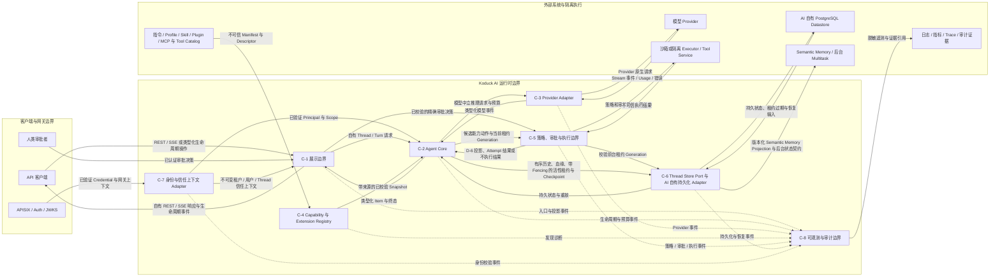
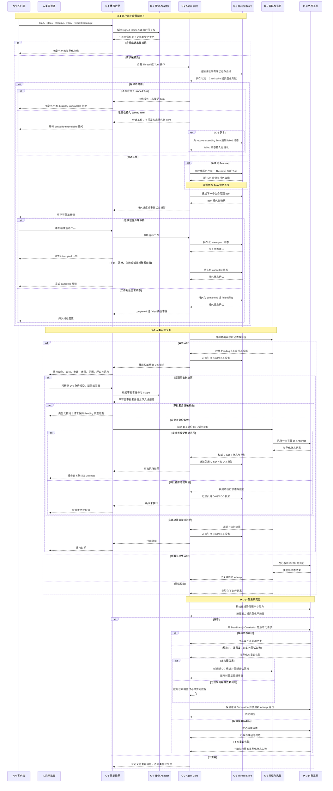

# ADD-0001：AI 服务边界与 Codex 对齐（中文翻译）

> [!IMPORTANT]
> 本文件是
> [`docs/architecture/ADD-0001-ai-service-codex-alignment.md`](../../ADD-0001-ai-service-codex-alignment.md)
> 的非权威中文翻译，不是第二份 ADD，也不拥有独立的状态、审批或记录身份。
> 若中英文存在差异，以已索引的英文 ADD 为准。状态、证据基线、候选项和链接应与英文版同步更新。

## 元数据 [Required]

- **设计状态**：Current
- **日期**：2026-08-10
- **作者**：Codex
- **架构负责人**：@linhai
- **所需审批人**：@linhai
- **审批人 [Conditionally Required — 设计状态为或曾为 `Current`]**：@linhai
- **审批时间 [Conditionally Required — 设计状态为或曾为 `Current`]**：2026-08-11T10:37:34+08:00
- **审批证据 [Conditionally Required — 设计状态为或曾为 `Current`]**：Approve
- **退役执行人 [Conditionally Required — 设计状态为 `Deprecated` 或 `Superseded`]**：N/A — 当前设计状态为 `Current`，文档未退役
- **退役时间 [Conditionally Required — 设计状态为 `Deprecated` 或 `Superseded`]**：N/A — 当前设计状态为 `Current`，文档未退役
- **退役证据 [Conditionally Required — 设计状态为 `Deprecated` 或 `Superseded`]**：N/A — 当前设计状态为 `Current`，文档未退役
- **退役原因 [Conditionally Required — 设计状态为 `Deprecated` 或 `Superseded`]**：N/A — 当前设计状态为 `Current`，文档未退役
- **范围级别**：Repository / Cross-project
- **范围**：未来 Koduck AI 运行时，以及它与 API 客户端、模型提供商、认证、记忆、工具执行、后台任务和扩展提供方之间的契约
- **Trello 来源**：[Koduck 卡片 4WI4sszw](https://trello.com/c/4WI4sszw/2-%E8%B0%83%E7%A0%94-adr-%E6%98%8E%E7%A1%AE-ai-%E6%9C%8D%E5%8A%A1%E9%87%8D%E6%9E%84%E8%BE%B9%E7%95%8C%E4%B8%8E-codex-%E5%AF%B9%E9%BD%90%E7%9B%AE%E6%A0%87)
- **Figma 来源 [Conditionally Required — UI 在范围内]**：N/A — 本设计只涉及服务和协议边界，不改变 Web 或原生 UI
- **相关资料**：[英文权威 ADD](../../ADD-0001-ai-service-codex-alignment.md)；[Koduck 前身基线](https://github.com/hailingu/koduck-quant/tree/c414ddccdbc45a99fcd3d606ca0fe1f75730b7fe/koduck-ai)；[OpenAI Codex 参考基线](https://github.com/openai/codex/tree/3c60d4da648bfa98e3c51c5161ac2720519c733e)
- **取代 [Conditionally Required — 本 ADD 替换其他 ADD]**：None
- **被取代 [Conditionally Required — 本 ADD 被替换]**：None

## 要求级别图例 [Required]

- **`[Required]`**：章节或字段始终适用，必须保留并提供完整、可验证的内容。只有模板明确允许空结果时，才可使用 `None — <原因>`，不得留空。
- **`[Conditionally Required — <触发条件>]`**：触发条件成立时必须完成；不成立时保留 `N/A — <原因>`，除非模板明确要求删除或作为未来生命周期说明保留。未评估触发条件即为内容不完整。
- **`[Optional]`**：删除后不影响审批、实施、完成或验证；如保留则必须准确完整，且不能替代必填证据。

`[Required]` 章节中未单独标注的字段均为必填。

## 背景与方案摘要 [Required]

Koduck 是 `koduck-quant` 的全新重建版本。新仓库目前只有治理脚手架，尚未加入任何服务。前身仓库 `koduck-ai` 在提交 `c414ddccdbc45a99fcd3d606ca0fe1f75730b7fe` 的代码只作为功能调研证据：对应基础设施已经移除，它不是实际运行基线，其契约也不是兼容或回滚要求。该 Rust crate 同时承载 REST/SSE API、模型适配、原生工具循环、MCP 客户端、Agent Profile、Skill、Memory/Multitask 客户端、后台 Worker、认证和可靠性策略。基线共有 161 个受 Git 跟踪的 Rust 源文件，多处编排、模型适配、配置和 Worker 文件超过 800 物理行，其中原生工具循环为 2,073 行。这些数字只是需要架构审查的信号，不意味着目标是机械拆文件。

公开参考固定为 OpenAI Codex 提交
`3c60d4da648bfa98e3c51c5161ac2720519c733e`。与本任务相关的设计信号包括：与模型提供商解耦的核心、明确的 thread/turn/item 生命周期、类型化应用协议、可替换 Thread Store、分离的执行与沙箱职责、显式审批请求，以及独立加载的 MCP、Skill、Plugin 和仓库指令能力。Codex 不是 Koduck 的产品规格，它的目录结构也不是迁移实施计划。

**方案摘要**：未来 Koduck AI 围绕自有的、与模型提供商无关的 Agent Core 和版本化 thread/turn/item 领域模型建设。由目标模型定义新的北向 REST/SSE 与自有持久化契约；前身行为只用于识别功能场景。能力发现、策略评估、审批和执行放到显式端口之后；任何高权限执行都必须经过最小权限执行边界。模型提供商、存储、MCP、Skill、仓库指令和展示协议均作为可独立替换的 Adapter。保留预期的多模型、租户隔离、语义记忆和后台任务能力，不采用 Codex 产品特有的本地持久化/认证模型，也不继承已移除的前身基础设施。

**Greenfield 运行模型**：不存在前身部署、APISIX 旧 Route、共享 History 或 Fallback Path。每个候选项在首次晋级前定义并验证自己拥有的新契约。失败候选项不晋级；只回退 Source 或隔离 Artifact，不尝试回切到已移除基础设施。首个已验证 Koduck AI Release 存在后，任何部署回滚只能在独立 Accepted OCR 下选择已验证的新 Artifact。

**设计边界**：本 ADD 只定义方案能力、逻辑数据、组件职责、流程、约束和按顺序排列的 ADR 候选项。它不授权实现，不指定源文件或 crate，不定义物理 Schema，不冻结线协议字段，不增加依赖，也不规定可执行的构建、测试、部署或回滚命令。

## 需求基线 [Required]

| ID | Trello 来源 | 需求基线 | 验收结果 | 优先级与约束 | 最后核对日期 |
| --- | --- | --- | --- | --- | --- |
| R-1 | [卡片 4WI4sszw](https://trello.com/c/4WI4sszw/2-%E8%B0%83%E7%A0%94-adr-%E6%98%8E%E7%A1%AE-ai-%E6%9C%8D%E5%8A%A1%E9%87%8D%E6%9E%84%E8%BE%B9%E7%95%8C%E4%B8%8E-codex-%E5%AF%B9%E9%BD%90%E7%9B%AE%E6%A0%87) | 对照公开 OpenAI Codex 调研现有 AI 服务，形成可审计的目标边界和迁移方向。 | 提供可追溯差距矩阵、采用决策及理由、外部契约与安全边界、按依赖排序且带验证与回滚边界的迁移切片；ADD 获批后再提出项目级 Full ADR。 | 看板中排位最高。治理 ADR 被合格审批人接受前，不得修改 source/config/依赖、构建、发布或部署。Trello 是协调上下文，不是决策权威。 | 2026-08-10 |
| R-2 | N/A — 当前 Codex 任务中的用户指令，不是 Trello 卡片 | ADD 额外提供中文版。 | 完整中文翻译存在，并明确英文 ADD 是权威版本。 | 翻译不得形成第二个决策身份，也不得与索引中的 ADD 分叉。 | 2026-08-10 |

## 目标与非目标 [Required]

目标：

- 固定一个可审计的前身功能调研版本和一个不可变的 Codex 参考版本。
- 明确哪些 Codex 概念直接采用、调整后采用或不采用。
- 将编排策略与传输、模型提供商、存储、扩展和高权限执行解耦。
- 把前身功能意图保留为调研场景，同时定义新的自有 Koduck 契约，不承担 Wire Parity 或运行时 Fallback 义务。
- 在扩展工具执行前先确定最小权限、审批、隔离、审计、取消和恢复边界。
- 提供按依赖排序、可独立评审且具备二元验收上下文的 ADR 候选项。
- 为中文评审者提供同步翻译。

非目标：

- Fork OpenAI Codex，或承诺与其 CLI、桌面、云端产品或 UI 功能对等。
- 复用 Codex 的 ChatGPT 专属认证、账户、限额或模型目录行为。
- 将本地 JSONL 或 SQLite 作为 Koduck 对话/记忆的权威真值。
- 在 ADD 中选择物理 crate 布局、线协议 Schema、数据库 Schema、依赖或实现框架。
- 在本 ADD 中改变当前 API、部署、运行配置或服务所有权。
- 在单 Agent 生命周期和执行策略完成验证前实现主动多 Agent 编排。

## 功能能力设计 [Required]

| ID | 参与者 | 触发条件 | 能力与结果 | 业务规则和边界情况 | 需求 |
| --- | --- | --- | --- | --- | --- |
| F-1 | API 客户端或展示 Adapter | 用户开始、恢复、Fork、Steer、中断或读取工作 | 将工作表达为包含有序 Turn 和类型化 Item 的稳定 Thread，并明确活动与终态。 | Resume 始终依据权威历史在同一 Thread 新建 Turn，绝不重新激活终态 Turn。已认证客户端主动停止产生 `interrupted`；平台、策略或依赖停止产生 `cancelled`，两者都是终态。行为由新版本化 REST/SSE 自有契约定义。 | R-1 |
| F-2 | Agent Core | Turn 被接受 | 将指令、上下文、能力、模型输入和策略组织为一个可观测编排生命周期。 | Provider 类型不进入领域模型；状态迁移只有一个 Owner；部分结果和终态错误可区分。 | R-1 |
| F-3 | 模型 Adapter | Core 请求推理 | 在不向 Core 泄漏模型线协议类型的前提下转换输入与流式输出。 | CAND-1 无 Provider Fallback；时间、Token、重试和输出有界；Usage 与终态被保留。任何后续自动 Fallback 需要独立 Accepted ADR。 | R-1 |
| F-4 | Tool 或 MCP Provider | Core 需要发现或调用能力 | 发现类型化工具、校验请求、评估策略、必要时请求审批，并经执行边界分发。 | 不可信描述/结果不能授予权限；未知高权限效果默认拒绝；审批绑定精确动作和范围。 | R-1 |
| F-5 | Thread Store Adapter | Thread 状态变化 | 通过自有 Store Port 和 AI 自有 Durable Store 持久化权威 Thread/Turn/Item 历史与元数据。 | 每项数据只有一个权威 Owner；Append 有序且幂等；本地 Cache 可重建且不能静默成为真值。Semantic Memory 与后台 Multitask 不拥有权威 Turn History。 | R-1 |
| F-6 | 扩展所有者 | 指令、Skill、Plugin 或 MCP 能力变化 | 加载经过校验且带来源的扩展元数据，不修改 Core 编排代码。 | 优先级确定；无效扩展显式失败；保留租户/Thread 隔离；扩展声明不能扩大权限。 | R-1 |
| F-7 | 运维或评审者 | 高权限动作、失败或恢复发生 | 在不泄漏密钥或敏感 Prompt 的前提下观察生命周期、策略、审批、执行和恢复证据。 | 默认最小化并脱敏内容；相关 ID 串联事件；审计区分请求、决策、尝试和结果。 | R-1 |
| F-8 | 中文评审者 | 评审 ADD | 阅读同步中文翻译，同时保持唯一英文权威身份。 | 状态、ID、证据、候选项和规范含义与英文一致；冲突以英文为准。 | R-2 |

## 数据模型设计 [Conditionally Required — 会创建、更新、删除、传输或保留数据，或改变所有权、分类、生命周期、关系或不变量]

### 实体与生命周期

| ID | 实体 | 用途 | 所有权 | 分类 | 生命周期 |
| --- | --- | --- | --- | --- | --- |
| D-1 | Thread | 一组用户可见工作的稳定容器及其血缘。 | Koduck AI Thread Store 领域；持久化由获批的 AI 自有 Store Adapter 提供。 | 可能敏感的租户/用户内容与元数据。 | 创建、可选 Fork、活动、归档或按 Owner 策略删除。删除 Thread 不会静默级联删除按独立策略保留的 D-6/D-7 安全证据。 |
| D-2 | Turn | Thread 内一次从输入到终态的执行尝试。 | 活状态与前台活性对账归 Agent Core；持久历史和带 fencing 的活性租约归 Thread Store。 | 可能敏感的 Prompt、上下文引用和策略元数据。 | 排队或开始；持久化不可用时 `recovery-pending` 是 started 的非终态子状态；随后进入完成、中断、失败或取消。每个前台 started Turn 都有 C-2 Owner 心跳，并对应一个 C-6 持久化的租约 Generation。超过确定性活性窗口后，健康的 C-2 对账器隔离失联 Owner 并追加 `cancelled`；若 C-6 当时不可用，则在恢复后对账。终态不可重新活动。`interrupted` 表示已认证客户端主动停止；`cancelled` 表示平台、策略或依赖停止。Resume 新建 Turn。 |
| D-3 | Item | Turn 内有序类型单元，例如输入、推理摘要、Tool Call、审批状态投影、Tool Result、文件变更或 Agent Message。 | Core 创建领域 Item，Store 持久化，展示 Adapter 投影；审批权威属于 D-6 而不是 D-3。 | 随 Payload 分类；模型与工具输出均不可信。审批投影只携带 D-6 身份和状态，不拥有独立授权能力。 | 以稳定身份和顺序追加。更正是引用原 Item 的新版本化 Item；原 Item 永不修改或删除。 |
| D-4 | Capability Descriptor | 经过校验的 Tool、MCP、Skill 或 Plugin 描述和 Schema，并包含效果分类、幂等性、重试安全性以及适用的 Deadline/输出约束。 | 扩展/工具 Registry。 | 公开或内部元数据；描述和自声明执行属性在策略校验前均不可信。 | 发现、校验、启用、刷新、禁用或撤回，带来源和稳定版本。 |
| D-5 | Permission Profile | 对文件系统、网络、进程、数据和服务访问的命名限制。 | 安全策略领域。 | 安全敏感策略，但不是密钥。 | 定义并版本化后为 Turn 选择，可进一步收窄。审批绝不修改或扩大 Profile；策略允许审批路径时，D-6 也只授权其精确 D-7 Attempt。 |
| D-6 | Approval Request | 一个精确高权限动作、目标、参数、效果、请求范围、理由和决策的权威安全记录。 | 经 C-5 归审批/策略领域；Thread Item 只是投影。 | 安全审计数据，可能含敏感路径或命令元数据。 | 请求、针对一次精确有界执行 Attempt 接受、拒绝、取消或过期；接受后关联该 Attempt 结果。可复用 Session/Turn 授权不在本 ADD 范围，需未来 Accepted ADR。 |
| D-7 | Execution Attempt | 一次有界工具或进程调用及可观测结果。 | 执行边界。 | 可能敏感的输入/输出和诊断。 | 准备、策略检查、可选审批、运行、成功/失败/超时/取消。前台 Attempt 引用当前 D-2 租约 Generation；该 Generation 被隔离后，C-5 拒绝分发或提交结果。 |
| D-8 | Extension Manifest | 扩展的来源、声明能力、配置需求和兼容信息。 | Extension Registry。 | 内部配置元数据；只引用密钥，不嵌入密钥。 | 发现、校验、激活、更新、禁用或拒绝。 |

### 关系与不变量

| 关系 | 基数与含义 | 不变量 |
| --- | --- | --- |
| Thread 包含 Turn | 一个 Thread 包含零到多个有序 Turn。 | Turn 只属于一个 Thread，Thread 身份不变。 |
| Turn 包含 Item | 一个 Turn 包含一个或多个有序 Item，包括后续更正 Item。 | 对同一权威 Snapshot/版本，重放产生相同外部可见序列。更正追加一个引用前序 Item 的新有序 Item，绝不改写过去的重放历史。 |
| Thread Fork Thread | 一个 Thread 最多有一个 Parent，可有多个 Child。 | Fork 血缘不可变，禁止跨租户血缘。 |
| 前台 Turn 持有活性租约 | 每个前台 started Turn 都有一个当前 C-6 持久租约 Generation，由其 C-2 Owner 续租。 | 只有当前 Generation 可追加或分发/提交前台 D-7。超过确定性活性窗口未收到心跳时，旧 Owner 被隔离；并发对账器使用按 Turn 与租约 Generation 建立的条件式幂等终态迁移，恰好产生一个 `cancelled`。过期 Owner 不能恢复或覆盖该结果。 |
| Turn 选择 Permission Profile | 每个 Turn 解析出且仅解析出一个有效 Profile。 | 后续扩展、模型输出或审批都不能修改或扩大 Profile；已接受 D-6 仍是经策略评估的一次 Attempt 授权。 |
| Approval Request 投影为 Item | 一个 D-6 记录可以在所属 Turn 中生成状态投影 Item。 | D-6 是权威；D-3 投影引用精确 D-6 版本，不能授权执行，只能通过追加后续投影来更正。 |
| Approval Request 授权 Execution Attempt | 一个已接受 D-6 审批只授权动作、目标、参数、效果和范围完全一致的一次 D-7 Attempt。 | 任一参数、目标、效果、范围或 Attempt 身份变化都必须重新评估并新建审批；本设计不存在 Session/Turn 级可复用授权。 |
| Capability Descriptor 产生 Execution Attempt | Attempt 引用一个已校验的 Descriptor 版本。 | Descriptor 缺失、超过允许时效、禁用或不兼容时拒绝执行。 |
| Extension Manifest 暴露 Capability Descriptor | 一个 Manifest 可暴露多个 Descriptor。 | 禁用 Manifest 后 Descriptor 不再可用，但历史不被改写。 |

## 架构设计 [Required]

| ID | 组件或依赖 | 职责 | 概念输入与输出 | 依赖 | 已接受约束 |
| --- | --- | --- | --- | --- | --- |
| C-1 | 展示边界 | 暴露新的版本化 REST/SSE、已认证审批协议和未来类型化协议，并转换为自有领域请求、审批决策与事件。 | 客户端/审批者请求、网关上下文、Thread/Turn 操作、审批决策；生命周期事件和自有 REST/SSE 响应。 | C-2、C-5、C-7。 | C-1 把 Signed Claim 校验和信任上下文构造委托给 C-7，自身不校验身份。新契约权威，不要求前身 Wire Parity；UI 不在范围。 |
| C-2 | Agent Core | 管理 Thread/Turn 编排、状态迁移、上下文、预算、取消、前台租约心跳、孤儿 Turn 对账和 Provider 无关策略。 | 自有 Turn 输入、指令、上下文引用、能力、租约过期信号；类型化 Item 和终态。 | C-3、C-4、C-5、C-6、C-7。 | 任一健康 C-2 实例都可对账过期前台租约，但只能通过 C-6 Generation Fencing。Core 不包含 Provider 线类型、Web Handler、数据库类型或高权限宿主机执行。 |
| C-3 | Provider Adapter | 将自有推理请求/Stream 转换到 OpenAI-compatible 和其他配置 Provider。 | 模型中立消息、工具 Schema、预算；模型事件、Usage、归一化错误。 | 外部模型 API。 | Provider 选择显式；初始基线无自动 Fallback。密钥只存在于 Adapter 配置边界。 |
| C-4 | Capability 与 Extension Registry | 按优先级和来源加载仓库指令、Agent Profile、Skill、Plugin、MCP/Tool Descriptor。 | 配置 Root 和远程 Catalog；已校验 Descriptor 和诊断。 | MCP/Tool Provider、配置。 | 元数据不可信；扩展声明不能授予执行权限。 |
| C-5 | 策略、审批与执行边界 | 解析 Permission Profile、评估效果、持有权威 D-6、把接受绑定到一个 D-7、经 C-6 校验当前前台租约 Generation，并通过沙箱/隔离 Executor 执行。 | 动作、不可变信任上下文和适用的 Turn 租约 Generation；经 C-1 传入的已认证审批决策；经 C-2 返回的策略决策、D-6 状态、执行事件与结果。 | C-6、Tool Service、MCP Provider、平台沙箱或隔离 Worker。 | C-5 暴露自有 Port，不依赖 C-1；拒绝被隔离前台 Owner 的分发与结果提交。默认拒绝、取消、超时、输出上限和审计必需；C-2 不直接执行，本设计无可复用 Session/Turn 审批。 |
| C-6 | Thread Store Port 与 AI 自有持久化 Adapter | 在 AI 服务边界拥有的共享持久 Store 中保存/读取权威历史、元数据、血缘、前台活性租约、Checkpoint 和幂等状态。 | Thread/Turn/Item Append/Query，租约 Acquire/Renew/Expire；有序历史、元数据和带 Fencing 的租约 Generation。 | AI 自有 PostgreSQL Datastore；后续 Semantic Memory/后台 Multitask Adapter 消费自有 Projection 或 Command。 | 租约过期和孤儿终态迁移按 Turn + Generation 条件执行且幂等；旧 Generation 被 Fence 后不得 Append。Thread/Turn/Item 以 AI 自有 Store 为权威；进程本地状态只能重建。 |
| C-7 | 身份与信任上下文 Adapter | 校验 Gateway/JWT 身份，构造不可变租户/用户/Thread 信任上下文。 | Credential 和 Gateway 上下文；已验证 Principal 与 Scope。 | APISIX、Auth/JWKS。 | Header 不能补造缺失签名 Claim；密钥和原始 Credential 不进入历史或日志。 |
| C-8 | 可观测与审计边界 | 输出生命周期、Provider、策略、审批、执行、重试和恢复信号。 | C-1 至 C-7 的关联事件；脱敏日志、指标、Trace 和证据引用。 | 日志、指标、Trace 后端。 | 默认最小化内容；敏感诊断需安全环境显式开启并脱敏。 |

表格的“依赖”列定义实现依赖方向。下图中的返回事件和响应不会反转该方向：C-5 经 C-2 返回自有策略/审批/执行事件；C-1 是在 C-7 校验后调用 C-5 决策 Port 的 Adapter。

### Mermaid 架构图 [Required]

## 控制流程设计 [Conditionally Required — 方案存在多步、分支、重试、异步工作或失败恢复]

| ID | 触发与前置条件 | 正常路径 | 分支与重试 | 失败处理 | 可观测结果 |
| --- | --- | --- | --- | --- | --- |
| CF-1 | 客户端开始/继续 Turn；身份与 Thread 访问有效 | C-1 标准化输入；C-2 持久创建 started Turn 与输入，经 C-6 获取并续租带 Fencing 的前台租约，解析上下文/能力/策略、调用 C-3，并在 C-1 发布前经 C-6 持久化每个外部可见 Item 和终态。 | 已选 Provider 的重试受预算限制；不发生 Provider 或旧 Runtime Fallback。已认证客户端中断产生 `interrupted`；平台、策略、依赖或对账确认的 Owner 失联产生 `cancelled`。 | 身份无效在模型/工具前失败。初始 started Turn/输入/租约写入失败时不接受 Turn。后续 Append 失败进入 `recovery-pending`，C-6 恢复后以 `failed` 关闭。心跳超过确定性窗口后旧 Generation 被隔离；健康 C-2 对账器通过同一条件式幂等 Key 竞争，因此恰好一个追加 `cancelled`，包括 C-6 恢复后的延迟判断。 | 客户端看到无 Turn 的拒绝、持久前缀加 `durability-unavailable`，或孤儿 Turn 最终持久化的 `cancelled`；过期 Owner 不能继续 Append 或报告完成。 |
| CF-2 | 模型请求能力；Descriptor 活动且兼容 | C-4 解析已校验的效果、幂等、重试和预算元数据；C-5 校验精确动作与当前前台租约 Generation，并在需要审批时创建权威 D-6、经 C-1/C-7 获取决策、把接受绑定到一个 D-7。允许的工作在隔离环境执行，并向 C-2 返回适用的 D-6 投影和不可信结果。 | 策略可拒绝、要求收窄输入、免审批允许或要求审批。效果发生前工作可按元数据/预算重试；高权限 D-7 开始后，任何重试都是新 Attempt，必须重新校验当前租约、评估策略并在需要时审批。 | 租约被隔离、拒绝、取消或过期变成类型化不执行结果；执行中被隔离时不提交结果，并按已观测效果状态记录 cancelled/failed Attempt。Descriptor 变化重新评估且不复用审批。 | 权威审计证据关联 Descriptor 版本、策略、租约 Generation、适用时的 D-6、D-7、结果和 D-3 投影，投影不拥有授权能力。 |
| CF-3 | Resume 或 Fork Thread；调用者有权限 | C-6 加载权威有序历史与血缘；C-2 按当前预算重建上下文。Resume 在同一 Thread 新建 Turn；Fork 创建 Child Thread 后再新建 Turn。 | 可重建缺失 Cache；版本化 Adapter 转换兼容历史 Item。前台孤儿 Turn 关闭属于 CF-1；仍活动后台 Turn 的进程恢复属于 CF-5，两者都不是 Resume。 | 权威历史损坏/不完整时显式失败，不创建静默截断 Turn；终态 Turn 永不重新激活。 | 原终态 Turn 保持不变；新 Turn 或 Child Thread 保留稳定身份、血缘和确定可见历史。 |
| CF-4 | 扩展清单变化或已配置来源不可达 | 来源可达时，C-4 发现、解析、校验、记录来源，并原子发布新 Snapshot。 | 无效项排除并诊断。来源不可达时，只有显式 Stale 策略允许其年龄和范围，才保留旧有效 Snapshot；否则新解析 Fail Closed。 | 来源丢失或加载失败不能扩大权限，也不能发布半成品 Catalog；在途 Turn 保留已解析 Snapshot。 | 新 Turn 使用一个一致的新鲜或显式陈旧 Snapshot，或得到带来源诊断的类型化能力不可用失败。 |
| CF-5 | 后台工作被接受；身份、幂等和能力策略有效 | 创建持久 Work Intent；Multitask 调度；Worker 使用同一 Core 生命周期，C-6 记录 Checkpoint 与终态。 | 重复提交返回已有身份；丢 Lease 或重启仅按任务语义从持久 Checkpoint 恢复。 | 恢复不安全/含糊时停止并新建 Attempt；放弃任务记录真实终态。 | 前台/后台暴露兼容生命周期与证据语义。 |

### Mermaid 控制流程 [Conditionally Required — Control Flow Design 已触发]

```mermaid
flowchart TB
  subgraph CF1 ["CF-1 前台 Turn 生命周期"]
    CF1Start["开始或继续 Turn"] --> CF1Auth{"身份与 Thread 访问有效？"}
    CF1Auth -->|"否"| CF1Reject["在模型或工具调用前拒绝"]
    CF1Auth -->|"是"| CF1Append["C-1 标准化；C-2 追加 started Turn 与输入"]
    CF1Append --> CF1InputStored{"started Turn 与输入已持久化？"}
    CF1InputStored -->|"否"| CF1NoTurn["以 durability-unavailable 拒绝；未接受 Turn"]
    CF1InputStored -->|"是"| CF1Lease["C-2 经 C-6 获取并续租带 Fencing 的前台租约"]
    CF1Lease --> CF1Resolve["解析上下文、能力、策略与预算"]
    CF1Lease -.->|"超过活性窗口无心跳"| CF1Orphan["隔离过期 Owner Generation"]
    CF1Orphan --> CF1OrphanCancel["C-2 对账器通过同一条件式幂等 Key 竞争"] --> CF1Persist
    CF1Resolve --> CF1Provider["调用 C-3"]
    CF1Provider --> CF1Outcome{"下一个 Provider 或控制结果"}
    CF1Outcome -->|"Stream Item"| CF1Item["经 C-6 追加 Item"]
    CF1Item --> CF1ItemStored{"Item 已持久化？"}
    CF1ItemStored -->|"是"| CF1Publish["C-1 发布持久 Item"] --> CF1Provider
    CF1ItemStored -->|"否"| CF1StoreFail["停止生成；发出带外 durability-unavailable"]
    CF1Outcome -->|"可重试且预算剩余"| CF1Provider
    CF1Outcome -->|"已认证客户端中断"| CF1Interrupt["准备 interrupted 终态"] --> CF1Persist
    CF1Outcome -->|"平台、策略或依赖停止"| CF1Cancel["准备 cancelled 终态"] --> CF1Persist
    CF1Outcome -->|"Provider 终态失败"| CF1Fail["准备 failed 终态"] --> CF1Persist
    CF1Outcome -->|"成功"| CF1Persist["C-6 追加终态"]
    CF1Persist --> CF1Stored{"持久化成功？"}
    CF1Stored -->|"否"| CF1StoreFail
    CF1Stored -->|"是"| CF1Done["输出有序持久终态生命周期"]
    CF1StoreFail --> CF1Recovery["Turn 保持非终态；C-6 恢复后准备 failed 终态"] --> CF1Persist
  end

  subgraph CF2 ["CF-2 能力策略、审批与执行"]
    CF2Start["模型提出能力动作"] --> CF2Descriptor{"C-4 Descriptor 活动且兼容？"}
    CF2Descriptor -->|"否或已变化"| CF2Refresh["刷新并解析精确 Descriptor"]
    CF2Refresh --> CF2Fresh{"存在新的兼容 Descriptor？"}
    CF2Fresh -->|"否"| CF2NoExec["类型化不执行结果"]
    CF2Fresh -->|"是"| CF2Policy["C-5 校验 Lease Generation、输入与效果"]
    CF2Descriptor -->|"是"| CF2Policy
    CF2Policy --> CF2Lease{"前台 Lease 当前有效或不适用？"}
    CF2Lease -->|"否"| CF2NoExec
    CF2Lease -->|"是"| CF2Decision{"策略决策"}
    CF2Decision -->|"拒绝或要求收窄输入"| CF2NoExec["类型化不执行结果"]
    CF2Decision -->|"需要审批"| CF2Present["C-1/C-7 展示权威精确 D-6 请求"]
    CF2Present --> CF2Approval{"接受、拒绝、取消或过期？"}
    CF2Approval -->|"拒绝 / 取消 / 过期"| CF2NoExec
    CF2Approval -->|"接受一次精确 D-7 Attempt"| CF2Execute["分发至隔离 Executor"]
    CF2Decision -->|"允许"| CF2Execute
    CF2Execute --> CF2ExecOutcome{"执行结果"}
    CF2ExecOutcome -->|"效果前可重试失败且元数据允许"| CF2Reevaluate["创建新 Attempt 候选；重新评估策略和审批"] --> CF2Policy
    CF2ExecOutcome -->|"超时或取消"| CF2Stop["以类型化结果终止 Attempt"]
    CF2ExecOutcome -->|"Owner Generation 已被 Fencing"| CF2Fenced["拒绝提交结果；按观察到的效果状态记录 Cancelled 或 Failed"]
    CF2ExecOutcome -->|"失败或效果可能已发生"| CF2Failure["记录类型化失败 Attempt；不自动重试"]
    CF2ExecOutcome -->|"成功"| CF2Result["向 C-2 返回 D-6 投影与不可信结果"]
    CF2NoExec --> CF2Audit["关联 Descriptor、策略、适用的 D-6/D-7、结果与投影"]
    CF2Stop --> CF2Audit
    CF2Fenced --> CF2Audit
    CF2Failure --> CF2Audit
    CF2Result --> CF2Audit
  end

  subgraph CF3 ["CF-3 Resume 或 Fork"]
    CF3Start["Resume 或 Fork 请求"] --> CF3Access{"调用者有权限？"}
    CF3Access -->|"否"| CF3Reject["拒绝且不创建工作"]
    CF3Access -->|"是"| CF3Load["C-6 加载权威历史与血缘"]
    CF3Load --> CF3History{"权威历史完整且有效？"}
    CF3History -->|"否"| CF3Fail["显式失败，不截断历史"]
    CF3History -->|"是"| CF3Cache{"可选 Cache 存在？"}
    CF3Cache -->|"否"| CF3Rebuild["从权威历史重建 Cache"] --> CF3Version
    CF3Cache -->|"是"| CF3Version{"历史 Item 版本兼容？"}
    CF3Version -->|"否，但存在 Adapter"| CF3Translate["应用版本化转换"] --> CF3Context
    CF3Version -->|"无 Adapter"| CF3Fail
    CF3Version -->|"是"| CF3Context["按当前预算重建上下文"]
    CF3Context --> CF3Operation{"Resume 还是 Fork？"}
    CF3Operation -->|"Resume"| CF3Resume["在同一 Thread 新建 Turn；原终态 Turn 保持终态"]
    CF3Operation -->|"Fork"| CF3Fork["创建 Child Thread，再以稳定血缘新建 Turn"]
  end

  subgraph CF4 ["CF-4 扩展清单刷新"]
    CF4Start["已配置来源变化或不可达"] --> CF4Reachable{"来源可达？"}
    CF4Reachable -->|"否，Stale 策略允许年龄与范围"| CF4Prior["保留旧有效 Snapshot 并报告陈旧状态"]
    CF4Reachable -->|"不允许 Stale"| CF4Fail["Fail Closed 并输出能力不可用诊断"]
    CF4Reachable -->|"是"| CF4Discover["发现、解析、校验并记录来源"]
    CF4Discover --> CF4Valid{"条目有效？"}
    CF4Valid -->|"否"| CF4Exclude["排除条目并输出诊断"] --> CF4Snapshot
    CF4Valid -->|"是"| CF4Snapshot["构造一致候选 Snapshot"]
    CF4Snapshot --> CF4Publish{"原子发布成功？"}
    CF4Publish -->|"是"| CF4Done["新 Turn 使用新 Snapshot；在途 Turn 保留原 Snapshot"]
    CF4Publish -->|"否，Stale 策略允许年龄与范围"| CF4Prior
    CF4Publish -->|"不允许 Stale"| CF4Fail
  end

  subgraph CF5 ["CF-5 后台工作"]
    CF5Start["提交后台工作"] --> CF5Validate{"身份、幂等与策略有效？"}
    CF5Validate -->|"否"| CF5Reject["拒绝且不调度"]
    CF5Validate -->|"重复"| CF5Existing["返回已有工作身份"]
    CF5Validate -->|"是"| CF5Intent["持久化 Work Intent 并由 Multitask 调度"]
    CF5Intent --> CF5Worker["Worker 运行同一 Core 生命周期"]
    CF5Worker --> CF5Checkpoint["C-6 记录 Checkpoint 与 Lease 进度"]
    CF5Checkpoint --> CF5Outcome{"终态、丢 Lease 或重启？"}
    CF5Outcome -->|"终态"| CF5Done["记录真实且兼容的终态"]
    CF5Outcome -->|"允许从 Checkpoint 恢复"| CF5Worker
    CF5Outcome -->|"恢复不安全或含糊"| CF5Stop["停止、记录放弃并要求新 Attempt"]
  end
```

## 交互流程设计 [Conditionally Required — 人或外部系统与方案交互]

| ID | 参与者与入口状态 | 动作 | 系统反馈与迁移 | 退出状态 | Figma 引用 |
| --- | --- | --- | --- | --- | --- |
| IX-1 | 已认证且拥有新/旧 Thread 的 API 客户端 | Start、Steer、Interrupt、Resume、Fork 或 Read。 | C-1 从 C-7 获取信任上下文；每个生命周期 Item 只有经 C-6 确认持久化后才发布。Resume 加载权威历史并在同一 Thread 新建 Turn，来源 Turn 保持终态。`interrupted` 表示客户端停止；`cancelled` 表示平台、策略、依赖或对账确认的前台 Owner 停止。 | 持久终态、Resume 新建的 Turn，或无副作用的拒绝。初始持久化失败不创建 Turn；后续 Store 宕机只暴露持久前缀和 `durability-unavailable`；孤儿 Turn 在活性窗口后持久化为 `cancelled`。 | N/A — 只定义服务/协议交互。 |
| IX-2 | 通过 C-1 暴露且由 C-7 校验的已认证审批协议操作的人类审批者 | 检查权威 D-6 的动作、目标、参数、效果、范围、理由和风险，并对该精确请求接受、拒绝或取消。 | C-5 始终是 D-6 权威；C-1 只传递请求/决策，不拥有审批状态；C-2/C-6 追加引用 D-6 的用户可见 D-3 状态投影。接受只绑定一个 D-7，执行结果单独反馈。 | 无执行的拒绝/取消/过期，或绑定一个终态 D-7 的接受。任何重试都是重新评估的新 Attempt，并在需要时重新审批。 | N/A — 只定义审批协议；展示需未来 Figma。 |
| IX-3 | MCP、Tool、Model、Memory、Auth 或 Multitask 系统 | 初始化/协商、交换版本化请求与事件、报告能力并返回结果。 | 明确兼容性、Deadline、Correlation、Retryability 和终态。 | 成功、兼容降级或不扩大权限的类型化失败。 | N/A — 外部系统交互。 |

### Mermaid 交互流程 [Conditionally Required — Interaction Flow Design 已触发]

## 横切设计 [Required]

| 质量属性 | 方案级设计 | 架构级验证 |
| --- | --- | --- |
| 安全与最小权限 | 不可变身份上下文、命名 Permission Profile、默认拒绝、有界审批、隔离执行和网络/文件/进程控制。 | 每种高权限效果只有一个策略 Owner 和 Enforcement Boundary，具备拒绝与审计路径；Core 不直接执行宿主机效果。 |
| 隐私与密钥安全 | Credential 留在 Adapter 配置；按分类最小化/脱敏 Prompt、Tool 参数/结果、路径和日志。删除 Thread 时按 Owner 策略删除用户内容历史与审批投影；权威 D-6/D-7 安全证据遵循独立保留/删除周期，并最小化或伪名化关联。 | Thread 历史和诊断契约无 Secret 字段；审计 Payload 不超过批准的安全/隐私保留期；可选内容诊断必须由安全环境显式开启。 |
| 可靠性 | 显式状态、取消/超时/重试/Token 预算、幂等、先持久化后发布、带 Fencing 的前台活性租约、Checkpoint 所有权和真实部分/终态。 | 每个外部可见 Item 发布前已持久化；取消、超时、依赖失败、Store 失败、审批拒绝、重复输入和前台 Owner 失联均有精确状态；租约过期恰好产生一个 `cancelled`，并拒绝旧 Owner 写入。 |
| 可观测性 | 关联 Thread、Turn、Item、Provider Call、Descriptor、Approval 和 Execution Attempt。 | 可在不依赖敏感内容的情况下追踪请求到持久终态。 |
| 契约演进 | 新北向 REST/SSE 与自有 Store 契约版本化且 Provider 中立；前身契约只作调研证据。 | Contract Test 直接验证新的 C-1/C-6 契约；后续不兼容变化另行决策，不设旧 Parity 或 Route-back Gate。 |
| 可维护性 | 编排、展示、Provider 转换、扩展发现、策略/执行、身份和存储各有一个清晰 Owner。 | 依赖指向自有契约、无环、Core 无 Provider/Store/Transport 外部类型。 |
| 可扩展性 | 展示/Core 尽量无状态；持久共享状态在 Adapter 后；前台 Turn 使用带 Fencing 的活性租约，后台执行使用 Lease 与 Checkpoint。 | 横向实例不依赖进程本地真值；任一健康 C-2 实例都能对账孤儿 Turn，且不接受过期 Owner 写入或重复非幂等效果。 |
| 供应链与来源 | 外部参考固定不可变版本；扩展和 Descriptor 带来源与版本。 | 每个活动扩展可追溯到确切来源/版本。 |

## 假设与开放问题 [Conditionally Required — 存在假设或重大问题]

| ID | 假设或问题 | Owner | 状态 | 结论与证据 |
| --- | --- | --- | --- | --- |
| Q-1 | 当前仓库没有服务代码时，AI 服务调研基线是什么？ | @linhai | Resolved | 仅把前身 `koduck-quant` 的 `koduck-ai@c414ddcc…` 用于功能调研。当前仓库 [README](../../../../README.md) 明确说明它是全新重建且尚未加入服务；2026-08-11 仓库 Owner 指示确认前身基础设施已移除，并非运行基线。 |
| Q-2 | 对比哪个 Codex 版本？ | @linhai | Resolved | 使用 2026-08-10 读取到的公开 `openai/codex@3c60d4da…`；@linhai 在 2026-08-10 的 ADD 评审中确认了这份不可变证据基线。 |
| Q-3 | “与 Codex 对齐”是否意味着 Fork 或实现全部产品能力？ | @linhai | Resolved | 否。Trello 要求目标边界和迁移方案；本 ADD 选择自有 Koduck 契约下的概念对齐，并明确排除 Fork/功能对等。 |
| Q-4 | 中英文冲突时哪一份权威？ | @linhai | Resolved | 已索引的英文文件 `docs/architecture/ADD-0001-ai-service-codex-alignment.md` 权威；本文件只是同步翻译。 |
| Q-5 | 前身基础设施已经移除时采用什么运行模型？ | @linhai | Resolved | 2026-08-11 当前 Codex 任务中的仓库 Owner 指示确立 Greenfield 模型：新实现契约权威；旧基线只作功能调研证据；不适用前身 Artifact、APISIX 旧 Route、共享 History、Fallback 或 Route-back Gate。 |

当前不存在阻止审批的重大开放问题。审批者若发现重大未决问题，应指出问题并让文档继续保持 `Draft`，而不是回复 `Approve`。

## 风险与权衡 [Required]

| ID | 风险或权衡 | 影响 | 缓解 |
| --- | --- | --- | --- |
| RK-1 | 把 Codex 目录当复制目标。 | 引入无关的本地产品、认证、UI 和持久化约束。 | 使用采用矩阵；每项实现决策必须对应 Koduck 结果并独立获批。 |
| RK-2 | 把调研证据误作兼容义务。 | 新契约可能继承已移除基础设施和未经验证的 Wire 行为。 | 明确前身材料只作功能证据，并直接测试新的自有契约。 |
| RK-3 | 拆 Monolith 变成分布式耦合。 | crate/服务增加却无清晰所有权，成本和延迟更高。 | 只按失败、信任、数据和生命周期边界定义 Port，不按行数机械拆分。 |
| RK-4 | 有审批 UI 但执行可绕过。 | 高权限效果未经评审范围即可执行。 | 所有路径在 C-5 下统一强制策略，包括 MCP 和后台 Worker。 |
| RK-5 | 权威 History 与 Semantic Memory 所有权重叠。 | 重复真值、重放不一致或跨租户泄漏。 | Thread/Turn/Item 保持在 AI 自有 Store；CAND-3 定义 Memory/Multitask 的版本化 Projection 与所有权。 |
| RK-6 | 首个自有 REST/SSE 契约漏掉必要功能场景。 | Greenfield Release 内部一致却功能不完整。 | 从前身调研和当前产品需求提取场景覆盖，但以新版本化契约和确定性测试为权威。 |
| RK-7 | 扩展描述或 Tool Result 操纵权限。 | Prompt Injection 导致未授权行为或数据访问。 | 所有扩展/模型/工具内容不可信；权限只来自身份、策略和显式审批。 |
| RK-8 | 多 Agent 扩大未完成的生命周期与权限风险。 | 并发、血缘、预算和审批含糊。 | CAND-1 至 CAND-4 验证完成前保持延期。 |
| RK-9 | 单 Attempt 审批相较可复用 Session/Turn 授权增加交互次数和延迟。 | 高频高权限工作可能变慢，甚至产生绕过审批的压力。 | CAND-2 保持精确可审计基线；任何可复用授权必须有测量需求、有界撤销/Scope 模型和独立 Accepted ADR。 |
| RK-10 | 先持久化后发布让 Stream 延迟和可用性依赖 C-6。 | 首 Item 延迟可能增加，Store 宕机也会停止原本可用的模型输出。 | CAND-1 必须设置并测量有界 Append/Backpressure 阈值，保持持久前缀不变量并 Fail Closed；弱化持久性需要独立架构决策。 |
| RK-11 | 前台活性窗口可能把暂停或网络分区中的 Owner 误判为死亡，设置过长又会延迟孤儿关闭。 | 活计算可能被取消，或用户长时间等待非终态。 | C-6 Generation Fencing 保证决策安全；CAND-1 必须覆盖有界心跳、Clock Skew、Pause 和 Partition，且取消绝不把同一 Turn 转移给另一 Owner。 |

## ADR 任务候选项 [Required]

允许状态：`Ready`、`Selected`、`Complete`、`Deferred`。

| ID | 完整结果 | 范围边界 | 依赖 | 验收上下文 | 建议 ADR 类型 | 状态 | 状态原因或证据 | ADR 路径 |
| --- | --- | --- | --- | --- | --- | --- | --- | --- |
| CAND-1 | 一个 Provider 中立的 Thread/Turn/Item 编排内核可让单个已认证、无工具 Turn 经新版本化 REST/SSE 边界执行，持久化有序历史，并产生明确完成、失败、中断、持久化宕机和前台 Owner 失联结果。 | 包含领域生命周期、Core Port、新 REST/SSE v1 契约、一个 Provider 路径，以及足以支持先持久化后发布、重放和带 Fencing 前台活性租约的 AI 自有 C-6 持久化 Adapter；不含 Semantic Memory、后台 Multitask、Fork/Checkpoint、高权限工具、扩展、部署和任何旧兼容/Fallback Path。 | 本 ADD 必须 `Current`；ADR 接受前，新 REST/SSE v1、TurnHistory、Trust Context Handoff 和 AI 自有持久 Store 边界必须完整且可确定验证。 | 一个无工具 Turn 的二元契约检查，以及 Resume 新建 Turn、先持久化后发布、有界 Append/Backpressure 与活性窗口、重放、Provider/Store 失败、进程崩溃、租约过期、旧 Owner Fencing、并发对账幂等和恰好一个孤儿 `cancelled`。 | Full | Complete | 已由 `docs/adr/ADR-0001-provider-neutral-turn-kernel.md` 中 Accepted、Complete 的项目级 Full ADR 完成；Implementation Source 为 Commit `08cc1b3`，Review Correction 为 Commit `56073a0`、`df49b69`、`11b5ea2`、`fe3beb9`、`a7258bc` 与 `a7b6faa`，全部 14 个 ADR Check 均通过 | `docs/adr/ADR-0001-provider-neutral-turn-kernel.md` |
| CAND-2 | 所有 Tool/MCP 调用经过统一默认拒绝策略和隔离 D-7 执行边界；需要审批时使用一份权威精确动作 D-6，并具备取消、超时、输出上限、租约 Fencing 和可审计终态。 | 包含 C-1/C-7 审批传输、C-5 权威、C-6 前台租约校验、D-3 状态投影和新 Tool/MCP Adapter；不含可复用 Session/Turn 授权、UI 和新增高权限能力。 | CAND-1 完成；已认证审批协议和预期 Tool Effect 清单可用。 | 覆盖免审批 Allow、拒绝、无效审批者、接受/拒绝/取消/过期、Scope/Attempt/Lease 漂移、过期 Owner 分发与结果拒绝、效果前重试再审批、超时、取消和不可信输出；恢复时禁用或回退未晋级 Dispatcher，让 Tool 不可用，而不是调用旧 Path。 | Full | Ready | N/A — Ready；依赖阻止提前选择 | None |
| CAND-3 | AI 自有 Store Port 扩展权威血缘、Checkpoint 与幂等能力；Memory/Multitask 通过独立版本化 Semantic Memory/后台任务契约集成，不依赖进程本地真值。 | 扩展 CAND-1 History/Liveness 所有权，加入 Fork、Checkpoint、后台 Resume、Projection 与集成语义；不含无关 Memory Ranking 和部署。Memory/Multitask 不取代 AI 对权威 Thread/Turn/Item 的所有权。 | CAND-1 完成；Memory/Multitask Owner 参与。 | 重放/顺序/Append-only 更正/租约 Fencing/租户隔离/重复提交有精确结果；Schema 演进保留 CAND-1 历史和终态语义，回滚只使用最后验证的新 Schema/Artifact，并只丢弃可重建投影。 | Full | Ready | N/A — Ready；依赖阻止提前选择 | None |
| CAND-4 | 仓库指令、Agent Profile、Skill、Plugin 和 MCP Descriptor 经过一个带来源的扩展边界加载，且不能扩大执行权限。 | 包含发现、校验、优先级、Snapshot、诊断和现有 Adapter；不含 Marketplace UI、远程安装和新高权限工具。 | CAND-1、CAND-2 完成；需要时使用 CAND-3 Snapshot 语义。 | 优先级、无效扩展、来源丢失、Stale 策略、隔离、Snapshot 一致性和权限不升级可确定验证；回滚到静态安全清单。 | Full | Ready | N/A — Ready；依赖阻止提前选择 | None |
| CAND-5 | 前台/后台和支持 Provider 均使用新 Core，并满足自有 REST/SSE、生命周期、恢复和首次生产晋级契约。 | 包含 Provider、后台生命周期、Consumer Readiness、SLO 证据和首发准备；不含新产品功能/UI。 | CAND-1 至 CAND-4 完成并验证；预期 Consumer 清单完整。 | Provider/Stream/后台契约、恢复、SLO、Error Budget 和晋级停止检查精确；首次晋级前失败就隔离候选项，之后只能在 OCR 下回滚到最后验证的新 Artifact。 | Full | Ready | N/A — Ready；最终 Readiness 候选项 | None |
| CAND-6 | 多 Agent 执行的生命周期、血缘、预算、权限、审批、取消和存储模型获得批准，或经证据审查后明确拒绝。 | 包含架构决策和有界试点结果；不含生产发布/UI。 | CAND-1 至 CAND-5 完成并验证；单 Agent 指标和事故证据可用。 | 需求有测量证据，安全/所有权审查可确定；拒绝/延期不留下休眠生产路径。 | Full | Deferred | 单 Agent 目标边界完成且证据证明需要前保持延期 | None |

## 可追溯性 [Required]

| 需求 | 能力 | 数据实体 | 组件 | 控制/交互流程 | ADR 候选项 |
| --- | --- | --- | --- | --- | --- |
| R-1 | F-1 至 F-7 | D-1 至 D-8 | C-1 至 C-8 | CF-1 至 CF-5；IX-1 至 IX-3 | CAND-1 至 CAND-6 |
| R-2 | F-8 | N/A — 翻译不创建运行时实体 | N/A — 翻译不增加运行时组件 | N/A — 仅文档评审 | N/A — 由同步翻译完成，不需要实现 ADR |

## 支持材料 [Optional]

### 证据基线

| ID | 不可变或仓库来源 | 关键结论 |
| --- | --- | --- |
| E-1 | 当前仓库 [README](../../../../README.md) | Koduck 是 `koduck-quant` 的全新重建，当前没有服务代码。 |
| E-2 | [`koduck-ai` 设计 `c414ddcc`](https://github.com/hailingu/koduck-quant/blob/c414ddccdbc45a99fcd3d606ca0fe1f75730b7fe/koduck-ai/docs/design/ai-decoupled-architecture.md) | 前身目标是 AI Gateway/Orchestrator，Memory、Tool、Auth、Gateway 治理归周边服务。 |
| E-3 | [`lib.rs`](https://github.com/hailingu/koduck-quant/blob/c414ddccdbc45a99fcd3d606ca0fe1f75730b7fe/koduck-ai/src/lib.rs) 与 [`app/mod.rs`](https://github.com/hailingu/koduck-quant/blob/c414ddccdbc45a99fcd3d606ca0fe1f75730b7fe/koduck-ai/src/app/mod.rs) | 单个 crate 同时包含 API、生命周期、Auth、后台、Client、Config、Context、LLM、MCP、Orchestrator、Registry、Reliability、Session、Skill、Storage、Stream、Task，并暴露大量 REST/SSE。 |
| E-4 | [`native_tool_loop.rs`](https://github.com/hailingu/koduck-quant/blob/c414ddccdbc45a99fcd3d606ca0fe1f75730b7fe/koduck-ai/src/api/llm_flow/native_tool_loop.rs) | 2,073 行工具编排是后续 ADR 的高耦合审查区。 |
| E-5 | [`mcp/mod.rs`](https://github.com/hailingu/koduck-quant/blob/c414ddccdbc45a99fcd3d606ca0fe1f75730b7fe/koduck-ai/src/mcp/mod.rs) | Koduck 已有最小 MCP Client Surface，并把工具适配进原生 Tool Pipeline。 |
| E-6 | Codex [`app-server` README](https://github.com/openai/codex/blob/3c60d4da648bfa98e3c51c5161ac2720519c733e/codex-rs/app-server/README.md) | 应用协议分离并建模 Thread、Turn、事件、审批、Skill、App、Auth 和执行。 |
| E-7 | Codex [`thread-store` README](https://github.com/openai/codex/blob/3c60d4da648bfa98e3c51c5161ac2720519c733e/codex-rs/thread-store/README.md) | 可替换 ThreadStore、单一元数据写 API、LiveThread 与本地/内存实现。 |
| E-8 | Codex [`core` README](https://github.com/openai/codex/blob/3c60d4da648bfa98e3c51c5161ac2720519c733e/codex-rs/core/README.md)、[`sandboxing`](https://github.com/openai/codex/blob/3c60d4da648bfa98e3c51c5161ac2720519c733e/codex-rs/core/src/sandboxing/mod.rs)、[`approvals`](https://github.com/openai/codex/blob/3c60d4da648bfa98e3c51c5161ac2720519c733e/codex-rs/core/src/tools/approvals.rs) | 文件/网络沙箱和审批是显式执行职责，不由模型内容授权。 |
| E-9 | Codex [`codex_mcp_interface.md`](https://github.com/openai/codex/blob/3c60d4da648bfa98e3c51c5161ac2720519c733e/codex-rs/docs/codex_mcp_interface.md) | 控制面使用 Thread/Turn、类型化通知和 Server→Client 审批；MCP 控制接口明确为实验性。 |
| E-10 | Codex [`agents_md.rs`](https://github.com/openai/codex/blob/3c60d4da648bfa98e3c51c5161ac2720519c733e/codex-rs/core/src/agents_md.rs)、[`skills/loading.rs`](https://github.com/openai/codex/blob/3c60d4da648bfa98e3c51c5161ac2720519c733e/codex-rs/skills/src/loading.rs)、[`plugins/mod.rs`](https://github.com/openai/codex/blob/3c60d4da648bfa98e3c51c5161ac2720519c733e/codex-rs/core/src/plugins/mod.rs) | 仓库指令、Skill、Plugin 是具有显式 Root/Service 的独立加载能力。 |

### 现状到目标差距矩阵

| 领域 | 前身现状 | Codex 信号 | Koduck 目标 | 处理方式 |
| --- | --- | --- | --- | --- |
| 生命周期 | Session/Chat/Task 分散在 Handler、Native Loop、Memory Client、Registry 和 Worker。 | Thread/Turn/Typed Item、Resume/Fork/Interrupt。 | 前后台统一使用自有 Thread/Turn/Item。 | 调整后采用，映射现有身份与契约。 |
| 应用协议 | 前身暴露 REST/SSE，但只作调研证据，不是 Live Contract。 | 类型化双向 App Server 协议与生成 Schema。 | 定义自有版本化 REST/SSE v1；有消费者需求时再引入 Provider 中立 Typed Protocol。 | 调整后采用，不要求旧 Wire Parity。 |
| Core 边界 | 单 crate 混合传输、编排、Provider、Tool、MCP、后台、存储和策略。 | Core、Protocol、Store、Exec、Sandbox、Skill、App Server 分离。 | 以 Port 构建 Provider 中立 Core，只按 Owner/失败/信任/生命周期拆分。 | 采用边界原则，不复制 crate 列表。 |
| Tool | Native Tool Use 已存在，但前后台策略、Allowlist、Tool Service 和审批逻辑分散。 | 集中 Tool Routing、审批和沙箱。 | 所有 Tool Path 下沉到一个策略/审批/执行边界。 | 调整后采用，保留 Tool Service/MCP。 |
| Sandbox | 有服务隔离和 Allowlist，但未发现覆盖所有 Tool Path 的 Turn 级文件/网络/进程沙箱契约。 | 跨平台 Sandbox 与 Permission Profile。 | 隔离 Worker 或平台沙箱 + 显式 Profile + 默认拒绝。 | 采用安全模型，平台实现由 ADR 决定。 |
| Store | 前身使用 Memory/Multitask 和进程内 Registry/Checkpoint，但该基础设施不再是运行基线。 | 可替换 ThreadStore，本地 JSONL/SQLite。 | 自有 Store Port 由 AI 自有共享 PostgreSQL Datastore 实现；Memory/Multitask 后续消费独立 Semantic Memory/后台契约。 | 采用 Store 抽象和共享持久化，不采用前身所有权或进程本地真值。 |
| Provider | 前身展示多模型 Adapter、路由、归一化类型、Stream、重试与 Fallback，但只作调研证据。 | Core Client/Model Provider 偏 OpenAI/Codex 产品。 | 从一个显式选择 Provider 开始，无自动 Fallback；保留 Adapter 边界供后续独立决策。 | 采用边界，不采用前身 Fallback 行为。 |
| MCP | 自研最小 stdio/HTTP Client，适配进 Native Loop。 | MCP Client/Resource/Approval/Control/App Integration 分离，部分实验性。 | 标准兼容 Adapter，带版本、来源、Elicitation/Approval 和不可信输出处理。 | 调整后采用，不把实验 RPC 作为权威 API。 |
| 指令/Skill/Plugin | Agent Profile、Skill、MCP 已有但激活程度和所有权不均。 | 指令、Skill Root、Plugin、Injection 独立 Loader/Service。 | 一个 Extension Registry 管理优先级、Snapshot、校验、来源和权限不升级。 | 按租户/Thread 隔离调整后采用。 |
| Auth | APISIX/JWT/JWKS 与租户/用户 Claim。 | ChatGPT Account Login。 | 保留 APISIX/Auth/JWKS，向 Core 传不可变信任上下文。 | 不采用 Codex Auth。 |
| Observability | Tracing、可靠性指标和受控 Prompt 诊断存在，但证据分散。 | 类型化生命周期和审批/执行事件。 | 关联 Ingress、Turn、Provider、Tool、Approval、Store、Recovery。 | 采用事件纪律，保留隐私约束。 |
| 多 Agent | 有后台任务/Plan 血缘，但主动 Subagent 不是已证明需求。 | Agent Spawn/Message/Wait/Lineage/Collaboration。 | 单 Agent 边界完成且有测量需求前延期。 | 现在不采用。 |

### 采用决策

| ID | Codex 概念 | 处理 | 理由 |
| --- | --- | --- | --- |
| AD-1 | Thread/Turn/Item + 类型化事件 | 调整后采用 | 获得统一可重放生命周期，但 Resume 新建 Turn、终态 Turn 永不重新激活、更正采用 Append-only Item，并映射 Koduck Session/Task。 |
| AD-2 | Provider 中立 Core 支持多个展示面 | 采用 | 直接解决传输、Provider 与编排耦合。 |
| AD-3 | 可替换 Thread Store | 调整后采用 | CAND-1 建立 Consumer-owned Port 与 AI 自有共享 PostgreSQL Adapter，作为 Thread/Turn/Item 权威；CAND-3 扩展血缘/Checkpoint/幂等并集成 Memory/Multitask，但不转移权威所有权。 |
| AD-4 | Permission Profile、有界审批和隔离 | 调整后采用 | 模型/扩展内容不能授予权限；C-5 持有权威 D-6，C-1/C-7 传输已认证决策，D-3 只是投影，初始安全基线只授权一次精确 D-7，而不是可复用 Session/Turn 授权。 |
| AD-5 | 独立应用协议与生成 Schema | 调整后采用 | 提升兼容性，但 Codex App Server 和实验 MCP RPC 不是 Koduck 契约。 |
| AD-6 | 指令、Skill、Plugin、MCP 分离加载 | 调整后采用 | 需要补充租户/Thread 隔离、来源和权限不升级。 |
| AD-7 | 本地 Rollout/SQLite 为权威 | 不采用 | Koduck 需要分布式共享状态。 |
| AD-8 | ChatGPT Account/Auth/Rate Limit/Model Catalog | 不采用 | Koduck 的 APISIX/JWT/JWKS 和多 Provider 才是产品边界。 |
| AD-9 | CLI/TUI/Desktop UI 和通用文件系统 API | 不作为本任务范围 | UI 需要 Figma；首个服务迁移不需要广泛文件 API。 |
| AD-10 | 主动多 Agent | 暂不采用 | 基础生命周期、权限、成本、取消、Store 未验证。 |
| AD-11 | 直接 Fork 或逐 crate 重写 | 不采用 | 产品、契约、Store、Auth、部署不同，概念对齐风险更低。 |

### 外部契约与安全边界

| 边界 | 需保留/评估的现有契约 | 目标 Owner | 安全与兼容规则 |
| --- | --- | --- | --- |
| Client/Approver→AI | 新版本化 REST/SSE Chat 与审批协议 | C-1，身份由 C-7 校验 | 自有契约权威；C-1 在状态/模型/工具/审批前把 Signed Claim 校验委托给 C-7；Body 有界、Stream 终态持久有序、审批携带精确 D-6 身份。前身 Route 只提供功能场景。 |
| Gateway/Auth→AI | APISIX 与 JWT/JWKS 租户/用户身份 | C-7 | Signed Claim 权威；Header 不造身份；JWKS 失败有显式策略。 |
| AI→Memory | 未来版本化 Semantic Memory Projection/Retrieval Contract | C-6 权威所有权外的专用 Adapter | 租户/用户/Thread Owner、Deadline、幂等、版本以及与权威 Turn History 的明确分离必需。 |
| AI→Multitask | 未来后台 Submit、Lease、Checkpoint、Retry、Terminal Contract | 与 C-2/C-6 协作的后台 Adapter | 重复提交一个逻辑任务；丢 Lease 不重复非幂等效果；Credential 不进历史；Multitask 不拥有前台权威 Turn。 |
| AI→Tool | 能力发现、Schema 校验、执行 | C-4/C-5 | 来源、精确版本、默认拒绝、幂等、超时、输出上限、审计。 |
| AI→MCP | JSON-RPC 初始化、发现、调用、Resource、Elicitation | C-4/C-5 | 内容不可信；Transport 不授予权限；本地强制审批和访问控制。 |
| AI→Model | Provider-native HTTP/Stream | C-3 | Secret 在 Adapter；Provider/Model 显式；CAND-1 无 Fallback；脱敏和预算有界。 |
| Core→Executor | 自有 Action/Profile/Approval/Execution Event | C-5 | 最强信任边界：不可绕过、范围绑定、隔离、取消、超时、输出限制、审计。 |
| Extension→Core | 指令/Profile/Skill/Plugin/Tool Descriptor | C-4 | 优先级、来源、Schema、租户隔离，内容不能升级权限。 |

### Greenfield 交付顺序、验证与恢复边界

顺序为 CAND-1 → CAND-2 → CAND-3 → CAND-4 → CAND-5；CAND-6 保持延期。CAND-1 建立新 C-1 Contract 与 AI 自有 C-6 持久化边界；CAND-3 扩展 Store，并按独立职责集成 Memory/Multitask。任何切片都不假设前身部署、旧 Route、共享 History 或 Fallback。每个被选择候选项必须创建一份双向链接的 Full ADR，最多三个实施子任务，并预先定义确定性检查。

| 切片 | 最小架构结果 | 架构级验证 | 恢复边界 |
| --- | --- | --- | --- |
| 1 / CAND-1 | 单个无工具认证 Turn 通过新 REST/SSE v1→Core→Provider→AI 自有 C-6 Adapter，并到达唯一持久终态。 | 自有契约映射、Resume 新建 Turn、先持久化后发布延迟/Backpressure、前台活性窗口、进程崩溃、租约过期、旧 Owner Fencing、恰好一次孤儿取消、有序重放和 Provider/Store 失败均有二元结果。 | 首次晋级前隔离或回退失败候选项并保留证据，不存在前身 Route-back。存在已验证新 Release 后，OCR 只能选择已验证的新 Artifact。 |
| 2 / CAND-2 | 所有 Tool/MCP 效果通过统一 C-5 权威和隔离的一次 Attempt D-7；需要审批时使用精确 D-6，D-3 只承载投影。 | 免审批 Allow、Deny、无效审批者、接受/拒绝/取消/过期、Scope/Attempt 变化、重试再审批、超时、输出上限、不可信结果。 | 禁用或回退未晋级 Dispatcher；晋级后只能通过 OCR 恢复最后验证的新 Dispatcher Artifact。任何 Pending 投影或部分授权 Scope 都不能执行。 |
| 3 / CAND-3 | AI 自有 Store 增加完整血缘/Checkpoint/幂等，并集成 Semantic Memory/后台 Multitask，但不转移权威 Turn 所有权。 | 有序重放、Append-only 更正、Fork 血缘、租户隔离、Checkpoint 恢复、重复提交、Cache 丢失和 CAND-1 Schema 演进有精确结果。 | 保留原权威数据，只丢弃/重建投影；Owner 含糊时停止恢复，并只使用验证过的新 Schema/Artifact Pair。 |
| 4 / CAND-4 | 指令/Profile/Skill/Plugin/MCP 共享一致 Snapshot 且不升级权限。 | 优先级、来源、无效项、来源丢失、Stale、跨租户、权限不升级。 | 禁用 Registry 并恢复静态安全清单，保留历史来源证据。 |
| 5 / CAND-5 | 前后台与支持 Provider 使用新 Core，并满足首次生产晋级 Gate。 | 自有契约、Stream 顺序、Provider、后台恢复、SLO、Error Budget 和晋级停止触发器。 | 失败首发候选项不晋级；首次晋级后只能回滚到最后验证的新 Path，并保留权威 Store/自有外部契约。 |

## 审批与评审检查表 [Required]

- [x] 范围路由、文件名、编号、元数据和中央索引正确。
- [x] 每个 Trello 来源均有需求基线、验收结果和最后核对日期。
- [x] 每项功能能力引用需求 ID，行为可追溯。
- [x] 数据模型触发且所有权、生命周期、敏感性、关系、不变量完整。
- [x] 每个架构组件均有职责、概念输入输出、依赖和已接受约束；必需的 Mermaid 架构图覆盖每个组件 ID、边界、依赖和适用的概念流程，并与表格一致。
- [x] 每个已触发的控制或交互流程节均包含必需的 Mermaid 图和结构化表格；图覆盖每个已声明流程 ID，以及适用的排序或迁移、分支、反馈、失败和恢复，并与表格一致。每个未触发节均记录 `N/A — <原因>`。
- [x] UI 不在范围，Figma 触发明确为不适用。
- [x] 横切关注点、风险和假设完整，重大问题均已解决。
- [x] 需求与能力、候选项建立可追溯性，或说明为何无运行时候选项。
- [x] 候选项只有结果/边界，无源文件和可执行实施设计。
- [x] 每个 `Selected`/`Complete` 候选项均有精确双向 ADR 路径；CAND-1 已通过 `docs/adr/ADR-0001-provider-neutral-turn-kernel.md` 完成，且该 ADR 的 Architecture Source 指回本 ADD 与候选项 ID。
- [x] 必填和条件触发内容完整。
- [x] 在变为 `Current` 前已记录合格非作者审批人、审批时间及精确 `Approval Evidence: Approve`；由于尚无不可变 Revision 表示本次获批的未提交内容，因此不记录 Approval Context Revision。

## 归档 [Conditionally Required — 设计状态为 `Deprecated` 或 `Superseded`]

当前为 `Current`，本节不激活。触发时：

- [ ] 所有候选项为 `Deferred` 或 `Complete`，且关联 ADR 无非终态状态，双向路径均正确。
- [ ] 移动到本架构根目录下的 `archive/ADD-0001-ai-service-codex-alignment.md`。
- [ ] 更新所有 ADR、ADD、代码、文档和候选项引用。
- [ ] 被取代时设置双向 `Supersedes` / `Superseded By`。
- [ ] 更新 `docs/architecture/INDEX.md` 中唯一行，不删除。
- [ ] 确认无活动 ADD/ADR 或 Marker 仍引用旧路径。

## 变更日志 [Required]

| 日期 | 变更 | 作者 |
| --- | --- | --- |
| 2026-08-10 | 根据 Trello 卡片 4WI4sszw 创建 Draft 中文翻译，固定前身与 OpenAI Codex 证据，并同步目标边界和迁移候选项。 | Codex |
| 2026-08-11 | 增加必需的架构、控制流程和交互流程 Mermaid 图；恢复图表评审项；明确 R-2 不是 Trello 来源；并记录 @linhai 是确认 Q-2 的评审者。 | Codex |
| 2026-08-11 | 解决生命周期、审批权威、精确 Attempt Scope、Append-only 更正、CAND-1 存储和迁移共存冲突；同步统一来源丢失、持久化、重试元数据、取消语义、契约方向、审计保留以及 C-1/C-7 交互。 | Codex |
| 2026-08-11 | 将前台孤儿 Turn 活性归属明确为 C-2/C-6 带 Fencing 租约与对账，阻止旧 Owner 分发工具或提交结果，增加 CAND-1/CAND-2 崩溃/过期/Fencing 检查，并把迁移前提统一到 ADR Acceptance。 | Codex |
| 2026-08-10 | @linhai 在当前评审对话中批准；记录审批元数据与信息性、非约束的审批上下文修订 `541598139e4903942b309ccb075b46473b117f7f`，并将设计状态置为 `Current`。 | @kimi |
| 2026-08-11 | 通过 Proposed、Not Started 的项目级 Full ADR `docs/adr/ADR-0001-provider-neutral-turn-kernel.md` 选中 CAND-1，并同步双向路径与评审清单。 | @codex |
| 2026-08-11 | 2026-08-11T09:48:15+08:00 的使审批失效修订，把前身并行迁移、旧兼容、共享 History 与 Route-back 模型改为 Greenfield 实施模型。保留旧审批历史：Approver `@linhai`、Approval Time `2026-08-10T17:24:17Z`、Approval Evidence `Approve`、Approval Context Revision `541598139e4903942b309ccb075b46473b117f7f`；设计状态重置为 `Draft`，等待重新审批。 | @codex |
| 2026-08-11 | 人类审批人先自声明 `@linhai`、明确审批对象 ADD-0001，再精确回复 `Approve`，从而重新批准 Greenfield 修订；记录 Approval Time `2026-08-11T10:37:34+08:00` 并把设计状态恢复为 `Current`。由于获批内容尚无对应不可变 Commit，不记录 Approval Context Revision。 | @linhai |
| 2026-08-11 | `@linhai` 接受 `docs/adr/ADR-0001-provider-neutral-turn-kernel.md` 后同步 CAND-1 Evidence；ADR 为 `Accepted`、`Not Started` 时，Candidate 保持 `Selected`。 | @codex |
| 2026-08-11 | 关联 ADR 因新增首个服务必需的 Scope Routing 交付物回到 `Proposed`、`Not Started` 后，同步 CAND-1 Evidence。 | @codex |
| 2026-08-11 | `@linhai` 重新批准 `docs/adr/ADR-0001-provider-neutral-turn-kernel.md` 的 Scope Routing 修订后同步 CAND-1；关联 ADR 为 `Accepted`、`Not Started`。 | @codex |
| 2026-08-11 | 关联 Accepted ADR 为 Test-first T-1 实施进入 `In Progress` 后同步 CAND-1。 | @codex |
| 2026-08-11 | 关联 ADR 为在受治理 Build 前补充遗漏的维护型 Rust Path 与生成 Lock Path 回到 `Proposed`、`Not Started` 后，同步 CAND-1。 | @codex |
| 2026-08-11 | `@linhai` 重新批准完整维护路径范围且关联 ADR 进入 `Accepted`、`In Progress` 后，同步 CAND-1。 | @codex |
| 2026-08-11 | 关联 ADR-0001 进入 `Accepted`、`Complete` 后同步 CAND-1 为 `Complete`；Source Commit `08cc1b3` 满足 AC-12 Runtime 前置条件，全部 14 个 ADR Acceptance Check 均通过。 | @codex |
| 2026-08-11 | 为 CAND-1 增加 Review Correction Evidence Commit `56073a0`，覆盖并发、增量 Streaming、Provider Failure 终态化、Append Deadline 与 Lease Worker 接线；Candidate 保持 `Complete`，已接受的 Outcome 与 Scope 不变。 | @codex |
| 2026-08-11 | 为 CAND-1 增加第二个 Review Correction Evidence Commit `df49b69`，覆盖 In-band Stream Failure、Idle Interrupt Polling、Nullable Usage Decoding、同步 Failure Mapping、Payload/UTF-8 Validation 与 Heartbeat Retry；Candidate 保持 `Complete`，已接受的 Outcome 与 Scope 不变。 | @codex |
| 2026-08-11 | 为 CAND-1 增加第三个 Review Correction Evidence Commit `11b5ea2`，覆盖 Durability Recovery Ownership、Subject Isolation、Provider History Delta Coalescing 与完整 JSON 输入输出 Escape；Candidate 保持 `Complete`，已接受的 Outcome 与 Scope 不变。 | @codex |
| 2026-08-11 | 为 CAND-1 增加第四个 Review Correction Evidence Commit `fe3beb9`，覆盖仅 HTTPS 的 Provider 配置、Runtime Problem Correlation、Interrupt/Completion Arbitration 与执行期 64-Item Fail-closed Limit；Candidate 保持 `Complete`，已接受的 Outcome 与 Scope 不变。 | @codex |
| 2026-08-11 | 为 CAND-1 增加第五个 Review Correction Evidence Commit `a7258bc`，覆盖每一种 Provider Terminal 的 Interrupt Arbitration、单次有界 PostgreSQL Append Operation 与 SSE Terminal Consistency；Candidate 保持 `Complete`，已接受的 Outcome 与 Scope 不变。 | @codex |
| 2026-08-11 | 为 CAND-1 增加第六个 Review Correction Evidence Commit `a7b6faa`，覆盖 Serialized-payload Accounting、Provider-pump Cancellation 与非阻塞 Renewal-guard Shutdown；Candidate 保持 `Complete`，已接受的 Outcome 与 Scope 不变。 | @codex |
