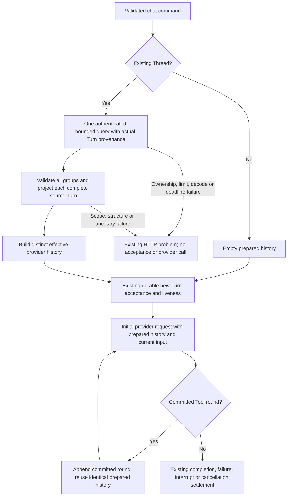

# ADR-0006: Effective Provider Context Integration

## Metadata [Required]

- **Decision Status**: Accepted
- **Implementation Status**: In Progress
- **Date**: 2026-10-08
- **Author**: @codex
- **Decision Owner**: @linhai
- **Required Approver**: @linhai
- **Record Scope**: Service internal — koduck-ai
- **Approver [Conditionally Required — Decision Status is or has been `Accepted`]**: @linhai
- **Approval Time [Conditionally Required — Decision Status is or has been `Accepted`]**: 2026-10-08T23:56:11+08:00
- **Approval Evidence [Conditionally Required — Decision Status is or has been `Accepted`]**: Approve
- **Rejector [Conditionally Required — Decision Status is `Rejected`]**: N/A — this ADR has not been rejected
- **Rejection Time [Conditionally Required — Decision Status is `Rejected`]**: N/A — this ADR has not been rejected
- **Rejection Evidence [Conditionally Required — Decision Status is `Rejected`]**: N/A — this ADR has not been rejected
- **Rejection Reason [Conditionally Required — Decision Status is `Rejected`]**: N/A — this ADR has not been rejected
- **Retired By [Conditionally Required — Decision Status is `Deprecated` or `Superseded`]**: N/A — this ADR has not been retired
- **Retirement Time [Conditionally Required — Decision Status is `Deprecated` or `Superseded`]**: N/A — this ADR has not been retired
- **Retirement Evidence [Conditionally Required — Decision Status is `Deprecated` or `Superseded`]**: N/A — this ADR has not been retired
- **Retirement Reason [Conditionally Required — Decision Status is `Deprecated` or `Superseded`]**: N/A — this ADR has not been retired
- **Blocked From [Conditionally Required — Implementation Status is `Blocked`]**: N/A — implementation is in progress and not Blocked
- **Blocker And Evidence [Conditionally Required — Implementation Status is `Blocked`]**: N/A — implementation is in progress and not Blocked
- **Blocker Owner [Conditionally Required — Implementation Status is `Blocked`]**: N/A — implementation is in progress and not Blocked
- **Blocker Exit Or Recheck Criterion [Conditionally Required — Implementation Status is `Blocked`]**: N/A — implementation is in progress and not Blocked
- **Related [Optional]**: [Trello requirement](https://trello.com/c/4WI4sszw); `koduck-ai/docs/adr/ADR-0003-correction-item-schema-and-raw-replay.md`; `koduck-ai/docs/adr/ADR-0004-authenticated-correction-admission.md`; `koduck-ai/docs/adr/ADR-0005-effective-correction-projection.md`; `docs/adr/ADR-0001-provider-neutral-turn-kernel.md`; `docs/adr/ADR-0003-default-deny-tool-approval-execution-boundary.md`; `docs/adr/ADR-0005-provider-delta-coalescing-and-512-item-turn-budget.md`; `docs/adr/ADR-0002-required-ai-ci-postgres-verification.md`; `docs/adr/ADR-0017-push-boundary-sonarqube-verification.md`
- **Architecture Source [Conditionally Required — product demand]**: `docs/architecture/ADD-0001-ai-service-codex-alignment.md` — CAND-13
- **Supersedes [Conditionally Required — this ADR replaces another]**: None
- **Superseded By [Conditionally Required — this ADR is replaced]**: None

## Requirement Level Legend [Required]

- **`[Required]`**: The section or field always applies and MUST remain present
  with complete, verifiable content. Use `None — <reason>` only when the
  template explicitly permits an empty result; never leave it blank.
- **`[Conditionally Required — <trigger>]`**: The section or field MUST be
  completed when its stated trigger applies. When the trigger does not apply,
  retain `N/A — <reason>` unless the template explicitly instructs removal or
  retention as inactive future-lifecycle guidance. A missing trigger assessment
  is incomplete content.
- **`[Optional]`**: The section may be removed without affecting acceptance,
  execution, completion, or verification. If retained, it MUST be accurate and
  complete; optional content MUST NOT substitute for required evidence.

Unlabeled fields inside a `[Required]` section are required.

## Context And Problem Statement [Required]

CAND-12 is Complete and supplies a pure, scoped correction projection.
Today a resumed Turn still loads a flattened `Vec<Item>` through
`TurnHistory::prior_thread_items`. The PostgreSQL query orders rows by
`turns.created_at`, `turn_items.turn_id`, and Turn-local `sequence`, but
discards the row's Turn identity. The provider serializer ignores Correction
Items and therefore sends the superseded original text.

For example, prior history containing user text `draft`, assistant text
`answer`, a terminal, and a correction of `draft` to `revised` currently sends
`draft` to the model. This task sends `revised` at the original user's
position, keeps `answer` in its original order, and sends no separate
correction message. Canonical replay still contains all four original rows.

The Current ADD's CAND-13 selects exactly this provider-context integration.
One implementation PR will connect authenticated, provenance-preserving reads
to the existing projection and provider input. The small history-port and
PostgreSQL read changes support this consumer; they do not introduce a new
persistence policy, migration, correction-write operation, or independently
deliverable storage capability.

This is a service-internal Full ADR: it integrates a trust-sensitive canonical
history consumer and defines an internal input/error contract. No other
service consumes the changed Rust types, and no externally consumed REST/SSE,
database, provider-wire schema, or configuration contract changes.

## Scope [Required]

In scope:

- Preserve tenant, subject, Thread, and actual Turn provenance in the existing
  bounded prior-history read, including corrections appended after terminals.
- Prepare one owned effective provider-history view before accepting a new
  Turn, using CAND-12 once for each source Turn in canonical order.
- Carry that prepared view in the initial `ModelInput` and reuse it unchanged
  in the same Turn's Tool continuation requests.
- Translate the prepared view through the existing OpenAI-compatible message
  serializer; preserve existing roles, delta concatenation, terminal flushes,
  current-input placement, and committed Tool-round ordering.
- Propagate typed context rejection through existing HTTP problem semantics;
  preserve read limits, database deadlines, cancellation, and raw replay.
- Add focused tests in separate child modules of an existing coverage-selected
  integration target, plus only necessary adaptations of existing test doubles.

Out of scope:

- Changes to CAND-12 chain policy, CAND-11 admission, canonical writes, schema,
  migrations, replay, routes, authentication formats, or UI.
- CAND-17 Thread mutation admission, CAND-18 submission identity, forks,
  compaction, summary generation, Memory, extensions, and background recovery.
- Additional providers, dependencies, runtime settings, CI or Sonar coverage
  configuration, builds, releases, deployment, or external writes.
- Reconstruction of historical Tool invocations from D-3 projections, new
  dispatch authority, or a guarantee that later corrections affect an already
  prepared request.

## Tensions, Constraints, And Open Questions [Required]

### Identified Tensions [Conditionally Required — competing goals or trade-offs exist]

| ID | Tension | Impact | Decision |
| --- | --- | --- | --- |
| TN-1 | Flat historical input versus Turn-scoped projection | Relabeling flat rows can combine unrelated chains or omit post-terminal corrections | Carry real provenance from the authenticated query and project complete per-Turn groups |
| TN-2 | Corrected meaning versus immutable evidence | Replacing canonical rows hides original history | Use a distinct owned provider view; raw replay and every stored row remain unchanged |
| TN-3 | Smaller effective context versus existing raw admission limits | Dropping correction rows before admission can bypass the accepted raw-history cap | Admit raw history before projection; prove that the derived view cannot increase its Item count or canonical payload bytes |
| TN-4 | Current context versus later concurrent writes | Multiple reads or per-Turn queries can mix incompatible source versions | Prepare from one ordered query snapshot; reuse that snapshot for continuations; leave mutation admission to CAND-17 |

### Constraints [Required]

- CAND-13's existing outcome, scope, dependencies, and acceptance context in
  the Current ADD remain unchanged. CAND-12 is the sole chain-policy owner.
- CAND-12 EP-01 through EP-08 remain authoritative: complete scoped input at
  the chosen read point, original positions and kinds, exact effective source
  bytes, post-terminal corrections, atomic typed rejection, and no fabricated
  provenance or projection fallback.
- The accepted CAND-1 prior-history limits remain 4,096 raw Items and
  1,048,576 bytes of canonical serialized Item payload; the SQL query reads at
  most 4,097 rows to detect overflow. Every PostgreSQL attempt retains its
  existing two-second deadline. No history truncation or larger cap is allowed.
- The current input's 65,536-byte limit, the 512 post-acceptance Item budget,
  the 1-MiB durable output budget, provider timeouts, polling, and channel
  capacities remain governed by the existing Accepted ADRs.
- CAND-2 TC-11 remains authoritative for committed Tool results, ordered
  assistant-call/result groups, and current-generation execution authority.
  Corrected text carries content only, never approval or dispatch authority.
- Core context types contain owned domain/application values, never SQLx,
  Reqwest, Axum, or provider-specific JSON values.
- Keep canonical payload encoding and raw byte accounting inside the history
  adapter. The application neither imports that codec nor encodes the derived
  view for a second admission check. Do not add dependencies or SQLx features;
  database ordering needs no application timestamp representation.
- Place the new `PriorTurnHistory`, `ProviderHistoryItem`, and
  `ProviderContextError` types in `application/provider_context.rs` or its
  focused children, with application-level reexports. Keep `ports.rs` changes
  limited to the required method signature, existing input field, and error
  variant. Place the new SQL read/grouping implementation in a focused child
  under `adapters/history/postgres/sqlx_executor/`; the parent retains only
  module wiring and forwarding. Replace the old flat read rather than retain
  an unused seam.
- Apply the common engineering standard's production-file review threshold
  of 600 physical lines and hard limit of 800, and test-file review threshold
  of 1,000 and hard limit of 1,800. At baseline
  `f87e75a519264aacaff310e843408a4aa5a5151d`, `ports.rs` has 731 lines,
  `postgres.rs` 707, and `sqlx_executor.rs` 759; these are point-in-time
  measurements, not maintained equality assertions. Review decomposition of
  every affected file above its review threshold. New context/read modules
  must remain at or below 600 lines; use focused children when needed. No
  affected production file may exceed 800 lines under this proposal. Any
  necessary extraction is limited to this consumer's responsibility.
- Affected executable units must remain at or below the non-waivable
  80-physical-line maximum; review decomposition above 60 lines. Record final
  revision-bound file/unit measurements and dispositions in A-6 and AC-8.
  An exception to an exception-eligible rule requires ADR reapproval before
  use; this draft grants none.
- New public APIs receive intent-bearing documentation before their bodies.
  Tests assert typed behavior and parsed request semantics, not source prose,
  layout, line-count equality, or copied implementation logic.

### Open Questions [Conditionally Required — material questions exist or were resolved during drafting]

| ID | Question | Owner | Due | Status | Resolution and Evidence |
| --- | --- | --- | --- | --- | --- |
| Q-1 | Can the flat history be divided at terminal Items? | @codex | 2026-10-08 | Resolved | No. EP-01 requires actual Turn provenance and EP-05 processes corrections after terminals; the baseline SQL read discards `turn_id`. PC-01 defines the supporting read. |
| Q-2 | May projection permit raw history above the accepted aggregate limits? | @codex | 2026-10-08 | Resolved | No. CAND-13 retains aggregate limits, and project ADR-0001 Constraints requires the raw prior-history guard. PC-03 preserves raw admission and proves derived non-expansion without another capacity check. |
| Q-3 | Must a correction committed after the history read change a continuation? | @codex | 2026-10-08 | Resolved | No additional freshness guarantee is introduced. EP-01 defines the caller's chosen read point; CAND-17 remains undelivered. PC-02 binds initial and continuation requests to the same prepared snapshot. |

No unresolved material question remains in this proposed technical design.
These resolutions are design rationale, not human approval of this ADR.

## Decision Drivers [Required]

1. **Correct model context**: The last correction changes exactly its original
   message position, without a duplicate conversation entry.
2. **Traceable provenance**: Scope comes from the authenticated canonical read,
   and the integration cannot invent Turn membership from message content.
3. **Preserved bounds and evidence**: Projection neither bypasses existing
   admission nor changes canonical history.
4. **One policy owner**: Provider code consumes CAND-12 output without another
   correction interpreter.

## Options Considered [Required]

### Option: Interpret flat history inside provider serialization

Infer groups from terminals and resolve correction links in the adapter.

Pros: Small apparent call-site change.

Cons: Loses truthful Turn scope, misses post-terminal corrections, and duplicates
CAND-12 policy. This cannot satisfy EP-01 or PC-01.

### Option: Return corrected canonical Items from persistence

Make the history adapter replace original payloads during canonical reads.

Pros: Existing provider call sites would receive corrected text immediately.

Cons: Changes raw replay semantics and gives persistence ownership of effective
meaning; exceeds the selected candidate and hides evidence.

### Option: Prepare an owned provider view from scoped canonical history

Read ordered source groups with provenance, use CAND-12, and convert its
borrowed views into one explicitly derived, provider-only input.

Pros: Preserves chain-policy ownership, raw history, provenance, and existing
serialization semantics; works for initial and continuation requests.

Cons: Requires a supporting internal read seam and adaptations of input fixtures.

## Decision [Required]

**Selected option**: Prepare an owned provider view from scoped canonical history.

**Rationale**: The runner already owns prior-history acquisition and continuation
input. Preparing a validated view there lets one integration own errors and
resource admission before any new Turn or provider effect. The provider adapter
then translates resolved values without interpreting canonical relationships.

### Normative Contract Clauses [Required]

- **PC-01 — Provenance-preserving bounded read**: Replace
  `TurnHistory::prior_thread_items` and its `PostgresExecutor` counterpart with
  the required `prior_thread_turns` read. The runner is the flat seam's only
  production consumer; remove the old method, implementations, and obsolete
  flat-read tests, adapting their relevant assertions to the new seam.
  Return ordered `PriorTurnHistory` groups retaining each row's canonical Item
  and tenant/subject/Thread/Turn source scope. Each group owns an explicit
  `source_turn: TurnId` field, populated by the adapter from the canonical SQL
  `turn_items.turn_id` used to group that query's rows. This field is separate
  from the per-row scopes: preparation uses it directly and never derives
  the group's expected Turn from its first row. Thus a test double can supply
  a row/group Turn mismatch even at row index 0. The production adapter
  returns only nonempty groups; no rows means an empty group collection.
  Do not return a timestamp or
  an adapter-generated ordering key for application-side order validation.
  PostgreSQL selects actual scope from the existing joined canonical tables,
  filters by validated tenant,
  subject, and Thread, and orders by `turns.created_at`, `turn_items.turn_id`,
  then `sequence`. Preserve this tuple order, including equal timestamps and
  Turn-local sequence restarts. One SELECT supplies the complete raw Items of
  every returned Turn at its statement snapshot, including rows after a
  terminal; there is no per-Turn N+1 read. An overflow or decode failure returns
  an error, never a truncated or partial group. An unknown or non-owned Thread
  returns `HistoryError::NotFound` with no borrowed foreign rows. An owned empty
  Thread returns empty history; its existing ownership-existence query remains
  permitted when the data SELECT is empty. There is no flattened fallback or
  default implementation that invents provenance. AC-1 verifies database order
  with real PostgreSQL, including equal timestamps; no SQLx feature changes
  or timestamp decoding are required.
- **PC-02 — Snapshot and atomic preparation**: For resume, obtain PC-01 before
  `accept_initial`. First validate group structure using each group's explicit
  `source_turn`: every group must be nonempty, and each `source_turn` may occur
  in exactly one group. Thus any two groups must have different `source_turn`
  values; splitting or interleaving one Turn into multiple groups is rejected
  as a duplicate group identity. No UUID adjacency or consecutive Turn-ID
  property is required. An empty group or duplicate `source_turn` across groups
  returns `ProviderContextError::InvalidProvenance` before any projection. An empty
  collection of groups remains valid empty history; it is distinct from a
  collection containing an empty group. Then call `project_corrections`
  separately for each group in returned order, constructing its expected
  `ProjectionScope` from the validated command's tenant, subject and Thread
  and the group's explicit `source_turn` field. Pass every row's reported scope
  unchanged. CAND-12 is the sole owner of row-scope validation: a tenant,
  subject, Thread or row/group Turn mismatch returns exactly
  `ProviderContextError::Projection(ProjectionError::ScopeMismatch { index })`,
  retaining the first mismatching row's group-local index. Do not precheck row
  scope in preparation or relabel it from the expected scope. CAND-12 retains
  its scope-before-structure-before-ancestry validation order. The application
  preserves database order;
  it does not try to validate it against an adapter-supplied sort key. Never sort,
  relabel, repair, or split at terminals. All groups must validate before
  returning any prepared view. A new Thread has empty prior context. Perform
  no new canonical write or provider call if preparation fails. Reuse the
  identical prepared history in every Tool continuation of the accepted Turn;
  do not requery or reproject mid-Turn. Later source changes affect the next
  read, not this request. This statement-snapshot policy does not authorize
  Thread mutation admission or claim freshness at provider dispatch.
- **PC-03 — Raw admission and derived non-expansion**: Before projection, retain the existing
  inclusive maximum of 4,096 raw Items and 1,048,576 canonical payload bytes
  over the entire Thread, counting corrections and all non-text kinds. Retain
  the 4,097-row overflow sentinel and two-second attempt deadline. Canonical
  JSON escaping counts, not just string UTF-8 length. Raw count or byte overflow
  returns exactly `TurnRunError::History(HistoryError::ContextLimit)`, mapped
  to the existing `400 invalid-request`; no accepted Turn, `turn.started`,
  partial provider input, or history mutation is produced. Raw overflow still
  rejects when projection would make the view smaller.
  Named encoding premise: CAND-3 canonical content-encoding equality, grounded
  in `koduck-ai/docs/adr/ADR-0003-correction-item-schema-and-raw-replay.md`
  CR-01/CR-05 and its implementation copy
  `koduck-ai/docs/contracts/cand-3-correction-schema-v1.md` — Durable Storage
  and Codec. Correction JSON contains the full replacement in exactly
  `{"content": X}`, as do user/assistant textual payloads with content X.
  `corrects_item_id` and `item_type` are separate durable columns, excluded
  from the existing canonical payload byte measure. This proof depends on
  that encoding equality; AC-5's public-codec equality/non-expansion assertions
  guard the premise if the accepted representation or codec changes.
  The derived Item count and canonical payload byte total cannot exceed the
  admitted raw totals: each unchanged view selects its original raw payload;
  each corrected textual root selects one final correction payload, whose
  `{"content": X}` encoding is byte-identical to that root kind with content X;
  different roots select different source Items, and all remaining corrections
  are omitted. Non-text payloads are unchanged. Thus the derived measure is a
  subset of raw payload measures, including escaping. AC-5 proves this invariant
  through the public adapter codec in tests; production preparation performs no
  second capacity check or codec call. Provider JSON envelopes, current input,
  and current Tool rounds remain outside this prior-history measure.
- **PC-04 — Distinct effective input**: Introduce an owned application
  `ProviderHistoryItem` view for `ModelInput.history`, distinct from a canonical
  `Item`. It retains original identity, sequence, and payload-kind semantics,
  selected source identity, and the effective content/non-text value copied
  from CAND-12's accessors. Create exactly one view per non-correction Item in
  group order. Preserve replacement bytes without trimming, tag filtering, or
  reapplying the 16,384-byte output-delta chunk limit to historical corrected
  text. These values are not persistence append inputs or REST/SSE documents.
  No Correction Item becomes a separate message or a new lifecycle/Tool effect.
- **PC-05 — Provider message translation**: The existing serializer reads
  original kind and effective content from PC-04. A user root emits one user
  message after flushing preceding assistant deltas; assistant roots concatenate
  their effective text in order and flush at the existing user/terminal/end
  boundaries. Usage, ApprovalStatus, and historical ToolCall/ToolResult views
  remain inert under the current provider serialization policy. A correction
  physically after a terminal changes its earlier root before that terminal's
  flush; its position is never treated as a new message boundary. For history
  without corrections, the parsed provider `messages` array equals the baseline
  array. The current user input occurs exactly once after prior history and
  before the first current Tool round. The provider adapter owns JSON formatting;
  no correction policy or database access enters it.
- **PC-06 — Tool causality and controls**: Preserve ordered current Tool rounds,
  assistant content, names, arguments, result content, and generated call/result
  IDs. A continuation is possible only after the existing C-5 boundary commits
  the carried results in the current lease generation. Corrected history occurs
  once before the current input in every continuation, not again among Tool
  rounds. Context preparation adds no retry, asynchronous producer, cache,
  mutation lock, timeout override, or dispatch authority. Existing provider
  header/idle/total deadlines, stream polling, interruption, cancellation,
  terminal arbitration, and append-before-publish remain in force.
- **PC-07 — Typed failure and safe diagnostics**: Preserve the exact CAND-12
  `ProjectionError` cause in an owned `ProviderContextError::Projection`;
  this includes row-scope mismatch. `ProviderContextError::InvalidProvenance`
  is reserved for empty groups or duplicate `source_turn` values across groups
  under PC-02.
  A new `TurnRunError::Context` carries either safe typed cause; there is no
  `ProviderContextError::ContextLimit`. The HTTP error match maps both Context
  variants to `503 durability-unavailable`. Existing history failures remain
  `TurnRunError::History`: `HistoryError::ContextLimit` maps to
  `400 invalid-request`, `NotFound` to `404 not-found`, and `Unavailable`
  (including read deadline expiry or decode failure) to
  `503 durability-unavailable`. These pre-acceptance failures start no SSE on
  either chat route. Internal
  Display/Debug and external problems expose no original/replacement payload,
  tenant/subject values, raw rows, or credentials. A failure in a later group
  cannot send an earlier prefix, and no path falls back to flat history.
- **PC-08 — Canonical and resource isolation**: No success, failure, repeated
  preparation, or continuation updates/deletes canonical Items, correction
  links, sequence values, or existing Turn statuses. Source reads and projections
  use call-local bounded data. The history adapter reuses its existing canonical
  codec/raw accounting; the application reuses the pure projection without an
  adapter dependency, per-root raw-history cloning, or new chain traversal.
  Conversion may copy selected effective content once
  into the owned view; source borrows end before provider I/O. Independent
  preparations share no mutable projection state. This does not introduce a
  new wall-clock latency or global Thread concurrency guarantee.

### Integration Flow [Required]

### Consequences [Required]

Positive:

- Corrected meaning reaches actual model requests while immutable history
  remains available for replay and audit.
- One owned preparation result supplies both initial and continuation requests.
- The new read seam closes the provenance loss identified during CAND-12.

Negative:

- Supporting internal port and input-type changes require existing fixture
  adaptations and allocate an owned effective view.
- Raw history above the current cap still cannot resume, even if corrections
  could reduce its effective size.
- A prepared request does not incorporate a correction committed afterward.
- A Thread containing a malformed correction chain fails closed on every
  resumed request with `503 durability-unavailable` while that source remains
  invalid. This ADR provides no repair or recovery path, so retrying that Thread
  alone cannot restore it. Decision Owner @linhai owns any follow-up recovery
  decision and its separate governing ADR; this slice authorizes no repair,
  deletion, or mutation of the corrupt history.

Mitigations:

- Keep the port changes limited to this consumer, retain raw admission, bound
  metadata/content by the admitted source, and use the existing projection.
- Cover production SQL and actual provider request serialization, including
  failure outcomes and a later-correction snapshot test.
- Leave compaction and Thread ownership to their selected ADD candidates.
- Demonstrate that an independent valid Thread still succeeds on the same
  runner after rejection; record the affected Thread's recovery limitation
  rather than imply that an unchanged corrupt source heals on retry.

## Implementation Plan [Required]

**Complete task outcome**: An authenticated resumed Turn and every current Tool
continuation send the ordered effective correction view to the configured
provider within existing aggregate bounds, with atomic typed rejection and
unchanged canonical history, public REST/SSE contract and problem wire format.
Invalid correction history can newly reject resume with the existing 503 problem
before SSE, as specified by PC-07; that observable rejection is intentional.

**Primary implementation boundary**: Provider-context integration between the
owned C-2 input preparation and C-3 provider translation. C-6 read/provenance,
internal port/export, and existing HTTP error-match adaptations are supporting
changes required by this one consumer, not separate implementation outcomes.

One implementation PR targets `dev`. The two inherited provider timeout
checks use their existing private library timing seam; the new integration
checks exercise corrected context through the actual provider transport without
adding a public test-only timing API. Implementation starts only after this
record becomes Accepted; drafting and document verification authorize no source
change. Allowed subtask statuses are `Not Started`, `In Progress`, `Blocked`,
`Complete`, or `N/A — <specific reason>`.

| ID | Objective or deliverable | Included scope | Status | Actual implementation evidence |
| --- | --- | --- | --- | --- |
| T-1 | Deliver scoped read, atomic effective input preparation, provider translation, and typed rejection | PC-01 through PC-08; required ports/exports, PostgreSQL SELECT/decode/grouping, a focused context module, runner input plumbing, provider serialization, existing HTTP error match | Complete | Source delivered at `f1e07f0`: `koduck_ai::application::provider_context::{PriorTurnHistory, PriorTurnRow, ProviderHistoryItem, ProviderHistoryKind, ProviderContextError, prepare_provider_history}` with application reexports; `TurnHistory::prior_thread_turns` and `PostgresExecutor::prior_thread_turns` replacing the removed flat `prior_thread_items` seam; `SqlxPostgresExecutor` delegating to the new `koduck_ai::adapters::history::postgres::sqlx_executor::prior_turn_history::read` (single tuple-ordered SELECT, unchanged `push_bounded_history` admission, consecutive-row grouping, empty-result ownership probe); `TurnRunner::execute_with_observer_and_cancellation` preparing through `TurnRunner::prepare_prior_history` before `accept_initial` and reusing the prepared view across continuations; `provider_messages` translating `ProviderHistoryItem` kinds and effective content; `TurnRunError::Context` mapped to the existing 503 `durability-unavailable` in `map_turn_run_error`. Focused TDD fixtures and one real-`SQLx` smoke live in `koduck-ai/tests/cand_12_projection/cand_13_context.rs`; the ten affected trait-double/fixture files and `postgres_subject_ownership.rs` were adapted to the new seam. T-1 closed out through T-2: AC-1 through AC-8 pass with the evidence recorded in their rows at the acceptance revision `d276e0d`, and AC-9 records the delivery gates. |
| T-2 | Prove effective context and preserved invariants through integration checks | AC-1 through AC-9; focused child test modules, existing doubles/harnesses, routed verification and exact-revision delivery evidence | In Progress | The complete AC-1 through AC-7 named checks and the AC-8 structural suite were delivered at `d276e0d` as focused child modules of `cand_13_context` (shared fixtures in `support.rs`; per-AC modules `scoped_read.rs`, `effective_messages.rs`, `atomic_rejection.rs`, `tool_snapshot.rs`, `bounds_deadline.rs`, `controls_failures.rs`, `trust_problems.rs`), each executed through its exact `--exact` command against an isolated migrated PostgreSQL and the production `Reqwest` transport with one passed test, zero failed/ignored. AC-1 through AC-8 are `Pass` with actual results in their rows. AC-9 remains open for the exact-revision delivery evidence (push admission, required CI on the final SHA) and closes in the follow-up evidence change. |

**Affected paths**:

- `koduck-ai/src/application/provider_context.rs` (new focused input owner),
  `koduck-ai/src/application/ports.rs`, `koduck-ai/src/application/mod.rs`,
  and `koduck-ai/src/application/runner.rs`.
- `koduck-ai/src/adapters/history/postgres.rs` for replacement of the
  `PostgresExecutor::prior_thread_items` trait declaration and the
  `PostgresTurnHistory` forwarding implementation,
  `koduck-ai/src/adapters/history/postgres/sqlx_executor.rs` for forwarding,
  a new focused read module under `sqlx_executor/` (mandatory), and
  `koduck-ai/src/adapters/history/postgres/commit_reconciliation.rs` only for
  reuse/extraction of the existing history accounting without changed limits.
- `koduck-ai/src/adapters/provider/messages.rs`,
  `koduck-ai/src/adapters/provider/mod.rs` only for serializer integration and
  its existing input fixtures, and `koduck-ai/src/adapters/http/mod.rs` only
  for the existing error-match extension and related fixtures.
- `koduck-ai/tests/cand_12_projection.rs` only for a child-module declaration;
  new `koduck-ai/tests/cand_12_projection/cand_13_context.rs` and focused
  fixture children. Replacing the required read method also requires adapting
  trait doubles in these nine existing files:
  `koduck-ai/tests/cand_1_kernel.rs`, `koduck-ai/tests/cand_1_contract.rs`,
  `koduck-ai/tests/cand_1_liveness.rs`, `koduck-ai/tests/runtime_wiring.rs`,
  `koduck-ai/tests/cand_2_runner_tools.rs`,
  `koduck-ai/tests/cand_1_durability.rs`,
  `koduck-ai/tests/cand_2_runner_projection_guards.rs`,
  `koduck-ai/tests/cand_2_runner_projection_guards/lifecycle_guards.rs`, and
  `koduck-ai/tests/turn_terminal_arbitration.rs`. Also adapt
  `koduck-ai/tests/postgres_subject_ownership.rs`:
  `verify_payload_and_subject_ownership` calls
  `PostgresExecutor::prior_thread_items` directly; replace that call while
  retaining its foreign-subject `HistoryError::NotFound` assertion.
  Other existing test fixtures
  are affected only where they call the removed flat method or construct
  `ModelInput.history`; preserve their relevant existing behavior assertions.
- This ADR, `docs/adr/INDEX.md`, and the CAND-13 lifecycle/link and Change Log
  in `docs/architecture/ADD-0001-ai-service-codex-alignment.md`.

### Stable Implementation Touchpoints [Conditionally Required — source or configuration implementation]

All existing-source rows below represent baseline commit
`f87e75a519264aacaff310e843408a4aa5a5151d`. Planned symbols are explicitly
identified as absent at that baseline; implementation evidence must bind their
actual symbols and source revision before completion.

| Path | Stable symbol or contract anchor | Key code excerpt, when needed | Purpose | Source revision |
| --- | --- | --- | --- | --- |
| `koduck-ai/src/application/ports.rs` | `koduck_ai::application::TurnHistory::prior_thread_items`, `ModelInput`, `TurnRunError`; planned `TurnHistory::prior_thread_turns` and `TurnRunError::Context` | N/A — stable symbols are sufficient | Replace the flat method, change the existing input field and add the safe error variant; new type definitions belong in provider_context, not this 731-line baseline file | Baseline `f87e75a519264aacaff310e843408a4aa5a5151d`; planned symbols absent |
| `koduck-ai/src/application/correction_projection.rs` | `koduck_ai::application::correction_projection::project_corrections`, `ProjectionScope`, `ScopedProjectionItem`, `EffectiveItem` | N/A — stable symbols are sufficient | Reuse EP-01 through EP-08 unchanged; this file is an inspected dependency, not a planned affected path | `f87e75a519264aacaff310e843408a4aa5a5151d` |
| `koduck-ai/src/application/provider_context.rs` | Planned `koduck_ai::application::provider_context::prepare_provider_history`, `PriorTurnHistory`, `ProviderHistoryItem`, and `ProviderContextError`; application-level reexports | N/A — planned symbols identify the owner | Own new types, explicit group source_turn, nonempty-group/unique-source_turn checks and expected scope construction from the group field, per-Turn projection and derived conversion; CAND-12 alone validates row scope; no timestamp decoding, adapter codec dependency or second admission | New file; absent at baseline `f87e75a519264aacaff310e843408a4aa5a5151d` |
| `koduck-ai/src/application/runner.rs` | `koduck_ai::application::TurnRunner::execute_with_observer_and_cancellation`; `application::runner::run_accepted` | N/A — stable symbols are sufficient | Prepare before acceptance and preserve identical history across continuations | `f87e75a519264aacaff310e843408a4aa5a5151d` |
| `koduck-ai/src/adapters/history/postgres.rs` | `koduck_ai::adapters::history::postgres::PostgresExecutor::prior_thread_items`; `PostgresTurnHistory` implementation of `TurnHistory`; planned `PostgresExecutor::prior_thread_turns` | N/A — stable symbols are sufficient | Replace the executor trait declaration and history forwarding implementation together, without a default flattened fallback | Baseline `f87e75a519264aacaff310e843408a4aa5a5151d`; planned method absent |
| `koduck-ai/src/adapters/history/postgres/sqlx_executor.rs` and new child `sqlx_executor/prior_turn_history.rs` | Existing `SqlxPostgresExecutor::prior_thread_items_async` and `wait_with_deadline`; planned `SqlxPostgresExecutor::prior_thread_turns_async` delegated to the child read owner | N/A — stable symbols are sufficient | Remove the flat read; parent forwarding preserves deadline, mandatory child owns tuple-ordered SELECT, decode and grouping | Baseline `f87e75a519264aacaff310e843408a4aa5a5151d`; planned child/read absent |
| `koduck-ai/src/adapters/history/postgres/commit_reconciliation.rs` | `push_bounded_history`, `MAX_PROVIDER_HISTORY_ITEMS`, `MAX_PROVIDER_HISTORY_QUERY_ROWS` | N/A — stable symbols are sufficient | Reuse exact canonical encoded-byte and raw-count admission | `f87e75a519264aacaff310e843408a4aa5a5151d` |
| `koduck-ai/src/adapters/provider/messages.rs` | `koduck_ai::adapters::provider::messages::provider_messages`; `flush_assistant` | N/A — stable symbols are sufficient | Translate resolved content with existing role/terminal and Tool-round boundaries | `f87e75a519264aacaff310e843408a4aa5a5151d` |
| `koduck-ai/src/adapters/http/mod.rs` | `koduck_ai::adapters::http::map_turn_run_error`; `HttpAdapter` | N/A — stable symbols are sufficient | Map safe internal context errors through unchanged v1 problem responses | `f87e75a519264aacaff310e843408a4aa5a5151d` |
| `koduck-ai/tests/postgres_subject_ownership.rs` | `verify_payload_and_subject_ownership` | N/A — stable test symbol is sufficient | Replace the direct executor flat-read call and preserve foreign-subject rejection | `f87e75a519264aacaff310e843408a4aa5a5151d` |

**Migration and rollback strategy [Conditionally Required — this replaces or
changes existing behavior]**: No schema or data migration is required. Deliver
the supporting read, derived input, serializer, and tests together. On a
projection, scope, limit, deadline, or decode failure, stop before acceptance;
never fall back to superseded text. If this integration must be withdrawn,
revert its one implementation slice through the normal reviewed source-change
workflow, preserving all canonical rows. A later runtime rollout/rollback is
outside this ADR and requires its normal operational authorization. Reverting
withdraws the corrected-context capability; it does not undo corrections.

### Engineering Exceptions [Conditionally Required — an engineering rule is exceeded or waived]

N/A — no engineering rule is exceeded or waived by the proposed changes.
Mandatory placement, file/unit limits and decomposition evidence are stated in
Constraints and checked by A-6/AC-8. Actual implementation compliance remains
unverified until the affected source exists.

## Contract-To-Check Traceability [Conditionally Required — source or configuration implementation]

| Clause ID | Authoritative contract path and heading | Exact normative requirement | Acceptance check or deterministic test IDs | Explicit coverage method |
| --- | --- | --- | --- | --- |
| PC-01 | `koduck-ai/docs/adr/ADR-0006-effective-provider-context-integration.md` — Normative Contract Clauses | True per-row scope and explicit group source_turn from SQL turn_id, database tuple order, complete nonempty groups, single data query, owned-empty/non-owned outcomes and removal of the flat seam | AC-1, AC-3, AC-5, AC-7, AC-8 | Actual SQLx reader with equal-timestamp/sequence-reset fixtures and explicit group IDs; row-0 mismatch fixture, deadline and scope cases; AC-8 S-READ checks the query structure without a tracing hook |
| PC-02 | `koduck-ai/docs/adr/ADR-0006-effective-provider-context-integration.md` — Normative Contract Clauses | Nonempty groups with pairwise distinct source_turn values checked first; empty collection accepted but empty group rejected; CAND-12 alone validates unchanged row scope against command/group expected scope; all groups prepare atomically before acceptance; new Thread empty and continuation snapshot reused | AC-1, AC-2, AC-3, AC-4, AC-8 | Multi-Turn, row-0 mismatch and empty/later-invalid-group inputs with exact Projection(ScopeMismatch) versus InvalidProvenance results, S-LAYERS single-owner inspection, zero-write failures and a later correction between provider rounds |
| PC-03 | `koduck-ai/docs/adr/ADR-0006-effective-provider-context-integration.md` — Normative Contract Clauses | Existing raw count/escaped-byte caps and exact History(ContextLimit) rejection; derived count/bytes never increase, with no second admission | AC-5, AC-8 | Below/at/above raw boundaries through the production read; ADR-0003 CR-01/CR-05 representation premise and deterministic public-codec equality/whole-view non-expansion assertions; S-LAYERS excludes application codec imports |
| PC-04 | `koduck-ai/docs/adr/ADR-0006-effective-provider-context-integration.md` — Normative Contract Clauses | Distinct provider view, one non-correction entry per position, original kind/source identity, exact bytes and no effect authority | AC-2, AC-3, AC-4, AC-8 | Typed view assertions, parsed wire arrays, raw snapshots and dependency/append-path inspection |
| PC-05 | `koduck-ai/docs/adr/ADR-0006-effective-provider-context-integration.md` — Normative Contract Clauses | Existing role and delta flush semantics, post-terminal correction, unchanged no-correction messages and exact current-input placement | AC-2, AC-4 | Production Reqwest request captured by a loopback HTTP server and parsed as JSON |
| PC-06 | `koduck-ai/docs/adr/ADR-0006-effective-provider-context-integration.md` — Normative Contract Clauses | Current-generation committed Tool rounds, identical history, preserved controls and no new producer/authority | AC-4, AC-6, AC-8 | Runner with real Tool boundary and transport/control harness; dependency/resource ownership inspection |
| PC-07 | `koduck-ai/docs/adr/ADR-0006-effective-provider-context-integration.md` — Normative Contract Clauses | Typed causes, exact existing HTTP mapping, zero partial dispatch and payload-free diagnostics | AC-3, AC-5, AC-7 | Every projection category, both chat routes, deadline and scope fixtures, internal/external sentinel checks |
| PC-08 | `koduck-ai/docs/adr/ADR-0006-effective-provider-context-integration.md` — Normative Contract Clauses | Immutable canonical data, adapter-local raw accounting, bounded call-local conversion, borrow release and independent preparations | AC-1, AC-2, AC-3, AC-4, AC-5, AC-8 | Before/after raw replay, concurrent preparations, compiler ownership and AC-8's binary S-LAYERS/S-STORAGE/S-ALLOC/S-OWNERSHIP checks |

The existing EP-01 through EP-08 projection semantics are exercised through
AC-2/AC-3 and the unchanged `cand_12_projection` suite. CAND-1 prior-context
bounds and CAND-2 TC-11 are exercised explicitly by AC-5 and AC-4 respectively.

## Risk Coverage Matrix [Conditionally Required — source or configuration implementation]

| Risk dimension | Applicability and scenario, or specific N/A reason | Owning boundary | Deterministic verification method | Exact expected result | Acceptance check IDs | Status | Actual evidence |
| --- | --- | --- | --- | --- | --- | --- | --- |
| concurrency and ordering | Applicable: equal Turn timestamps, local sequence restarts, independent reads, and a correction committed between initial and continuation requests | Authenticated C-6 read and provider-context integration | Actual PostgreSQL fixtures plus barrier-controlled runner/transport | Groups follow the canonical tuple; independent results agree; continuation retains its first snapshot and the next read includes the later correction | AC-1, AC-2, AC-4 | Pass | AC-1 at `d276e0d`: tie-broken tuple order over a real seeded Thread (newest Turn with the smallest UUID last), gap sequence `[1,2,5,6]`, two barrier-started independent reads equal, snapshots unchanged; AC-2: eight parsed production requests over real history; AC-4: shared ordering log proves `ac4_request_1 < correction2_committed < projection_appended < ac4_request_2`, requests 1–3 carry the identical frozen prior context, and the next preparation sees `revised-2` |
| timeout and deadline | Applicable: prior-history read cannot acquire a connection before the two-second attempt deadline; provider headers/idle/total timeout after context preparation | SQLx wait boundary and production Reqwest transport | Exhaust the isolated pool; run production transport timeout harness with its existing injected test timing | History timeout is Unavailable with zero new Turn/provider calls; provider timeout remains its existing typed code and settlement | AC-5, AC-6 | Pass | AC-5 at `d276e0d`: a `pg_sleep`-holding single-connection pool rejects `prior_thread_turns` as `History(Unavailable)` in 2–4 s with zero acceptance/dispatch; AC-6: the two inherited library timing checks (`provider_response_header_and_stream_idle_timeouts_are_typed`, `provider_total_timeout_terminates_pending_establishment`) each report 1 passed / 0 failed through the private timing seam |
| cancellation and interruption | Applicable: provider wait or continuation is interrupted/disconnected after corrected context is prepared | Existing runner, C-5 control and Reqwest resource owner | Barrier-controlled production transport and runner/control integration | Exactly one existing interrupted/cancelled terminal wins; no post-terminal continuation or late publication; resources are released | AC-4, AC-6 | Pass | AC-6 at `d276e0d`: a stalled stream plus a persisted interrupt flag yields exactly one `Interrupted` terminal with one provider stream and the terminal as the last publication; a disconnecting consumer yields exactly one `Cancelled` terminal with `observed == published`; AC-4: the interrupted-free two-round Turn ends in exactly one `Completed` terminal |
| resource bounds and backpressure | Applicable: corrections could hide raw count/bytes; escaped content reaches the raw byte cap; copied history could multiply allocations or buffering | Bounded read, prepared view and existing stream channel | Exact raw count/encoded-byte boundaries; deterministic effective non-expansion test; binary S-ALLOC/S-SCOPE inspection; existing backpressure suite | Raw admission remains inclusive at the existing maxima; overflow is History(ContextLimit) with no dispatch; derived count/bytes are at most raw, without re-admission; bounded per-row metadata, no per-root history clone or channel/cap change | AC-5, AC-6, AC-8 | Pass | AC-5 at `d276e0d`: 4,095/4,096 prepare and 4,097 rejects; 1,048,575/1,048,576 prepare and 1,048,577 rejects; escaped backslash content rejects on escaped bytes; a 4,097-row one-root chain (effective 1) still rejects; both routes return 400 with zero effects; the public-codec premise and non-expansion scenarios pass; AC-6: a 300-frame burst over the 64-frame channel completes with bounded 16,384-byte durable deltas and durable-before-visible ordering; S-ALLOC/S-SCOPE inspections Pass in AC-8 |
| framework or trust-boundary rejection | Applicable: missing identity, foreign owner/Thread/Turn, invalid later group or corrupted stored payload | HTTP identity boundary, production SQLx scope read and typed context integration | HTTP boundary harness, actual owner predicates and corruption fixtures | Existing 401/404/503 problems as applicable; zero foreign content, accepted Turn or provider request; typed internal cause with redacted diagnostics | AC-1, AC-3, AC-7 | Pass | AC-7 at `d276e0d`: missing identity is 401 + `WWW-Authenticate: Bearer` with zero prior reads; foreign tenant/subject and unknown Thread are indistinguishable 404s on both routes with exact problem keys; corrupt payload and corrupt chains are 503 before any SSE with four sentinels absent from internal Display/Debug and external bodies; AC-3: every category rejects with its exact typed cause, zero acceptance/dispatch, retry-persistent corruption, and an independent valid Thread succeeding on the same runner |

## Acceptance Checks [Required]

Each proposed focused test below will be a named test in the
`cand_13_context` child module of `koduck-ai/tests/cand_12_projection.rs`.
The existing Sonar integration-target selection already executes that target;
no coverage-tool configuration change is authorized. Each `--exact` command
must report one passed test, zero failed/ignored tests, and its filtered-out
count. Missing isolated PostgreSQL prerequisites fail a database check rather
than silently passing it. Loopback fixtures use generated local addresses and
synthetic identity/content; they require no live provider or credential.

| Check ID | Subtask | Binary acceptance point | Preconditions or input | Verification method | Exact expected result | Expected evidence | Status | Actual result and evidence |
| --- | --- | --- | --- | --- | --- | --- | --- | --- |
| AC-1 | T-2 | The production read preserves actual per-Turn provenance and canonical order without modifying source history | Isolated migrated PostgreSQL via `KODUCK_AI_TEST_DATABASE_URL`; an owned empty Thread; Turns with unequal created_at values and UUID order opposed to timestamp order, plus two Turns sharing created_at, local sequences restarting at 1, sequence gaps, a nonterminal prior Turn, and post-terminal corrections; independent barrier-started reads | `cargo test -p koduck-ai --test cand_12_projection cand_13_context::scoped_thread_read -- --exact`; drive SqlxPostgresExecutor/PostgresTurnHistory and compare returned groups with the independently specified fixture order; AC-8 S-READ separately inspects the single-data-query structure | One test passes; each explicit group source_turn equals the fixture Turn ID, no group is empty, exact tenant/subject/Thread/Turn scope per row, complete groups in timestamp then Turn UUID then sequence order, all post-terminal corrections present, empty owned Thread gives empty groups, identical independent results and unchanged raw snapshots; no application timestamp/sort-key field is required | Test summary, expected/actual group and raw Item identities, raw snapshot equality; separate revision-bound S-READ result, with no statement-tracing API assumed | Pass | Executed at `d276e0d`: `cand_13_context::scoped_thread_read -- --exact` reported 1 passed / 0 failed / 24 filtered out. The seeded fixture gives two Turns sharing `2026-01-01` (UUID tie-break) and a newest `2026-01-03` Turn with the smallest UUID; returned groups equal `[early, tied, late]` with per-row scope equality, the `[1,2,5,6]` gap sequence, the nonterminal Turn without a terminal row, and the post-terminal correction present; two `Barrier`-started independent reads agreed; an owned empty Thread returned no groups and an unknown Thread `NotFound`; before/after SQL snapshots were identical. S-READ inspected separately in AC-8. |
| AC-2 | T-2 | Actual provider requests contain the ordered effective messages with no correction duplicates | New Thread, no-correction resume, single/repeated/independent corrections over multiple Turns, adjacent assistant deltas, post-terminal correction, whitespace/control/Unicode content, and a 65,536-byte corrected assistant delta | `cargo test -p koduck-ai --test cand_12_projection cand_13_context::effective_provider_messages -- --exact`; run TurnRunner with production history and ReqwestOpenAiTransport against a deterministic loopback server; parse captured request JSON | One test passes; exact expected messages arrays and roles for every case; no-correction array equals baseline; original position/kind and final source identity in typed views; replacement bytes exact; one current user message; no Correction entry; raw replay unchanged | Named-case parsed JSON assertions, typed provenance assertions, raw snapshots and test summary | Pass | Executed at `d276e0d`: `cand_13_context::effective_provider_messages -- --exact` reported 1 passed / 0 failed. Eight production `Reqwest` requests parsed against the loopback upstream: new Thread (current input only), no-correction baseline equality, single post-terminal correction, repeated chain selecting `third`, independent per-Turn corrections, adjacent deltas concatenating as `AB2`, exact whitespace/control/Unicode replacement bytes, and a 65,536-byte corrected delta carried unchunked. Typed provenance asserted directly through the read seam; the corrected prior Turn's SQL rows were unchanged by the resume. |
| AC-3 | T-2 | Invalid source anywhere rejects the whole prepared context before acceptance or dispatch without contaminating later independent requests | Valid first group followed by each EP-06 category: tenant/subject/Thread or row/group Turn scope mismatch at row index 0 and later positions, raw InvalidReplay causes, forward edge/cycle, unsupported root; independently assigned group source_turn and unchanged row scopes; an empty group alone or following a valid group; duplicate source_turn across groups (including split/interleaved Turn groups); actual corrupt SQL payload fixture; a separate valid owned Thread on the same runner | `cargo test -p koduck-ai --test cand_12_projection cand_13_context::atomic_context_rejection -- --exact`; invoke the typed preparation seam and runner, including production decoding for stored corruption; retry the unchanged corrupt Thread, then submit the separate valid Thread | One test passes; each row-scope mismatch is exactly TurnRunError::Context(ProviderContextError::Projection(ProjectionError::ScopeMismatch { index })) with the first group-local mismatching index; every other projection failure retains its exact ProjectionError; only empty groups or duplicate source_turn across groups (including split/interleaved Turn groups) return TurnRunError::Context(ProviderContextError::InvalidProvenance) before projection; decode failure is TurnRunError::History(HistoryError::Unavailable); no prepared prefix, accept_initial call, new row, provider request or stream event for invalid requests; no flat fallback; the unchanged corrupt Thread still rejects with 503, while the separate valid Thread succeeds on the same runner; raw source unchanged | Full error-variant/index assertions, zero-effect counters, SQL snapshots, persistent-rejection and separate-Thread success observations, test summary | Pass | Executed at `d276e0d`: `cand_13_context::atomic_context_rejection -- --exact` reported 1 passed / 0 failed. Thirteen pure EP-06 categories behind a valid prefix returned their exact `ProjectionError` (scope drift at row 0 and a later index, all five raw-structure causes, forward edge, cycle, unsupported root); empty groups and duplicate/split/interleaved `source_turn` rejected as `InvalidProvenance`; six runner-level cases rejected with zero acceptance, zero provider input, and zero observer events, kept rejecting on retry, and an independent valid Thread succeeded on the same runner; a real corrupt `SQL` payload failed as `History(Unavailable)` with 503 on both routes before any SSE, unchanged rows, and a neighboring valid Thread returning 200. |
| AC-4 | T-2 | Two current Tool rounds preserve causality and reuse the same corrected history snapshot | Terminal source Turn with a correction; real C-5 boundary with synthetic configured Tool; two loopback provider Tool rounds and final completion; barrier commits a second correction after request 1 and before request 2 | `cargo test -p koduck-ai --test cand_12_projection cand_13_context::tool_continuation_snapshot -- --exact`; capture each production request and canonical C-5 result commit order | One test passes; all three requests carry identical prepared prior context once, then current input once; request 2/3 include only already-committed current-generation rounds in their exact assistant-call/result order with matching call IDs; no historical Tool dispatch; next independent preparation sees correction 2; exactly one Turn terminal | Parsed request arrays, commit-order and terminal assertions, later-read result, raw source equality and test summary | Pass | Executed at `d276e0d`: `cand_13_context::tool_continuation_snapshot -- --exact` reported 1 passed / 0 failed. The shared ordering log proved `ac4_request_1 < correction2_committed < projection_appended < ac4_request_2`; requests 1–3 carried the identical frozen prior context (`revised-1`) once each with the current input once at position 3; request 2 carried only round one and request 3 both committed rounds in causal order with `call_0`/`call_1`; only the two current-generation calls were dispatched (historical Tool views inert); exactly one `Completed` terminal; the source Turn changed only by the deliberately inserted second correction; the next independent preparation saw `revised-2`. |
| AC-5 | T-2 | Raw admission boundaries remain exact, derived history cannot expand, and the database deadline rejects without acceptance | Valid Turn groups spanning raw counts 4,095/4,096/4,097 and canonical payload totals 1,048,575/1,048,576/1,048,577 bytes; escaped/control/Unicode content; repeated and independent corrections on user/assistant roots, every supported non-text kind unchanged, no-correction source, and raw overflow with a small effective projection; isolated pool held unavailable beyond its attempt deadline | `cargo test -p koduck-ai --test cand_12_projection cand_13_context::context_bounds_and_deadline -- --exact`; exercise actual SQLx read; test-only encoding uses public DurableItemCodec::encode on raw payloads and each view's original kind with its selected content; use a four-second harness guard around the unchanged two-second attempt; S-READ inspects LIMIT 4097 | One test passes; below/at raw limits prepare complete views; every raw over-limit result is exactly TurnRunError::History(HistoryError::ContextLimit), and both routes return 400 invalid-request with zero new Turn/provider call; no partial last group is returned; selected correction encoding equals the effective user/assistant encoding byte for byte, including escaping; effective count equals raw count minus correction count and effective canonical bytes are at most raw bytes in every case; unchanged views encode identically; no effective-view overflow branch exists; deadline is TurnRunError::History(HistoryError::Unavailable) before the guard with zero acceptance/dispatch | Exact raw/effective counts and public-codec byte calculations, S-READ row-limit result, full error/problem assertions, deadline and zero-effect evidence | Pass | Executed at `d276e0d`: `cand_13_context::context_bounds_and_deadline -- --exact` reported 1 passed / 0 failed. Raw counts 4,095/4,096 prepared complete groups and 4,097 rejected as `History(ContextLimit)` with 400 `invalid-request` on both routes, zero new Turns, and zero provider calls; canonical payload totals 1,048,575/1,048,576 prepared and 1,048,577 rejected; 524,282 raw backslashes (below the cap as UTF-8) rejected on their escaped encoding while 524,281 stayed admitted, and unescaped `é` counted as UTF-8 bytes; the public-codec premise held byte-for-byte across user/delta/correction encodings including escaping; four non-expansion scenarios kept effective count = raw − corrections and effective bytes ≤ raw; a 4,097-row single-root chain still rejected; the exhausted single-connection pool rejected as `Unavailable` inside the four-second guard with zero acceptance. S-READ's `LIMIT 4097` bind inspected in AC-8. |
| AC-6 | T-2 | Corrected input preserves existing provider timeout, interruption, cancellation and backpressure outcomes | Prepared corrected context, stalled headers/body and blocked Tool continuation; existing production Reqwest library timing tests; runner/control barriers; bounded observer/channel harness | `cargo test -p koduck-ai --test cand_12_projection cand_13_context::controls_and_transport_failures -- --exact`; also run `cargo test -p koduck-ai --lib adapters::provider::tests::provider_response_header_and_stream_idle_timeouts_are_typed -- --exact` and `cargo test -p koduck-ai --lib adapters::provider::tests::provider_total_timeout_terminates_pending_establishment -- --exact`; reuse the existing library timing seam, with no new public timing API | Each of the three commands reports one passed test and zero failed/ignored tests; existing OPENAI_RESPONSE_HEADER_TIMEOUT, OPENAI_STREAM_IDLE_TIMEOUT and OPENAI_TOTAL_TIMEOUT outcomes remain typed; interrupted/disconnected cases produce exactly one interrupted/cancelled terminal respectively, no late publication or post-terminal continuation; failed transport settles through existing failed-terminal path; bounded-channel saturation retains existing append-before-publish behavior and capacity | Error codes, terminal and no-late-event assertions, joined fixture resource teardown, channel-bound observations and test summary | Pass | Executed at `d276e0d`: `cand_13_context::controls_and_transport_failures -- --exact` reported 1 passed / 0 failed over corrected context; the two inherited library timing checks (`--lib adapters::provider::tests::provider_response_header_and_stream_idle_timeouts_are_typed -- --exact` and `--lib adapters::provider::tests::provider_total_timeout_terminates_pending_establishment -- --exact`) each reported 1 passed / 0 failed. A stalled stream with a persisted interrupt produced exactly one `Interrupted` terminal, one provider stream, and the terminal as the last publication; a disconnecting consumer produced exactly one `Cancelled` terminal with observed == published; the production transport's HTTP 500 settled as the `Failed { code: OPENAI_HTTP_500 }` terminal with the corrected context already prepared; a 300-frame burst through the bounded channel completed with all frames delivered, durable deltas within 16,384 bytes, and unchanged append-before-publish ordering. |
| AC-7 | T-2 | Trust rejection and context errors retain exact v1 problems without leaking source values | Both chat routes; missing/invalid identity; foreign tenant/subject/Thread/Turn; unknown Thread; stored decode and projection failures; payload and identity sentinels | `cargo test -p koduck-ai --test cand_12_projection cand_13_context::trust_and_problem_contract -- --exact`; actual SQLx owner predicates plus HTTP/runtime boundary harness; parse problem responses and format internal errors | One test passes; identity returns 401 invalid-identity and WWW-Authenticate Bearer without reaching history; unknown/non-owned Thread returns indistinguishable 404 not-found; malformed context returns 503 durability-unavailable before SSE; bodies retain exactly type/title/status/code/correlation_id; no sentinel in external or internal Display/Debug diagnostics; zero accepted/provider effects | Parsed response/header assertions, safe diagnostic captures, SQL ownership cases, call counters and test summary | Pass | Executed at `d276e0d`: `cand_13_context::trust_and_problem_contract -- --exact` reported 1 passed / 0 failed. Missing identity returned 401 `invalid-identity` with `WWW-Authenticate: Bearer` and zero prior reads; foreign tenant, foreign subject, and unknown Thread returned shape-identical 404 `not-found` problems on both routes with exactly the `{type,title,status,code,correlation_id}` keys; a real undecodable payload and a corrupt correction chain returned 503 `durability-unavailable` before any SSE event; four payload/identity sentinels appeared in neither internal `Display`/`Debug` renderings nor external bodies; Turn counts and provider inputs stayed at zero. |
| AC-8 | T-2 | The implementation respects one consumer boundary, bounded derived ownership and engineering limits | Implemented context seam, runner, serializer, supporting read/match and tests; canonical before/after snapshots available | `cargo test -p koduck-ai --test cand_12_projection`; complete every binary structural check S-READ through S-FILES below against one identified implementation revision | Suite passes with the new checks executed; all source snapshots identical; every structural row is Pass with its named evidence; no undocumented exception or failed row is accepted | Full target summary, raw snapshots, per-row yes/no disposition, affected stable symbols, file/unit measurements, Git diff and source revision | Pass | Executed at `d276e0d`: `cargo test -p koduck-ai --test cand_12_projection` reported 25 passed / 0 failed. S-READ: `prior_turn_history::read` holds exactly two statements — the ordered data `SELECT` (tenant/subject/Thread predicates, `ORDER BY turns.created_at, turn_items.turn_id, turn_items.sequence`, `LIMIT $4` bound to the unchanged `MAX_PROVIDER_HISTORY_QUERY_ROWS = 4_097`) and the ownership-existence probe reachable only when the data result is empty; no query executes inside the row loop; zero `prior_thread_items` references remain in `src/` or `tests/`. S-LAYERS: types remain in `provider_context` with ports limited to the method/field/variant plumbing; no `payload_codec`/`DurableItemCodec` import exists under `src/application/`; EP policy and correction chains are untouched by SQL/provider code. S-STORAGE: zero `UPDATE`/`DELETE` in the read/preparation path; snapshot assertions in AC-1/AC-3/AC-4. S-ALLOC: preparation retains one `Vec` of views, one `HashSet` of source-Turn identities, and one borrowed-entries `Vec` per group — a fixed family count with at most one entry per Item/root/group; conversion visits each non-correction Item once copying its selected value once; the CAND-12 projection is reused unchanged. S-OWNERSHIP: `ProviderHistoryItem` owns `String`/`ItemPayload` values with no row borrow crossing provider I/O; the runner reuses the one prepared snapshot. S-SCOPE: the `d276e0d` diff touches only `koduck-ai/tests/cand_12_projection/cand_13_context*` — no migration, dependency, SQLx feature, runtime/CI/Sonar setting, route, timeout, capacity, or channel change. S-FILES: production files are byte-identical to the T-1 revision (`provider_context.rs` 252, `ports.rs` 744, `runner.rs` 465, `postgres.rs` 712, `sqlx_executor.rs` 712, `prior_turn_history.rs` 122, `commit_reconciliation.rs` 343, `messages.rs` 96, `provider/mod.rs` 643, `http/mod.rs` 420 — all at most 800); affected test files measure `cand_13_context.rs` 659 and children 318–977 (all at most 1,000 and at most 1,800); the largest new executable unit is 78 lines with every unit at most 80. |
| AC-9 | T-2 | The final implementation revision satisfies required verification and delivery gates | T-1 and focused checks complete; isolated PostgreSQL present; one Draft implementation PR to dev with identifiable latest pushed SHA | Run exact Scope Routing commands from repository root: `cargo fmt --all --check`; `cargo clippy -p koduck-ai --all-targets --all-features -- -D warnings`; `cargo test -p koduck-ai --all-targets --all-features`; `npm test --prefix tools/governance-validator`; `npm run validate --prefix tools/governance-validator`; `python3 tools/sonarqube/gate.py check --revision HEAD` or matching successful push-time evidence; inspect exact-SHA CI/review/thread evidence | Every command exits 0; applicable risk rows Pass; latest SHA has green required koduck-ai-format/koduck-ai-clippy/koduck-ai-test-postgres, zero incremental Sonar issues, analysis-bound Quality Gate OK and at least 80% changed executable-line coverage; configured review covers that exact SHA and no actionable non-outdated P0/P1/P2 thread remains unresolved | Command summaries, exact revision/base/tree Sonar identity and coverage, required CI URLs, review round/SHA/result and thread replies/dispositions | Not Started | Pending — no implementation revision or PR exists |

Allowed final check statuses are `Pass`, `Fail`, or `N/A — <specific reason>`.
None of AC-1 through AC-9 is optional for this implementation. A broad green
suite does not substitute for the named check's expected outcomes or real SQL
and provider transport evidence. Test output and safe reports may be retained;
disposable compilation and fixture output must be removed before completion.

AC-8's structural checks are predetermined yes/no inspections of the identified
source revision, not tests that read source as opaque text. Record `Pass` or
`Fail` for every row, its affected stable symbols and supporting diff/measurement;
all rows apply. The compiler and behavioral tests supplement these inspections.

| Structural check ID | Binary passing criterion | Required revision-bound evidence |
| --- | --- | --- |
| S-READ | The production read has one ordered data SELECT, with tenant/subject/Thread predicates, ORDER BY created_at/turn_id/sequence and LIMIT 4097; the existing ownership-existence SELECT is reachable only when the data result is empty; no query is issued inside a per-Turn/Item loop; no legacy prior_thread_items method/default or production call remains | Stable read/grouping and forwarding symbols, SQL call-path inspection, linked AC-1/AC-5 behavioral results |
| S-LAYERS | New input/error/group types belong to provider_context or its children; only required signature/field/variant plumbing enters ports; SQL read/grouping belongs to a sqlx_executor child; each group has an explicit SQL-derived source_turn; preparation checks group nonemptiness and pairwise distinct source_turn values and builds expected scope from that field, never its first row, then passes unchanged reported scopes to CAND-12 without a duplicate row-scope guard; raw codec/accounting remains adapter-local, with no application import of the adapter codec or derived re-admission; EP policy is unchanged and neither SQL nor provider code resolves correction chains | Module/type ownership, explicit group field and scope-validation call path, imports and call graph in the scoped diff; compiler result |
| S-STORAGE | No context success/failure/continuation path invokes canonical update/delete or appends its derived view; before/after canonical snapshots agree except the deliberately inserted AC-4 fixture correction and the accepted current Turn's existing lifecycle writes | Callable persistence surfaces, scoped diff, raw snapshot assertions with those explicit fixture/current-Turn baselines |
| S-ALLOC | With n admitted raw Items and g source groups, each new metadata collection family has at most one entry per source Item/root/group across all groups; the number of such families is a fixed implementation constant independent of n/g; conversion visits each non-correction Item once and copies its selected payload once into the owned view; no root/group clones or rescans the entire Thread history and no new projection chain walk is implemented | Collection-family inventory with aggregate entry bounds and fixed family count, preparation/conversion loop and clone-site inspection; existing CAND-12 projection reused |
| S-OWNERSHIP | Prepared history owns domain/application values and holds no source/SQL-row borrow at provider I/O; the same prepared history is reused for continuations; preparation uses only call-local state and creates no producer, cache or shared mutable projection state | Type/lifetime and call-path inspection, compiler result, AC-4 continuation and independent-request assertions |
| S-SCOPE | The diff adds no migration, dependency, SQLx feature, runtime/CI/Sonar setting, route, mutation/dispatch authority, timeout/capacity override or channel; test doubles/fixtures change only as required by the replaced read/input contract | Scoped diff and dependency/configuration comparison; existing control checks remain green |
| S-FILES | Every affected production file is at most 800 physical lines; new context/read modules are at most 600; affected test files are at most 1800; decomposition dispositions exist for production files above 600, test files above 1000 and executable units above 60; every affected executable unit is at most 80 lines, with no waiver of that maximum | Per-file/per-unit measurements at the implementation revision and threshold dispositions in A-6; focused child-module/extraction evidence |

## Completion Checklist [Required]

| ID | Item | Completion Criterion | Expected Evidence | Status | Actual Evidence |
| --- | --- | --- | --- | --- | --- |
| A-1 | ADR approved | Eligible non-author Approve, identity and approval time recorded | Metadata and approval context | Complete | In the active Codex task, the user self-declared @linhai and responded Approve in the message `@linhai Approve`, after the approval request identified this exact repository-relative ADR path. Approval recording time 2026-10-08T23:56:11+08:00; author @codex is distinct from the named Required Approver. |
| A-2 | Complete task delivered | T-1/T-2 Complete and AC-1 through AC-9 Pass with actual evidence | Stable implementation revision, checks and PR | Not Started | Pending — source implementation not started |
| A-3 | Reciprocal ADD link synchronized | Exact reciprocal paths agree; CAND-13 remains Selected until this ADR is Complete/Verified, then becomes Complete in the same change | ADD row, ADR metadata and index | Not Started | Acceptance synchronizes the Accepted/Not Started link; CAND-13 remains Selected and implementation closeout is pending |
| A-4 | Requirement levels satisfied | Every required/triggered field complete for its stage; inactive conditions reasoned; no template placeholders | Structured review and recorded finding closure for the current design | Complete | The user-reported round 6 found no blocking issue in the pre-edit working draft 929e2d2a839b58eac2ba1d30d75ac93699ded5f8. Its precision edits and reported authorization source are recorded below. Acceptance adds the triggered approval fields and A-1 evidence; requirement-level/lifecycle validation is in A-8. Complete applies to the Accepted/Not Started stage; implementation evidence remains pending. |
| A-5 | Acceptance checks decidable | Each check identifies subtask, inputs, deterministic method, exact result and evidence; proposed tests explicitly marked | Structured acceptance review and recorded finding closure for the current design | Complete | Round-6 closure names the existing content-encoding premise, distinguishes public contract preservation from fail-closed behavior and defines one group per source_turn. Acceptance methods and outcomes are unchanged; empty groups and duplicate group IDs remain InvalidProvenance. No seventh agent review or passing implementation test is claimed. |
| A-6 | Engineering exceptions governed | Actual affected files/units meet Constraints and S-FILES; all threshold dispositions recorded; no unapproved exception | Revision-bound file/unit measurements and decomposition evidence | In Progress | T-1 measurements at `f1e07f0`: provider_context.rs 221 and prior_turn_history.rs 122 (new, ≤600); ports.rs 744 (baseline 731), postgres.rs 712 (707), sqlx_executor.rs 712 (759, reduced), provider/mod.rs 609 (574), messages.rs 96, http/mod.rs 420, runner.rs 463; test file cand_13_context.rs 491 (≤1000). The four production files above the 600-line review threshold remain cohesive single-boundary owners whose growth is confined to this consumer's required signature, error-variant, and serializer-fixture plumbing; none exceeds the 800 hard limit and no engineering exception is claimed. Largest affected executable units: `execute_with_observer_and_cancellation` 77 (baseline 88; decomposed through `prepare_prior_history` and `start_liveness_or_close`), `provider_messages` 71, test `continuation_request_preserves_causal_round_order` 77, pre-existing `start_turn_liveness` 63 and `run_accepted` 64; every unit is at or below the non-waivable 80-line maximum. Final closeout measurements at the T-2 acceptance revision `d276e0d`: every production file is byte-identical to the T-1 delivery, so the T-1 figures remain final (`provider_context.rs` 252, `ports.rs` 744, `runner.rs` 465, `postgres.rs` 712, `sqlx_executor.rs` 712, `prior_turn_history.rs` 122, `commit_reconciliation.rs` 343, `messages.rs` 96, `provider/mod.rs` 643, `http/mod.rs` 420; the four files above the 600-line review threshold keep their single-boundary-owner dispositions and none exceeds 800). The decomposed acceptance suite keeps `cand_13_context.rs` at 659 lines with focused children `support.rs` 977, `atomic_rejection.rs` 679, `bounds_deadline.rs` 437, `effective_messages.rs` 398, `controls_failures.rs` 338, `tool_snapshot.rs` 370, `scoped_read.rs` 331, and `trust_problems.rs` 318 — every affected test file at or below the 1,000-line review threshold and the 1,800 hard limit. The largest new executable units are `structure_cases` 78, `scope_mismatch_cases` 77, `runner_cases` 71, and the AC-named wrappers delegating to them; the pre-existing 60–80-line units retain their recorded dispositions and no unit exceeds 80. |
| A-7 | Contracts and baseline risks covered | PC-01 through PC-08 mapped explicitly; all five risk rows reach Pass before review-ready/completion | Traceability, matrix and actual acceptance evidence | Pass | At `d276e0d`: every PC-01 through PC-08 traceability row resolves to the executed AC rows above (AC-1 through AC-8 all `Pass` with actual command results), and all five Risk Coverage Matrix rows are `Pass` with their recorded evidence. |
| A-8 | Governance validation passed | Both routed governance commands report success for the current document state | Validator outputs and document identities | Complete | 2026-10-08 acceptance verification: npm test --prefix tools/governance-validator exited 0 with 208 passed, 0 failed, 0 skipped; npm run validate --prefix tools/governance-validator exited 0 after the draft-stage archival N/A was replaced with the template's inactive future-lifecycle guidance; both whitespace checks produced no diagnostics. Approval/result evidence entries are revalidated separately; no implementation result is claimed. |

## Supporting Notes [Optional]

### Input Audit And Verification Limits

The user requested a Full ADR for the recommended CAND-13 in this Codex task.
Before drafting, local `dev` was at
`f87e75a519264aacaff310e843408a4aa5a5151d`; all Full/Lightweight ADR index rows
had terminal implementation statuses. The untracked `.zcodeignore` is unrelated
and preserved. Branch `codex/cand-13-provider-context-adr` was created from this
local `dev` without remote synchronization.

The Current ADD and Accepted records are the requirement/contract baseline.
The Trello board was read in the preceding recommendation: it contained the
overall requirement card, with no finer task priority or checklist. No card,
board, source, configuration, dependency, or runtime change is authorized by
this drafting request. The ADD change selects its existing CAND-13 and adds a
reciprocal link; it changes no outcome, dependency, boundary, or approval.

The inspected source proves the flat-read gap, existing order/caps, projection
API and serializer behavior. Proposed types/tests and their names above are
design choices awaiting implementation and acceptance, not existing passing
evidence. The pinned coverage target already includes `cand_12_projection`;
placing CAND-13 tests in a focused child module keeps their ownership visible
without changing the configured target selection. Real SQL and Reqwest tests
are still required; a ModelProvider double alone cannot establish those rows.

### Key State And Invariant Matrix

These cases guide the future test-first implementation. P1 denotes isolation,
wrong model meaning, or unbounded acceptance failures with direct user impact;
P2 denotes integration regression/control cases with existing baseline guards.
The priority changes implementation order, not whether a check is required.

| Priority and state/precondition | Action or ordering | Expected observable outcome | Invariant and owner/entry points | Check or current gap |
| --- | --- | --- | --- | --- |
| P1: multiple owned Turns, equal timestamps and restarted sequences | Read resume source, then project by real source Turn | Tuple-ordered complete scoped groups and exact corrected messages | C-6 owns database order/truthful scope; context integration preserves order, checks nonempty groups with pairwise distinct source_turn values and supplies expected scope from explicit source_turn; CAND-12 alone validates rows across both chat entries | AC-1/AC-2/AC-3; not run |
| P1: valid prefix, empty/malformed/foreign later group | Prepare before accept_initial | Empty group is InvalidProvenance; row-0 or later scope mismatch is Projection(ScopeMismatch); typed whole-context rejection with zero acceptance/provider effects | Context integration owns all-or-error preparation; both chat routes use the same seam | AC-3/AC-7; not run |
| P1: raw limit edge, including escaped payload and smaller derived view | Admit raw source, then project/convert | Below/at raw limit accepted; above rejected as History(ContextLimit) without truncation; derived count/bytes never increase | History adapter owns raw aggregate admission at every resume entry; projection/conversion own non-expansion without a second admission | AC-5; not run |
| P1: corrected source, two current Tool rounds | Commit result, then continue; later correction commits between requests | Same prepared prefix, current input once, committed groups in order; next independent read sees later correction | Runner/C-5 own causal continuation; serializer never confers execution authority | AC-4; not run |
| P2: new Thread or uncorrected source | Prepare and send initial request | Empty prior context or baseline-equivalent messages | Provider-context integration preserves existing no-correction behavior | AC-2; not run |
| P2: database or transport stall | Read deadline or provider timeout expires | Existing typed failure, no fabricated success | SQLx/Reqwest retain their current deadlines and terminal owners | AC-5/AC-6; not run |
| P2: active provider/continuation, interrupt or disconnect | Existing control wins terminal arbitration | One interrupted/cancelled terminal, no late continuation/publication | Runner, C-5 and runtime resource owners retain control on every enabled path | AC-6; not run |
| P1: success, failure, repeated/parallel preparation | Compare source before and after | Every canonical row/payload/link/status unchanged | Canonical store alone owns mutation; derived input cannot append | AC-1/AC-3/AC-8; not run |

Distributed ownership, durable submission retries, compaction and historical
Tool reconstruction are not applicable to this slice because their ADD
candidates/owners are outside its scope. Statement-snapshot consistency is
verified here; prevention of a concurrent fresh Thread mutation is a CAND-17
gap, not an implied CAND-13 guarantee. Missing PostgreSQL evidence, under-80%
coverage, incomplete exact-revision review, or any failing acceptance/risk row
blocks implementation closeout. Further review beyond two agent rounds requires
the repository owner's bounded extension under AGENTS.md.

### Draft Review Evidence

Earlier reports below are historical and do not establish coverage for later
revisions. The latest user message identifies its report as agent review round
6 and reports no blocking issue, with three precision edits and one approval
consideration. Its reported authorization source and closed deltas are recorded
below; A-4/A-5 use that review-and-closure evidence. None of these reports is
formal approval, pushed automatic-review coverage or passing implementation
evidence. The drafting agent initiated no seventh review during closeout.

Local structured review round 1 on 2026-10-08 examined ADR working-draft
blob `8254124a1c6f8fd261429ce6422ae992e72163f1`, ADD blob
`de9cf2a3875e5856ba469131e640fd19ca49dfdb`, and index blob
`8a8d3e1fe6ca40eaeb1d493cdad4decc4436cad5` against baseline
`f87e75a519264aacaff310e843408a4aa5a5151d`. Review covered service routing,
serialization, the unchanged ADD candidate, raw/projection ownership, real
Turn provenance and retained ordering keys, atomic pre-accept failure,
aggregate/escaping limits, post-terminal corrections, Tool snapshot causality,
public problem codes, five risk dimensions, stage requirements and reciprocal
links. The source comparison corrected the proposed 404 code to the existing
`not-found`, made canonical ordering-key retention explicit, and made each
traceability row name the full contract path before the identified draft.
The review then found that the proposed integration test could not use the
provider module's private accelerated timing seam; AC-6 now names the two
existing library timeout checks separately and adds no public timing API.
The remaining checks stay explicitly unimplemented and unrun. These identities
are local working-draft evidence, not an approval-context revision or pushed
automatic-review coverage.

Local structured review round 2 examined revised ADR working-draft blob
`d19bee52e59a97f3ca0f56236ed7040761ef77dd`, with the same ADD/index blobs
and baseline. It rechecked the round-1 corrections and each PC clause against
its linked input/assertions, all five risk owners, separate production SQL and
Reqwest evidence, snapshot limits, new versus inherited test commands,
stage-specific evidence, single-boundary scope, and preserved ADD approval.
Result: no unresolved finding in the local document/acceptance review.
Governance validation passed again after the timing-test clarification;
`cargo fmt --all --check` passed. New CAND-13 acceptance tests remain Not
Started. These are pre-evidence identities; this review and the draft-stage
checklist updates authorize no implementation and claim no remote review.

### Agent Review Round 3 Requested By The User

Source: the agent review report relayed in the user's 2026-10-08 message in
this Codex conversation. The user identifies this as the third, explicitly
requested review round. The reviewed revision was the preceding working draft;
its full ADR blob was not supplied in that report. Source baseline remained
`f87e75a519264aacaff310e843408a4aa5a5151d`; no exact draft identity is
invented from that baseline. The result was to withhold `Approve` for four
blocking findings and the accompanying P2/P3 suggestions, not the canonical
`Reject` action. The table records their drafting dispositions, not an extra
review round or proof of implemented behavior.

| Finding | Draft disposition | Revised anchors |
| --- | --- | --- |
| 1 — unreachable derived admission and codec dependency inversion | Removed the second admission and its error variant; documented the unique selected-source/encoding proof and deterministic public-codec test | TN-3, Q-2, Constraints, PC-03/PC-07/PC-08, Integration Flow, traceability, resource risk, AC-5, state matrix |
| 2 — timestamp key requires an unsupported representation and self-validates adapter order | Selected option (a): no returned timestamp/key; preparation checks unique contiguous Turn groups and delegates row scope to CAND-12; production SQL order is verified with real timestamp/UUID fixtures | Constraints, PC-01/PC-02, touchpoints, AC-1/AC-3 |
| 3 — production file limits omitted | Mandatory new types in provider_context and SQL read in a sqlx_executor child; recorded baseline measurements, review thresholds and hard limits | Constraints, affected paths, touchpoints, A-6, AC-8 S-FILES |
| 4 — Mermaid node E reused | Empty context is E0 and reaches acceptance directly; E only builds the derived view; unreachable overflow edge removed | Integration Flow |
| 5/6 — obsolete flat seam and ambiguous limit error | Replace/remove the old methods and callers; name nine trait-double files and required caller/input fixture adaptations; raw overflow is exactly TurnRunError::History(HistoryError::ContextLimit) | PC-01/PC-03/PC-07, affected paths, AC-5, S-READ |
| 7 — SELECT tracing undefined and resource inspection subjective | Removed assumed tracing; actual SQL tests prove scope/order and S-READ checks query structure. Structural ownership/allocation/scope/file checks have individual binary criteria | AC-1, AC-5, AC-8 S-READ through S-FILES |
| 8/9 — retry target and fail-closed recovery limitation unclear | Unchanged damaged Thread keeps rejecting; a separate valid Thread succeeds on the same runner. No repair path is authorized; @linhai owns the follow-up recovery decision | AC-3, Consequences |
| P3 — constraints under N/A and stale verification/review evidence | Moved requirements to Constraints; reduced baseline verification detail; invalidated current A-4/A-5 evidence and rerun governance validation for A-8 | Engineering Exceptions, Completion Checklist, Draft Review Evidence, Drafting Verification |

### Agent Review Round 4 And Finding Closure

On 2026-10-08, the agent review relayed in the user's round-4 message examined
ADR blob `e68d4a4291091ef50aa907ede2659ad266ddae09`, ADD blob
`72c639671817965468b6165c18571cdcfd181fc3`, and index blob
`8a8d3e1fe6ca40eaeb1d493cdad4decc4436cad5`. The full identities were checked
against the working files before this revision. The report confirmed all
round-3 fixes and found no blocking approval issue, leaving one P2 clarification
and three editorial items for closure before requesting `Approve` from @linhai.
It also reported successful governance validation for that reviewed draft.

Extension authorization source: the direct human user's 2026-10-08 message in
Codex conversation `01a11a13-c358-7871-baab-7f1d4f88979d` explicitly states
that round 4 belongs to the requested extension and directs incorporation of
these findings and A-4/A-5 closeout. The preceding user message identifies
round 3 as explicitly requested. This records the instruction source rather
than attributing it to @codex or inferring that the human user is @linhai;
no separate originating review task/account identifier was provided. @codex
is the drafting actor; @linhai remains the named Decision Owner and Required
Approver. That extension was not open-ended authorization for round 5; the
subsequent round's separately reported authorization is recorded below.

| Round-4 finding | Closed drafting disposition | Exact post-review diff and evidence |
| --- | --- | --- |
| P2 — ambiguous row-scope rejection owner | Selected option (a): only CAND-12 validates row scope, retaining ScopeMismatch and its exact group-local index; InvalidProvenance is reserved for repeated/noncontiguous groups | PC-02/PC-07, matching AC-3 error outcomes, PC-02 traceability, provider_context touchpoint, S-LAYERS and state-matrix owner; existing project_corrections/reject_foreign_scope verifies the selected ownership and validation order |
| P3-1 — omitted direct caller and trait-declaration change | Explicitly named postgres_subject_ownership.rs and the PostgresExecutor trait declaration, retaining the existing ownership assertion | Affected paths and stable touchpoints; baseline verify_payload_and_subject_ownership calls prior_thread_items and asserts HistoryError::NotFound; postgres.rs declares that method and forwards the history read |
| P3-2 — misleading review source/round labels | Recorded round 3 as an agent review requested by the user, added round 4 with the full reviewed identities and explicit instruction source | Draft Review Evidence and Change Log; at round-4 closeout the count was four and no fifth review had been initiated; the later round is recorded separately below |
| P3-3 — stale A-4/A-5 and optional approval revision | Marked A-4/A-5 Complete for Proposed-stage content using round 4 plus these closed deltas; preserved all implementation checks as Not Started | Completion Checklist and this table; final governance validation is recorded separately in A-8. No Approval Context Revision is set: the draft is uncommitted, and HEAD does not contain its content. |

The post-review changes are confined to those entries and their verification
evidence. Group rejection still precedes projection; within a group CAND-12
owns scope, then raw structure, then ancestry validation. Both context error
variants keep the existing 503 public response. No candidate outcome, public
contract, resource limit, implementation boundary, dependency, canonical-write
policy or approval metadata changed. Closure of these specified findings is
part of round 4's recorded remediation, not a new whole-document review pass.

### Agent Review Round 5 And Clarification Closure

On 2026-10-08, the agent review report relayed in the latest user message
identified ADR blob `b53a341b4b49d6a49b8bb0e56c88feca07a71322`. The full
working-file identity was checked before this revision; ADD and index remained
`72c639671817965468b6165c18571cdcfd181fc3` and
`8a8d3e1fe6ca40eaeb1d493cdad4decc4436cad5`. The report found no blocking
issue and proposed two optional clarifications. It recorded 208 governance
tests passed, zero failed/skipped, successful repository validation, and no
whitespace diagnostics; the no-index check returned 1 for differing files.

Authorization source: the direct human user's latest 2026-10-08 message in
Codex conversation `01a11a13-c358-7871-baab-7f1d4f88979d` identifies this
as the explicitly requested fifth round and directs recording it with the
limited clarification diff, then requesting @linhai's `Approve` without another
review. As with round 4, this records the user's instruction source without
inferring an @linhai identity or inventing a separate originating account/task.
At round-5 closeout the reported count was five; that extension did not
authorize a sixth round or an open-ended loop. The later message's separately
reported round-6 authorization is recorded below.

| Optional round-5 clarification | Closed drafting disposition | Limited post-review diff |
| --- | --- | --- |
| Group Turn identity has no explicit origin/field | Each PriorTurnHistory owns source_turn: TurnId, filled by the adapter from the query's canonical turn_items.turn_id; expected Turn is read from that independent group field, never inferred from the first row's scope | PC-01/PC-02, provider_context touchpoint, traceability, AC-1 group-ID assertions, AC-3 row-0/later mismatch inputs and S-LAYERS; rows retain their reported scope, with CAND-12 as the only row-scope validator |
| Empty groups have no specified result | Every individual group must be nonempty; any empty group is InvalidProvenance before projection/acceptance, including one after a valid prefix. An empty collection remains valid empty history | PC-02/PC-07, traceability, AC-3 exact error/zero-effect assertions, S-LAYERS and state matrix; the production adapter returns nonempty groups or an empty collection, never an empty group |

Only these clarification anchors and their review/verification evidence changed
after round 5. Existing row-scope error ownership, 503 problem mapping, raw
limits, immutable history, snapshot reuse, one-PR scope and the ADD candidate
remain unchanged. A-4/A-5 stay Complete for the Proposed document stage using
round 5 plus this recorded closure; no additional whole-document review or
implementation evidence is claimed. No Approval Context Revision is recorded
because the document remains uncommitted and HEAD omits its content; that
optional audit field is not required to request or record `Approve`.

### Later Independent-Check Report And Editorial Closure

The earlier unnumbered user report on 2026-10-08 described a full independent comparison
against the template, ADD/index and source baseline, followed by successful
governance validation. Before the present edits, the working draft was ADR
blob `fdf371c88667fc9acbd32db0facde6baba661dc5`, with unchanged ADD/index
blobs `72c639671817965468b6165c18571cdcfd181fc3` and
`8a8d3e1fe6ca40eaeb1d493cdad4decc4436cad5`; HEAD still equaled the fixed
source baseline `f87e75a519264aacaff310e843408a4aa5a5151d`. These are checked
working-file identities; the report supplied no separate full blob, reviewer
account, review-round number or original report location. No reviewer identity
or additional agent-review authorization is inferred, and the drafting agent
has not initiated another review pass.

The report found no blocking governance issue and proposed a template-heading
correction plus a non-blocking implementation-evidence clarification. This
closeout changes `Consequences` to `###` beneath `Decision`, matching
`docs/adr/template/0000-template.md` and Accepted service ADR-0005, without
moving the section. T-1's evidence field now explicitly links its actual
implementation symbols/revision to T-2's AC-1 through AC-9 results and A-2.
No check assignment, method, expected outcome, scope, contract clause or
approval metadata changed. The report's informational observation about UUID
tie ordering is already represented by PC-01 and AC-1's baseline-order fixtures.

Evidence boundary for @linhai: rounds 3 through 6 are review reports relayed
through this conversation and recorded by the drafting agent. Original
reviewer-authored reports and independently verifiable reviewer identities are
not stored in this repository; the recorded blobs alone cannot prove that
those reviews occurred or had the reported conclusions. The later report is
also recorded as supplied, rather than presented as a repository-verifiable
review artifact. These reported conclusions support the Proposed-stage
checklist only; the named approver must still make the formal `Approve`
decision under AGENTS.md.

### Agent Review Round 6 And Precision Closure

The latest user message on 2026-10-08 identifies its report as the sixth agent
review and reports no blocking finding. Before this revision, the working ADR
blob was `929e2d2a839b58eac2ba1d30d75ac93699ded5f8`, with unchanged ADD/index
blobs `72c639671817965468b6165c18571cdcfd181fc3` and
`8a8d3e1fe6ca40eaeb1d493cdad4decc4436cad5`. HEAD remained the pinned
`f87e75a519264aacaff310e843408a4aa5a5151d` source baseline. These full
working-file identities were checked before mutation; the report itself
supplied the baseline and current-workspace validation result rather than a
separate full ADR blob identity. It reported 208 governance tests passed with
zero failures, successful repository validation, and verified contract/source
and reciprocal-link consistency.

Reported extension source: the direct human user's latest 2026-10-08 message
in Codex conversation `01a11a13-c358-7871-baab-7f1d4f88979d` states that this
sixth review was directly requested in this conversation and instructs recording
that source if the findings are incorporated. This records the user's declared
round number and bounded-extension source, not an independently available
original review dispatch or authenticated authorizing account. No @linhai
identity is inferred. The drafting agent did not dispatch another review;
this closeout grants no open-ended extension or seventh-round authorization.

| Round-6 precision point | Closed drafting disposition | Limited post-review diff and evidence |
| --- | --- | --- |
| P3-1 — name the encoding premise and accepted schema dependency | Added CAND-3 canonical content-encoding equality, citing ADR-0003 CR-01/CR-05 and the implementation copy's Durable Storage/Codec headings. The correction, user and assistant payloads with identical content are byte-identical; target/type live in separate columns and add no payload-budget overhead | PC-03 and its traceability row; baseline public codec/encode_payload, item_correction::encode and push_bounded_history substantiate the exact premise; AC-5 remains its deterministic guard |
| P3-2 — unchanged public behavior overstates preservation | Narrowed the outcome to unchanged public REST/SSE contract and problem wire format, explicitly retaining the newly observable pre-SSE 503 rejection of invalid correction history | Complete task outcome; PC-07 and its HTTP format/error outcomes are unchanged |
| P3-3 — contiguous/non-repeated group wording is redundant | Defined exactly one nonempty group per source_turn, equivalently pairwise distinct group IDs; split/interleaved Turn groups appear as duplicate IDs and reject before projection | PC-02/PC-07, provider_context touchpoint, traceability, AC-3, S-LAYERS and the current state matrix; the same empty/duplicate inputs and InvalidProvenance outcome remain required |
| P3-4 — permanent corruption presented as 503 deserves approval attention | Retained the existing deliberate 503 mapping and persistent-rejection consequence; retrying unchanged corrupt source cannot recover it, and follow-up repair remains @linhai's separately governed decision | PC-07 and Consequences remain authoritative; approval of this ADR includes that trade-off, with no extra approval token or explanation required |

The three wording refinements change no verification method, acceptance
outcome, resource limit, implementation boundary, canonical write policy or
public wire contract. A-4/A-5 remain Complete for the Proposed document stage
using the reported round-6 conclusion and these closed deltas. Report provenance
has the limits recorded above; it is neither formal approval nor new automatic
review coverage. No seventh whole-document review or source implementation was
initiated, and no optional Approval Context Revision is recorded for the
uncommitted document.

### Drafting Verification

| Command or inspection | Result | Scope and evidence limit |
| --- | --- | --- |
| `npm test --prefix tools/governance-validator` | Exit 0: 208 passed, 0 failed, 0 skipped after acceptance metadata was recorded | Existing governance-validator suite; no validator source changed |
| `npm run validate --prefix tools/governance-validator` | Exit 0: Governance validation passed after acceptance and archival-guidance closure | Current ADR/ADD/index lifecycle, reciprocal paths and Mermaid syntax |
| `git diff --check`; `git diff --no-index --check /dev/null koduck-ai/docs/adr/ADR-0006-effective-provider-context-integration.md` | No whitespace diagnostics | Tracked changes and the new untracked ADR; no-index exits 1 because files differ, with no whitespace diagnostic |

The historical round-3 remediation validation checkpoint, before its result entries were
filled, was ADR blob `482793163d6dd3d70f7ff0fcc283022a9f535669`, ADD blob
`72c639671817965468b6165c18571cdcfd181fc3`, and index blob
`8a8d3e1fe6ca40eaeb1d493cdad4decc4436cad5`, against unchanged source baseline
`f87e75a519264aacaff310e843408a4aa5a5151d`. This checkpoint contains the
revised design; it is not the final file's self-referential blob identity or
a structured-review result. Its final evidence-entry draft was the
`e68d4a4291091ef50aa907ede2659ad266ddae09` blob reviewed in round 4.
The historical round-4 pre-evidence checkpoint was ADR blob
`104d3d8e6bb5b7ffd43ebbf1d599885a7120f13c`, with the same ADD/index identities
and unchanged source baseline. Its final evidence-entry draft was
`b53a341b4b49d6a49b8bb0e56c88feca07a71322`, reviewed in round 5. Those
historical checkpoints are not the current file's self-referential identity.
The round-5 clarification verification checkpoint, before recording the result
entries, was ADR blob `77cbc1fd9942f3a08343c1169ba5c579068ccf69`, with the same
ADD/index identities and unchanged source baseline. Its governance suite and
repository validation passed. The final evidence-entry draft was
`fdf371c88667fc9acbd32db0facde6baba661dc5`, identified before the latest
editorial closeout. Current results replace the historical command results
above; final evidence-entry updates receive repository validation and whitespace
checks without a new review or source change. A-4/A-5 closure relies on the
reported review conclusions and closed deltas, with the evidence boundary
stated above, rather than treating deterministic validation as semantic review.

The historical editorial-closeout verification checkpoint, before recording its
results, was ADR blob `50fb4a03a9bc1246a834286bace402efd616a1fd`, with the same
ADD/index identities and unchanged source baseline. The governance suite and
repository validation passed for that checkpoint; final evidence-entry updates
receive repository validation and whitespace checks. This is a working-draft
verification identity, not an Approval Context Revision or a new review result.
Its final evidence-entry draft was `929e2d2a839b58eac2ba1d30d75ac93699ded5f8`,
identified before the round-6 precision closure. The round-6 verification
checkpoint, before recording its result entries, was ADR blob
`72b0653a64f2c0fcdfa34309bb0f936518141b9f`, with the same ADD/index identities
and unchanged source baseline. Its governance suite and repository validation
passed; final evidence entries and nonsemantic wrapping receive repository
validation and whitespace checks without another review or source change.

Earlier Rust format, strict Clippy and 502 existing Rust tests passed against
unchanged baseline source; the manual Sonar check passed for committed
`f87e75a519264aacaff310e843408a4aa5a5151d` only. Those checks are not evidence
for the ADR's content or future CAND-13 implementation and were not rerun for
this documentation revision. Disposable compiler/database output was removed.
No commit, push, PR, automatic review, new acceptance test, implementation or
runtime delivery occurred. AC-1 through AC-9 and all implementation risk rows
remain Not Started. A future push requires fresh exact-revision admission and
configured review coverage. A seventh whole-document agent review would require
a new bounded owner extension; this task initiates none.

Acceptance verification initially rejected the archival body's draft-stage
`N/A` value under Accepted status. The Full ADR template expressly retains
inactive future-lifecycle guidance before retirement; the existing archival
instructions were retained under that wording, without changing the trigger,
path or policy. Repository validation then passed. The existing governance
suite passed 208 tests with no failures or skips, and tracked/untracked
whitespace checks produced no diagnostics. Final approval/result evidence
entries receive repository validation and whitespace checks; no additional
whole-document review or implementation is claimed.

## Archival [Conditionally Required — Decision Status is `Rejected`, or Decision Status is `Deprecated` or `Superseded` and Implementation Status is final]

Inactive future-lifecycle guidance: this ADR is Accepted and Not Started, so
the retirement trigger does not apply. If the trigger later applies, archive
under `koduck-ai/docs/adr/archive/` with this
filename, update all markers and reciprocal/index paths in the same change,
and preserve replacement paths when superseded, under AGENTS.md.

## Change Log [Required]

| Date | Change | Author |
| --- | --- | --- |
| 2026-10-08 | Drafted one service-internal Full ADR for Current ADD-0001 CAND-13 at baseline f87e75a519264aacaff310e843408a4aa5a5151d. Selected the candidate and recorded reciprocal/index references together. Defined true per-Turn read provenance, unchanged raw admission, effective provider input, atomic typed rejection, continuation snapshot semantics, nine acceptance checks, five baseline risk dimensions, and future state/invariant coverage. Status remains Proposed/Not Started; no approval or implementation occurred. | @codex |
| 2026-10-08 | Completed two local structured document/acceptance review rounds and draft-stage governance validation (208 tests passed, repository validator passed), with working-draft identities and dispositions in Supporting Notes. Corrected the existing not-found problem code, preserved the canonical group ordering key, and reused private library timeout checks explicitly. A-4/A-5/A-8 are Complete for drafting; A-1, implementation checks and risk evidence remain unfulfilled. | @codex |
| 2026-10-08 | Recorded drafting verification: format and strict all-target Clippy passed; the full existing Rust suite passed 502 tests with an isolated disposable PostgreSQL; temporary compiler/fixture output was removed. Manual Sonar verification passed only for committed baseline f87e75a519264aacaff310e843408a4aa5a5151d with matched identity, zero incremental issues and Quality Gate OK; it is not future implementation or uncommitted-draft coverage. Source and implementation statuses remain unchanged. | @codex |
| 2026-10-08 | Incorporated agent review round 3 requested by the user: removed unreachable derived admission and timestamp keys, required focused type/read modules and file-limit evidence, fixed Mermaid E0, replaced the unused flat read, clarified errors/retry and fail-closed consequences, and made structural checks binary. Prior review blobs and A-4/A-5 Complete evidence became historical; remediation initiated no additional review pass. Decision remained Proposed/Not Started. | @codex |
| 2026-10-08 | Reran revised-draft governance tests (208 passed, 0 failed, 0 skipped), repository validation and whitespace checks. Recorded the pre-evidence checkpoint separately from the subsequent evidence-entry validation; A-8 is Complete. A-4/A-5 still await current structured review, requiring a bounded owner extension for further agent review. | @codex |
| 2026-10-08 | Recorded agent review round 4 of ADR e68d4a4291091ef50aa907ede2659ad266ddae09, ADD 72c639671817965468b6165c18571cdcfd181fc3 and index 8a8d3e1fe6ca40eaeb1d493cdad4decc4436cad5, with its reported extension source and no blocking approval finding. Closed its specified deltas: single CAND-12 row-scope owner, exact scope/group errors, explicit direct caller/trait paths and accurate review provenance. A-4/A-5 are Complete for the Proposed stage using round-4 review plus finding closure; no fifth full review or approval is claimed, no implementation started, and no optional Approval Context Revision was fabricated from HEAD. | @codex |
| 2026-10-08 | Round-4 remediation governance tests passed 208/208 with no failure/skip; repository validation and whitespace checks passed. Recorded ADR pre-evidence checkpoint 104d3d8e6bb5b7ffd43ebbf1d599885a7120f13c and repeated verification after final evidence entries; A-8 is Complete. The reviewed design and closed deltas are ready for the named Required Approver's decision, without treating review or validation as Approve. | @codex |
| 2026-10-08 | Recorded agent review round 5 of ADR b53a341b4b49d6a49b8bb0e56c88feca07a71322, unchanged ADD/index identities and the user's reported bounded-extension source. No blocking issue was reported. Closed two optional clarifications: explicit SQL-derived group source_turn independent of row scopes, and InvalidProvenance for empty groups with empty history still valid; synchronized traceability, acceptance and structural checks. A-4/A-5 remain Complete for the Proposed stage using round-5 closure; no sixth review, approval, implementation, commit or optional Approval Context Revision is claimed. | @codex |
| 2026-10-08 | Round-5 clarification checks passed: governance tests 208 passed, 0 failed, 0 skipped; repository validation passed; whitespace checks produced no diagnostics. Recorded pre-evidence ADR checkpoint 77cbc1fd9942f3a08343c1169ba5c579068ccf69 and validated final evidence entries separately. A-8 is Complete; Proposed/Not Started and approval metadata are unchanged. | @codex |
| 2026-10-08 | Incorporated the later independently checked report supplied by the user: aligned Consequences with the template's third-level heading and made T-1's evidence ownership through T-2 AC-1–AC-9 explicit. Recorded the pre-edit working-file identities and the repository-verifiability limits of relayed review reports for @linhai. Acceptance checks, contract clauses, approval metadata and Proposed/Not Started are unchanged; no new agent review was initiated. | @codex |
| 2026-10-08 | Editorial-closeout verification passed: governance tests 208 passed, 0 failed, 0 skipped; repository validation passed; whitespace checks produced no diagnostics. Recorded pre-evidence ADR checkpoint 50fb4a03a9bc1246a834286bace402efd616a1fd and validated final evidence entries separately. A-8 is Complete; no formal approval or implementation is recorded. | @codex |
| 2026-10-08 | Recorded the user's reported agent review round 6, current-conversation bounded-extension source and pre-edit working ADR identity 929e2d2a839b58eac2ba1d30d75ac93699ded5f8. No blocking issue was reported. Named the ADR-0003 content-encoding equality premise with its actual separate-column representation, narrowed public preservation to contract/problem wire format and consolidated group validation to nonempty unique source_turn groups. Retained the intentional permanent-corruption 503 trade-off for approval attention. Acceptance methods/outcomes, scope and Proposed/Not Started are unchanged; no seventh review or implementation was initiated. | @codex |
| 2026-10-08 | Round-6 precision verification passed: governance tests 208 passed, 0 failed, 0 skipped; repository validation passed; whitespace checks produced no diagnostics. Recorded pre-evidence ADR checkpoint 72b0653a64f2c0fcdfa34309bb0f936518141b9f and validated final evidence entries separately. A-8 is Complete; formal approval remains unrecorded and implementation Not Started. | @codex |
| 2026-10-08 | Recorded formal acceptance after the human user self-declared @linhai and responded `Approve` in the message `@linhai Approve` in this Codex task. The preceding request identified `koduck-ai/docs/adr/ADR-0006-effective-provider-context-integration.md` as the sole approval target. Approval recording time 2026-10-08T23:56:11+08:00; active Approver @linhai and Approval Evidence Approve are recorded, A-1 is Complete, and Decision Status is Accepted with Implementation Status Not Started. Synchronized the central index and ADD CAND-13 lifecycle evidence in the same change. The approved design and implementation checks are unchanged. No informational Approval Context Revision is recorded because the approved document is uncommitted and HEAD omits its content. | @codex |
| 2026-10-08 | Acceptance verification passed: governance suite 208 passed, 0 failed, 0 skipped; repository validation passed after replacing the archival body's draft-stage N/A with the template's inactive future-lifecycle wording, retaining the same archival trigger/path/policy. Whitespace checks produced no diagnostics. A-8 records current acceptance evidence; final evidence entries are revalidated separately. Approved implementation scope and all implementation statuses are unchanged. | @codex |
| 2026-10-09 | Started T-1 implementation at `f1e07f0`: replaced the flat `prior_thread_items` seam with grouped `prior_thread_turns` provenance reads, added the `provider_context` preparation owner with the owned effective provider view, translated that view in `provider_messages`, mapped `TurnRunError::Context` to the existing 503 problem, adapted the ten trait-double/fixture files plus `postgres_subject_ownership.rs`, and added focused TDD fixtures with one real-`SQLx` smoke under `cand_13_context`. Verification at that revision: `cargo fmt --all --check`, `cargo clippy -p koduck-ai --all-targets --all-features -- -D warnings`, and `cargo test -p koduck-ai --all-targets --all-features` against an isolated disposable PostgreSQL (511 passed, 0 failed; disposable container removed). Implementation Status is In Progress with T-1 In Progress; T-2 with AC-1 through AC-9 remains Not Started, and no push, PR, or Sonar admission is claimed. | @zcode |
| 2026-10-09 | Moved T-2 to In Progress with push-boundary coverage fixtures in `cand_13_context` (runner resume, HTTP 503 problem, production `Reqwest` wire capture, owned-empty/foreign read outcomes) after the first manual gate check at `a789eb0` reported `SONAR_NEW_COVERAGE_BELOW_80`; a shared setup mutex serializes the target's disposable-database migration. Full suite on a fresh disposable PostgreSQL: 515 passed, 0 failed; fmt and strict clippy clean. No AC row is claimed Pass; T-2's specified AC-1 through AC-9 matrix and delivery evidence remain pending. | @zcode |
| 2026-10-10 | Closed PR #36 automatic-review round 1 (reviewed commit `019119b`): addressed P1 by synchronizing the ADD-0001 CAND-13 lifecycle evidence this record's affected-paths list already required, and addressed P2 by retaining the unchanged non-text payload in each `ProviderHistoryItem` through the new `ProviderHistoryValue::{Text, NonText}` field per PC-04's effective content/non-text value wording, with the serializer unchanged and inert. Both thread replies cite the fixing revision; no contract clause, scope, or approval metadata changed. | @zcode |
| 2026-10-10 | Closed automatic-review round 2 (reviewed commit `ac9e231`): addressed its single P2 by surfacing the pre-acceptance `prior_thread_turns` failure as the exact `TurnRunError::History` cause — including `Unavailable` for read deadline expiry or decode failure — instead of the post-acceptance durability conversion, per PC-07/AC-3/AC-5; a focused runner fixture asserts the exact variant with zero acceptance. Full suite 516 passed / 0 failed; the fixing revision is recorded in the thread reply. A further review pass on that revision would be a third round and requires the repository owner's explicit bounded extension under AGENTS.md. | @zcode |
| 2026-10-10 | Closed the repository-owner-triggered automatic-review round 3 (reviewed commit `211a356`): addressed its single P2 by making `migrated_pool` fail the database check when `KODUCK_AI_TEST_DATABASE_URL` is absent or malformed, so the production-`SQLx` fixtures can no longer silently pass without their prerequisite, per this record's Acceptance Checks preamble. Full suite 516 passed / 0 failed with the disposable fixture; the fail-loud behavior was verified by running the target without the variable. The fixing revision is recorded in the thread reply; a further automatic-review round again requires the owner's explicit trigger. | @zcode |
| 2026-10-10 | Delivered the complete T-2 acceptance matrix at `d276e0d`: the seven AC-1 through AC-7 named checks plus the AC-8 structural suite now run as focused child modules of `cand_13_context` with shared fixtures in `support.rs`, each reporting one passed test through its exact `--exact` command against an isolated migrated PostgreSQL and the production `Reqwest` transport. Routed verification at that revision: `cargo fmt --all --check`, `cargo clippy -p koduck-ai --all-targets --all-features -- -D warnings`, and `cargo test -p koduck-ai --all-targets --all-features` (523 passed / 0 failed over 26 result lines) all exited 0; governance tests 208 passed / 0 failed and repository validation passed. T-1 is Complete through AC-1–AC-8; T-2 remains In Progress pending AC-9's exact-revision delivery evidence. | @zcode |
